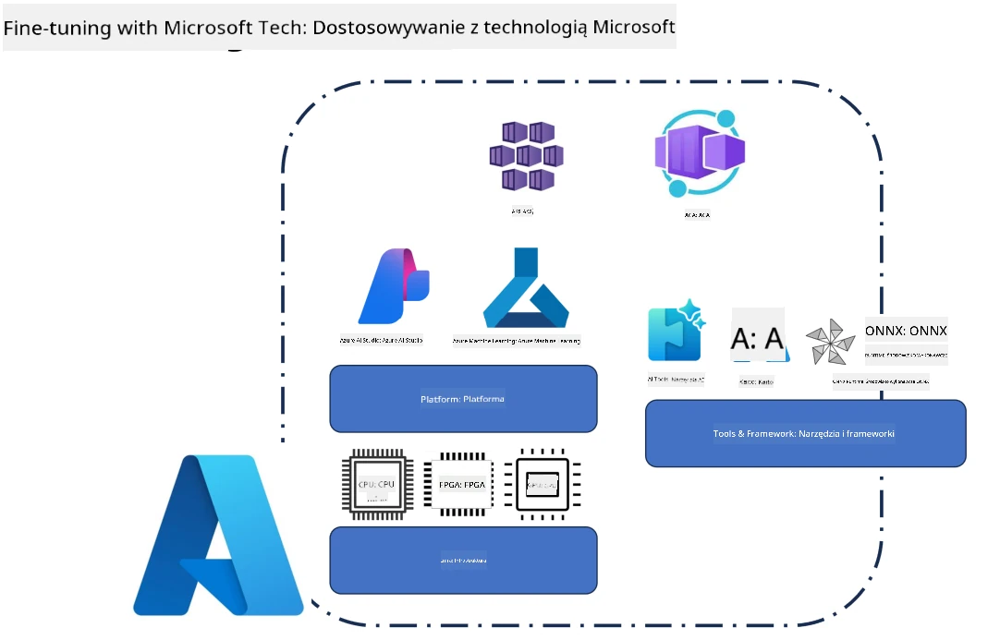
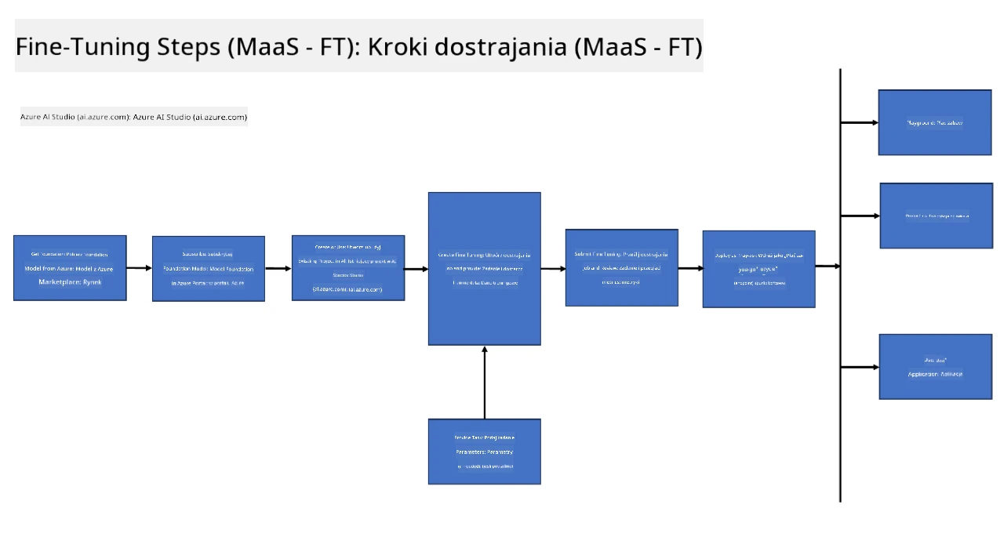
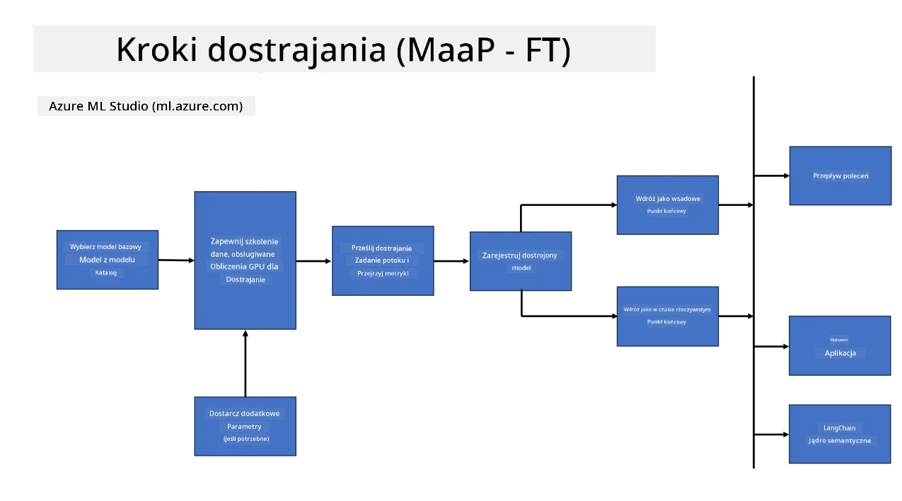
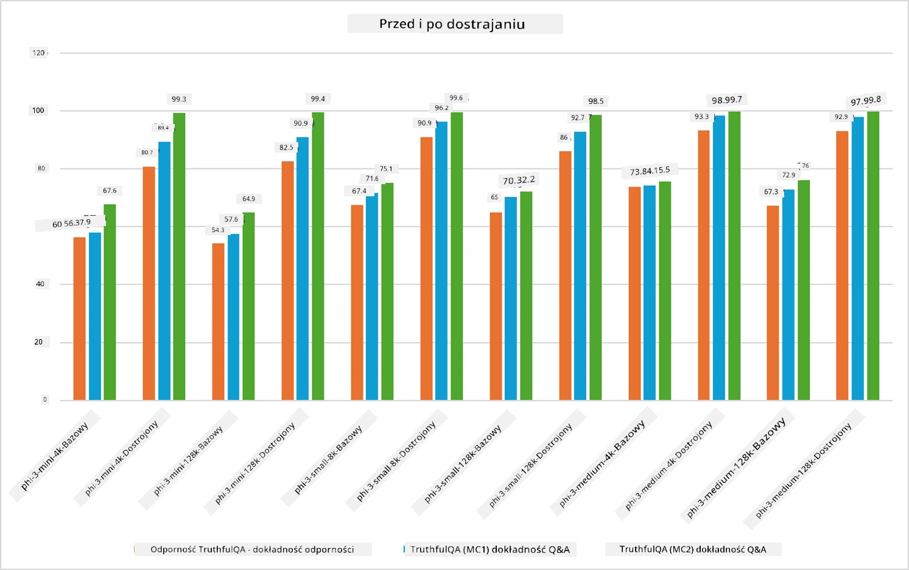

## Scenariusze Fine Tuningu

Ta sekcja zawiera przegląd scenariuszy fine tuningu w środowiskach Microsoft Foundry i Azure, w tym modeli wdrożeń, warstw infrastruktury oraz powszechnie stosowanych technik optymalizacji.

**Platforma**  
Obejmuje zarządzane usługi takie jak Microsoft Foundry (dawniej Azure AI Foundry) oraz Azure Machine Learning, które dostarczają zarządzanie modelami, orchestrację, śledzenie eksperymentów oraz procesy wdrożeniowe.

**Infrastruktura**  
Fine tuning wymaga skalowalnych zasobów obliczeniowych. W środowiskach Azure obejmuje to zwykle maszyny wirtualne oparte na GPU oraz zasoby CPU dla lekkich obciążeń, wraz ze skalowalną pamięcią masową na zestawy danych i punkty kontrolne.

**Narzędzia i Frameworki**  
Przepływy fine tuningu powszechnie opierają się na frameworkach i bibliotekach optymalizacyjnych takich jak Hugging Face Transformers, DeepSpeed i PEFT (Parameter-Efficient Fine-Tuning).

Proces fine tuningu przy użyciu technologii Microsoft obejmuje usługi platformowe, infrastrukturę obliczeniową oraz frameworki treningowe. Rozumiejąc, w jaki sposób te komponenty współpracują, deweloperzy mogą efektywnie dostosowywać modele bazowe do określonych zadań i scenariuszy produkcyjnych.

## Model jako usługa

Dostrajanie modelu za pomocą hostowanego fine tuningu, bez konieczności tworzenia i zarządzania obliczeniami.

Fine tuning bezserwerowy jest obecnie dostępny dla rodzin modeli Phi-3, Phi-3.5 i Phi-4, umożliwiając deweloperom szybkie i łatwe dostosowywanie modeli do scenariuszy chmurowych i edge bez konieczności organizowania zasobów obliczeniowych.

## Model jako platforma

Użytkownicy zarządzają własnymi zasobami obliczeniowymi, aby dostroić swoje modele.

[Przykład Fine Tuningu](https://github.com/Azure/azureml-examples/blob/main/sdk/python/foundation-models/system/finetune/chat-completion/chat-completion.ipynb)

## Porównanie technik Fine Tuningu

|Scenariusz|LoRA|QLoRA|PEFT|DeepSpeed|ZeRO|DoRA|
|---|---|---|---|---|---|---|
|Dostosowywanie wstępnie wytrenowanych LLM do konkretnych zadań lub dziedzin|Tak|Tak|Tak|Tak|Tak|Tak|
|Fine tuning zadań NLP takich jak klasyfikacja tekstu, rozpoznawanie nazwanych jednostek i tłumaczenie maszynowe|Tak|Tak|Tak|Tak|Tak|Tak|
|Fine tuning zadań QA|Tak|Tak|Tak|Tak|Tak|Tak|
|Fine tuning generowania odpowiedzi przypominających ludzkie w chatbotach|Tak|Tak|Tak|Tak|Tak|Tak|
|Fine tuning generowania muzyki, sztuki lub innych form kreatywności|Tak|Tak|Tak|Tak|Tak|Tak|
|Redukcja kosztów obliczeniowych i finansowych|Tak|Tak|Tak|Tak|Tak|Tak|
|Redukcja użycia pamięci|Tak|Tak|Tak|Tak|Tak|Tak|
|Użycie mniejszej liczby parametrów dla efektywnego fine tuningu|Tak|Tak|Tak|Nie|Nie|Tak|
|Efektywna pamięciowo forma paralelizmu danych umożliwiająca dostęp do agregowanej pamięci GPU wszystkich dostępnych urządzeń GPU|Nie|Nie|Nie|Tak|Tak|Nie|

> [!NOTE]
> LoRA, QLoRA, PEFT i DoRA to metody efektywnego parametrów fine tuningu, natomiast DeepSpeed i ZeRO skupiają się na rozproszonym treningu i optymalizacji pamięci.

## Przykłady wydajności Fine Tuningu

---

<!-- CO-OP TRANSLATOR DISCLAIMER START -->
**Zastrzeżenie**:  
Niniejszy dokument został przetłumaczony przy użyciu automatycznej usługi tłumaczeniowej [Co-op Translator](https://github.com/Azure/co-op-translator). Mimo że dokładamy starań, aby tłumaczenie było jak najbardziej precyzyjne, należy pamiętać, że tłumaczenia automatyczne mogą zawierać błędy lub niedokładności. Oryginalny dokument w języku źródłowym powinien być uznawany za źródło autorytatywne. W przypadku informacji krytycznych zaleca się skorzystanie z profesjonalnego, ludzkiego tłumaczenia. Nie ponosimy odpowiedzialności za jakiekolwiek nieporozumienia lub błędne interpretacje wynikające z korzystania z tego tłumaczenia.
<!-- CO-OP TRANSLATOR DISCLAIMER END -->