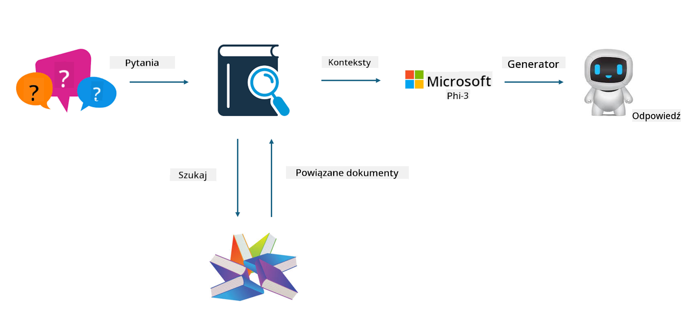

<!--
CO_OP_TRANSLATOR_METADATA:
{
  "original_hash": "e4e010400c2918557b36bb932a14004c",
  "translation_date": "2025-05-09T22:15:24+00:00",
  "source_file": "md/03.FineTuning/FineTuning_vs_RAG.md",
  "language_code": "pl"
}
-->
## Finetuning vs RAG

## Retrieval Augmented Generation

RAG to połączenie wyszukiwania danych i generowania tekstu. Strukturalne i niestrukturalne dane przedsiębiorstwa są przechowywane w bazie wektorowej. Podczas wyszukiwania odpowiednich treści odnajdywany jest odpowiedni skrót i zawartość, które tworzą kontekst, a następnie wykorzystuje się zdolność uzupełniania tekstu modelu LLM/SLM do generowania treści.

## RAG Process

## Fine-tuning
Fine-tuning opiera się na ulepszaniu konkretnego modelu. Nie trzeba zaczynać od algorytmu modelu, ale dane muszą być stale gromadzone. Jeśli zależy Ci na precyzyjnej terminologii i wyrażeniach językowych w zastosowaniach branżowych, fine-tuning będzie lepszym wyborem. Jednak jeśli Twoje dane często się zmieniają, fine-tuning może stać się skomplikowany.

## How to choose
Jeśli nasza odpowiedź wymaga wprowadzenia danych zewnętrznych, najlepszym wyborem jest RAG.

Jeśli potrzebujesz stabilnej i precyzyjnej wiedzy branżowej, fine-tuning będzie dobrym rozwiązaniem. RAG skupia się na pobieraniu odpowiednich treści, ale nie zawsze trafia w specjalistyczne niuanse.

Fine-tuning wymaga wysokiej jakości zbioru danych, a jeśli dane obejmują tylko wąski zakres, efekt może być niewielki. RAG jest bardziej elastyczny.  
Fine-tuning to czarna skrzynka, coś metafizycznego, trudno zrozumieć jego wewnętrzny mechanizm. Natomiast RAG ułatwia znalezienie źródła danych, co pozwala skuteczniej korygować halucynacje lub błędy w treści oraz zapewnia lepszą przejrzystość.

**Zastrzeżenie**:  
Niniejszy dokument został przetłumaczony za pomocą usługi tłumaczenia AI [Co-op Translator](https://github.com/Azure/co-op-translator). Mimo że dokładamy starań, aby tłumaczenie było jak najdokładniejsze, prosimy pamiętać, że automatyczne tłumaczenia mogą zawierać błędy lub niedokładności. Oryginalny dokument w języku źródłowym należy uważać za źródło autorytatywne. W przypadku informacji krytycznych zalecane jest skorzystanie z profesjonalnego tłumaczenia wykonanego przez człowieka. Nie ponosimy odpowiedzialności za jakiekolwiek nieporozumienia lub błędne interpretacje wynikające z korzystania z tego tłumaczenia.