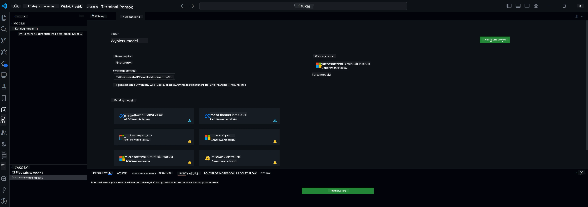

## Witamy w AI Toolkit dla VS Code

[AI Toolkit dla VS Code](https://github.com/microsoft/vscode-ai-toolkit/tree/main) łączy różne modele z katalogu Azure AI Studio oraz innych katalogów, takich jak Hugging Face. Ten zestaw narzędzi upraszcza typowe zadania programistyczne związane z tworzeniem aplikacji AI z wykorzystaniem narzędzi i modeli generatywnej sztucznej inteligencji poprzez:
- Rozpoczęcie pracy z odkrywaniem modeli i placem zabaw.
- Dostosowywanie modeli i inferencję z wykorzystaniem lokalnych zasobów obliczeniowych.
- Zdalne dostrajanie i inferencję z użyciem zasobów Azure.

[Zainstaluj AI Toolkit dla VSCode](https://marketplace.visualstudio.com/items?itemName=ms-windows-ai-studio.windows-ai-studio)



**[Private Preview]** Jednoklikowe uruchamianie Azure Container Apps do przeprowadzania dostrajania modeli i inferencji w chmurze.

Przejdźmy teraz do tworzenia Twojej aplikacji AI:

- [Witamy w AI Toolkit dla VS Code](../../../../md/03.FineTuning)
- [Lokalny rozwój](../../../../md/03.FineTuning)
  - [Przygotowania](../../../../md/03.FineTuning)
  - [Aktywacja Conda](../../../../md/03.FineTuning)
  - [Tylko dostrajanie modelu bazowego](../../../../md/03.FineTuning)
  - [Dostrajanie modelu i inferencja](../../../../md/03.FineTuning)
  - [Dostrajanie modelu](../../../../md/03.FineTuning)
  - [Microsoft Olive](../../../../md/03.FineTuning)
  - [Przykłady i zasoby do dostrajania](../../../../md/03.FineTuning)
- [**\[Private Preview\]** Zdalny rozwój](../../../../md/03.FineTuning)
  - [Wymagania wstępne](../../../../md/03.FineTuning)
  - [Konfiguracja zdalnego projektu](../../../../md/03.FineTuning)
  - [Provisionowanie zasobów Azure](../../../../md/03.FineTuning)
  - [\[Opcjonalnie\] Dodanie tokenu Huggingface do sekretu Azure Container App](../../../../md/03.FineTuning)
  - [Uruchomienie dostrajania](../../../../md/03.FineTuning)
  - [Provisionowanie punktu końcowego inferencji](../../../../md/03.FineTuning)
  - [Wdrożenie punktu końcowego inferencji](../../../../md/03.FineTuning)
  - [Zaawansowane użycie](../../../../md/03.FineTuning)

## Lokalny rozwój
### Przygotowania

1. Upewnij się, że na hoście jest zainstalowany sterownik NVIDIA.
2. Uruchom `huggingface-cli login`, jeśli korzystasz z HF do wykorzystania zbioru danych.
3. Wyjaśnienia ustawień klucza `Olive` dotyczące wszystkiego, co modyfikuje użycie pamięci.

### Aktywacja Conda
Ponieważ korzystamy ze środowiska WSL, które jest współdzielone, musisz ręcznie aktywować środowisko conda. Po tym kroku możesz uruchomić dostrajanie lub inferencję.

```bash
conda activate [conda-env-name] 
```

### Tylko dostrajanie modelu bazowego
Aby wypróbować model bazowy bez dostrajania, po aktywacji conda możesz uruchomić następujące polecenie.

```bash
cd inference

# Web browser interface allows to adjust a few parameters like max new token length, temperature and so on.
# User has to manually open the link (e.g. http://0.0.0.0:7860) in a browser after gradio initiates the connections.
python gradio_chat.py --baseonly
```

### Dostrajanie modelu i inferencja

Po otwarciu przestrzeni roboczej w kontenerze deweloperskim, otwórz terminal (domyślna ścieżka to katalog główny projektu), a następnie uruchom poniższe polecenie, aby dostroić LLM na wybranym zbiorze danych.

```bash
python finetuning/invoke_olive.py 
```

Punkty kontrolne i finalny model zostaną zapisane w folderze `models`.

Następnie uruchom inferencję z wykorzystaniem dostrojonego modelu poprzez czaty w `konsoli`, `przeglądarce internetowej` lub `prompt flow`.

```bash
cd inference

# Console interface.
python console_chat.py

# Web browser interface allows to adjust a few parameters like max new token length, temperature and so on.
# User has to manually open the link (e.g. http://127.0.0.1:7860) in a browser after gradio initiates the connections.
python gradio_chat.py
```

Aby korzystać z `prompt flow` w VS Code, zapoznaj się z tym [Szybkim startem](https://microsoft.github.io/promptflow/how-to-guides/quick-start.html).

### Dostrajanie modelu

Następnie pobierz odpowiedni model w zależności od dostępności GPU na Twoim urządzeniu.

Aby rozpocząć lokalną sesję dostrajania z użyciem QLoRA, wybierz model, który chcesz dostroić z naszego katalogu.
| Platforma(y) | Dostępne GPU | Nazwa modelu | Rozmiar (GB) |
|---------|---------|--------|--------|
| Windows | Tak | Phi-3-mini-4k-**directml**-int4-awq-block-128-onnx | 2.13GB |
| Linux | Tak | Phi-3-mini-4k-**cuda**-int4-onnx | 2.30GB |
| Windows<br>Linux | Nie | Phi-3-mini-4k-**cpu**-int4-rtn-block-32-acc-level-4-onnx | 2.72GB |

**_Uwaga_** Nie potrzebujesz konta Azure, aby pobrać modele.

Model Phi3-mini (int4) ma rozmiar około 2GB-3GB. W zależności od prędkości sieci pobranie może zająć kilka minut.

Zacznij od wybrania nazwy projektu i lokalizacji.
Następnie wybierz model z katalogu modeli. Zostaniesz poproszony o pobranie szablonu projektu. Możesz wtedy kliknąć „Konfiguruj projekt”, aby dostosować różne ustawienia.

### Microsoft Olive

Do uruchamiania dostrajania QLoRA na modelu PyTorch z naszego katalogu używamy [Olive](https://microsoft.github.io/Olive/why-olive.html). Wszystkie ustawienia są wstępnie skonfigurowane z domyślnymi wartościami, aby zoptymalizować lokalne uruchomienie procesu dostrajania z efektywnym wykorzystaniem pamięci, ale można je dostosować do własnych potrzeb.

### Przykłady i zasoby do dostrajania

- [Przewodnik „Pierwsze kroki z dostrajaniem”](https://learn.microsoft.com/windows/ai/toolkit/toolkit-fine-tune)
- [Dostrajanie z użyciem zbioru danych HuggingFace](https://github.com/microsoft/vscode-ai-toolkit/blob/main/archive/walkthrough-hf-dataset.md)
- [Dostrajanie z prostym zbiorem danych](https://github.com/microsoft/vscode-ai-toolkit/blob/main/archive/walkthrough-simple-dataset.md)

## **[Private Preview]** Zdalny rozwój

### Wymagania wstępne

1. Aby uruchomić dostrajanie modelu w zdalnym środowisku Azure Container App, upewnij się, że Twoja subskrypcja ma wystarczającą pojemność GPU. Złóż [zgłoszenie do pomocy technicznej](https://azure.microsoft.com/support/create-ticket/), aby uzyskać wymaganą pojemność dla swojej aplikacji. [Więcej informacji o pojemności GPU](https://learn.microsoft.com/azure/container-apps/workload-profiles-overview)
2. Jeśli korzystasz z prywatnego zbioru danych na HuggingFace, upewnij się, że masz [konto HuggingFace](https://huggingface.co/?WT.mc_id=aiml-137032-kinfeylo) i [wygeneruj token dostępu](https://huggingface.co/docs/hub/security-tokens?WT.mc_id=aiml-137032-kinfeylo)
3. Włącz flagę funkcji Zdalne dostrajanie i inferencja w AI Toolkit dla VS Code
   1. Otwórz ustawienia VS Code, wybierając *Plik -> Preferencje -> Ustawienia*.
   2. Przejdź do *Rozszerzenia* i wybierz *AI Toolkit*.
   3. Zaznacz opcję *"Enable Remote Fine-tuning And Inference"*.
   4. Przeładuj VS Code, aby zmiany zaczęły działać.

- [Zdalne dostrajanie](https://github.com/microsoft/vscode-ai-toolkit/blob/main/archive/remote-finetuning.md)

### Konfiguracja zdalnego projektu
1. Uruchom paletę poleceń `AI Toolkit: Focus on Resource View`.
2. Przejdź do *Model Fine-tuning*, aby uzyskać dostęp do katalogu modeli. Nadaj nazwę swojemu projektowi i wybierz jego lokalizację na swoim komputerze. Następnie kliknij przycisk *"Configure Project"*.
3. Konfiguracja projektu
    1. Nie włączaj opcji *"Fine-tune locally"*.
    2. Pojawią się ustawienia konfiguracji Olive z domyślnymi wartościami. Dostosuj i uzupełnij te ustawienia według potrzeb.
    3. Przejdź do *Generate Project*. Ten etap wykorzystuje WSL i polega na utworzeniu nowego środowiska Conda, przygotowując grunt pod przyszłe aktualizacje z Dev Containers.
4. Kliknij *"Relaunch Window In Workspace"*, aby otworzyć zdalny projekt deweloperski.

> **Uwaga:** Projekt obecnie działa albo lokalnie, albo zdalnie w AI Toolkit dla VS Code. Jeśli podczas tworzenia projektu wybierzesz *"Fine-tune locally"*, będzie on działał wyłącznie w WSL bez możliwości zdalnego rozwoju. Natomiast jeśli nie włączysz *"Fine-tune locally"*, projekt będzie ograniczony do zdalnego środowiska Azure Container App.

### Provisionowanie zasobów Azure
Aby rozpocząć, musisz provisionować zasób Azure do zdalnego dostrajania. Zrób to, uruchamiając polecenie `AI Toolkit: Provision Azure Container Apps job for fine-tuning` z palety poleceń.

Monitoruj postęp provisionowania za pomocą linku wyświetlanego w kanale wyjściowym.

### [Opcjonalnie] Dodanie tokenu Huggingface do sekretu Azure Container App
Jeśli korzystasz z prywatnego zbioru danych HuggingFace, ustaw swój token HuggingFace jako zmienną środowiskową, aby uniknąć konieczności ręcznego logowania się do Hugging Face Hub.
Możesz to zrobić za pomocą polecenia `AI Toolkit: Add Azure Container Apps Job secret for fine-tuning`. Przy tym poleceniu możesz ustawić nazwę sekretu jako [`HF_TOKEN`](https://huggingface.co/docs/huggingface_hub/package_reference/environment_variables#hftoken) i użyć swojego tokenu Hugging Face jako wartości sekretu.

### Uruchomienie dostrajania
Aby rozpocząć zdalne dostrajanie, wykonaj polecenie `AI Toolkit: Run fine-tuning`.

Aby zobaczyć logi systemowe i konsolowe, możesz odwiedzić portal Azure, korzystając z linku w panelu wyjściowym (więcej informacji w [View and Query Logs on Azure](https://aka.ms/ai-toolkit/remote-provision#view-and-query-logs-on-azure)). Możesz też wyświetlić logi konsoli bezpośrednio w panelu wyjściowym VSCode, uruchamiając polecenie `AI Toolkit: Show the running fine-tuning job streaming logs`.
> **Uwaga:** Zadanie może być w kolejce z powodu braku zasobów. Jeśli logi się nie wyświetlają, uruchom polecenie `AI Toolkit: Show the running fine-tuning job streaming logs`, poczekaj chwilę, a następnie uruchom je ponownie, aby ponownie połączyć się ze strumieniem logów.

Podczas tego procesu QLoRA będzie używany do dostrajania i utworzy adaptery LoRA dla modelu do wykorzystania podczas inferencji.
Wyniki dostrajania będą przechowywane w Azure Files.

### Provisionowanie punktu końcowego inferencji
Po wytrenowaniu adapterów w środowisku zdalnym, użyj prostej aplikacji Gradio do interakcji z modelem.
Podobnie jak w przypadku dostrajania, musisz skonfigurować zasoby Azure do zdalnej inferencji, wykonując polecenie `AI Toolkit: Provision Azure Container Apps for inference` z palety poleceń.

Domyślnie subskrypcja i grupa zasobów dla inferencji powinny być takie same jak te używane do dostrajania. Inferencja będzie korzystać z tego samego środowiska Azure Container App i uzyska dostęp do modelu oraz adaptera modelu przechowywanych w Azure Files, które zostały wygenerowane podczas etapu dostrajania.

### Wdrożenie punktu końcowego inferencji
Jeśli chcesz zmodyfikować kod inferencji lub przeładować model inferencyjny, wykonaj polecenie `AI Toolkit: Deploy for inference`. Spowoduje to synchronizację najnowszego kodu z Azure Container App i ponowne uruchomienie repliki.

Po pomyślnym wdrożeniu możesz uzyskać dostęp do API inferencji, klikając przycisk „*Go to Inference Endpoint*” wyświetlany w powiadomieniu VSCode. Alternatywnie, punkt końcowy API webowego znajdziesz pod `ACA_APP_ENDPOINT` w pliku `./infra/inference.config.json` oraz w panelu wyjściowym. Teraz możesz ocenić model, korzystając z tego punktu końcowego.

### Zaawansowane użycie
Aby uzyskać więcej informacji o zdalnym rozwoju z AI Toolkit, zapoznaj się z dokumentacją [Fine-Tuning models remotely](https://aka.ms/ai-toolkit/remote-provision) oraz [Inferencing with the fine-tuned model](https://aka.ms/ai-toolkit/remote-inference).

**Zastrzeżenie**:  
Niniejszy dokument został przetłumaczony za pomocą usługi tłumaczenia AI [Co-op Translator](https://github.com/Azure/co-op-translator). Mimo że dążymy do dokładności, prosimy mieć na uwadze, że tłumaczenia automatyczne mogą zawierać błędy lub nieścisłości. Oryginalny dokument w języku źródłowym powinien być uznawany za źródło autorytatywne. W przypadku informacji krytycznych zalecane jest skorzystanie z profesjonalnego tłumaczenia wykonanego przez człowieka. Nie ponosimy odpowiedzialności za jakiekolwiek nieporozumienia lub błędne interpretacje wynikające z korzystania z tego tłumaczenia.