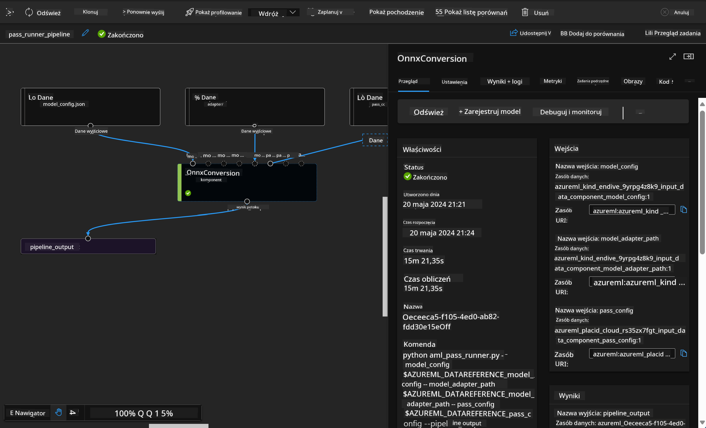

<!--
CO_OP_TRANSLATOR_METADATA:
{
  "original_hash": "7fe541373802e33568e94e13226d463c",
  "translation_date": "2025-07-17T09:41:00+00:00",
  "source_file": "md/03.FineTuning/Introduce_AzureML.md",
  "language_code": "pl"
}
-->
# **Wprowadzenie do usługi Azure Machine Learning**

[Azure Machine Learning](https://ml.azure.com?WT.mc_id=aiml-138114-kinfeylo) to usługa w chmurze, która przyspiesza i zarządza cyklem życia projektów związanych z uczeniem maszynowym (ML).

Specjaliści ML, data scientist i inżynierowie mogą korzystać z niej na co dzień, aby:

- Trenować i wdrażać modele.  
- Zarządzać operacjami uczenia maszynowego (MLOps).  
- Możesz stworzyć model w Azure Machine Learning lub użyć modelu zbudowanego na platformie open-source, takiej jak PyTorch, TensorFlow czy scikit-learn.  
- Narzędzia MLOps pomagają monitorować, ponownie trenować i wdrażać modele.

## Dla kogo jest Azure Machine Learning?

**Data Scientist i inżynierowie ML**

Mogą korzystać z narzędzi przyspieszających i automatyzujących ich codzienne zadania.  
Azure ML oferuje funkcje związane z uczciwością, wyjaśnialnością, śledzeniem i audytowalnością.

**Programiści aplikacji:**  
Mogą bezproblemowo integrować modele z aplikacjami lub usługami.

**Deweloperzy platform**

Mają dostęp do zaawansowanego zestawu narzędzi wspieranych przez trwałe API Azure Resource Manager.  
Narzędzia te umożliwiają tworzenie zaawansowanych rozwiązań ML.

**Przedsiębiorstwa**

Pracując w chmurze Microsoft Azure, przedsiębiorstwa korzystają z dobrze znanego bezpieczeństwa i kontroli dostępu opartej na rolach.  
Mogą konfigurować projekty, aby kontrolować dostęp do chronionych danych i określonych operacji.

## Wydajność dla całego zespołu  
Projekty ML często wymagają zespołu o różnorodnych umiejętnościach do budowy i utrzymania rozwiązań.

Azure ML oferuje narzędzia, które pozwalają:  
- Współpracować z zespołem za pomocą współdzielonych notatników, zasobów obliczeniowych, obliczeń bezserwerowych, danych i środowisk.  
- Tworzyć modele z uwzględnieniem uczciwości, wyjaśnialności, śledzenia i audytowalności, spełniając wymagania dotyczące pochodzenia danych i zgodności audytowej.  
- Szybko i łatwo wdrażać modele ML na dużą skalę oraz efektywnie nimi zarządzać i nimi sterować za pomocą MLOps.  
- Uruchamiać zadania uczenia maszynowego wszędzie, korzystając z wbudowanych mechanizmów zarządzania, bezpieczeństwa i zgodności.

## Narzędzia platformy kompatybilne między sobą

Każdy członek zespołu ML może korzystać z preferowanych narzędzi, aby wykonać swoją pracę.  
Niezależnie od tego, czy prowadzisz szybkie eksperymenty, stroisz hiperparametry, budujesz pipeline’y czy zarządzasz inferencjami, możesz korzystać ze znanych interfejsów, takich jak:  
- Azure Machine Learning Studio  
- Python SDK (v2)  
- Azure CLI (v2)  
- Azure Resource Manager REST APIs

W trakcie udoskonalania modeli i współpracy w cyklu rozwoju możesz udostępniać i wyszukiwać zasoby, materiały i metryki w interfejsie Azure Machine Learning studio.

## **LLM/SLM w Azure ML**

Azure ML dodał wiele funkcji związanych z LLM/SLM, łącząc LLMOps i SLMOps, aby stworzyć platformę generatywnej sztucznej inteligencji na poziomie przedsiębiorstwa.

### **Katalog modeli**

Użytkownicy korporacyjni mogą wdrażać różne modele w zależności od scenariuszy biznesowych za pomocą Katalogu modeli, oferując usługi jako Model as Service dla deweloperów lub użytkowników korporacyjnych.

Katalog modeli w Azure Machine Learning studio to centrum do odkrywania i korzystania z szerokiej gamy modeli, które umożliwiają budowę aplikacji Generative AI. Katalog zawiera setki modeli od dostawców takich jak Azure OpenAI service, Mistral, Meta, Cohere, Nvidia, Hugging Face, w tym modele wytrenowane przez Microsoft. Modele od dostawców innych niż Microsoft to Produkty nie-Microsoft, zgodnie z definicją w Product Terms Microsoft, i podlegają warunkom określonym przy modelu.

### **Pipeline zadań**

Rdzeniem pipeline’u uczenia maszynowego jest podział pełnego zadania ML na wieloetapowy workflow. Każdy krok to zarządzalny komponent, który można rozwijać, optymalizować, konfigurować i automatyzować indywidualnie. Kroki łączą się przez dobrze zdefiniowane interfejsy. Usługa pipeline Azure Machine Learning automatycznie orkiestruje wszystkie zależności między krokami.

Podczas fine-tuningu SLM / LLM możemy zarządzać danymi, treningiem i procesami generacji za pomocą Pipeline.

### **Prompt flow**

Korzyści z używania Azure Machine Learning prompt flow  
Azure Machine Learning prompt flow oferuje szereg korzyści, które pomagają użytkownikom przejść od pomysłu do eksperymentu, a ostatecznie do produkcyjnych aplikacji opartych na LLM:

**Zwinność w inżynierii promptów**

Interaktywne tworzenie: Azure Machine Learning prompt flow zapewnia wizualną reprezentację struktury przepływu, co ułatwia użytkownikom zrozumienie i nawigację po projektach. Oferuje także doświadczenie podobne do notatnika, co usprawnia rozwój i debugowanie przepływów.  
Warianty do strojenia promptów: Użytkownicy mogą tworzyć i porównywać wiele wariantów promptów, co ułatwia iteracyjne doskonalenie.

Ewaluacja: Wbudowane przepływy ewaluacyjne pozwalają ocenić jakość i skuteczność promptów i przepływów.

Kompleksowe zasoby: Azure Machine Learning prompt flow zawiera bibliotekę wbudowanych narzędzi, przykładów i szablonów, które stanowią punkt wyjścia do rozwoju, inspirując kreatywność i przyspieszając proces.

**Gotowość korporacyjna dla aplikacji opartych na LLM**

Współpraca: Azure Machine Learning prompt flow wspiera pracę zespołową, umożliwiając wielu użytkownikom wspólne tworzenie projektów inżynierii promptów, dzielenie się wiedzą i kontrolę wersji.

Platforma all-in-one: Azure Machine Learning prompt flow upraszcza cały proces inżynierii promptów — od rozwoju i ewaluacji po wdrożenie i monitorowanie. Użytkownicy mogą łatwo wdrażać swoje przepływy jako punkty końcowe Azure Machine Learning i monitorować ich działanie w czasie rzeczywistym, zapewniając optymalną pracę i ciągłe ulepszanie.

Rozwiązania gotowe na potrzeby przedsiębiorstw Azure Machine Learning: Prompt flow korzysta z solidnych rozwiązań Azure Machine Learning zapewniających bezpieczną, skalowalną i niezawodną bazę do rozwoju, eksperymentowania i wdrażania przepływów.

Dzięki Azure Machine Learning prompt flow użytkownicy mogą uwolnić swoją zwinność w inżynierii promptów, efektywnie współpracować i korzystać z rozwiązań klasy korporacyjnej, aby skutecznie rozwijać i wdrażać aplikacje oparte na LLM.

Łącząc moc obliczeniową, dane i różne komponenty Azure ML, deweloperzy korporacyjni mogą łatwo tworzyć własne aplikacje sztucznej inteligencji.

**Zastrzeżenie**:  
Niniejszy dokument został przetłumaczony za pomocą usługi tłumaczenia AI [Co-op Translator](https://github.com/Azure/co-op-translator). Mimo że dokładamy starań, aby tłumaczenie było jak najbardziej precyzyjne, prosimy mieć na uwadze, że automatyczne tłumaczenia mogą zawierać błędy lub nieścisłości. Oryginalny dokument w języku źródłowym należy traktować jako źródło autorytatywne. W przypadku informacji o kluczowym znaczeniu zalecane jest skorzystanie z profesjonalnego tłumaczenia wykonanego przez człowieka. Nie ponosimy odpowiedzialności za jakiekolwiek nieporozumienia lub błędne interpretacje wynikające z korzystania z tego tłumaczenia.