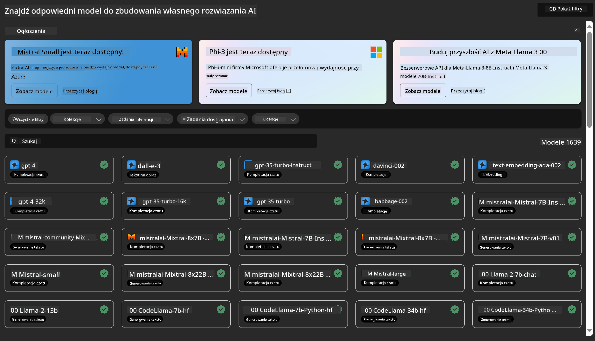
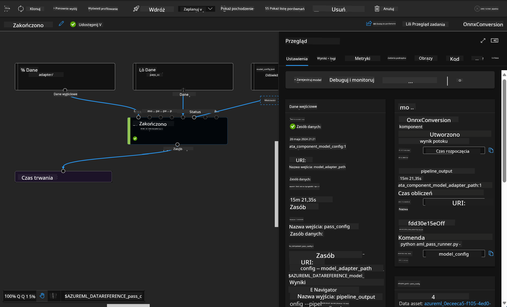

<!--
CO_OP_TRANSLATOR_METADATA:
{
  "original_hash": "7fe541373802e33568e94e13226d463c",
  "translation_date": "2025-05-09T22:19:44+00:00",
  "source_file": "md/03.FineTuning/Introduce_AzureML.md",
  "language_code": "pl"
}
-->
# **Wprowadzenie do usługi Azure Machine Learning**

[Azure Machine Learning](https://ml.azure.com?WT.mc_id=aiml-138114-kinfeylo) to usługa w chmurze, która przyspiesza i zarządza cyklem życia projektów uczenia maszynowego (ML).

Specjaliści ML, data scientist oraz inżynierowie mogą korzystać z niej na co dzień, aby:

- Trenować i wdrażać modele.  
Zarządzać operacjami uczenia maszynowego (MLOps).  
- Możesz stworzyć model w Azure Machine Learning lub użyć modelu zbudowanego na platformie open-source, takiej jak PyTorch, TensorFlow czy scikit-learn.  
- Narzędzia MLOps pomagają monitorować, ponownie trenować i wdrażać modele.

## Dla kogo jest Azure Machine Learning?

**Data Scientist i inżynierowie ML**

Mogą korzystać z narzędzi, które przyspieszają i automatyzują ich codzienne zadania.  
Azure ML oferuje funkcje związane z uczciwością, wyjaśnialnością, śledzeniem i audytowalnością.

**Programiści aplikacji:**  
Mogą bezproblemowo integrować modele z aplikacjami lub usługami.

**Programiści platformy**

Mają dostęp do solidnego zestawu narzędzi wspieranych przez trwałe API Azure Resource Manager.  
Te narzędzia pozwalają na tworzenie zaawansowanych rozwiązań ML.

**Przedsiębiorstwa**

Pracujące w chmurze Microsoft Azure korzystają z dobrze znanych zabezpieczeń i kontroli dostępu opartej na rolach.  
Konfigurują projekty, aby kontrolować dostęp do chronionych danych i określonych operacji.

## Wydajność dla całego zespołu  
Projekty ML często wymagają zespołu o różnorodnych kompetencjach do budowy i utrzymania.

Azure ML oferuje narzędzia, które umożliwiają:  
- Współpracę z zespołem za pomocą współdzielonych notatników, zasobów obliczeniowych, obliczeń bezserwerowych, danych i środowisk.  
- Tworzenie modeli z uwzględnieniem uczciwości, wyjaśnialności, śledzenia i audytowalności, spełniając wymagania dotyczące pochodzenia danych i zgodności audytowej.  
- Szybkie i łatwe wdrażanie modeli ML na dużą skalę oraz efektywne zarządzanie i nadzór nad nimi dzięki MLOps.  
- Uruchamianie zadań uczenia maszynowego w dowolnym miejscu z wbudowanym zarządzaniem, bezpieczeństwem i zgodnością.

## Narzędzia platformy kompatybilne między sobą

Każdy w zespole ML może używać preferowanych narzędzi do realizacji zadań.  
Niezależnie od tego, czy przeprowadzasz szybkie eksperymenty, stroisz hiperparametry, budujesz pipeline’y czy zarządzasz inferencjami, możesz korzystać ze znanych interfejsów, takich jak:  
- Azure Machine Learning Studio  
- Python SDK (v2)  
- Azure CLI (v2)  
- Azure Resource Manager REST APIs

Podczas dopracowywania modeli i współpracy w całym cyklu rozwoju możesz udostępniać i odnajdywać zasoby, materiały i metryki w interfejsie Azure Machine Learning studio.

## **LLM/SLM w Azure ML**

Azure ML dodało wiele funkcji związanych z LLM/SLM, łącząc LLMOps i SLMOps, tworząc tym samym platformę technologii generatywnej sztucznej inteligencji na poziomie przedsiębiorstwa.

### **Katalog modeli**

Użytkownicy korporacyjni mogą wdrażać różne modele w zależności od scenariuszy biznesowych za pomocą Katalogu modeli oraz oferować usługi jako Model as Service dla deweloperów lub użytkowników biznesowych.

Katalog modeli w Azure Machine Learning studio to centrum, w którym można odkrywać i korzystać z szerokiej gamy modeli umożliwiających tworzenie aplikacji Generative AI. Katalog zawiera setki modeli od dostawców takich jak Azure OpenAI service, Mistral, Meta, Cohere, Nvidia, Hugging Face, w tym modele wytrenowane przez Microsoft. Modele dostawców innych niż Microsoft są traktowane jako Non-Microsoft Products zgodnie z warunkami określonymi w Product Terms Microsoft i podlegają warunkom udostępnionym wraz z modelem.

### **Pipeline zadań**

Rdzeniem pipeline’u uczenia maszynowego jest podział pełnego zadania ML na wieloetapowy workflow. Każdy krok to zarządzalny komponent, który można rozwijać, optymalizować, konfigurować i automatyzować osobno. Kroki łączą się przez dobrze zdefiniowane interfejsy. Usługa pipeline w Azure Machine Learning automatycznie orkiestruje wszystkie zależności między krokami.

W procesie fine-tuningu SLM / LLM możemy zarządzać danymi, treningiem i generowaniem za pomocą Pipeline.

### **Prompt flow**

Korzyści z używania Azure Machine Learning prompt flow  
Azure Machine Learning prompt flow oferuje szereg zalet, które pomagają użytkownikom przejść od pomysłu do eksperymentu, a ostatecznie do produkcyjnych aplikacji opartych na LLM:

**Zwinność w inżynierii promptów**

Interaktywne tworzenie: Azure Machine Learning prompt flow zapewnia wizualną reprezentację struktury przepływu, co ułatwia zrozumienie i nawigację po projektach. Oferuje także doświadczenie podobne do notatnika, co przyspiesza rozwój i debugowanie przepływów.  
Warianty do strojenia promptów: Użytkownicy mogą tworzyć i porównywać wiele wariantów promptów, ułatwiając iteracyjny proces udoskonalania.

Ewaluacja: Wbudowane przepływy oceny pozwalają ocenić jakość i skuteczność promptów i przepływów.

Kompleksowe zasoby: Azure Machine Learning prompt flow zawiera bibliotekę narzędzi, przykładów i szablonów, które stanowią punkt wyjścia do rozwoju, inspirując kreatywność i przyspieszając proces.

**Gotowość przedsiębiorstwa do aplikacji opartych na LLM**

Współpraca: Azure Machine Learning prompt flow wspiera pracę zespołową, umożliwiając wielu użytkownikom wspólną pracę nad projektami inżynierii promptów, dzielenie się wiedzą i kontrolę wersji.

Platforma all-in-one: Azure Machine Learning prompt flow upraszcza cały proces inżynierii promptów – od rozwoju i oceny, przez wdrożenie i monitoring. Użytkownicy mogą łatwo wdrażać swoje przepływy jako endpointy Azure Machine Learning i monitorować ich działanie w czasie rzeczywistym, zapewniając optymalną pracę i ciągłe ulepszanie.

Rozwiązania Azure Machine Learning Enterprise Readiness: Prompt flow korzysta z solidnych rozwiązań Azure Machine Learning zapewniających bezpieczną, skalowalną i niezawodną bazę do rozwoju, eksperymentowania i wdrażania przepływów.

Dzięki Azure Machine Learning prompt flow użytkownicy mogą zwiększyć swoją zwinność w inżynierii promptów, efektywnie współpracować i korzystać z rozwiązań klasy enterprise, aby skutecznie rozwijać i wdrażać aplikacje oparte na LLM.

Łącząc moc obliczeniową, dane i różne komponenty Azure ML, deweloperzy korporacyjni mogą łatwo tworzyć własne aplikacje sztucznej inteligencji.

**Zastrzeżenie**:  
Niniejszy dokument został przetłumaczony za pomocą usługi tłumaczenia AI [Co-op Translator](https://github.com/Azure/co-op-translator). Chociaż dokładamy wszelkich starań, aby tłumaczenie było precyzyjne, prosimy mieć na uwadze, że automatyczne tłumaczenia mogą zawierać błędy lub nieścisłości. Oryginalny dokument w języku źródłowym należy traktować jako źródło autorytatywne. W przypadku informacji o istotnym znaczeniu zalecane jest skorzystanie z profesjonalnego tłumaczenia wykonanego przez człowieka. Nie ponosimy odpowiedzialności za jakiekolwiek nieporozumienia lub błędne interpretacje wynikające z użycia tego tłumaczenia.