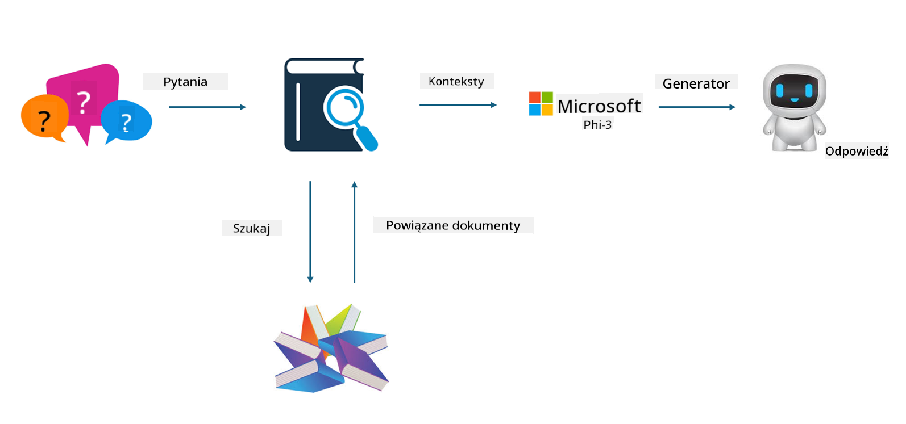
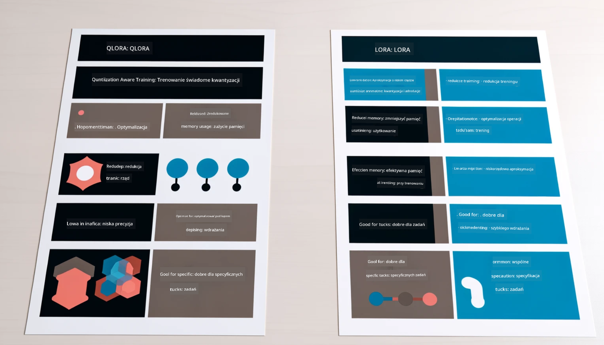

<!--
CO_OP_TRANSLATOR_METADATA:
{
  "original_hash": "743d7e9cb9c4e8ea642d77bee657a7fa",
  "translation_date": "2025-05-09T22:26:25+00:00",
  "source_file": "md/03.FineTuning/LetPhi3gotoIndustriy.md",
  "language_code": "pl"
}
-->
# **Niech Phi-3 stanie się ekspertem branżowym**

Aby wprowadzić model Phi-3 do branży, musisz dodać do niego dane biznesowe z danej branży. Mamy dwie różne opcje: pierwsza to RAG (Retrieval Augmented Generation), a druga to Fine Tuning.

## **RAG vs Fine-Tuning**

### **Retrieval Augmented Generation**

RAG to wyszukiwanie danych + generowanie tekstu. Strukturalne i niestrukturalne dane przedsiębiorstwa są przechowywane w bazie wektorowej. Podczas wyszukiwania odpowiednich treści, odnajduje się istotne podsumowania i zawartość, które tworzą kontekst, a następnie łączy się to z możliwościami generowania tekstu LLM/SLM, aby wygenerować odpowiednią treść.

### **Fine-tuning**

Fine-tuning to proces doskonalenia określonego modelu. Nie wymaga rozpoczynania od algorytmu modelu, ale dane muszą być systematycznie gromadzone. Jeśli zależy Ci na precyzyjnej terminologii i wyrażeniach językowych w zastosowaniach branżowych, fine-tuning będzie lepszym wyborem. Jednak jeśli Twoje dane często się zmieniają, fine-tuning może stać się skomplikowany.

### **Jak wybrać**

1. Jeśli nasza odpowiedź wymaga wprowadzenia zewnętrznych danych, najlepszym wyborem jest RAG.

2. Jeśli potrzebujesz stabilnej i precyzyjnej wiedzy branżowej, fine-tuning będzie dobrym wyborem. RAG skupia się na wyciąganiu powiązanych treści, ale nie zawsze trafia w specjalistyczne niuanse.

3. Fine-tuning wymaga wysokiej jakości zestawu danych, a jeśli zakres danych jest niewielki, nie przyniesie dużych efektów. RAG jest bardziej elastyczny.

4. Fine-tuning to czarna skrzynka, coś metafizycznego, trudno zrozumieć jego wewnętrzny mechanizm. RAG natomiast ułatwia odnalezienie źródła danych, co pozwala skutecznie korygować halucynacje lub błędy w treści oraz zapewnia lepszą przejrzystość.

### **Scenariusze**

1. Branże pionowe wymagające specyficznego słownictwa i wyrażeń — ***Fine-tuning*** będzie najlepszym wyborem.

2. Systemy QA, obejmujące syntezę różnych punktów wiedzy — ***RAG*** będzie najlepszym wyborem.

3. Połączenie zautomatyzowanego przepływu biznesowego — ***RAG + Fine-tuning*** to najlepszy wybór.

## **Jak korzystać z RAG**

Baza wektorowa to zbiór danych przechowywanych w formie matematycznej. Bazy wektorowe ułatwiają modelom uczenia maszynowego zapamiętywanie poprzednich danych wejściowych, umożliwiając wykorzystanie uczenia maszynowego do wspierania takich zastosowań jak wyszukiwanie, rekomendacje czy generowanie tekstu. Dane można identyfikować na podstawie miar podobieństwa, a nie dokładnych dopasowań, co pozwala modelom komputerowym lepiej rozumieć kontekst danych.

Baza wektorowa jest kluczem do realizacji RAG. Możemy konwertować dane na wektorową formę przechowywania za pomocą modeli wektorowych, takich jak text-embedding-3, jina-ai-embedding i innych.

Dowiedz się więcej o tworzeniu aplikacji RAG [https://github.com/microsoft/Phi-3CookBook](https://github.com/microsoft/Phi-3CookBook?WT.mc_id=aiml-138114-kinfeylo)

## **Jak korzystać z Fine-tuning**

Najczęściej używane algorytmy w Fine-tuning to Lora i QLora. Jak wybrać?
- [Dowiedz się więcej z tego przykładowego notatnika](../../../../code/04.Finetuning/Phi_3_Inference_Finetuning.ipynb)
- [Przykład Python FineTuning Sample](../../../../code/04.Finetuning/FineTrainingScript.py)

### **Lora i QLora**

LoRA (Low-Rank Adaptation) i QLoRA (Quantized Low-Rank Adaptation) to techniki stosowane do fine-tuningu dużych modeli językowych (LLM) przy użyciu Parameter Efficient Fine Tuning (PEFT). Techniki PEFT są zaprojektowane tak, aby trenować modele efektywniej niż tradycyjne metody.  
LoRA to samodzielna technika fine-tuningu, która zmniejsza zużycie pamięci przez zastosowanie aproksymacji o niskim rzędzie do macierzy aktualizacji wag. Oferuje szybkie czasy treningu i utrzymuje wydajność zbliżoną do tradycyjnych metod fine-tuningu.

QLoRA to rozszerzona wersja LoRA, która wykorzystuje techniki kwantyzacji, aby jeszcze bardziej zmniejszyć zużycie pamięci. QLoRA kwantyzuje precyzję parametrów wag w wstępnie wytrenowanym LLM do precyzji 4-bitowej, co jest bardziej efektywne pamięciowo niż LoRA. Jednak trening QLoRA jest około 30% wolniejszy niż trening LoRA z powodu dodatkowych kroków kwantyzacji i dekwantyzacji.

QLoRA wykorzystuje LoRA jako dodatek do korygowania błędów powstałych podczas kwantyzacji. QLoRA umożliwia fine-tuning ogromnych modeli z miliardami parametrów na stosunkowo niewielkich, powszechnie dostępnych GPU. Na przykład QLoRA może dostroić model o 70 miliardach parametrów, który wymaga 36 GPU, używając tylko 2

**Zastrzeżenie**:  
Niniejszy dokument został przetłumaczony za pomocą usługi tłumaczeń AI [Co-op Translator](https://github.com/Azure/co-op-translator). Mimo że dokładamy wszelkich starań, aby tłumaczenie było jak najbardziej precyzyjne, prosimy mieć na uwadze, że automatyczne tłumaczenia mogą zawierać błędy lub niedokładności. Oryginalny dokument w jego języku źródłowym powinien być uważany za źródło wiarygodne. W przypadku informacji krytycznych zaleca się skorzystanie z profesjonalnego tłumaczenia wykonanego przez człowieka. Nie ponosimy odpowiedzialności za jakiekolwiek nieporozumienia lub błędne interpretacje wynikające z korzystania z tego tłumaczenia.