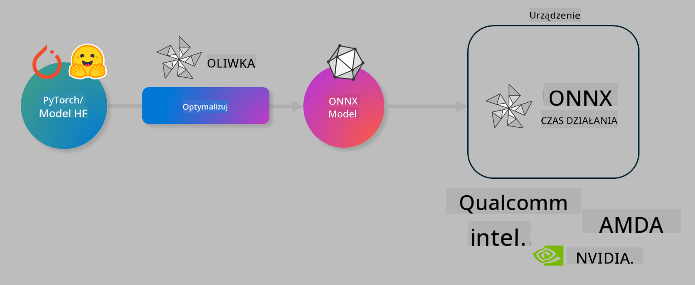

<!--
CO_OP_TRANSLATOR_METADATA:
{
  "original_hash": "6bbe47de3b974df7eea29dfeccf6032b",
  "translation_date": "2025-05-09T22:36:15+00:00",
  "source_file": "md/03.FineTuning/olive-lab/readme.md",
  "language_code": "pl"
}
-->
# Lab. Optymalizacja modeli AI do inferencji na urządzeniu

## Wprowadzenie

> [!IMPORTANT]  
> To laboratorium wymaga **karty graficznej Nvidia A10 lub A100** z odpowiednimi sterownikami oraz zainstalowanym zestawem narzędzi CUDA (wersja 12+).

> [!NOTE]  
> To jest **35-minutowe** laboratorium, które zapewni Ci praktyczne wprowadzenie do podstaw optymalizacji modeli pod kątem inferencji na urządzeniu przy użyciu OLIVE.

## Cele nauki

Po zakończeniu tego laboratorium będziesz potrafił używać OLIVE do:

- Kwantyzacji modelu AI metodą AWQ.
- Dostosowania modelu AI do konkretnego zadania.
- Generowania adapterów LoRA (modeli dostrojonych) do efektywnej inferencji na urządzeniu przy użyciu ONNX Runtime.

### Czym jest Olive

Olive (*O*NNX *live*) to zestaw narzędzi do optymalizacji modeli wraz z towarzyszącym CLI, który umożliwia dostarczanie modeli dla ONNX runtime +++https://onnxruntime.ai+++ z zachowaniem jakości i wydajności.



Wejściem dla Olive jest zazwyczaj model PyTorch lub Hugging Face, a wyjściem zoptymalizowany model ONNX, który jest uruchamiany na urządzeniu (celu wdrożenia) z ONNX runtime. Olive optymalizuje model pod kątem akceleratora AI (NPU, GPU, CPU) dostarczanego przez producenta sprzętu takiego jak Qualcomm, AMD, Nvidia czy Intel.

Olive wykonuje *workflow*, czyli uporządkowaną sekwencję pojedynczych zadań optymalizacji modelu zwanych *passes* – przykładowe passes to: kompresja modelu, przechwytywanie grafu, kwantyzacja, optymalizacja grafu. Każdy pass ma zestaw parametrów, które można dostroić, aby osiągnąć najlepsze metryki, np. dokładność i opóźnienie, oceniane przez odpowiedniego ewaluatora. Olive stosuje strategię poszukiwania, która używa algorytmu do automatycznego dostrajania każdego passu pojedynczo lub zestawu passów razem.

#### Zalety Olive

- **Zmniejsza frustrację i czas** związany z ręcznym eksperymentowaniem metodami optymalizacji grafu, kompresji i kwantyzacji. Zdefiniuj swoje wymagania dotyczące jakości i wydajności, a Olive automatycznie znajdzie najlepszy model dla Ciebie.
- **Ponad 40 wbudowanych komponentów optymalizacji modeli**, obejmujących najnowsze techniki kwantyzacji, kompresji, optymalizacji grafu i dostrajania.
- **Łatwe w użyciu CLI** do typowych zadań optymalizacji modeli, np. olive quantize, olive auto-opt, olive finetune.
- Wbudowane pakowanie i wdrażanie modeli.
- Obsługa generowania modeli do **Multi LoRA serving**.
- Tworzenie workflow za pomocą YAML/JSON do zarządzania zadaniami optymalizacji i wdrożenia modeli.
- Integracja z **Hugging Face** i **Azure AI**.
- Wbudowany mechanizm **cache’owania** pozwalający **oszczędzać koszty**.

## Instrukcje do laboratorium

> [!NOTE]  
> Upewnij się, że masz przygotowany Azure AI Hub i Projekt oraz skonfigurowany klaster A100 zgodnie z Lab 1.

### Krok 0: Połącz się ze swoim Azure AI Compute

Połączysz się z Azure AI Compute za pomocą funkcji zdalnej w **VS Code**.

1. Otwórz aplikację **VS Code** na komputerze.
1. Otwórz **paletę poleceń** za pomocą **Shift+Ctrl+P**.
1. W palecie poleceń wyszukaj **AzureML - remote: Connect to compute instance in New Window**.
1. Postępuj zgodnie z instrukcjami na ekranie, aby połączyć się z Compute. Będzie to wymagało wybrania subskrypcji Azure, grupy zasobów, projektu i nazwy Compute skonfigurowanej w Lab 1.
1. Po połączeniu z węzłem Azure ML Compute, jego status pojawi się w **lewym dolnym rogu Visual Studio Code** `><Azure ML: Compute Name`

### Krok 1: Sklonuj to repozytorium

W VS Code możesz otworzyć nowy terminal za pomocą **Ctrl+J** i sklonować repozytorium:

W terminalu pojawi się prompt

```
azureuser@computername:~/cloudfiles/code$ 
```  
Sklonuj rozwiązanie

```bash
cd ~/localfiles
git clone https://github.com/microsoft/phi-3cookbook.git
```

### Krok 2: Otwórz folder w VS Code

Aby otworzyć VS Code w odpowiednim folderze, wykonaj poniższe polecenie w terminalu, które otworzy nowe okno:

```bash
code phi-3cookbook/code/04.Finetuning/Olive-lab
```

Alternatywnie możesz otworzyć folder wybierając **Plik** > **Otwórz folder**.

### Krok 3: Zależności

Otwórz terminal w VS Code na swoim Azure AI Compute Instance (skrót: **Ctrl+J**) i wykonaj poniższe polecenia, aby zainstalować zależności:

```bash
conda create -n olive-ai python=3.11 -y
conda activate olive-ai
pip install -r requirements.txt
az extension remove -n azure-cli-ml
az extension add -n ml
```

> [!NOTE]  
> Instalacja wszystkich zależności zajmie około 5 minut.

W tym laboratorium będziesz pobierać i przesyłać modele do katalogu modeli Azure AI. Aby uzyskać dostęp do katalogu modeli, musisz zalogować się do Azure używając:

```bash
az login
```

> [!NOTE]  
> Podczas logowania zostaniesz poproszony o wybranie subskrypcji. Upewnij się, że wybierasz subskrypcję przypisaną do tego laboratorium.

### Krok 4: Wykonaj polecenia Olive

Otwórz terminal w VS Code na swoim Azure AI Compute Instance (skrót: **Ctrl+J**) i upewnij się, że środowisko `olive-ai` jest aktywne:

```bash
conda activate olive-ai
```

Następnie wykonaj poniższe polecenia Olive w linii komend.

1. **Sprawdź dane:** W tym przykładzie dostosujesz model Phi-3.5-Mini tak, aby specjalizował się w odpowiadaniu na pytania związane z podróżami. Poniższy kod wyświetla pierwsze rekordy zbioru danych w formacie JSON lines:

    ```bash
    head data/data_sample_travel.jsonl
    ```

1. **Kwantyzuj model:** Przed trenowaniem modelu wykonaj kwantyzację poleceniem korzystającym z techniki Active Aware Quantization (AWQ) +++https://arxiv.org/abs/2306.00978+++. AWQ kwantyzuje wagi modelu, biorąc pod uwagę aktywacje generowane podczas inferencji. Oznacza to, że proces kwantyzacji uwzględnia rzeczywisty rozkład danych w aktywacjach, co pozwala lepiej zachować dokładność modelu w porównaniu do tradycyjnych metod kwantyzacji wag.

    ```bash
    olive quantize \
       --model_name_or_path microsoft/Phi-3.5-mini-instruct \
       --trust_remote_code \
       --algorithm awq \
       --output_path models/phi/awq \
       --log_level 1
    ```

    Kwantyzacja AWQ zajmuje **około 8 minut** i **zmniejsza rozmiar modelu z ~7,5GB do ~2,5GB**.

    W tym laboratorium pokazujemy, jak wprowadzać modele z Hugging Face (np. `microsoft/Phi-3.5-mini-instruct`). However, Olive also allows you to input models from the Azure AI catalog by updating the `model_name_or_path` argument to an Azure AI asset ID (for example:  `azureml://registries/azureml/models/Phi-3.5-mini-instruct/versions/4`). 

1. **Train the model:** Next, the `olive finetune` polecenie dostraja kwantyzowany model). Kwantyzacja modelu *przed* dostrajaniem zamiast po nim daje lepszą dokładność, ponieważ proces dostrajania częściowo kompensuje utratę spowodowaną kwantyzacją.

    ```bash
    olive finetune \
        --method lora \
        --model_name_or_path models/phi/awq \
        --data_files "data/data_sample_travel.jsonl" \
        --data_name "json" \
        --text_template "<|user|>\n{prompt}<|end|>\n<|assistant|>\n{response}<|end|>" \
        --max_steps 100 \
        --output_path ./models/phi/ft \
        --log_level 1
    ```

    Dostrajanie (z 100 krokami) zajmuje **około 6 minut**.

1. **Optymalizuj:** Po wytrenowaniu modelu, zoptymalizuj go za pomocą polecenia Olive `auto-opt` command, which will capture the ONNX graph and automatically perform a number of optimizations to improve the model performance for CPU by compressing the model and doing fusions. It should be noted, that you can also optimize for other devices such as NPU or GPU by just updating the `--device` and `--provider` – jednak w tym laboratorium użyjemy CPU.

    ```bash
    olive auto-opt \
       --model_name_or_path models/phi/ft/model \
       --adapter_path models/phi/ft/adapter \
       --device cpu \
       --provider CPUExecutionProvider \
       --use_ort_genai \
       --output_path models/phi/onnx-ao \
       --log_level 1
    ```

    Optymalizacja zajmuje **około 5 minut**.

### Krok 5: Szybki test inferencji modelu

Aby przetestować inferencję modelu, utwórz w swoim folderze plik Python o nazwie **app.py** i wklej poniższy kod:

```python
import onnxruntime_genai as og
import numpy as np

print("loading model and adapters...", end="", flush=True)
model = og.Model("models/phi/onnx-ao/model")
adapters = og.Adapters(model)
adapters.load("models/phi/onnx-ao/model/adapter_weights.onnx_adapter", "travel")
print("DONE!")

tokenizer = og.Tokenizer(model)
tokenizer_stream = tokenizer.create_stream()

params = og.GeneratorParams(model)
params.set_search_options(max_length=100, past_present_share_buffer=False)
user_input = "what is the best thing to see in chicago"
params.input_ids = tokenizer.encode(f"<|user|>\n{user_input}<|end|>\n<|assistant|>\n")

generator = og.Generator(model, params)

generator.set_active_adapter(adapters, "travel")

print(f"{user_input}")

while not generator.is_done():
    generator.compute_logits()
    generator.generate_next_token()

    new_token = generator.get_next_tokens()[0]
    print(tokenizer_stream.decode(new_token), end='', flush=True)

print("\n")
```

Uruchom kod za pomocą:

```bash
python app.py
```

### Krok 6: Prześlij model do Azure AI

Przesłanie modelu do repozytorium modeli Azure AI umożliwia dzielenie się modelem z innymi członkami zespołu oraz zarządzanie wersjami modelu. Aby przesłać model, wykonaj poniższe polecenie:

> [!NOTE]  
> Zaktualizuj `{}` ` placeholders with the name of your resource group and Azure AI Project Name. 

To find your resource group ` `"resourceGroup"` oraz nazwę projektu Azure AI i uruchom polecenie

```
az ml workspace show
```

Możesz też wejść na +++ai.azure.com+++ i wybrać **management center** > **project** > **overview**.

Zamień `{}` na nazwę swojej grupy zasobów oraz nazwy projektu Azure AI.

```bash
az ml model create \
    --name ft-for-travel \
    --version 1 \
    --path ./models/phi/onnx-ao \
    --resource-group {RESOURCE_GROUP_NAME} \
    --workspace-name {PROJECT_NAME}
```

Następnie możesz zobaczyć przesłany model i wdrożyć go pod adresem https://ml.azure.com/model/list

**Zastrzeżenie**:  
Niniejszy dokument został przetłumaczony za pomocą usługi tłumaczeń AI [Co-op Translator](https://github.com/Azure/co-op-translator). Mimo że dokładamy starań, aby tłumaczenie było jak najbardziej precyzyjne, prosimy pamiętać, że automatyczne tłumaczenia mogą zawierać błędy lub nieścisłości. Oryginalny dokument w jego języku źródłowym należy traktować jako źródło wiarygodne i ostateczne. W przypadku informacji o krytycznym znaczeniu zaleca się skorzystanie z profesjonalnego tłumaczenia wykonanego przez człowieka. Nie ponosimy odpowiedzialności za jakiekolwiek nieporozumienia lub błędne interpretacje wynikające z korzystania z tego tłumaczenia.