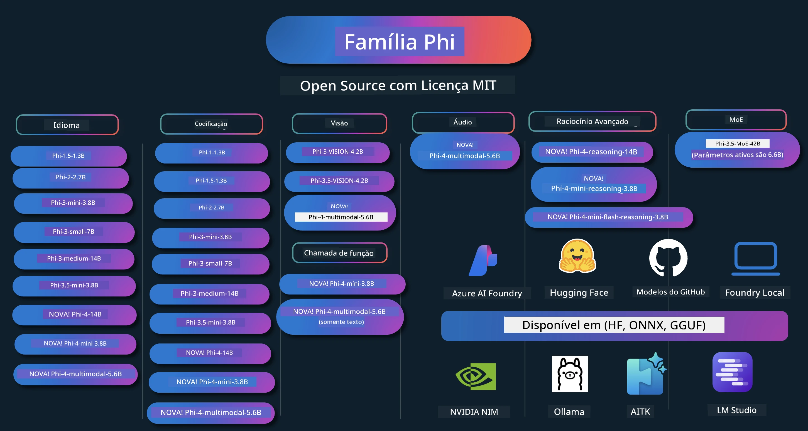

# Phi Cookbook: Exemplos Práticos com os Modelos Phi da Microsoft

[](https://codespaces.new/microsoft/phicookbook)
[](https://vscode.dev/redirect?url=vscode://ms-vscode-remote.remote-containers/cloneInVolume?url=https://github.com/microsoft/phicookbook)

[](https://GitHub.com/microsoft/phicookbook/graphs/contributors/?WT.mc_id=aiml-137032-kinfeylo)
[](https://GitHub.com/microsoft/phicookbook/issues/?WT.mc_id=aiml-137032-kinfeylo)
[](https://GitHub.com/microsoft/phicookbook/pulls/?WT.mc_id=aiml-137032-kinfeylo)
[](http://makeapullrequest.com?WT.mc_id=aiml-137032-kinfeylo)

[](https://GitHub.com/microsoft/phicookbook/watchers/?WT.mc_id=aiml-137032-kinfeylo)
[](https://GitHub.com/microsoft/phicookbook/network/?WT.mc_id=aiml-137032-kinfeylo)
[](https://GitHub.com/microsoft/phicookbook/stargazers/?WT.mc_id=aiml-137032-kinfeylo)

[](https://discord.com/invite/ByRwuEEgH4)

Phi é uma série de modelos de IA open source desenvolvidos pela Microsoft.

Atualmente, Phi é o modelo de pequena linguagem (SLM) mais poderoso e rentável, com benchmarks muito bons em múltiplos idiomas, raciocínio, geração de texto/chat, codificação, imagens, áudio e outros cenários.

Você pode implantar o Phi na nuvem ou em dispositivos de borda, e pode facilmente construir aplicações de IA generativa com poder computacional limitado.

Siga estes passos para começar a usar esses recursos:  
1. **Faça um Fork do Repositório**: Clique [](https://GitHub.com/microsoft/phicookbook/network/?WT.mc_id=aiml-137032-kinfeylo)  
2. **Clone o Repositório**: `git clone https://github.com/microsoft/PhiCookBook.git`  
3. [**Junte-se à Comunidade Microsoft AI no Discord e conheça especialistas e desenvolvedores**](https://discord.com/invite/ByRwuEEgH4?WT.mc_id=aiml-137032-kinfeylo)



### 🌐 Suporte Multilíngue

#### Suportado via GitHub Action (Automatizado e Sempre Atualizado)

<!-- CO-OP TRANSLATOR LANGUAGES TABLE START -->
[Árabe](../ar/README.md) | [Bengali](../bn/README.md) | [Búlgaro](../bg/README.md) | [Birmanês (Myanmar)](../my/README.md) | [Chinês (Simplificado)](../zh-CN/README.md) | [Chinês (Tradicional, Hong Kong)](../zh-HK/README.md) | [Chinês (Tradicional, Macau)](../zh-MO/README.md) | [Chinês (Tradicional, Taiwan)](../zh-TW/README.md) | [Croata](../hr/README.md) | [Tcheco](../cs/README.md) | [Dinamarquês](../da/README.md) | [Holandês](../nl/README.md) | [Estoniano](../et/README.md) | [Finlandês](../fi/README.md) | [Francês](../fr/README.md) | [Alemão](../de/README.md) | [Grego](../el/README.md) | [Hebraico](../he/README.md) | [Hindi](../hi/README.md) | [Húngaro](../hu/README.md) | [Indonésio](../id/README.md) | [Italiano](../it/README.md) | [Japonês](../ja/README.md) | [Kannada](../kn/README.md) | [Coreano](../ko/README.md) | [Lituano](../lt/README.md) | [Malaio](../ms/README.md) | [Malaiala](../ml/README.md) | [Marata](../mr/README.md) | [Nepali](../ne/README.md) | [Pidgin Nigeriano](../pcm/README.md) | [Norueguês](../no/README.md) | [Persa (Farsi)](../fa/README.md) | [Polonês](../pl/README.md) | [Português (Brasil)](./README.md) | [Português (Portugal)](../pt-PT/README.md) | [Punjabi (Gurmukhi)](../pa/README.md) | [Romeno](../ro/README.md) | [Russo](../ru/README.md) | [Sérvio (Cirílico)](../sr/README.md) | [Eslovaco](../sk/README.md) | [Esloveno](../sl/README.md) | [Espanhol](../es/README.md) | [Suaíli](../sw/README.md) | [Sueco](../sv/README.md) | [Tagalog (Filipino)](../tl/README.md) | [Tâmil](../ta/README.md) | [Telugo](../te/README.md) | [Tailandês](../th/README.md) | [Turco](../tr/README.md) | [Ucraniano](../uk/README.md) | [Urdu](../ur/README.md) | [Vietnamita](../vi/README.md)

> **Prefere clonar localmente?**
>
> Este repositório inclui mais de 50 traduções de idiomas, o que aumenta significativamente o tamanho do download. Para clonar sem as traduções, use o sparse checkout:
>
> **Bash / macOS / Linux:**
> ```bash
> git clone --filter=blob:none --sparse https://github.com/microsoft/PhiCookBook.git
> cd PhiCookBook
> git sparse-checkout set --no-cone '/*' '!translations' '!translated_images'
> ```
>
> **CMD (Windows):**
> ```cmd
> git clone --filter=blob:none --sparse https://github.com/microsoft/PhiCookBook.git
> cd PhiCookBook
> git sparse-checkout set --no-cone "/*" "!translations" "!translated_images"
> ```
>
> Isso fornece tudo que você precisa para completar o curso com um download muito mais rápido.
<!-- CO-OP TRANSLATOR LANGUAGES TABLE END -->

## Índice

- Introdução  
  - [Bem-vindo à Família Phi](./md/01.Introduction/01/01.PhiFamily.md)  
  - [Configurando seu ambiente](./md/01.Introduction/01/01.EnvironmentSetup.md)  
  - [Compreendendo Tecnologias-Chave](./md/01.Introduction/01/01.Understandingtech.md)  
  - [Segurança em IA para Modelos Phi](./md/01.Introduction/01/01.AISafety.md)  
  - [Suporte de Hardware Phi](./md/01.Introduction/01/01.Hardwaresupport.md)  
  - [Modelos Phi & Disponibilidade em várias plataformas](./md/01.Introduction/01/01.Edgeandcloud.md)  
  - [Usando Guidance-ai e Phi](./md/01.Introduction/01/01.Guidance.md)  
  - [Modelos do GitHub Marketplace](https://github.com/marketplace/models)  
  - [Catálogo de Modelos Azure AI](https://ai.azure.com)  

- Inferência Phi em diferentes ambientes  
  - [Hugging face](./md/01.Introduction/02/01.HF.md)  
  - [Modelos GitHub](./md/01.Introduction/02/02.GitHubModel.md)  
  - [Catálogo de Modelos Azure AI Foundry](./md/01.Introduction/02/03.AzureAIFoundry.md)  
  - [Ollama](./md/01.Introduction/02/04.Ollama.md)  
  - [AI Toolkit VSCode (AITK)](./md/01.Introduction/02/05.AITK.md)  
  - [NVIDIA NIM](./md/01.Introduction/02/06.NVIDIA.md)  
  - [Foundry Local](./md/01.Introduction/02/07.FoundryLocal.md)  

- Inferência Família Phi  
  - [Inferência Phi em iOS](./md/01.Introduction/03/iOS_Inference.md)  
  - [Inferência Phi em Android](./md/01.Introduction/03/Android_Inference.md)  
  - [Inferência Phi em Jetson](./md/01.Introduction/03/Jetson_Inference.md)  
  - [Inferência Phi em PC de IA](./md/01.Introduction/03/AIPC_Inference.md)  
  - [Inferência Phi com Apple MLX Framework](./md/01.Introduction/03/MLX_Inference.md)  
  - [Inferência Phi em Servidor Local](./md/01.Introduction/03/Local_Server_Inference.md)  
  - [Inferência Phi em Servidor Remoto usando AI Toolkit](./md/01.Introduction/03/Remote_Interence.md)  
  - [Inferência Phi com Rust](./md/01.Introduction/03/Rust_Inference.md)  
  - [Inferência Phi--Visão em Local](./md/01.Introduction/03/Vision_Inference.md)  
  - [Inferência Phi com Kaito AKS, Azure Containers (suporte oficial)](./md/01.Introduction/03/Kaito_Inference.md)  
- [Quantificação da Família Phi](./md/01.Introduction/04/QuantifyingPhi.md)  
  - [Quantificando Phi-3.5 / 4 usando llama.cpp](./md/01.Introduction/04/UsingLlamacppQuantifyingPhi.md)  
  - [Quantificando Phi-3.5 / 4 usando extensões de IA Generativa para onnxruntime](./md/01.Introduction/04/UsingORTGenAIQuantifyingPhi.md)  
  - [Quantificando Phi-3.5 / 4 usando Intel OpenVINO](./md/01.Introduction/04/UsingIntelOpenVINOQuantifyingPhi.md)  
  - [Quantificando Phi-3.5 / 4 usando Apple MLX Framework](./md/01.Introduction/04/UsingAppleMLXQuantifyingPhi.md)  

- Avaliação Phi  
  - [IA Responsável](./md/01.Introduction/05/ResponsibleAI.md)  
  - [Azure AI Foundry para Avaliação](./md/01.Introduction/05/AIFoundry.md)  
  - [Usando Promptflow para Avaliação](./md/01.Introduction/05/Promptflow.md)  

- RAG com Azure AI Search  
  - [Como usar Phi-4-mini e Phi-4-multimodal (RAG) com Azure AI Search](https://github.com/microsoft/PhiCookBook/blob/main/code/06.E2E/E2E_Phi-4-RAG-Azure-AI-Search.ipynb)

- Exemplos de desenvolvimento de aplicações Phi  
  - Aplicações de Texto & Chat  
    - Exemplos Phi-4 🆕  
      - [📓] [Chat com Modelo Phi-4-mini ONNX](./md/02.Application/01.TextAndChat/Phi4/ChatWithPhi4ONNX/README.md)  
      - [Chat com modelo Phi-4 ONNX local em .NET](../../md/04.HOL/dotnet/src/LabsPhi4-Chat-01OnnxRuntime)  
      - [Aplicação Console .NET Chat com Phi-4 ONNX usando Semantic Kernel](../../md/04.HOL/dotnet/src/LabsPhi4-Chat-02SK)  
    - Exemplos Phi-3 / 3.5  
      - [Chatbot local no navegador usando Phi3, ONNX Runtime Web e WebGPU](https://github.com/microsoft/onnxruntime-inference-examples/tree/main/js/chat)
      - [OpenVino Chat](./md/02.Application/01.TextAndChat/Phi3/E2E_OpenVino_Chat.md)
      - [Multi Modelo - Phi-3-mini interativo e OpenAI Whisper](./md/02.Application/01.TextAndChat/Phi3/E2E_Phi-3-mini_with_whisper.md)
      - [MLFlow - Construindo um wrapper e usando Phi-3 com MLFlow](./md//02.Application/01.TextAndChat/Phi3/E2E_Phi-3-MLflow.md)
      - [Otimização de Modelo - Como otimizar o modelo Phi-3-min para ONNX Runtime Web com Olive](https://github.com/microsoft/Olive/tree/main/examples/phi3)
      - [App WinUI3 com Phi-3 mini-4k-instruct-onnx](https://github.com/microsoft/Phi3-Chat-WinUI3-Sample/)
      -[Exemplo de Aplicativo de Notas com IA Multi Modelo WinUI3](https://github.com/microsoft/ai-powered-notes-winui3-sample)
      - [Ajuste fino e integração de modelos Phi-3 personalizados com Prompt flow](./md/02.Application/01.TextAndChat/Phi3/E2E_Phi-3-FineTuning_PromptFlow_Integration.md)
      - [Ajuste fino e integração de modelos Phi-3 personalizados com Prompt flow no Azure AI Foundry](./md/02.Application/01.TextAndChat/Phi3/E2E_Phi-3-FineTuning_PromptFlow_Integration_AIFoundry.md)
      - [Avaliação do modelo Phi-3 / Phi-3.5 ajustado no Azure AI Foundry com foco nos Princípios de IA Responsável da Microsoft](./md/02.Application/01.TextAndChat/Phi3/E2E_Phi-3-Evaluation_AIFoundry.md)
      - [📓] [Exemplo de predição de linguagem Phi-3.5-mini-instruct (Chinês/Inglês)](./md/02.Application/01.TextAndChat/Phi3/phi3-instruct-demo.ipynb)
      - [Chatbot RAG Phi-3.5-Instruct WebGPU](./md/02.Application/01.TextAndChat/Phi3/WebGPUWithPhi35Readme.md)
      - [Usando GPU do Windows para criar solução Prompt flow com Phi-3.5-Instruct ONNX](./md/02.Application/01.TextAndChat/Phi3/UsingPromptFlowWithONNX.md)
      - [Usando Microsoft Phi-3.5 tflite para criar app Android](./md/02.Application/01.TextAndChat/Phi3/UsingPhi35TFLiteCreateAndroidApp.md)
      - [Exemplo Q&A .NET usando modelo ONNX Phi-3 local com Microsoft.ML.OnnxRuntime](../../md/04.HOL/dotnet/src/LabsPhi301)
      - [App console chat .NET com Semantic Kernel e Phi-3](../../md/04.HOL/dotnet/src/LabsPhi302)

  - Exemplos de Código Baseados em SDK Azure AI Inference 
    - Exemplos Phi-4 🆕
      - [📓] [Gerar código de projeto usando Phi-4-multimodal](./md/02.Application/02.Code/Phi4/GenProjectCode/README.md)
    - Exemplos Phi-3 / 3.5
      - [Construa seu próprio GitHub Copilot Chat do Visual Studio Code com Microsoft Phi-3 Family](./md/02.Application/02.Code/Phi3/VSCodeExt/README.md)
      - [Crie seu próprio Agente Copilot Chat do Visual Studio Code com Phi-3.5 pelos Modelos GitHub](/md/02.Application/02.Code/Phi3/CreateVSCodeChatAgentWithGitHubModels.md)

  - Exemplos de Raciocínio Avançado
    - Exemplos Phi-4 🆕
      - [📓] [Exemplos de Phi-4-mini-reasoning ou Phi-4-reasoning](./md/02.Application/03.AdvancedReasoning/Phi4/AdvancedResoningPhi4mini/README.md)
      - [📓] [Ajuste fino do Phi-4-mini-reasoning com Microsoft Olive](./md/02.Application/03.AdvancedReasoning/Phi4/AdvancedResoningPhi4mini/olive_ft_phi_4_reasoning_with_medicaldata.ipynb)
      - [📓] [Ajuste fino do Phi-4-mini-reasoning com Apple MLX](./md/02.Application/03.AdvancedReasoning/Phi4/AdvancedResoningPhi4mini/mlx_ft_phi_4_reasoning_with_medicaldata.ipynb)
      - [📓] [Phi-4-mini-reasoning com Modelos GitHub](./md/02.Application/02.Code/Phi4r/github_models_inference.ipynb)
      - [📓] [Phi-4-mini-reasoning com Modelos Azure AI Foundry](./md/02.Application/02.Code/Phi4r/azure_models_inference.ipynb)
  - Demos
      - [Demos Phi-4-mini hospedados no Hugging Face Spaces](https://huggingface.co/spaces/microsoft/phi-4-mini?WT.mc_id=aiml-137032-kinfeylo)
      - [Demos Phi-4-multimodal hospedados no Hugginge Face Spaces](https://huggingface.co/spaces/microsoft/phi-4-multimodal?WT.mc_id=aiml-137032-kinfeylo)
  - Exemplos Vision
    - Exemplos Phi-4 🆕
      - [📓] [Usar Phi-4-multimodal para ler imagens e gerar código](./md/02.Application/04.Vision/Phi4/CreateFrontend/README.md) 
    - Exemplos Phi-3 / 3.5
      -  [📓][Phi-3-vision-Imagem texto para texto](./md/02.Application/04.Vision/Phi3/E2E_Phi-3-vision-image-text-to-text-online-endpoint.ipynb)
      - [Phi-3-vision-ONNX](https://onnxruntime.ai/docs/genai/tutorials/phi3-v.html)
      - [📓][Phi-3-vision CLIP Embedding](./md/02.Application/04.Vision/Phi3/E2E_Phi-3-vision-image-text-to-text-online-endpoint.ipynb)
      - [DEMO: Reciclagem Phi-3](https://github.com/jennifermarsman/PhiRecycling/)
      - [Phi-3-vision - Assistente de linguagem visual - com Phi3-Vision e OpenVINO](https://docs.openvino.ai/nightly/notebooks/phi-3-vision-with-output.html)
      - [Phi-3 Vision Nvidia NIM](./md/02.Application/04.Vision/Phi3/E2E_Nvidia_NIM_Vision.md)
      - [Phi-3 Vision OpenVino](./md/02.Application/04.Vision/Phi3/E2E_OpenVino_Phi3Vision.md)
      - [📓][Exemplo Phi-3.5 Vision multi-frame ou multi-imagem](./md/02.Application/04.Vision/Phi3/phi3-vision-demo.ipynb)
      - [Phi-3 Vision Modelo ONNX Local usando Microsoft.ML.OnnxRuntime .NET](../../md/04.HOL/dotnet/src/LabsPhi303)
      - [Modelo ONNX Local Phi-3 Vision baseado em Menu usando Microsoft.ML.OnnxRuntime .NET](../../md/04.HOL/dotnet/src/LabsPhi304)

  - Exemplos Matemáticos
    -  Exemplos Phi-4-Mini-Flash-Reasoning-Instruct 🆕 [Demonstração Matemática com Phi-4-Mini-Flash-Reasoning-Instruct](./md/02.Application/09.Math/MathDemo.ipynb)

  - Exemplos de Áudio
    - Exemplos Phi-4 🆕
      - [📓] [Extraindo transcrições de áudio usando Phi-4-multimodal](./md/02.Application/05.Audio/Phi4/Transciption/README.md)
      - [📓] [Exemplo de áudio Phi-4-multimodal](./md/02.Application/05.Audio/Phi4/Siri/demo.ipynb)
      - [📓] [Exemplo de Tradução de Fala Phi-4-multimodal](./md/02.Application/05.Audio/Phi4/Translate/demo.ipynb)
      - [Aplicativo console .NET usando áudio Phi-4-multimodal para analisar arquivo de áudio e gerar transcrição](../../md/04.HOL/dotnet/src/LabsPhi4-MultiModal-02Audio)

  - Exemplos MOE
    - Exemplos Phi-3 / 3.5
      - [📓] [Modelos Phi-3.5 Mistura de Especialistas (MoEs) Exemplo de Mídias Sociais](./md/02.Application/06.MoE/Phi3/phi3_moe_demo.ipynb)
      - [📓] [Construindo um Pipeline de Geração Ampliada por Recuperação (RAG) com NVIDIA NIM Phi-3 MOE, Azure AI Search, e LlamaIndex](./md/02.Application/06.MoE/Phi3/azure-ai-search-nvidia-rag.ipynb)
      - 
  - Exemplos de Chamada de Função
    - Exemplos Phi-4 🆕
      -  [📓] [Usando Chamada de Função com Phi-4-mini](./md/02.Application/07.FunctionCalling/Phi4/FunctionCallingBasic/README.md)
      -  [📓] [Usando Chamada de Função para criar multiagentes com Phi-4-mini](./md/02.Application/07.FunctionCalling/Phi4/Multiagents/Phi_4_mini_multiagent.ipynb)
      -  [📓] [Usando Chamada de Função com Ollama](./md/02.Application/07.FunctionCalling/Phi4/Ollama/ollama_functioncalling.ipynb)
      -  [📓] [Usando Chamada de Função com ONNX](./md/02.Application/07.FunctionCalling/Phi4/ONNX/onnx_parallel_functioncalling.ipynb)
  - Exemplos de Mistura Multimodal
    - Exemplos Phi-4 🆕
      -  [📓] [Usando Phi-4-multimodal como jornalista de tecnologia](./md/02.Application/08.Multimodel/Phi4/TechJournalist/phi_4_mm_audio_text_publish_news.ipynb)
      - [Aplicativo console .NET usando Phi-4-multimodal para analisar imagens](../../md/04.HOL/dotnet/src/LabsPhi4-MultiModal-01Images)

- Ajuste fino dos Exemplos Phi
  - [Cenários de ajuste fino](./md/03.FineTuning/FineTuning_Scenarios.md)
  - [Ajuste fino vs RAG](./md/03.FineTuning/FineTuning_vs_RAG.md)
  - [Ajuste fino para tornar Phi-3 um especialista da indústria](./md/03.FineTuning/LetPhi3gotoIndustriy.md)
  - [Ajuste fino do Phi-3 com AI Toolkit para VS Code](./md/03.FineTuning/Finetuning_VSCodeaitoolkit.md)
  - [Ajuste fino do Phi-3 com Azure Machine Learning Service](./md/03.FineTuning/Introduce_AzureML.md)
  - [Ajuste fino do Phi-3 com Lora](./md/03.FineTuning/FineTuning_Lora.md)
  - [Ajuste fino do Phi-3 com QLora](./md/03.FineTuning/FineTuning_Qlora.md)
  - [Ajuste fino do Phi-3 com Azure AI Foundry](./md/03.FineTuning/FineTuning_AIFoundry.md)
  - [Ajuste fino do Phi-3 com Azure ML CLI/SDK](./md/03.FineTuning/FineTuning_MLSDK.md)
  - [Ajuste fino com Microsoft Olive](./md/03.FineTuning/FineTuning_MicrosoftOlive.md)
  - [Laboratório prático de ajuste fino com Microsoft Olive](./md/03.FineTuning/olive-lab/readme.md)
  - [Ajuste fino do Phi-3-vision com Weights and Bias](./md/03.FineTuning/FineTuning_Phi-3-visionWandB.md)
  - [Ajuste fino do Phi-3 com Apple MLX Framework](./md/03.FineTuning/FineTuning_MLX.md)
  - [Ajuste fino do Phi-3-vision (suporte oficial)](./md/03.FineTuning/FineTuning_Vision.md)
  - [Ajuste fino do Phi-3 com Kaito AKS, Azure Containers (Suporte oficial)](./md/03.FineTuning/FineTuning_Kaito.md)
  - [Ajuste fino do Phi-3 e Phi-3.5 Vision](https://github.com/2U1/Phi3-Vision-Finetune)

- Laboratório prático
  - [Explorando modelos de ponta: LLMs, SLMs, desenvolvimento local e mais](https://github.com/microsoft/aitour-exploring-cutting-edge-models)
  - [Desbloqueando o potencial de NLP: Ajuste fino com Microsoft Olive](https://github.com/azure/Ignite_FineTuning_workshop)
- Artigos e Publicações Acadêmicas
  - [Textbooks Are All You Need II: relatório técnico phi-1.5](https://arxiv.org/abs/2309.05463)
  - [Relatório Técnico Phi-3: Um Modelo de Linguagem Altamente Capaz Localmente no Seu Telefone](https://arxiv.org/abs/2404.14219)
  - [Relatório Técnico Phi-4](https://arxiv.org/abs/2412.08905)
  - [Relatório Técnico Phi-4-Mini: Modelos de Linguagem Multimodais Compactos mas Poderosos via Mistura de LoRAs](https://arxiv.org/abs/2503.01743)
  - [Otimização de Modelos Pequenos de Linguagem para Chamada de Funções em Veículos](https://arxiv.org/abs/2501.02342)
  - [(WhyPHI) Ajuste Fino do PHI-3 para Perguntas de Múltipla Escolha: Metodologia, Resultados e Desafios](https://arxiv.org/abs/2501.01588)
  - [Relatório Técnico Phi-4-reasoning](https://www.microsoft.com/en-us/research/wp-content/uploads/2025/04/phi_4_reasoning.pdf)
  - [Relatório Técnico Phi-4-mini-reasoning](https://huggingface.co/microsoft/Phi-4-mini-reasoning/blob/main/Phi-4-Mini-Reasoning.pdf)

## Usando os Modelos Phi

### Phi no Azure AI Foundry

Você pode aprender como usar o Microsoft Phi e como construir soluções de ponta a ponta em seus diversos dispositivos de hardware. Para experimentar o Phi por conta própria, comece testando os modelos e personalizando o Phi para seus cenários usando o [Catálogo de Modelos Azure AI Foundry](https://aka.ms/phi3-azure-ai). Você pode saber mais em Começando com [Azure AI Foundry](/md/02.QuickStart/AzureAIFoundry_QuickStart.md)

**Playground**  
Cada modelo tem um playground dedicado para testar o modelo [Azure AI Playground](https://aka.ms/try-phi3).

### Phi nos Modelos do GitHub

Você pode aprender como usar o Microsoft Phi e como construir soluções de ponta a ponta em seus diversos dispositivos de hardware. Para experimentar o Phi por conta própria, comece testando o modelo e personalizando o Phi para seus cenários usando o [Catálogo de Modelos do GitHub](https://github.com/marketplace/models?WT.mc_id=aiml-137032-kinfeylo). Você pode saber mais em Começando com [Catálogo de Modelos do GitHub](/md/02.QuickStart/GitHubModel_QuickStart.md)

**Playground**  
Cada modelo possui um [playground dedicado para testar o modelo](/md/02.QuickStart/GitHubModel_QuickStart.md).

### Phi no Hugging Face

Você também pode encontrar o modelo no [Hugging Face](https://huggingface.co/microsoft)

**Playground**  
[Playground Hugging Chat](https://huggingface.co/chat/models/microsoft/Phi-3-mini-4k-instruct)

## 🎒 Outros Cursos

Nossa equipe produz outros cursos! Confira:

<!-- CO-OP TRANSLATOR OTHER COURSES START -->
### LangChain  
[](https://aka.ms/langchain4j-for-beginners)  
[](https://aka.ms/langchainjs-for-beginners?WT.mc_id=m365-94501-dwahlin)  
[](https://github.com/microsoft/langchain-for-beginners?WT.mc_id=m365-94501-dwahlin)  
---

### Azure / Edge / MCP / Agentes  
[](https://github.com/microsoft/AZD-for-beginners?WT.mc_id=academic-105485-koreyst)  
[](https://github.com/microsoft/edgeai-for-beginners?WT.mc_id=academic-105485-koreyst)  
[](https://github.com/microsoft/mcp-for-beginners?WT.mc_id=academic-105485-koreyst)  
[](https://github.com/microsoft/ai-agents-for-beginners?WT.mc_id=academic-105485-koreyst)

---

### Série IA Generativa  
[](https://github.com/microsoft/generative-ai-for-beginners?WT.mc_id=academic-105485-koreyst)  
[-9333EA?style=for-the-badge&labelColor=E5E7EB&color=9333EA)](https://github.com/microsoft/Generative-AI-for-beginners-dotnet?WT.mc_id=academic-105485-koreyst)  
[-C084FC?style=for-the-badge&labelColor=E5E7EB&color=C084FC)](https://github.com/microsoft/generative-ai-for-beginners-java?WT.mc_id=academic-105485-koreyst)  
[-E879F9?style=for-the-badge&labelColor=E5E7EB&color=E879F9)](https://github.com/microsoft/generative-ai-with-javascript?WT.mc_id=academic-105485-koreyst)

---

### Aprendizado Fundamental  
[](https://aka.ms/ml-beginners?WT.mc_id=academic-105485-koreyst)  
[](https://aka.ms/datascience-beginners?WT.mc_id=academic-105485-koreyst)  
[](https://aka.ms/ai-beginners?WT.mc_id=academic-105485-koreyst)  
[](https://github.com/microsoft/Security-101?WT.mc_id=academic-96948-sayoung)  
[](https://aka.ms/webdev-beginners?WT.mc_id=academic-105485-koreyst)  
[](https://aka.ms/iot-beginners?WT.mc_id=academic-105485-koreyst)  
[](https://github.com/microsoft/xr-development-for-beginners?WT.mc_id=academic-105485-koreyst)

---

### Série Copilot  
[](https://aka.ms/GitHubCopilotAI?WT.mc_id=academic-105485-koreyst)  
[](https://github.com/microsoft/mastering-github-copilot-for-dotnet-csharp-developers?WT.mc_id=academic-105485-koreyst)  
[](https://github.com/microsoft/CopilotAdventures?WT.mc_id=academic-105485-koreyst)  
<!-- CO-OP TRANSLATOR OTHER COURSES END -->

## IA Responsável

A Microsoft está comprometida em ajudar nossos clientes a usar nossos produtos de IA de maneira responsável, compartilhando nossos aprendizados e construindo parcerias baseadas em confiança por meio de ferramentas como Notas de Transparência e Avaliações de Impacto. Muitos desses recursos podem ser encontrados em [https://aka.ms/RAI](https://aka.ms/RAI).  
A abordagem da Microsoft para IA responsável está fundamentada em nossos princípios de IA de justiça, confiabilidade e segurança, privacidade e segurança, inclusão, transparência e responsabilidade.

Modelos de linguagem natural, imagem e fala em grande escala - como os usados neste exemplo - podem potencialmente se comportar de maneiras injustas, não confiáveis ou ofensivas, causando danos. Por favor, consulte a [nota de transparência do serviço Azure OpenAI](https://learn.microsoft.com/legal/cognitive-services/openai/transparency-note?tabs=text) para se informar sobre riscos e limitações.

A abordagem recomendada para mitigar esses riscos é incluir um sistema de segurança em sua arquitetura que possa detectar e prevenir comportamentos prejudiciais. O [Azure AI Content Safety](https://learn.microsoft.com/azure/ai-services/content-safety/overview) fornece uma camada independente de proteção, capaz de detectar conteúdo prejudicial gerado pelo usuário e pela IA em aplicações e serviços. O Azure AI Content Safety inclui APIs de texto e imagem que permitem detectar material que é prejudicial. Dentro do Azure AI Foundry, o serviço Content Safety permite que você visualize, explore e teste códigos de exemplo para detectar conteúdo prejudicial em diferentes modalidades. A seguinte [documentação de início rápido](https://learn.microsoft.com/azure/ai-services/content-safety/quickstart-text?tabs=visual-studio%2Clinux&pivots=programming-language-rest) guia você em como fazer requisições para o serviço.
Outro aspecto a ser considerado é o desempenho geral da aplicação. Com aplicações multimodais e multimoodelos, consideramos desempenho como o sistema funcionando conforme você e seus usuários esperam, incluindo não gerar outputs prejudiciais. É importante avaliar o desempenho da sua aplicação geral usando os [Avaliadores de Desempenho, Qualidade, Risco e Segurança](https://learn.microsoft.com/azure/ai-studio/concepts/evaluation-metrics-built-in). Você também tem a capacidade de criar e avaliar com [avaliadores personalizados](https://learn.microsoft.com/azure/ai-studio/how-to/develop/evaluate-sdk#custom-evaluators).

Você pode avaliar sua aplicação de IA no seu ambiente de desenvolvimento usando o [Azure AI Evaluation SDK](https://microsoft.github.io/promptflow/index.html). Dado um conjunto de dados de teste ou um alvo, as gerações da sua aplicação de IA generativa são medidas quantitativamente com avaliadores embutidos ou avaliadores personalizados de sua escolha. Para começar a usar o azure ai evaluation sdk para avaliar seu sistema, você pode seguir o [guia de início rápido](https://learn.microsoft.com/azure/ai-studio/how-to/develop/flow-evaluate-sdk). Após executar uma avaliação, você pode [visualizar os resultados no Azure AI Foundry](https://learn.microsoft.com/azure/ai-studio/how-to/evaluate-flow-results).

## Marcas Registradas

Este projeto pode conter marcas registradas ou logotipos de projetos, produtos ou serviços. O uso autorizado das marcas ou logotipos da Microsoft está sujeito e deve seguir as [Diretrizes de Marcas e Branding da Microsoft](https://www.microsoft.com/legal/intellectualproperty/trademarks/usage/general).
O uso das marcas ou logotipos da Microsoft em versões modificadas deste projeto não deve causar confusão ou implicar patrocínio da Microsoft. Qualquer uso de marcas ou logotipos de terceiros está sujeito às políticas desses terceiros.

## Obter Ajuda

Se ficar com dúvidas ou tiver perguntas sobre construir apps de IA, entre:

[](https://aka.ms/foundry/discord)

Se você tem feedback de produto ou erros ao construir, visite:

[](https://aka.ms/foundry/forum)

---

<!-- CO-OP TRANSLATOR DISCLAIMER START -->
**Aviso Legal**:  
Este documento foi traduzido utilizando o serviço de tradução por IA [Co-op Translator](https://github.com/Azure/co-op-translator). Embora nos esforcemos para garantir a precisão, esteja ciente de que traduções automatizadas podem conter erros ou imprecisões. O documento original em seu idioma nativo deve ser considerado a fonte autorizada. Para informações críticas, recomenda-se tradução profissional humana. Não nos responsabilizamos por quaisquer mal-entendidos ou interpretações errôneas decorrentes do uso desta tradução.
<!-- CO-OP TRANSLATOR DISCLAIMER END -->