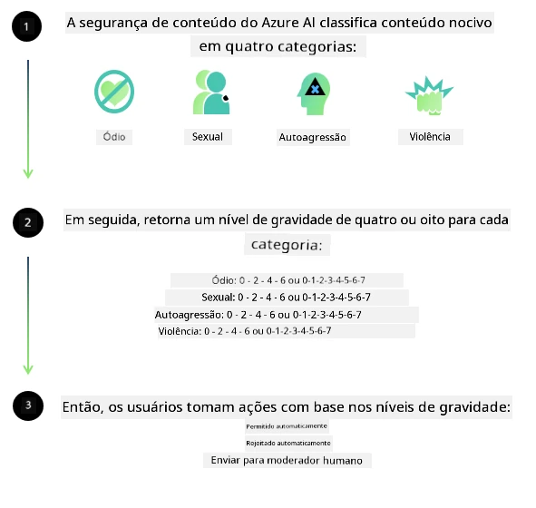
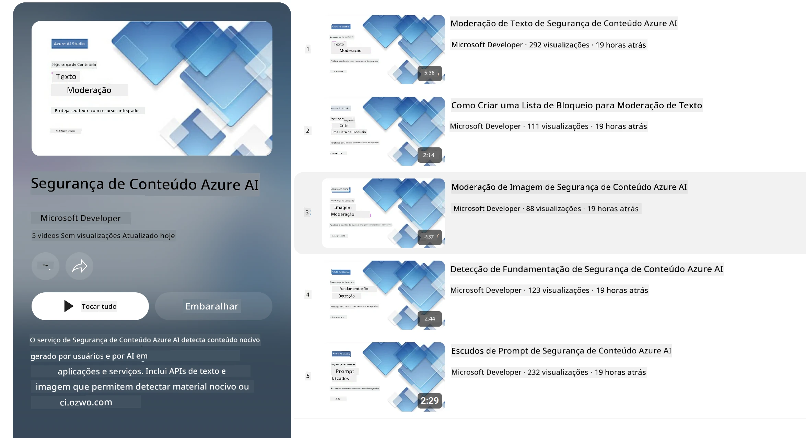

# Segurança de IA para modelos Phi
A família de modelos Phi foi desenvolvida de acordo com o [Padrão de IA Responsável da Microsoft](https://www.microsoft.com/ai/principles-and-approach#responsible-ai-standard), que é um conjunto de requisitos em toda a empresa baseado nos seguintes seis princípios: responsabilidade, transparência, justiça, confiabilidade e segurança, privacidade e segurança, e inclusão, que formam os [princípios de IA Responsável da Microsoft](https://www.microsoft.com/ai/responsible-ai). 

Como nos modelos Phi anteriores, foi adotada uma avaliação multifacetada de segurança e uma abordagem de segurança pós-treinamento, com medidas adicionais para considerar as capacidades multilíngues deste lançamento. Nossa abordagem para o treinamento e avaliações de segurança, incluindo testes em múltiplos idiomas e categorias de risco, está descrita no [Phi Safety Post-Training Paper](https://arxiv.org/abs/2407.13833). Embora os modelos Phi se beneficiem dessa abordagem, os desenvolvedores devem aplicar as melhores práticas de IA responsável, incluindo mapear, medir e mitigar riscos associados ao seu caso de uso específico e contexto cultural e linguístico.

## Melhores Práticas

Como outros modelos, a família de modelos Phi pode potencialmente se comportar de maneiras que são injustas, não confiáveis ou ofensivas.

Alguns dos comportamentos limitantes de SLM e LLM que você deve estar ciente incluem:

- **Qualidade do Serviço:** Os modelos Phi são treinados principalmente em texto em inglês. Línguas diferentes do inglês terão desempenho inferior. Variedades da língua inglesa com menos representação nos dados de treino podem apresentar desempenho inferior ao inglês americano padrão.
- **Representação de Danos e Perpetuação de Estereótipos:** Esses modelos podem super-representar ou sub-representar grupos de pessoas, apagar a representação de alguns grupos ou reforçar estereótipos depreciativos ou negativos. Apesar da segurança pós-treinamento, essas limitações podem ainda estar presentes devido aos diferentes níveis de representação de diferentes grupos ou à prevalência de exemplos de estereótipos negativos nos dados de treino que refletem padrões do mundo real e vieses sociais.
- **Conteúdo Inapropriado ou Ofensivo:** Esses modelos podem produzir outros tipos de conteúdo inapropriado ou ofensivo, o que pode tornar imprópria sua implantação em contextos sensíveis sem mitigações adicionais específicas para o caso de uso.
- **Confiabilidade da Informação:** Modelos de linguagem podem gerar conteúdo sem sentido ou fabricar conteúdo que pode parecer razoável, mas é impreciso ou desatualizado.
- **Escopo Limitado para Código:** A maioria dos dados de treinamento do Phi-3 é baseada em Python e usa pacotes comuns como "typing, math, random, collections, datetime, itertools". Se o modelo gerar scripts Python que utilizem outros pacotes ou scripts em outras linguagens, recomendamos fortemente que os usuários verifiquem manualmente todos os usos de APIs.

Os desenvolvedores devem aplicar as melhores práticas de IA responsável e são responsáveis por garantir que um caso de uso específico cumpra as leis e regulamentos relevantes (ex: privacidade, comércio, etc.). 

## Considerações sobre IA Responsável

Como outros modelos de linguagem, os modelos da série Phi podem comportar-se de maneiras que são injustas, não confiáveis ou ofensivas. Alguns dos comportamentos limitantes a serem observados incluem:

**Qualidade do Serviço:** Os modelos Phi são treinados principalmente em texto em inglês. Línguas diferentes do inglês terão desempenho inferior. Variedades da língua inglesa com menos representação nos dados de treinamentos podem apresentar desempenho inferior ao inglês americano padrão.

**Representação de Danos e Perpetuação de Estereótipos:** Esses modelos podem super-representar ou sub-representar grupos de pessoas, apagar a representação de alguns grupos ou reforçar estereótipos depreciativos ou negativos. Apesar da segurança pós-treinamento, essas limitações podem ainda estar presentes devido aos diferentes níveis de representação de diferentes grupos ou à prevalência de exemplos de estereótipos negativos nos dados de treino que refletem padrões do mundo real e vieses sociais.

**Conteúdo Inapropriado ou Ofensivo:** Esses modelos podem produzir outros tipos de conteúdo inapropriado ou ofensivo, o que pode tornar imprópria sua implantação em contextos sensíveis sem mitigações adicionais específicas para o caso de uso.
Confiabilidade da Informação: Modelos de linguagem podem gerar conteúdo sem sentido ou fabricar conteúdo que pode parecer razoável, mas é impreciso ou desatualizado.

**Escopo Limitado para Código:** A maioria dos dados de treinamento do Phi-3 é baseada em Python e usa pacotes comuns como "typing, math, random, collections, datetime, itertools". Se o modelo gerar scripts Python que utilizem outros pacotes ou scripts em outras linguagens, recomendamos fortemente que os usuários verifiquem manualmente todos os usos de APIs.

Os desenvolvedores devem aplicar as melhores práticas de IA responsável e são responsáveis por garantir que um caso de uso específico cumpra as leis e regulamentos relevantes (ex: privacidade, comércio, etc.). Áreas importantes para consideração incluem:

**Alocação:** Modelos podem não ser adequados para cenários que possam ter impacto consequente no status legal ou na alocação de recursos ou oportunidades de vida (ex: moradia, emprego, crédito, etc.) sem avaliações adicionais e técnicas adicionais de redução de vieses.

**Cenários de Alto Risco:** Os desenvolvedores devem avaliar a adequação do uso dos modelos em cenários de alto risco, onde saídas injustas, não confiáveis ou ofensivas possam ser extremamente custosas ou causar danos. Isso inclui fornecer aconselhamento em domínios sensíveis ou especializados onde precisão e confiabilidade são críticas (ex: aconselhamento jurídico ou de saúde). Salvaguardas adicionais devem ser implementadas no nível da aplicação conforme o contexto de implantação.

**Desinformação:** Modelos podem produzir informações imprecisas. Os desenvolvedores devem seguir as melhores práticas de transparência e informar os usuários finais que estão interagindo com um sistema de IA. No nível da aplicação, os desenvolvedores podem construir mecanismos de feedback e pipelines para fundamentar respostas em informações específicas do caso de uso e contextuais, uma técnica conhecida como Geração Aumentada por Recuperação (RAG).

**Geração de Conteúdo Prejudicial:** Os desenvolvedores devem avaliar as saídas conforme o contexto e usar classificadores de segurança disponíveis ou soluções personalizadas apropriadas para seu caso de uso.

**Uso Indevido:** Outras formas de uso indevido, como fraude, spam ou produção de malware, podem ser possíveis, e os desenvolvedores devem garantir que suas aplicações não violem leis e regulamentos aplicáveis.

### Ajuste Fino e Segurança de Conteúdo de IA

Após o ajuste fino de um modelo, recomendamos fortemente o uso das medidas de [Azure AI Content Safety](https://learn.microsoft.com/azure/ai-services/content-safety/overview) para monitorar o conteúdo gerado pelos modelos, identificar e bloquear riscos, ameaças e problemas de qualidade potenciais.

[Azure AI Content Safety](https://learn.microsoft.com/azure/ai-services/content-safety/overview) suporta tanto conteúdo de texto quanto de imagem. Pode ser implantado na nuvem, containers desconectados e dispositivos de borda/embarcados.

## Visão geral do Azure AI Content Safety

O Azure AI Content Safety não é uma solução única para todos os casos; ele pode ser personalizado para se alinhar às políticas específicas dos negócios. Além disso, seus modelos multilíngues permitem que ele compreenda múltiplas línguas simultaneamente.

- **Azure AI Content Safety**
- **Microsoft Developer**
- **5 vídeos**

O serviço Azure AI Content Safety detecta conteúdo prejudicial gerado por usuários e por IA em aplicações e serviços. Inclui APIs de texto e imagem que permitem detectar material prejudicial ou inapropriado.

[Playlist de AI Content Safety](https://www.youtube.com/playlist?list=PLlrxD0HtieHjaQ9bJjyp1T7FeCbmVcPkQ)

---

<!-- CO-OP TRANSLATOR DISCLAIMER START -->
**Aviso Legal**:  
Este documento foi traduzido usando o serviço de tradução por IA [Co-op Translator](https://github.com/Azure/co-op-translator). Embora nos esforcemos para garantir a precisão, esteja ciente de que traduções automáticas podem conter erros ou imprecisões. O documento original em seu idioma nativo deve ser considerado a fonte autorizada. Para informações críticas, recomenda-se tradução profissional feita por humanos. Não nos responsabilizamos por quaisquer mal-entendidos ou interpretações incorretas decorrentes do uso desta tradução.
<!-- CO-OP TRANSLATOR DISCLAIMER END -->