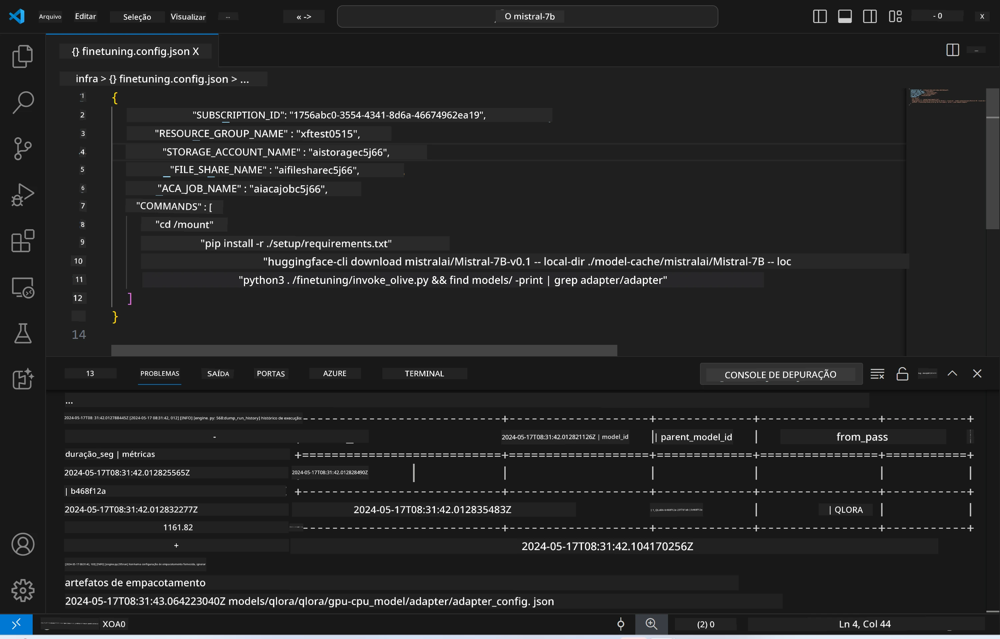
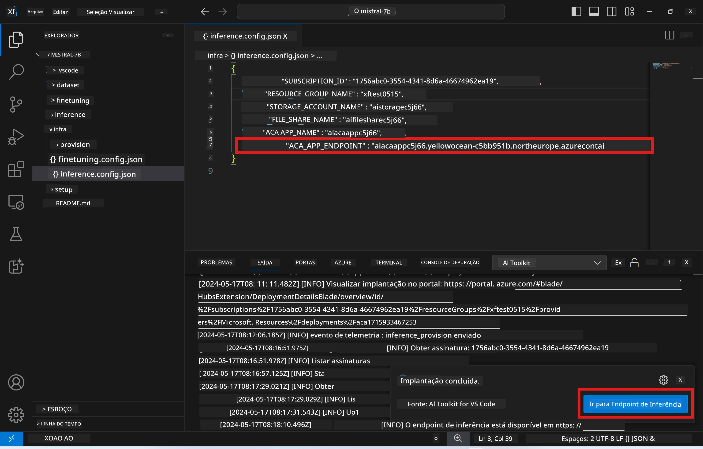

# Inferência Remota com o modelo ajustado

Após os adapters serem treinados no ambiente remoto, use uma aplicação simples do Gradio para interagir com o modelo.



### Provisionar Recursos do Azure  
Você precisa configurar os Recursos do Azure para inferência remota executando o comando `AI Toolkit: Provision Azure Container Apps for inference` a partir da paleta de comandos. Durante essa configuração, será solicitado que você selecione sua Assinatura do Azure e o grupo de recursos.  

   
Por padrão, a assinatura e o grupo de recursos para inferência devem ser os mesmos usados para o fine-tuning. A inferência usará o mesmo Ambiente do Azure Container App e acessará o modelo e o adapter do modelo armazenados no Azure Files, que foram gerados durante a etapa de fine-tuning.

## Usando o AI Toolkit

### Implantação para Inferência  
Se desejar revisar o código de inferência ou recarregar o modelo de inferência, execute o comando `AI Toolkit: Deploy for inference`. Isso sincronizará seu código mais recente com o ACA e reiniciará a réplica.


Após a conclusão bem-sucedida da implantação, o modelo estará pronto para avaliação usando este endpoint.

### Acessando a API de Inferência

Você pode acessar a API de inferência clicando no botão "*Go to Inference Endpoint*" exibido na notificação do VSCode. Alternativamente, o endpoint da API web pode ser encontrado em `ACA_APP_ENDPOINT` no arquivo `./infra/inference.config.json` e no painel de saída.



> **Note:** O endpoint de inferência pode levar alguns minutos para ficar totalmente operacional.

## Componentes de Inferência Incluídos no Template

| Pasta | Conteúdo |
| ------ |--------- |
| `infra` | Contém todas as configurações necessárias para operações remotas. |
| `infra/provision/inference.parameters.json` | Contém os parâmetros para os templates bicep, usados para provisionar recursos do Azure para inferência. |
| `infra/provision/inference.bicep` | Contém os templates para provisionar recursos do Azure para inferência. |
| `infra/inference.config.json` | O arquivo de configuração, gerado pelo comando `AI Toolkit: Provision Azure Container Apps for inference`. É usado como entrada para outros comandos remotos da paleta. |

### Usando o AI Toolkit para configurar o Provisionamento de Recursos do Azure  
Configure o [AI Toolkit](https://marketplace.visualstudio.com/items?itemName=ms-windows-ai-studio.windows-ai-studio)

Execute o comando `Provision Azure Container Apps for inference`.

Você pode encontrar os parâmetros de configuração no arquivo `./infra/provision/inference.parameters.json`. Aqui estão os detalhes:  
| Parâmetro | Descrição |
| --------- |------------ |
| `defaultCommands` | Comandos para iniciar uma API web. |
| `maximumInstanceCount` | Define a capacidade máxima de instâncias GPU. |
| `location` | Local onde os recursos do Azure serão provisionados. O valor padrão é o mesmo da localização do grupo de recursos escolhido. |
| `storageAccountName`, `fileShareName`, `acaEnvironmentName`, `acaEnvironmentStorageName`, `acaAppName`, `acaLogAnalyticsName` | Esses parâmetros são usados para nomear os recursos do Azure para provisionamento. Por padrão, eles serão iguais ao nome do recurso usado no fine-tuning. Você pode inserir um nome novo e não utilizado para criar recursos personalizados, ou pode inserir o nome de um recurso do Azure já existente, caso prefira usá-lo. Para mais detalhes, consulte a seção [Usando Recursos do Azure Existentes](../../../../../md/01.Introduction/03). |

### Usando Recursos do Azure Existentes

Por padrão, o provisionamento para inferência usa o mesmo Ambiente do Azure Container App, Conta de Armazenamento, Azure File Share e Azure Log Analytics que foram usados no fine-tuning. Um Azure Container App separado é criado exclusivamente para a API de inferência.

Se você personalizou os recursos do Azure durante o fine-tuning ou deseja usar seus próprios recursos do Azure existentes para inferência, especifique seus nomes no arquivo `./infra/inference.parameters.json`. Em seguida, execute o comando `AI Toolkit: Provision Azure Container Apps for inference` na paleta de comandos. Isso atualizará os recursos especificados e criará os que estiverem faltando.

Por exemplo, se você já possui um ambiente de container Azure existente, seu arquivo `./infra/finetuning.parameters.json` deve ser parecido com este:

```json
{
    "$schema": "https://schema.management.azure.com/schemas/2019-04-01/deploymentParameters.json#",
    "contentVersion": "1.0.0.0",
    "parameters": {
      ...
      "acaEnvironmentName": {
        "value": "<your-aca-env-name>"
      },
      "acaEnvironmentStorageName": {
        "value": null
      },
      ...
    }
  }
```

### Provisionamento Manual  
Se preferir configurar manualmente os recursos do Azure, você pode usar os arquivos bicep fornecidos na pasta `./infra/provision`. Se você já configurou todos os recursos do Azure sem usar a paleta de comandos do AI Toolkit, basta inserir os nomes dos recursos no arquivo `inference.config.json`.

Por exemplo:

```json
{
  "SUBSCRIPTION_ID": "<your-subscription-id>",
  "RESOURCE_GROUP_NAME": "<your-resource-group-name>",
  "STORAGE_ACCOUNT_NAME": "<your-storage-account-name>",
  "FILE_SHARE_NAME": "<your-file-share-name>",
  "ACA_APP_NAME": "<your-aca-name>",
  "ACA_APP_ENDPOINT": "<your-aca-endpoint>"
}
```

**Aviso Legal**:  
Este documento foi traduzido utilizando o serviço de tradução por IA [Co-op Translator](https://github.com/Azure/co-op-translator). Embora nos esforcemos para garantir a precisão, esteja ciente de que traduções automáticas podem conter erros ou imprecisões. O documento original em seu idioma nativo deve ser considerado a fonte autorizada. Para informações críticas, recomenda-se tradução profissional humana. Não nos responsabilizamos por quaisquer mal-entendidos ou interpretações incorretas decorrentes do uso desta tradução.