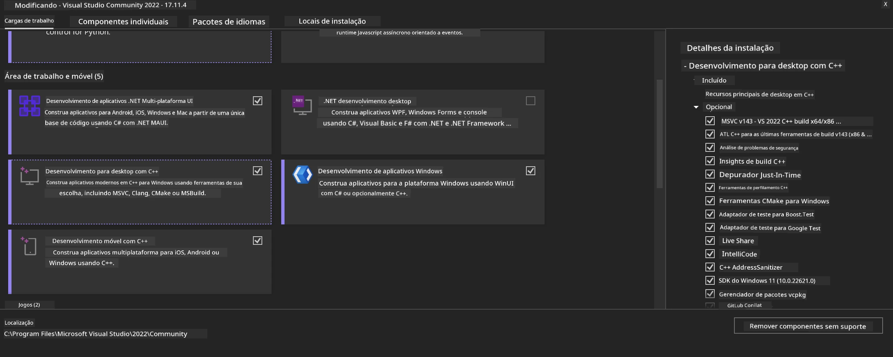
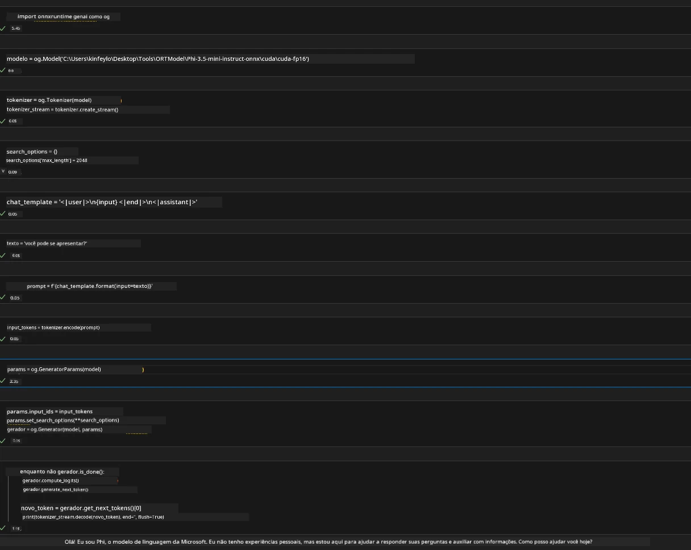
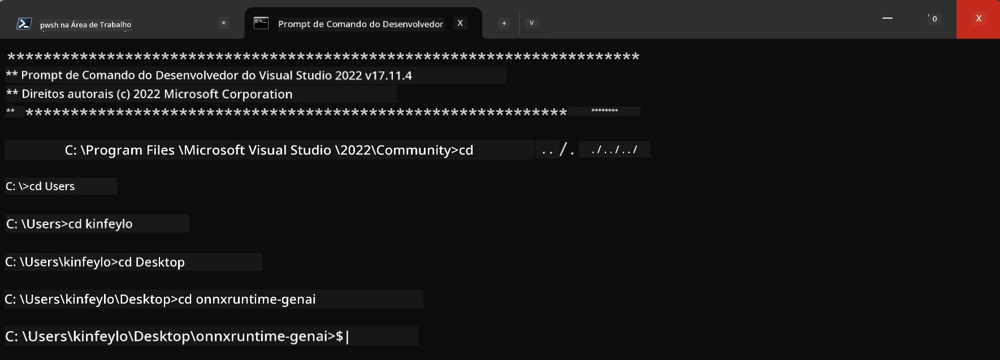

# **Diretriz para OnnxRuntime GenAI Windows GPU**

Esta diretriz fornece passos para configurar e usar o ONNX Runtime (ORT) com GPUs no Windows. Ela é projetada para ajudá-lo a aproveitar a aceleração por GPU para seus modelos, melhorando desempenho e eficiência.

O documento oferece orientação sobre:

- Configuração do Ambiente: Instruções para instalar as dependências necessárias como CUDA, cuDNN e ONNX Runtime.
- Configuração: Como configurar o ambiente e o ONNX Runtime para utilizar recursos da GPU de forma eficaz.
- Dicas de Otimização: Conselhos sobre como ajustar suas configurações de GPU para desempenho ótimo.

### **1. Python 3.10.x /3.11.8**

   ***Nota*** Sugere-se usar [miniforge](https://github.com/conda-forge/miniforge/releases/latest/download/Miniforge3-Windows-x86_64.exe) como seu ambiente Python

   ```bash

   conda create -n pydev python==3.11.8

   conda activate pydev

   ```

   ***Lembrete*** Se tiver instalado alguma biblioteca Python relacionada ao ONNX, por favor desinstale-a

### **2. Instalar CMake com winget**


   ```bash

   winget install -e --id Kitware.CMake

   ```

### **3. Instalar Visual Studio 2022 - Desenvolvimento Desktop com C++**

   ***Nota*** Se não quiser compilar, pode pular esta etapa




### **4. Instalar Driver NVIDIA**

1. **Driver NVIDIA GPU**  [https://www.nvidia.com/en-us/drivers/](https://www.nvidia.com/en-us/drivers/)

2. **NVIDIA CUDA 12.4** [https://developer.nvidia.com/cuda-12-4-0-download-archive](https://developer.nvidia.com/cuda-12-4-0-download-archive)

3. **NVIDIA CUDNN 9.4**  [https://developer.nvidia.com/cudnn-downloads](https://developer.nvidia.com/cudnn-downloads)

***Lembrete*** Por favor, use as configurações padrão no fluxo de instalação

### **5. Configurar Ambiente NVIDIA**

Copie as pastas lib, bin, include do NVIDIA CUDNN 9.4 para NVIDIA CUDA 12.4 lib, bin, include

- copie os arquivos de *'C:\Program Files\NVIDIA\CUDNN\v9.4\bin\12.6'* para  *'C:\Program Files\NVIDIA GPU Computing Toolkit\CUDA\v12.4\bin*

- copie os arquivos de *'C:\Program Files\NVIDIA\CUDNN\v9.4\include\12.6'* para  *'C:\Program Files\NVIDIA GPU Computing Toolkit\CUDA\v12.4\include*

- copie os arquivos de *'C:\Program Files\NVIDIA\CUDNN\v9.4\lib\12.6'* para  *'C:\Program Files\NVIDIA GPU Computing Toolkit\CUDA\v12.4\lib\x64'*


### **6. Baixar Phi-3.5-mini-instruct-onnx**


   ```bash

   winget install -e --id Git.Git

   winget install -e --id GitHub.GitLFS

   git lfs install

   git clone https://huggingface.co/microsoft/Phi-3.5-mini-instruct-onnx

   ```

### **7. Executar InferencePhi35Instruct.ipynb**

   Abra o [Notebook](../../../../code/09.UpdateSamples/Aug/ortgpu-phi35-instruct.ipynb) e execute 





### **8. Compilar ORT GenAI GPU**


   ***Nota*** 
   
   1. Por favor, desinstale todas as bibliotecas relacionadas a onnx, onnxruntime e onnxruntime-genai primeiro

   
   ```bash

   pip list 
   
   ```

   Depois desinstale todas as bibliotecas onnxruntime, por exemplo


   ```bash

   pip uninstall onnxruntime

   pip uninstall onnxruntime-genai

   pip uninstall onnxruntume-genai-cuda
   
   ```

   2. Verifique o suporte da Extensão do Visual Studio 

   Verifique se em C:\Program Files\NVIDIA GPU Computing Toolkit\CUDA\v12.4\extras existe a pasta C:\Program Files\NVIDIA GPU Computing Toolkit\CUDA\v12.4\extras\visual_studio_integration. 
   
   Se não for encontrada, verifique outras pastas do toolkit Cuda e copie a pasta visual_studio_integration e seus conteúdos para C:\Program Files\NVIDIA GPU Computing Toolkit\CUDA\v12.4\extras\visual_studio_integration


   - Se não quiser compilar, pode pular esta etapa


   ```bash

   git clone https://github.com/microsoft/onnxruntime-genai

   ```

   - Baixe [https://github.com/microsoft/onnxruntime/releases/download/v1.19.2/onnxruntime-win-x64-gpu-1.19.2.zip](https://github.com/microsoft/onnxruntime/releases/download/v1.19.2/onnxruntime-win-x64-gpu-1.19.2.zip)

   - Descompacte onnxruntime-win-x64-gpu-1.19.2.zip e renomeie para **ort**, copie a pasta ort para onnxruntime-genai

   - Usando o Windows Terminal, acesse o Prompt de Comando para Desenvolvedores do VS 2022 e vá para onnxruntime-genai 



   - Compile com seu ambiente Python

   
   ```bash

   cd onnxruntime-genai

   python build.py --use_cuda  --cuda_home "C:\Program Files\NVIDIA GPU Computing Toolkit\CUDA\v12.4" --config Release
 

   cd build/Windows/Release/Wheel

   pip install .whl

   ```

---

<!-- CO-OP TRANSLATOR DISCLAIMER START -->
**Aviso Legal**:
Este documento foi traduzido usando o serviço de tradução por IA [Co-op Translator](https://github.com/Azure/co-op-translator). Embora nos esforcemos pela precisão, por favor, esteja ciente de que traduções automatizadas podem conter erros ou imprecisões. O documento original em seu idioma nativo deve ser considerado a fonte autorizada. Para informações críticas, recomenda-se tradução profissional humana. Não nos responsabilizamos por quaisquer mal-entendidos ou interpretações incorretas decorrentes do uso desta tradução.
<!-- CO-OP TRANSLATOR DISCLAIMER END -->