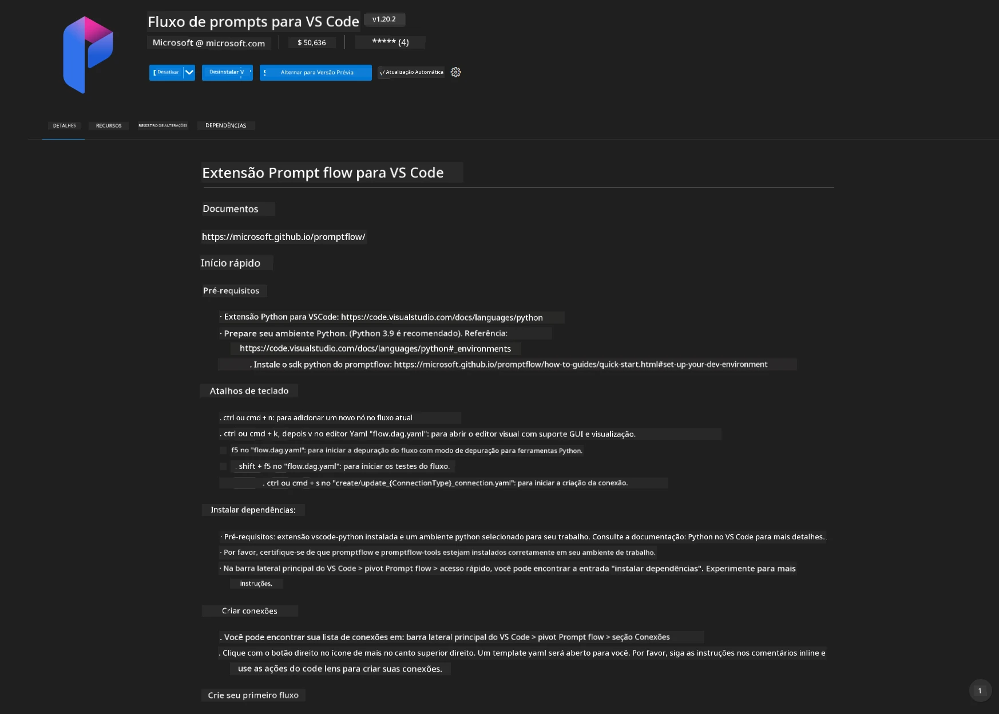
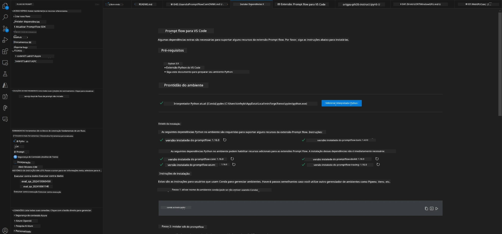
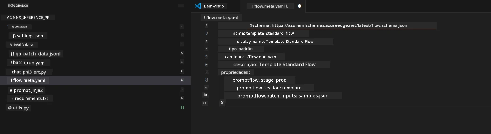
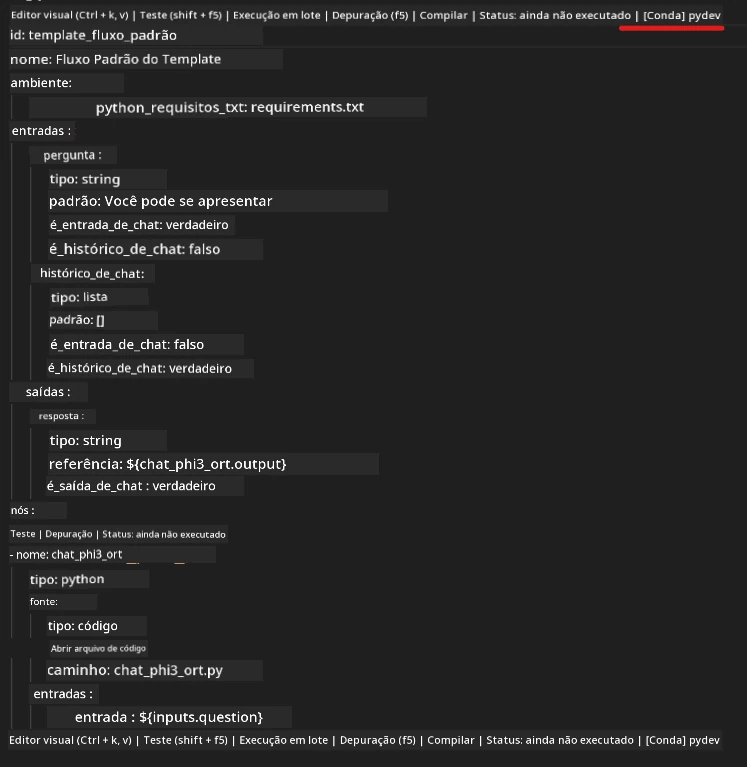
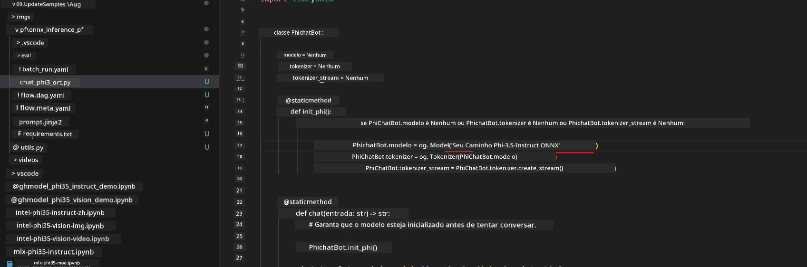
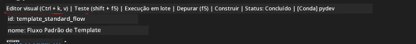
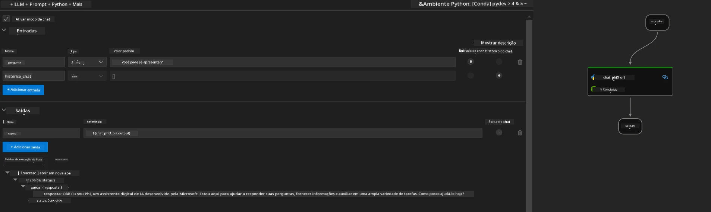
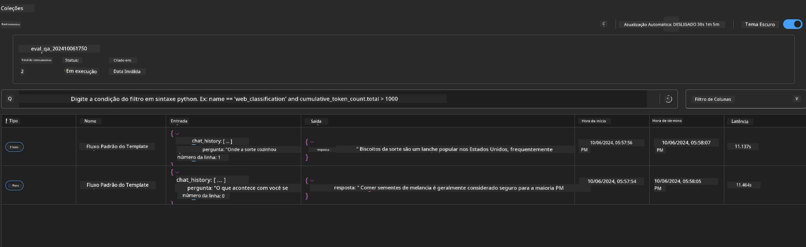

# Usando GPU do Windows para criar solução Prompt flow com Phi-3.5-Instruct ONNX 

O seguinte documento é um exemplo de como usar PromptFlow com ONNX (Open Neural Network Exchange) para desenvolver aplicações de IA baseadas em modelos Phi-3.

PromptFlow é um conjunto de ferramentas de desenvolvimento projetado para simplificar o ciclo completo de desenvolvimento de aplicações de IA baseadas em LLM (Large Language Model), desde a ideação e prototipagem até os testes e avaliação.

Ao integrar PromptFlow com ONNX, os desenvolvedores podem:

- Otimizar o desempenho do modelo: Aproveitar o ONNX para uma inferência e implantação eficiente do modelo.
- Simplificar o desenvolvimento: Usar PromptFlow para gerenciar o fluxo de trabalho e automatizar tarefas repetitivas.
- Melhorar a colaboração: Facilitar uma melhor colaboração entre os membros da equipe, fornecendo um ambiente de desenvolvimento unificado.

**Prompt flow** é um conjunto de ferramentas de desenvolvimento projetado para simplificar o ciclo completo de desenvolvimento de aplicações de IA baseadas em LLM, desde ideação, prototipagem, testes, avaliação até implantação em produção e monitoramento. Ele torna a engenharia de prompt muito mais fácil e permite construir apps LLM com qualidade de produção.

O Prompt flow pode se conectar ao OpenAI, Azure OpenAI Service, e modelos personalizáveis (Huggingface, LLM/SLM locais). Esperamos implantar o modelo ONNX quantizado do Phi-3.5 em aplicações locais. O Prompt flow pode nos ajudar a planejar melhor nosso negócio e completar soluções locais baseadas no Phi-3.5. Neste exemplo, combinaremos a Biblioteca ONNX Runtime GenAI para completar a solução Prompt flow baseada em GPU do Windows.

## **Instalação**

### **ONNX Runtime GenAI para GPU do Windows**

Leia esta diretriz para configurar o ONNX Runtime GenAI para GPU do Windows  [clique aqui](./ORTWindowGPUGuideline.md)

### **Configure o Prompt flow no VSCode**

1. Instale a extensão Prompt flow para VS Code



2. Após instalar a extensão Prompt flow para VS Code, clique na extensão e escolha **Installation dependencies** e siga esta diretriz para instalar o SDK do Prompt flow no seu ambiente



3. Baixe o [Código de Exemplo](../../../../../../code/09.UpdateSamples/Aug/pf/onnx_inference_pf) e use o VS Code para abrir este exemplo



4. Abra **flow.dag.yaml** para escolher seu ambiente Python



   Abra **chat_phi3_ort.py** para alterar a localização do seu modelo Phi-3.5-instruct ONNX



5. Execute seu prompt flow para testar

Abra **flow.dag.yaml** e clique no editor visual



após clicar aqui, execute para testar



1. Você pode executar em lote no terminal para verificar mais resultados


```bash

pf run create --file batch_run.yaml --stream --name 'Your eval qa name'    

```

Você pode verificar os resultados no seu navegador padrão




---

<!-- CO-OP TRANSLATOR DISCLAIMER START -->
**Aviso Legal**:
Este documento foi traduzido usando o serviço de tradução por IA [Co-op Translator](https://github.com/Azure/co-op-translator). Embora nos esforcemos pela precisão, por favor, esteja ciente de que traduções automatizadas podem conter erros ou imprecisões. O documento original em seu idioma nativo deve ser considerado a fonte autorizada. Para informações críticas, recomenda-se tradução profissional humana. Não nos responsabilizamos por quaisquer mal-entendidos ou interpretações incorretas decorrentes do uso desta tradução.
<!-- CO-OP TRANSLATOR DISCLAIMER END -->