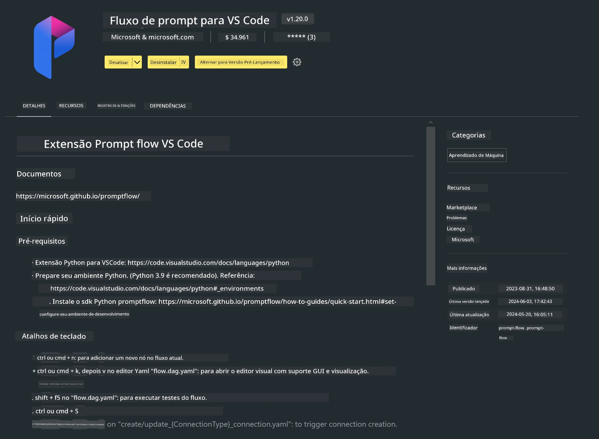

# **Lab 0 - Instalação**

Ao entrar no Lab, precisamos configurar o ambiente relevante:


### **1. Python 3.11+**

Recomenda-se usar o miniforge para configurar seu ambiente Python

Para configurar o miniforge, consulte [https://github.com/conda-forge/miniforge](https://github.com/conda-forge/miniforge)

Após configurar o miniforge, execute o seguinte comando no Power Shell

```bash

conda create -n pyenv python==3.11.8 -y

conda activate pyenv

```


### **2. Instalar o Prompt flow SDK**

No Lab 1, usaremos o Prompt flow, então é necessário configurar o Prompt flow SDK.

```bash

pip install promptflow --upgrade

```

Você pode verificar o promptflow sdk com este comando


```bash

pf --version

```

### **3. Instalar a Extensão Prompt flow do Visual Studio Code**



### **4. Framework MLX da Apple**

MLX é um framework para pesquisa em machine learning no silício da Apple, desenvolvido pela equipe de pesquisa em machine learning da Apple. Você pode usar o **framework Apple MLX** para acelerar LLM / SLM com Apple Silicon. Se quiser saber mais, pode ler [https://github.com/microsoft/PhiCookBook/blob/main/md/01.Introduction/03/MLX_Inference.md](https://github.com/microsoft/PhiCookBook/blob/main/md/01.Introduction/03/MLX_Inference.md).

Instale a biblioteca do framework MLX no bash


```bash

pip install mlx-lm

```


### **5. Outras Bibliotecas Python**


crie o arquivo requirements.txt e adicione este conteúdo

```txt

notebook
numpy 
scipy 
scikit-learn 
matplotlib 
pandas 
pillow 
graphviz

```


### **6. Instalar NVM**

instale o nvm no Powershell


```bash

brew install nvm

```

instale o nodejs 18.20


```bash

nvm install 18.20.0

nvm use 18.20.0

```

### **7. Instalar Suporte ao Desenvolvimento no Visual Studio Code**


```bash

npm install --global yo generator-code

```

Parabéns! Você configurou o SDK com sucesso. Agora, prossiga para as etapas práticas.

**Aviso Legal**:  
Este documento foi traduzido utilizando o serviço de tradução por IA [Co-op Translator](https://github.com/Azure/co-op-translator). Embora nos esforcemos para garantir a precisão, esteja ciente de que traduções automáticas podem conter erros ou imprecisões. O documento original em seu idioma nativo deve ser considerado a fonte autorizada. Para informações críticas, recomenda-se tradução profissional humana. Não nos responsabilizamos por quaisquer mal-entendidos ou interpretações incorretas decorrentes do uso desta tradução.