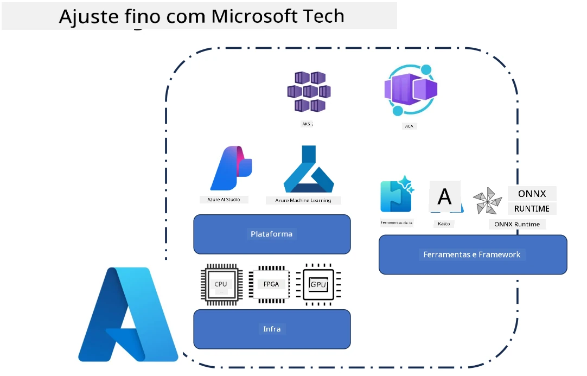
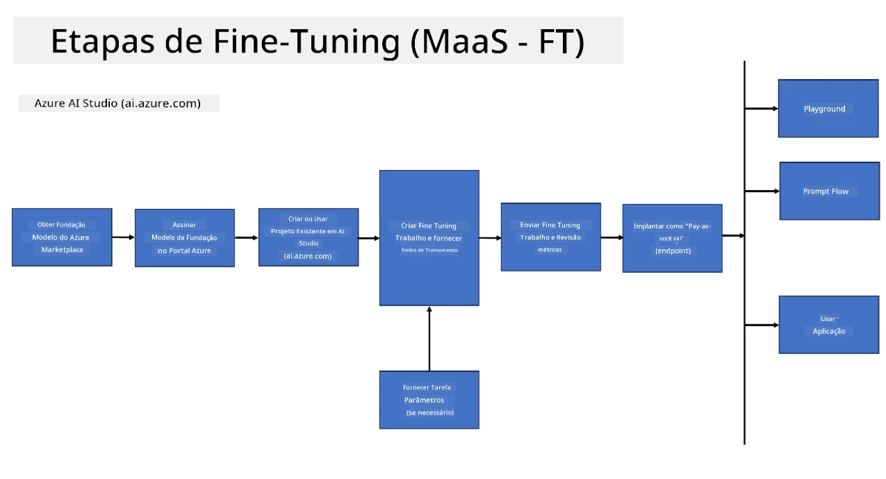
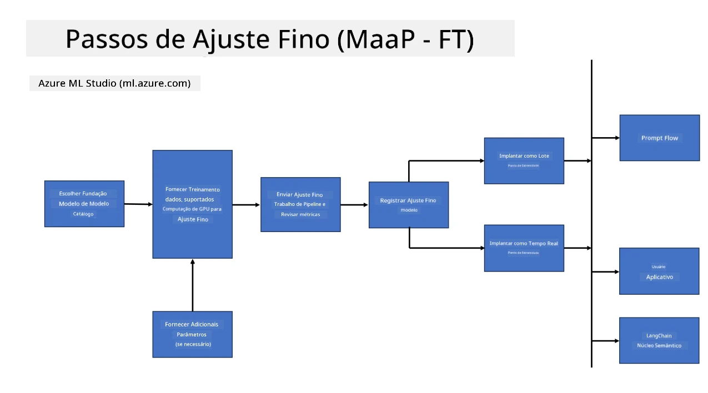
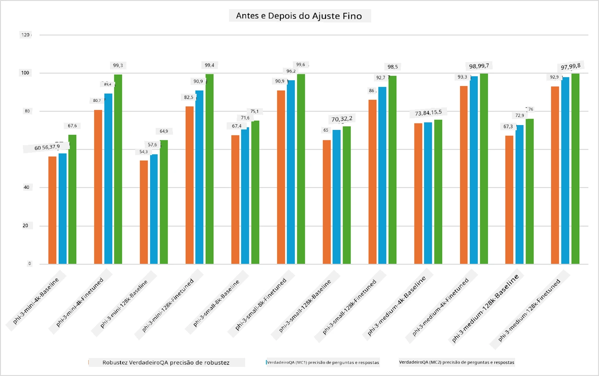

## Cenários de Fine Tuning

Esta seção fornece uma visão geral dos cenários de fine-tuning em ambientes Microsoft Foundry e Azure, incluindo modelos de implantação, camadas de infraestrutura e técnicas de otimização comumente usadas.

**Plataforma**  
Inclui serviços gerenciados como Microsoft Foundry (anteriormente Azure AI Foundry) e Azure Machine Learning, que fornecem gerenciamento de modelos, orquestração, rastreamento de experimentos e fluxos de trabalho de implantação.

**Infraestrutura**  
O fine-tuning requer recursos de computação escaláveis. Em ambientes Azure, isso normalmente inclui máquinas virtuais baseadas em GPU e recursos de CPU para cargas de trabalho leves, juntamente com armazenamento escalável para conjuntos de dados e pontos de verificação.

**Ferramentas & Framework**  
Fluxos de trabalho de fine-tuning geralmente dependem de frameworks e bibliotecas de otimização como Hugging Face Transformers, DeepSpeed e PEFT (Parameter-Efficient Fine-Tuning).

O processo de fine-tuning com tecnologias Microsoft abrange serviços de plataforma, infraestrutura de computação e frameworks de treinamento. Ao entender como esses componentes trabalham juntos, os desenvolvedores podem adaptar eficientemente modelos base a tarefas específicas e cenários de produção.

## Modelo como Serviço

Realize fine-tuning do modelo usando fine-tuning hospedado, sem a necessidade de criar e gerenciar computação.

O fine-tuning serverless está agora disponível para as famílias de modelos Phi-3, Phi-3.5 e Phi-4, permitindo que desenvolvedores personalizem rápida e facilmente os modelos para cenários de nuvem e edge sem precisar organizar computação.

## Modelo como Plataforma

Os usuários gerenciam sua própria computação para realizar fine-tuning dos seus modelos.

[Exemplo de Fine Tuning](https://github.com/Azure/azureml-examples/blob/main/sdk/python/foundation-models/system/finetune/chat-completion/chat-completion.ipynb)

## Comparação de Técnicas de Fine-Tuning

|Cenário|LoRA|QLoRA|PEFT|DeepSpeed|ZeRO|DoRA|
|---|---|---|---|---|---|---|
|Adaptação de LLMs pré-treinados para tarefas ou domínios específicos|Sim|Sim|Sim|Sim|Sim|Sim|
|Fine-tuning para tarefas de PLN como classificação de texto, reconhecimento de entidade nomeada e tradução automática|Sim|Sim|Sim|Sim|Sim|Sim|
|Fine-tuning para tarefas de Q&A|Sim|Sim|Sim|Sim|Sim|Sim|
|Fine-tuning para geração de respostas humanizadas em chatbots|Sim|Sim|Sim|Sim|Sim|Sim|
|Fine-tuning para geração de música, arte ou outras formas de criatividade|Sim|Sim|Sim|Sim|Sim|Sim|
|Redução de custos computacionais e financeiros|Sim|Sim|Sim|Sim|Sim|Sim|
|Redução do uso de memória|Sim|Sim|Sim|Sim|Sim|Sim|
|Uso de menos parâmetros para fine-tuning eficiente|Sim|Sim|Sim|Não|Não|Sim|
|Forma eficiente de paralelismo de dados que dá acesso à memória total das GPUs disponíveis|Não|Não|Não|Sim|Sim|Não|

> [!NOTE]
> LoRA, QLoRA, PEFT e DoRA são métodos de fine-tuning eficientes em parâmetros, enquanto DeepSpeed e ZeRO focam em treinamento distribuído e otimização de memória.

## Exemplos de Performance de Fine Tuning

---

<!-- CO-OP TRANSLATOR DISCLAIMER START -->
**Aviso Legal**:  
Este documento foi traduzido utilizando o serviço de tradução por IA [Co-op Translator](https://github.com/Azure/co-op-translator). Embora nos esforcemos para garantir a precisão, esteja ciente de que traduções automatizadas podem conter erros ou imprecisões. O documento original em seu idioma nativo deve ser considerado a fonte autoritativa. Para informações críticas, recomenda-se a tradução profissional realizada por humanos. Não nos responsabilizamos por quaisquer mal-entendidos ou interpretações incorretas decorrentes do uso desta tradução.
<!-- CO-OP TRANSLATOR DISCLAIMER END -->