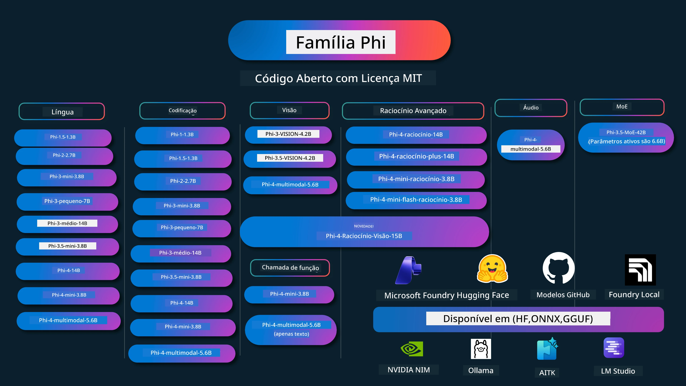

# Phi Cookbook: Exemplos Práticos com os Modelos Phi da Microsoft

[](https://codespaces.new/microsoft/phicookbook)
[](https://vscode.dev/redirect?url=vscode://ms-vscode-remote.remote-containers/cloneInVolume?url=https://github.com/microsoft/phicookbook)

[](https://GitHub.com/microsoft/phicookbook/graphs/contributors/?WT.mc_id=aiml-137032-kinfeylo)
[](https://GitHub.com/microsoft/phicookbook/issues/?WT.mc_id=aiml-137032-kinfeylo)
[](https://GitHub.com/microsoft/phicookbook/pulls/?WT.mc_id=aiml-137032-kinfeylo)
[](http://makeapullrequest.com?WT.mc_id=aiml-137032-kinfeylo)

[](https://GitHub.com/microsoft/phicookbook/watchers/?WT.mc_id=aiml-137032-kinfeylo)
[](https://GitHub.com/microsoft/phicookbook/network/?WT.mc_id=aiml-137032-kinfeylo)
[](https://GitHub.com/microsoft/phicookbook/stargazers/?WT.mc_id=aiml-137032-kinfeylo)

[](https://discord.com/invite/ByRwuEEgH4)

Phi é uma série de modelos de IA open source desenvolvidos pela Microsoft.

Phi é atualmente o modelo de linguagem pequeno (SLM) mais poderoso e económico, com benchmarks muito bons em multi-linguagem, raciocínio, geração de texto/chat, codificação, imagens, áudio e outros cenários.

Pode implantar o Phi na cloud ou em dispositivos edge, e pode construir facilmente aplicações de IA generativa com potência computacional limitada.

Siga estes passos para começar a usar estes recursos:
1. **Fazer Fork do Repositório**: Clique em [](https://GitHub.com/microsoft/phicookbook/network/?WT.mc_id=aiml-137032-kinfeylo)
2. **Clonar o Repositório**: `git clone https://github.com/microsoft/PhiCookBook.git`
3. [**Junte-se à Comunidade Microsoft AI Discord e conheça especialistas e outros programadores**](https://discord.com/invite/ByRwuEEgH4?WT.mc_id=aiml-137032-kinfeylo)



### 🌐 Suporte Multilíngue

#### Suportado via GitHub Action (Automatizado e Sempre Atualizado)

<!-- CO-OP TRANSLATOR LANGUAGES TABLE START -->
[Árabe](../ar/README.md) | [Bengali](../bn/README.md) | [Búlgaro](../bg/README.md) | [Birmanês (Myanmar)](../my/README.md) | [Chinês (Simplificado)](../zh-CN/README.md) | [Chinês (Tradicional, Hong Kong)](../zh-HK/README.md) | [Chinês (Tradicional, Macau)](../zh-MO/README.md) | [Chinês (Tradicional, Taiwan)](../zh-TW/README.md) | [Croata](../hr/README.md) | [Checo](../cs/README.md) | [Dinamarquês](../da/README.md) | [Holandês](../nl/README.md) | [Estónio](../et/README.md) | [Finlandês](../fi/README.md) | [Francês](../fr/README.md) | [Alemão](../de/README.md) | [Grego](../el/README.md) | [Hebraico](../he/README.md) | [Hindi](../hi/README.md) | [Húngaro](../hu/README.md) | [Indonésio](../id/README.md) | [Italiano](../it/README.md) | [Japonês](../ja/README.md) | [Kannada](../kn/README.md) | [Khmer](../km/README.md) | [Coreano](../ko/README.md) | [Lituano](../lt/README.md) | [Malaio](../ms/README.md) | [Malaiala](../ml/README.md) | [Marathi](../mr/README.md) | [Nepalês](../ne/README.md) | [Pidgin Nigeriano](../pcm/README.md) | [Norueguês](../no/README.md) | [Persa (Farsi)](../fa/README.md) | [Polaco](../pl/README.md) | [Português (Brasil)](../pt-BR/README.md) | [Português (Portugal)](./README.md) | [Punjabi (Gurmukhi)](../pa/README.md) | [Romeno](../ro/README.md) | [Russo](../ru/README.md) | [Sérvio (Cirílico)](../sr/README.md) | [Eslovaco](../sk/README.md) | [Esloveno](../sl/README.md) | [Espanhol](../es/README.md) | [Suaíli](../sw/README.md) | [Sueco](../sv/README.md) | [Tagalog (Filipino)](../tl/README.md) | [Tâmil](../ta/README.md) | [Telugu](../te/README.md) | [Tailandês](../th/README.md) | [Turco](../tr/README.md) | [Ucraniano](../uk/README.md) | [Urdu](../ur/README.md) | [Vietnamita](../vi/README.md)

> **Prefere Clonar Localmente?**
>
> Este repositório inclui mais de 50 traduções que aumentam significativamente o tamanho do download. Para clonar sem traduções, use o sparse checkout:
>
> **Bash / macOS / Linux:**
> ```bash
> git clone --filter=blob:none --sparse https://github.com/microsoft/PhiCookBook.git
> cd PhiCookBook
> git sparse-checkout set --no-cone '/*' '!translations' '!translated_images'
> ```
>
> **CMD (Windows):**
> ```cmd
> git clone --filter=blob:none --sparse https://github.com/microsoft/PhiCookBook.git
> cd PhiCookBook
> git sparse-checkout set --no-cone "/*" "!translations" "!translated_images"
> ```
>
> Isto dá-lhe tudo o que precisa para completar o curso com um download muito mais rápido.
<!-- CO-OP TRANSLATOR LANGUAGES TABLE END -->

## Índice

- Introdução
  - [Bem-vindo à Família Phi](./md/01.Introduction/01/01.PhiFamily.md)
  - [Configurar o seu ambiente](./md/01.Introduction/01/01.EnvironmentSetup.md)
  - [Compreender as Tecnologias-Chave](./md/01.Introduction/01/01.Understandingtech.md)
  - [Segurança de IA para Modelos Phi](./md/01.Introduction/01/01.AISafety.md)
  - [Suporte de Hardware Phi](./md/01.Introduction/01/01.Hardwaresupport.md)
  - [Modelos Phi & Disponibilidade em várias plataformas](./md/01.Introduction/01/01.Edgeandcloud.md)
  - [Usar Guidance-ai e Phi](./md/01.Introduction/01/01.Guidance.md)
  - [Modelos do GitHub Marketplace](https://github.com/marketplace/models)
  - [Catálogo de Modelos Azure AI](https://ai.azure.com)

- Inferência Phi em diferentes ambientes
    -  [Hugging face](./md/01.Introduction/02/01.HF.md)
    -  [Modelos GitHub](./md/01.Introduction/02/02.GitHubModel.md)
    -  [Catálogo de Modelos Microsoft Foundry](./md/01.Introduction/02/03.AzureAIFoundry.md)
    -  [Ollama](./md/01.Introduction/02/04.Ollama.md)
    -  [AI Toolkit VSCode (AITK)](./md/01.Introduction/02/05.AITK.md)
    -  [NVIDIA NIM](./md/01.Introduction/02/06.NVIDIA.md)
    -  [Foundry Local](./md/01.Introduction/02/07.FoundryLocal.md)

- Inferência Família Phi
    - [Inferência Phi em iOS](./md/01.Introduction/03/iOS_Inference.md)
    - [Inferência Phi em Android](./md/01.Introduction/03/Android_Inference.md)
    - [Inferência Phi em Jetson](./md/01.Introduction/03/Jetson_Inference.md)
    - [Inferência Phi em AI PC](./md/01.Introduction/03/AIPC_Inference.md)
    - [Inferência Phi com Apple MLX Framework](./md/01.Introduction/03/MLX_Inference.md)
    - [Inferência Phi em Servidor Local](./md/01.Introduction/03/Local_Server_Inference.md)
    - [Inferência Phi em Servidor Remoto usando AI Toolkit](./md/01.Introduction/03/Remote_Interence.md)
    - [Inferência Phi com Rust](./md/01.Introduction/03/Rust_Inference.md)
    - [Inferência Phi–Vision local](./md/01.Introduction/03/Vision_Inference.md)
    - [Inferência Phi com Kaito AKS, Contêineres Azure (suporte oficial)](./md/01.Introduction/03/Kaito_Inference.md)
-  [Quantificação Família Phi](./md/01.Introduction/04/QuantifyingPhi.md)
    - [Quantização Phi-3.5 / 4 usando llama.cpp](./md/01.Introduction/04/UsingLlamacppQuantifyingPhi.md)
    - [Quantização Phi-3.5 / 4 usando extensões de IA Generativa para onnxruntime](./md/01.Introduction/04/UsingORTGenAIQuantifyingPhi.md)
    - [Quantização Phi-3.5 / 4 usando Intel OpenVINO](./md/01.Introduction/04/UsingIntelOpenVINOQuantifyingPhi.md)
    - [Quantização Phi-3.5 / 4 usando Apple MLX Framework](./md/01.Introduction/04/UsingAppleMLXQuantifyingPhi.md)

-  Avaliação Phi
    - [IA Responsável](./md/01.Introduction/05/ResponsibleAI.md)
    - [Microsoft Foundry para Avaliação](./md/01.Introduction/05/AIFoundry.md)
    - [Usar Promptflow para Avaliação](./md/01.Introduction/05/Promptflow.md)
 
- RAG com Azure AI Search
    - [Como usar Phi-4-mini e Phi-4-multimodal (RAG) com Azure AI Search](https://github.com/microsoft/PhiCookBook/blob/main/code/06.E2E/E2E_Phi-4-RAG-Azure-AI-Search.ipynb)
    - [RAG Híbrido Local Zero-Cloud com SQLite FTS5 e phi-4-mini](https://github.com/microsoft/PhiCookBook/blob/main/code/06.E2E/E2E_Phi-4-mini_Local_Hybrid_RAG_SQLite_FTS5.ipynb)

- Exemplos de desenvolvimento de aplicações Phi
  - Aplicações de Texto e Chat
    - Exemplos Phi-4
      - [📓] [Conversar com Modelo Phi-4-mini ONNX](./md/02.Application/01.TextAndChat/Phi4/ChatWithPhi4ONNX/README.md)
      - [Conversar com Modelo Phi-4 local ONNX .NET](../../md/04.HOL/dotnet/src/LabsPhi4-Chat-01OnnxRuntime)
      - [App Console .NET para Chat com Phi-4 ONNX usando Sementic Kernel](../../md/04.HOL/dotnet/src/LabsPhi4-Chat-02SK)

    - Phi-3 / 3.5 Exemplos
      - [Chatbot local no browser usando Phi3, ONNX Runtime Web e WebGPU](https://github.com/microsoft/onnxruntime-inference-examples/tree/main/js/chat)
      - [Chat OpenVino](./md/02.Application/01.TextAndChat/Phi3/E2E_OpenVino_Chat.md)
      - [Multi Modelo - Phi-3-mini interativo e OpenAI Whisper](./md/02.Application/01.TextAndChat/Phi3/E2E_Phi-3-mini_with_whisper.md)
      - [MLFlow - Construir um wrapper e usar Phi-3 com MLFlow](./md//02.Application/01.TextAndChat/Phi3/E2E_Phi-3-MLflow.md)
      - [Otimização de Modelo - Como otimizar o modelo Phi-3-min para ONNX Runtime Web com Olive](https://github.com/microsoft/Olive/tree/main/examples/phi3)
      - [Aplicação WinUI3 com Phi-3 mini-4k-instruct-onnx](https://github.com/microsoft/Phi3-Chat-WinUI3-Sample/)
      -[Exemplo de aplicação WinUI3 Multi Model AI Powered Notes](https://github.com/microsoft/ai-powered-notes-winui3-sample)
      - [Ajustar e integrar modelos Phi-3 personalizados com Prompt flow](./md/02.Application/01.TextAndChat/Phi3/E2E_Phi-3-FineTuning_PromptFlow_Integration.md)
      - [Ajustar e integrar modelos Phi-3 personalizados com Prompt flow na Microsoft Foundry](./md/02.Application/01.TextAndChat/Phi3/E2E_Phi-3-FineTuning_PromptFlow_Integration_AIFoundry.md)
      - [Avaliar o modelo Phi-3 / Phi-3.5 ajustado na Microsoft Foundry com foco nos princípios de IA responsável da Microsoft](./md/02.Application/01.TextAndChat/Phi3/E2E_Phi-3-Evaluation_AIFoundry.md)
      - [📓] [Exemplo de predição de linguagem Phi-3.5-mini-instruct (Chinês/Inglês)](./md/02.Application/01.TextAndChat/Phi3/phi3-instruct-demo.ipynb)
      - [Chatbot Phi-3.5-Instruct WebGPU RAG](./md/02.Application/01.TextAndChat/Phi3/WebGPUWithPhi35Readme.md)
      - [Usar GPU do Windows para criar solução Prompt flow com Phi-3.5-Instruct ONNX](./md/02.Application/01.TextAndChat/Phi3/UsingPromptFlowWithONNX.md)
      - [Usar Microsoft Phi-3.5 tflite para criar aplicação Android](./md/02.Application/01.TextAndChat/Phi3/UsingPhi35TFLiteCreateAndroidApp.md)
      - [Exemplo Q&A .NET usando modelo ONNX Phi-3 local com Microsoft.ML.OnnxRuntime](../../md/04.HOL/dotnet/src/LabsPhi301)
      - [Aplicação chat consola .NET com Semantic Kernel e Phi-3](../../md/04.HOL/dotnet/src/LabsPhi302)

  - Exemplos de Código do SDK de Inferência Azure AI
    - Exemplos Phi-4
      - [📓] [Gerar código de projeto usando Phi-4-multimodal](./md/02.Application/02.Code/Phi4/GenProjectCode/README.md)
    - Exemplos Phi-3 / 3.5
      - [Construa o seu próprio VS Code GitHub Copilot Chat com a família Microsoft Phi-3](./md/02.Application/02.Code/Phi3/VSCodeExt/README.md)
      - [Crie o seu próprio agente Copilot de chat no Visual Studio Code com Phi-3.5 pelos modelos do GitHub](/md/02.Application/02.Code/Phi3/CreateVSCodeChatAgentWithGitHubModels.md)

  - Exemplos de Raciocínio Avançado
    - Exemplos Phi-4
      - [📓] [Exemplos Phi-4-mini-raciocínio ou Phi-4-raciocínio](./md/02.Application/03.AdvancedReasoning/Phi4/AdvancedResoningPhi4mini/README.md)
      - [📓] [Ajuste fino Phi-4-mini-raciocínio com Microsoft Olive](./md/02.Application/03.AdvancedReasoning/Phi4/AdvancedResoningPhi4mini/olive_ft_phi_4_reasoning_with_medicaldata.ipynb)
      - [📓] [Ajuste fino Phi-4-mini-raciocínio com Apple MLX](./md/02.Application/03.AdvancedReasoning/Phi4/AdvancedResoningPhi4mini/mlx_ft_phi_4_reasoning_with_medicaldata.ipynb)
      - [📓] [Phi-4-mini-raciocínio com modelos GitHub](./md/02.Application/02.Code/Phi4r/github_models_inference.ipynb)
      - [📓] [Phi-4-mini-raciocínio com modelos Microsoft Foundry](./md/02.Application/02.Code/Phi4r/azure_models_inference.ipynb)
  - Demos
      - [Demos Phi-4-mini hospedadas no Hugging Face Spaces](https://huggingface.co/spaces/microsoft/phi-4-mini?WT.mc_id=aiml-137032-kinfeylo)
      - [Demos Phi-4-multimodal hospedadas no Hugginge Face Spaces](https://huggingface.co/spaces/microsoft/phi-4-multimodal?WT.mc_id=aiml-137032-kinfeylo)
  - Exemplos de Visão
    - Exemplos Phi-4
      - [📓] [Usar Phi-4-multimodal para ler imagens e gerar código](./md/02.Application/04.Vision/Phi4/CreateFrontend/README.md)
    - Exemplos Phi-3 / 3.5
      -  [📓][Phi-3-visão - texto de imagem para texto](./md/02.Application/04.Vision/Phi3/E2E_Phi-3-vision-image-text-to-text-online-endpoint.ipynb)
      - [Phi-3-visão-ONNX](https://onnxruntime.ai/docs/genai/tutorials/phi3-v.html)
      - [📓][Phi-3-visão CLIP Embedding](./md/02.Application/04.Vision/Phi3/E2E_Phi-3-vision-image-text-to-text-online-endpoint.ipynb)
      - [DEMO: Reciclagem Phi-3](https://github.com/jennifermarsman/PhiRecycling/)
      - [Phi-3-visão - Assistente de linguagem visual - com Phi3-Vision e OpenVINO](https://docs.openvino.ai/nightly/notebooks/phi-3-vision-with-output.html)
      - [Phi-3 Visão Nvidia NIM](./md/02.Application/04.Vision/Phi3/E2E_Nvidia_NIM_Vision.md)
      - [Phi-3 Visão OpenVino](./md/02.Application/04.Vision/Phi3/E2E_OpenVino_Phi3Vision.md)
      - [📓][Phi-3.5 Visão multi-frame ou multi-imagem exemplo](./md/02.Application/04.Vision/Phi3/phi3-vision-demo.ipynb)
      - [Phi-3 Visão Modelo ONNX Local usando Microsoft.ML.OnnxRuntime .NET](../../md/04.HOL/dotnet/src/LabsPhi303)
      - [Modelo ONNX Local baseado em menu Phi-3 Visão usando Microsoft.ML.OnnxRuntime .NET](../../md/04.HOL/dotnet/src/LabsPhi304)

  - Exemplos Raciocínio-Visão
    - Phi-4-Raciocínio-Visão-15B
      - [📓] [Usar Phi-4-Raciocínio-Visão-15B para detectar travessia indevida](./md/02.Application/10.ReasoningVision/Phi_4_reasoning_vision_15b_Jaywalking.ipynb)
      - [📓] [Usar Phi-4-Raciocínio-Visão-15B para matemática](./md/02.Application/10.ReasoningVision/Phi_4_reasoning_vision_15b_Math.ipynb)
      - [📓] [Usar Phi-4-Raciocínio-Visão-15B para detetar UI](./md/02.Application/10.ReasoningVision/Phi_4_reasoning_vision_15b_ui.ipynb)

  - Exemplos de Matemática
    - Exemplos Phi-4-Mini-Flash-Reasoning-Instruct  [Demo Matemática com Phi-4-Mini-Flash-Reasoning-Instruct](./md/02.Application/09.Math/MathDemo.ipynb)

  - Exemplos Áudio
    - Exemplos Phi-4
      - [📓] [Extrair transcrições áudio usando Phi-4-multimodal](./md/02.Application/05.Audio/Phi4/Transciption/README.md)
      - [📓] [Exemplo áudio Phi-4-multimodal](./md/02.Application/05.Audio/Phi4/Siri/demo.ipynb)
      - [📓] [Exemplo de tradução de fala Phi-4-multimodal](./md/02.Application/05.Audio/Phi4/Translate/demo.ipynb)
      - [Aplicação consola .NET usando Phi-4-multimodal áudio para analisar ficheiro áudio e gerar transcrição](../../md/04.HOL/dotnet/src/LabsPhi4-MultiModal-02Audio)

  - Exemplos MOE
    - Exemplos Phi-3 / 3.5
      - [📓] [Modelos Phi-3.5 Mistura de Especialistas (MoEs) Exemplo Redes Sociais](./md/02.Application/06.MoE/Phi3/phi3_moe_demo.ipynb)
      - [📓] [Construir Pipeline de Geração com Recuperação (RAG) com NVIDIA NIM Phi-3 MOE, Azure AI Search e LlamaIndex](./md/02.Application/06.MoE/Phi3/azure-ai-search-nvidia-rag.ipynb)
      - 
  - Exemplos de Chamada de Função
    - Exemplos Phi-4 🆕
      -  [📓] [Usar Chamada de Função com Phi-4-mini](./md/02.Application/07.FunctionCalling/Phi4/FunctionCallingBasic/README.md)
      -  [📓] [Usar Chamada de Função para criar multi-agentes com Phi-4-mini](./md/02.Application/07.FunctionCalling/Phi4/Multiagents/Phi_4_mini_multiagent.ipynb)
      -  [📓] [Usar Chamada de Função com Ollama](./md/02.Application/07.FunctionCalling/Phi4/Ollama/ollama_functioncalling.ipynb)
      -  [📓] [Usar Chamada de Função com ONNX](./md/02.Application/07.FunctionCalling/Phi4/ONNX/onnx_parallel_functioncalling.ipynb)
  - Exemplos de Mistura Multimodal
    - Exemplos Phi-4 🆕
      -  [📓] [Usar Phi-4-multimodal como jornalista tecnológico](./md/02.Application/08.Multimodel/Phi4/TechJournalist/phi_4_mm_audio_text_publish_news.ipynb)
      - [Aplicação consola .NET usando Phi-4-multimodal para analisar imagens](../../md/04.HOL/dotnet/src/LabsPhi4-MultiModal-01Images)

- Ajuste fino de Exemplos Phi
  - [Cenários de ajuste fino](./md/03.FineTuning/FineTuning_Scenarios.md)
  - [Ajuste fino vs RAG](./md/03.FineTuning/FineTuning_vs_RAG.md)
  - [Ajuste fino para tornar Phi-3 um perito da indústria](./md/03.FineTuning/LetPhi3gotoIndustriy.md)
  - [Ajuste fino Phi-3 com AI Toolkit para VS Code](./md/03.FineTuning/Finetuning_VSCodeaitoolkit.md)
  - [Ajuste fino Phi-3 com Azure Machine Learning Service](./md/03.FineTuning/Introduce_AzureML.md)
  - [Ajuste fino Phi-3 com Lora](./md/03.FineTuning/FineTuning_Lora.md)
  - [Ajuste fino Phi-3 com QLora](./md/03.FineTuning/FineTuning_Qlora.md)
  - [Ajuste fino Phi-3 com Microsoft Foundry](./md/03.FineTuning/FineTuning_AIFoundry.md)
  - [Ajuste fino Phi-3 com Azure ML CLI/SDK](./md/03.FineTuning/FineTuning_MLSDK.md)
  - [Ajuste fino com Microsoft Olive](./md/03.FineTuning/FineTuning_MicrosoftOlive.md)
  - [Laboratório prático de ajuste fino com Microsoft Olive](./md/03.FineTuning/olive-lab/readme.md)
  - [Ajuste fino Phi-3-vision com Weights and Bias](./md/03.FineTuning/FineTuning_Phi-3-visionWandB.md)

  - [Ajuste fino do Phi-3 com o Apple MLX Framework](./md/03.FineTuning/FineTuning_MLX.md)
  - [Ajuste fino do Phi-3-vision (suporte oficial)](./md/03.FineTuning/FineTuning_Vision.md)
  - [Ajuste fino do Phi-3 com Kaito AKS, Azure Containers (suporte oficial)](./md/03.FineTuning/FineTuning_Kaito.md)
  - [Ajuste fino do Phi-3 e 3.5 Vision](https://github.com/2U1/Phi3-Vision-Finetune)

- Laboratório Prático
  - [Explorar modelos de ponta: LLMs, SLMs, desenvolvimento local e mais](https://github.com/microsoft/aitour-exploring-cutting-edge-models)
  - [Desbloquear o potencial do NLP: Ajuste fino com Microsoft Olive](https://github.com/azure/Ignite_FineTuning_workshop)

- Artigos Académicos e Publicações
  - [Textbooks Are All You Need II: relatório técnico phi-1.5](https://arxiv.org/abs/2309.05463)
  - [Relatório Técnico Phi-3: Um Modelo de Linguagem Altamente Capaz Localmente no Seu Telemóvel](https://arxiv.org/abs/2404.14219)
  - [Relatório Técnico Phi-4](https://arxiv.org/abs/2412.08905)
  - [Relatório Técnico Phi-4-Mini: Modelos de Linguagem Multimodal Compactos mas Poderosos via Mistura-de-LoRAs](https://arxiv.org/abs/2503.01743)
  - [Otimização de Pequenos Modelos de Linguagem para Chamada de Função In-Veículo](https://arxiv.org/abs/2501.02342)
  - [(WhyPHI) Ajuste fino do PHI-3 para Resposta a Perguntas de Escolha Múltipla: Metodologia, Resultados e Desafios](https://arxiv.org/abs/2501.01588)
  - [Relatório Técnico Phi-4-raciocínio](https://www.microsoft.com/en-us/research/wp-content/uploads/2025/04/phi_4_reasoning.pdf)
  - [Relatório Técnico Phi-4-mini-raciocínio](https://huggingface.co/microsoft/Phi-4-mini-reasoning/blob/main/Phi-4-Mini-Reasoning.pdf)

## Utilizar Modelos Phi

### Phi no Microsoft Foundry

Pode aprender a usar o Microsoft Phi e a construir soluções E2E nos seus diferentes dispositivos de hardware. Para experimentar o Phi, comece por brincar com os modelos e personalizar o Phi para os seus cenários usando o [Catálogo de Modelos Azure AI do Microsoft Foundry](https://aka.ms/phi3-azure-ai). Pode saber mais em Começar com [Microsoft Foundry](/md/02.QuickStart/AzureAIFoundry_QuickStart.md)

**Área de Testes**
Cada modelo tem uma área de testes dedicada para experimentar o modelo [Azure AI Playground](https://aka.ms/try-phi3).

### Phi nos Modelos GitHub

Pode aprender a usar o Microsoft Phi e a construir soluções E2E nos seus diferentes dispositivos de hardware. Para experimentar o Phi, comece por brincar com o modelo e personalizar o Phi para os seus cenários usando o [Catálogo de Modelos GitHub](https://github.com/marketplace/models?WT.mc_id=aiml-137032-kinfeylo). Pode saber mais em Começar com [Catálogo de Modelos GitHub](/md/02.QuickStart/GitHubModel_QuickStart.md)

**Área de Testes**
Cada modelo tem uma [área de testes dedicada para experimentar o modelo](/md/02.QuickStart/GitHubModel_QuickStart.md).

### Phi no Hugging Face

Também pode encontrar o modelo no [Hugging Face](https://huggingface.co/microsoft)

**Área de Testes**
 [Área de testes Hugging Chat](https://huggingface.co/chat/models/microsoft/Phi-3-mini-4k-instruct)

 ## 🎒 Outros Cursos

A nossa equipa produz outros cursos! Consulte:

<!-- CO-OP TRANSLATOR OTHER COURSES START -->
### LangChain
[](https://aka.ms/langchain4j-for-beginners)
[](https://aka.ms/langchainjs-for-beginners?WT.mc_id=m365-94501-dwahlin)
[](https://github.com/microsoft/langchain-for-beginners?WT.mc_id=m365-94501-dwahlin)
---

### Azure / Edge / MCP / Agentes
[](https://github.com/microsoft/AZD-for-beginners?WT.mc_id=academic-105485-koreyst)
[](https://github.com/microsoft/edgeai-for-beginners?WT.mc_id=academic-105485-koreyst)
[](https://github.com/microsoft/mcp-for-beginners?WT.mc_id=academic-105485-koreyst)
[](https://github.com/microsoft/ai-agents-for-beginners?WT.mc_id=academic-105485-koreyst)

---
 
### Série de IA Generativa
[](https://github.com/microsoft/generative-ai-for-beginners?WT.mc_id=academic-105485-koreyst)
[-9333EA?style=for-the-badge&labelColor=E5E7EB&color=9333EA)](https://github.com/microsoft/Generative-AI-for-beginners-dotnet?WT.mc_id=academic-105485-koreyst)
[-C084FC?style=for-the-badge&labelColor=E5E7EB&color=C084FC)](https://github.com/microsoft/generative-ai-for-beginners-java?WT.mc_id=academic-105485-koreyst)
[-E879F9?style=for-the-badge&labelColor=E5E7EB&color=E879F9)](https://github.com/microsoft/generative-ai-with-javascript?WT.mc_id=academic-105485-koreyst)

---
 
### Aprendizagem Core
[](https://aka.ms/ml-beginners?WT.mc_id=academic-105485-koreyst)
[](https://aka.ms/datascience-beginners?WT.mc_id=academic-105485-koreyst)
[](https://aka.ms/ai-beginners?WT.mc_id=academic-105485-koreyst)
[](https://github.com/microsoft/Security-101?WT.mc_id=academic-96948-sayoung)
[](https://aka.ms/webdev-beginners?WT.mc_id=academic-105485-koreyst)
[](https://aka.ms/iot-beginners?WT.mc_id=academic-105485-koreyst)
[](https://github.com/microsoft/xr-development-for-beginners?WT.mc_id=academic-105485-koreyst)

---
 
### Série Copilot
[](https://aka.ms/GitHubCopilotAI?WT.mc_id=academic-105485-koreyst)
[](https://github.com/microsoft/mastering-github-copilot-for-dotnet-csharp-developers?WT.mc_id=academic-105485-koreyst)
[](https://github.com/microsoft/CopilotAdventures?WT.mc_id=academic-105485-koreyst)
<!-- CO-OP TRANSLATOR OTHER COURSES END -->

## IA Responsável

A Microsoft está comprometida em ajudar os nossos clientes a usar os nossos produtos de IA de forma responsável, partilhando as nossas aprendizagens e construindo parcerias baseadas na confiança através de ferramentas como Notas de Transparência e Avaliações de Impacto. Muitos destes recursos podem ser encontrados em [https://aka.ms/RAI](https://aka.ms/RAI).
A abordagem da Microsoft à IA responsável assenta nos nossos princípios de IA de justiça, fiabilidade e segurança, privacidade e segurança, inclusão, transparência e responsabilidade.

Modelos de grande escala de linguagem natural, imagem e fala - como os usados neste exemplo - podem potencialmente comportar-se de maneiras injustas, não fiáveis ou ofensivas, causando assim prejuízos. Por favor consulte a [nota de Transparência do serviço Azure OpenAI](https://learn.microsoft.com/legal/cognitive-services/openai/transparency-note?tabs=text) para estar informado sobre riscos e limitações.


A abordagem recomendada para mitigar estes riscos é incluir um sistema de segurança na sua arquitetura que possa detetar e prevenir comportamentos nocivos. [Azure AI Content Safety](https://learn.microsoft.com/azure/ai-services/content-safety/overview) fornece uma camada independente de proteção, capaz de detetar conteúdos nocivos gerados por utilizadores e por IA em aplicações e serviços. O Azure AI Content Safety inclui APIs de texto e de imagem que lhe permitem detetar material nocivo. No Microsoft Foundry, o serviço Content Safety permite-lhe ver, explorar e experimentar código de exemplo para detetar conteúdo nocivo em diferentes modalidades. A seguinte documentação [quickstart](https://learn.microsoft.com/azure/ai-services/content-safety/quickstart-text?tabs=visual-studio%2Clinux&pivots=programming-language-rest) orienta-o na realização de pedidos ao serviço.

Outro aspeto a ter em conta é o desempenho geral da aplicação. Com aplicações multimodais e multimodelos, consideramos desempenho o facto do sistema funcionar como você e os seus utilizadores esperam, incluindo a não geração de saídas nocivas. É importante avaliar o desempenho da sua aplicação global utilizando os [avaliadores de Performance e Qualidade e de Risco e Segurança](https://learn.microsoft.com/azure/ai-studio/concepts/evaluation-metrics-built-in). Também tem a possibilidade de criar e avaliar com [avaliadores personalizados](https://learn.microsoft.com/azure/ai-studio/how-to/develop/evaluate-sdk#custom-evaluators).

Pode avaliar a sua aplicação de IA no seu ambiente de desenvolvimento utilizando o [Azure AI Evaluation SDK](https://microsoft.github.io/promptflow/index.html). Dado um conjunto de dados de teste ou um alvo, as gerações da sua aplicação de IA generativa são medidas quantitativamente com avaliadores integrados ou avaliadores personalizados à sua escolha. Para começar com o Azure AI Evaluation SDK para avaliar o seu sistema, pode seguir o [guia quickstart](https://learn.microsoft.com/azure/ai-studio/how-to/develop/flow-evaluate-sdk). Depois de executar uma avaliação, pode [visualizar os resultados no Microsoft Foundry](https://learn.microsoft.com/azure/ai-studio/how-to/evaluate-flow-results).

## Marcas Registadas

Este projeto pode conter marcas registadas ou logótipos de projetos, produtos ou serviços. O uso autorizado das marcas registadas ou logótipos da Microsoft está sujeito e deve seguir as [Diretrizes de Marcas e Branding da Microsoft](https://www.microsoft.com/legal/intellectualproperty/trademarks/usage/general).
O uso das marcas registadas ou logótipos da Microsoft em versões modificadas deste projeto não deve causar confusão nem implicar patrocínio da Microsoft. Qualquer uso de marcas registadas ou logótipos de terceiros está sujeito às políticas desses terceiros.

## Obter Ajuda

Se ficar bloqueado ou tiver alguma dúvida sobre a criação de aplicações de IA, junte-se a:

[](https://aka.ms/foundry/discord)

Se tiver feedback sobre produtos ou erros durante o desenvolvimento, visite:

[](https://aka.ms/foundry/forum)

---

<!-- CO-OP TRANSLATOR DISCLAIMER START -->
**Aviso Legal**:
Este documento foi traduzido utilizando o serviço de tradução automática [Co-op Translator](https://github.com/Azure/co-op-translator). Embora nos esforcemos pela precisão, esteja ciente de que traduções automáticas podem conter erros ou imprecisões. O documento original na sua língua nativa deve ser considerado a fonte autorizada. Para informações críticas, recomenda-se tradução profissional humana. Não nos responsabilizamos por quaisquer mal-entendidos ou interpretações incorretas resultantes da utilização desta tradução.
<!-- CO-OP TRANSLATOR DISCLAIMER END -->