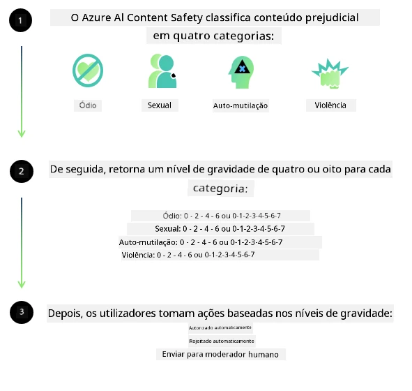
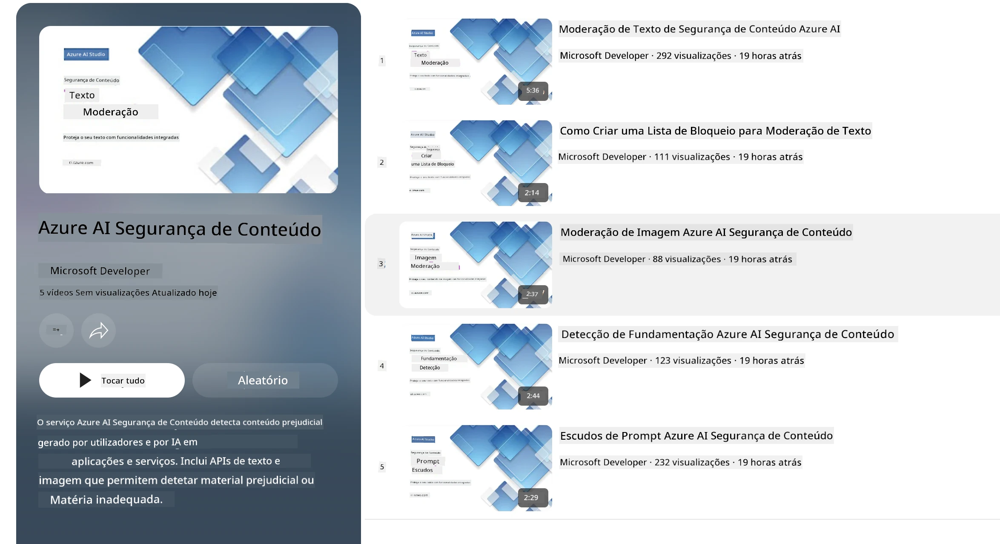

# Segurança de IA para modelos Phi
A família de modelos Phi foi desenvolvida de acordo com o [Microsoft Responsible AI Standard](https://www.microsoft.com/ai/principles-and-approach#responsible-ai-standard), que é um conjunto de requisitos a nível da empresa baseado nos seguintes seis princípios: responsabilização, transparência, justiça, fiabilidade e segurança, privacidade e segurança, e inclusão, que formam os [princípios de IA responsável da Microsoft](https://www.microsoft.com/ai/responsible-ai).

Tal como os modelos Phi anteriores, foi adotada uma avaliação multifacetada de segurança e uma abordagem de segurança pós-treinamento, com medidas adicionais para ter em conta as capacidades multilíngues desta versão. A nossa abordagem ao treino e avaliações de segurança incluindo testes em várias línguas e categorias de risco está detalhada no [Phi Safety Post-Training Paper](https://arxiv.org/abs/2407.13833). Embora os modelos Phi beneficiem desta abordagem, os desenvolvedores devem aplicar as melhores práticas de IA responsável, incluindo mapear, medir e mitigar os riscos associados ao seu caso de uso específico e ao contexto cultural e linguístico.

## Melhores Práticas

Tal como outros modelos, a família de modelos Phi pode potencialmente comportar-se de formas injustas, pouco fiáveis ou ofensivas.

Alguns dos comportamentos limitantes das SLM e LLM que deve conhecer incluem:

- **Qualidade de Serviço:** Os modelos Phi são treinados principalmente em texto em inglês. Línguas diferentes do inglês terão desempenho inferior. Variedades do inglês com menos representação nos dados de treino podem apresentar desempenho inferior ao inglês americano padrão.
- **Representação de Danos & Perpetuação de Estereótipos:** Estes modelos podem sobrerrepresentar ou subrepresentar grupos de pessoas, apagar a representação de alguns grupos ou reforçar estereótipos depreciativos ou negativos. Apesar do treino pós-segurança, estas limitações podem ainda estar presentes devido a diferentes níveis de representação de vários grupos ou à prevalência de exemplos de estereótipos negativos nos dados de treino, que refletem padrões do mundo real e vieses sociais.
- **Conteúdo Inadequado ou Ofensivo:** Estes modelos podem produzir outros tipos de conteúdo inadequado ou ofensivo, o que pode tornar inadequado o seu uso em contextos sensíveis sem mitigações adicionais específicas para o caso de uso.
- **Fiabilidade da Informação:** Os modelos de linguagem podem gerar conteúdo sem sentido ou fabricar conteúdo que pode parecer razoável mas é impreciso ou desatualizado.
- **Âmbito Limitado para Código:** A maioria dos dados de treino do Phi-3 é baseada em Python e utiliza pacotes comuns como "typing, math, random, collections, datetime, itertools". Se o modelo gerar scripts Python que utilizem outros pacotes ou scripts noutras linguagens, recomendamos fortemente que os utilizadores verifiquem manualmente todas as utilizações da API.

Os desenvolvedores devem aplicar as melhores práticas de IA responsável e são responsáveis por garantir que um caso de uso específico cumpre as leis e regulamentos relevantes (ex.: privacidade, comércio, etc.).

## Considerações sobre IA Responsável

Tal como outros modelos de linguagem, os modelos da série Phi podem potencialmente comportar-se de formas injustas, pouco fiáveis ou ofensivas. Alguns dos comportamentos limitantes a ter em conta incluem:

**Qualidade de Serviço:** Os modelos Phi são treinados principalmente em texto em inglês. Línguas diferentes do inglês terão desempenho inferior. Variedades do inglês com menos representação nos dados de treino podem apresentar desempenho inferior ao inglês americano padrão.

**Representação de Danos & Perpetuação de Estereótipos:** Estes modelos podem sobrerrepresentar ou subrepresentar grupos de pessoas, apagar a representação de alguns grupos ou reforçar estereótipos depreciativos ou negativos. Apesar do treino pós-segurança, estas limitações podem ainda estar presentes devido a diferentes níveis de representação de vários grupos ou à prevalência de exemplos de estereótipos negativos nos dados de treino, que refletem padrões do mundo real e vieses sociais.

**Conteúdo Inadequado ou Ofensivo:** Estes modelos podem produzir outros tipos de conteúdo inadequado ou ofensivo, o que pode tornar inadequado o seu uso em contextos sensíveis sem mitigações adicionais específicas para o caso de uso.
**Fiabilidade da Informação:** Os modelos de linguagem podem gerar conteúdo sem sentido ou fabricar conteúdo que pode parecer razoável mas é impreciso ou desatualizado.

**Âmbito Limitado para Código:** A maioria dos dados de treino do Phi-3 é baseada em Python e utiliza pacotes comuns como "typing, math, random, collections, datetime, itertools". Se o modelo gerar scripts Python que utilizem outros pacotes ou scripts noutras linguagens, recomendamos fortemente que os utilizadores verifiquem manualmente todas as utilizações da API.

Os desenvolvedores devem aplicar as melhores práticas de IA responsável e são responsáveis por garantir que um caso de uso específico cumpre as leis e regulamentos relevantes (ex.: privacidade, comércio, etc.). Áreas importantes a considerar incluem:

**Alocação:** Os modelos podem não ser adequados para cenários que possam ter impacto consequente no estatuto legal ou na alocação de recursos ou oportunidades de vida (ex.: habitação, emprego, crédito, etc.) sem avaliações adicionais e técnicas de descorreção adicionais.

**Cenários de Alto Risco:** Os desenvolvedores devem avaliar a adequação do uso dos modelos em cenários de alto risco onde saídas injustas, pouco fiáveis ou ofensivas possam ser extremamente dispendiosas ou causar dano. Isto inclui fornecer aconselhamento em domínios sensíveis ou especializados onde a precisão e fiabilidade são críticas (ex.: aconselhamento legal ou de saúde). Salvaguardas adicionais devem ser implementadas a nível da aplicação de acordo com o contexto de implantação.

**Desinformação:** Os modelos podem produzir informação imprecisa. Os desenvolvedores devem seguir as melhores práticas de transparência e informar os utilizadores finais que estão a interagir com um sistema de IA. A nível da aplicação, os desenvolvedores podem construir mecanismos de feedback e pipelines para fundamentar respostas em informação contextual específica do caso de uso, uma técnica conhecida como Retrieval Augmented Generation (RAG).

**Geração de Conteúdo Nocivo:** Os desenvolvedores devem avaliar as saídas no seu contexto e usar classificadores de segurança disponíveis ou soluções personalizadas apropriadas para o seu caso de uso.

**Uso Indevido:** Outras formas de uso indevido, tais como fraude, spam ou produção de malware, podem ser possíveis, e os desenvolvedores devem assegurar que as suas aplicações não violam leis e regulamentos aplicáveis.

### Ajuste Fino e Segurança de Conteúdo de IA

Após o ajuste fino de um modelo, recomendamos vivamente a utilização das medidas de [Azure AI Content Safety](https://learn.microsoft.com/azure/ai-services/content-safety/overview) para monitorizar o conteúdo gerado pelos modelos, identificar e bloquear riscos, ameaças e problemas de qualidade potenciais.

[Azure AI Content Safety](https://learn.microsoft.com/azure/ai-services/content-safety/overview) suporta conteúdos de texto e imagem. Pode ser implantado na cloud, em contentores desconectados e em dispositivos edge/embarcados.

## Visão Geral do Azure AI Content Safety

O Azure AI Content Safety não é uma solução única para todos; pode ser personalizado para alinhar com as políticas específicas das empresas. Adicionalmente, os seus modelos multilíngues permitem compreender várias línguas simultaneamente.

- **Azure AI Content Safety**
- **Microsoft Developer**
- **5 vídeos**

O serviço Azure AI Content Safety deteta conteúdo gerado por utilizadores e por IA que seja nocivo em aplicações e serviços. Inclui APIs de texto e imagem que permitem detetar material nocivo ou inapropriado.

[AI Content Safety Playlist](https://www.youtube.com/playlist?list=PLlrxD0HtieHjaQ9bJjyp1T7FeCbmVcPkQ)

---

<!-- CO-OP TRANSLATOR DISCLAIMER START -->
**Aviso Legal**:
Este documento foi traduzido utilizando o serviço de tradução por IA [Co-op Translator](https://github.com/Azure/co-op-translator). Embora nos esforcemos pela precisão, por favor tenha em atenção que as traduções automáticas podem conter erros ou imprecisões. O documento original na sua língua nativa deve ser considerado a fonte autoritativa. Para informações críticas, recomenda-se tradução profissional por humanos. Não nos responsabilizamos por quaisquer mal-entendidos ou interpretações incorretas decorrentes do uso desta tradução.
<!-- CO-OP TRANSLATOR DISCLAIMER END -->