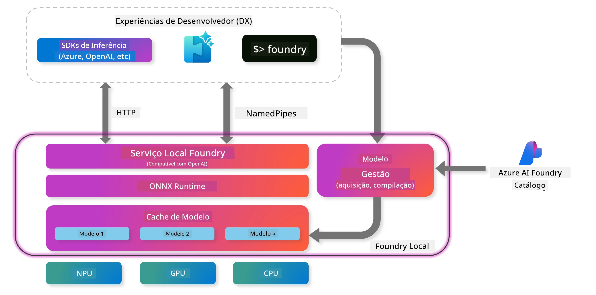
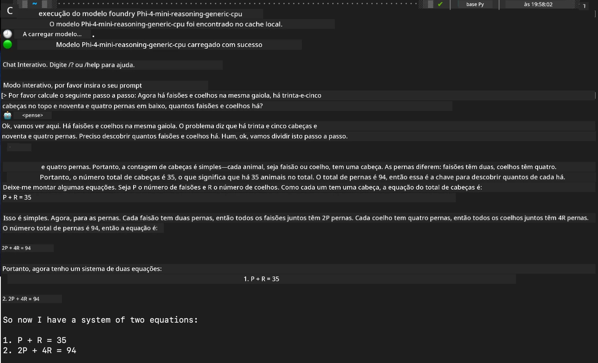

## Começar com os Modelos Phi-Family no Foundry Local

### Introdução ao Foundry Local

O Foundry Local é uma solução poderosa de inferência de IA no dispositivo que traz capacidades de IA ao nível empresarial diretamente para o seu hardware local. Este tutorial irá guiá-lo na configuração e utilização dos modelos Phi-Family com o Foundry Local, oferecendo-lhe controlo total sobre as suas cargas de trabalho de IA, ao mesmo tempo que mantém a privacidade e reduz custos.

O Foundry Local oferece vantagens em desempenho, privacidade, personalização e custo ao executar modelos de IA localmente no seu dispositivo. Integra-se perfeitamente nos seus fluxos de trabalho e aplicações existentes através de uma CLI intuitiva, SDK e API REST.




### Porquê Escolher o Foundry Local?

Compreender os benefícios do Foundry Local irá ajudá-lo a tomar decisões informadas sobre a sua estratégia de implementação de IA:

- **Inferência no Dispositivo:** Execute modelos localmente no seu próprio hardware, reduzindo custos e mantendo todos os seus dados no dispositivo.

- **Personalização de Modelos:** Escolha entre modelos pré-definidos ou utilize os seus próprios para satisfazer requisitos e casos de uso específicos.

- **Eficiência de Custos:** Elimine custos recorrentes de serviços na cloud usando o hardware que já possui, tornando a IA mais acessível.

- **Integração Sem Esforço:** Conecte-se às suas aplicações através do SDK, endpoints da API ou CLI, com fácil escalabilidade para o Microsoft Foundry à medida que as suas necessidades crescem.

> **Nota para Começar:** Este tutorial foca-se no uso do Foundry Local através das interfaces CLI e SDK. Vai aprender ambas as abordagens para o ajudar a escolher o método mais adequado ao seu caso de uso.

## Parte 1: Configurar o Foundry Local CLI

### Passo 1: Instalação

O Foundry Local CLI é a sua porta de entrada para gerir e executar modelos de IA localmente. Vamos começar por instalá-lo no seu sistema.

**Plataformas Suportadas:** Windows e macOS

Para instruções detalhadas de instalação, consulte a [documentação oficial do Foundry Local](https://github.com/microsoft/Foundry-Local/blob/main/README.md).

### Passo 2: Explorar os Modelos Disponíveis

Depois de instalar o Foundry Local CLI, pode descobrir quais os modelos disponíveis para o seu caso de uso. Este comando mostra todos os modelos suportados:


```bash
foundry model list
```

### Passo 3: Compreender os Modelos Phi Family

A Phi Family oferece uma variedade de modelos otimizados para diferentes casos de uso e configurações de hardware. Aqui estão os modelos Phi disponíveis no Foundry Local:

**Modelos Phi Disponíveis:** 

- **phi-3.5-mini** - Modelo compacto para tarefas básicas
- **phi-3-mini-128k** - Versão com contexto estendido para conversas mais longas
- **phi-3-mini-4k** - Modelo com contexto padrão para uso geral
- **phi-4** - Modelo avançado com capacidades melhoradas
- **phi-4-mini** - Versão leve do Phi-4
- **phi-4-mini-reasoning** - Especializado em tarefas de raciocínio complexo

> **Compatibilidade de Hardware:** Cada modelo pode ser configurado para diferentes acelerações de hardware (CPU, GPU) dependendo das capacidades do seu sistema.

### Passo 4: Executar o Seu Primeiro Modelo Phi

Vamos começar com um exemplo prático. Vamos executar o modelo `phi-4-mini-reasoning`, que se destaca na resolução de problemas complexos passo a passo.


**Comando para executar o modelo:**

```bash
foundry model run Phi-4-mini-reasoning-generic-cpu
```

> **Configuração Inicial:** Ao executar um modelo pela primeira vez, o Foundry Local irá descarregá-lo automaticamente para o seu dispositivo local. O tempo de download varia consoante a velocidade da sua rede, por isso, por favor, tenha paciência durante a configuração inicial.

### Passo 5: Testar o Modelo com um Problema Real

Agora vamos testar o nosso modelo com um problema clássico de lógica para ver como ele executa o raciocínio passo a passo:

**Problema de Exemplo:**

```txt
Please calculate the following step by step: Now there are pheasants and rabbits in the same cage, there are thirty-five heads on top and ninety-four legs on the bottom, how many pheasants and rabbits are there?
```

**Comportamento Esperado:** O modelo deverá decompor este problema em passos lógicos, usando o facto de que os faisões têm 2 pernas e os coelhos têm 4 pernas para resolver o sistema de equações.

**Resultados:**



## Parte 2: Construir Aplicações com o Foundry Local SDK

### Porquê Usar o SDK?

Enquanto a CLI é perfeita para testes e interações rápidas, o SDK permite integrar o Foundry Local nas suas aplicações de forma programática. Isto abre possibilidades para:

- Construir aplicações personalizadas com IA
- Criar fluxos de trabalho automatizados
- Integrar capacidades de IA em sistemas existentes
- Desenvolver chatbots e ferramentas interativas

### Linguagens de Programação Suportadas

O Foundry Local oferece suporte a SDKs para várias linguagens de programação, adaptando-se às suas preferências de desenvolvimento:

**📦 SDKs Disponíveis:**

- **C# (.NET):** [Documentação e Exemplos do SDK](https://github.com/microsoft/Foundry-Local/tree/main/sdk/cs)
- **Python:** [Documentação e Exemplos do SDK](https://github.com/microsoft/Foundry-Local/tree/main/sdk/python)
- **JavaScript:** [Documentação e Exemplos do SDK](https://github.com/microsoft/Foundry-Local/tree/main/sdk/js)
- **Rust:** [Documentação e Exemplos do SDK](https://github.com/microsoft/Foundry-Local/tree/main/sdk/rust)

### Próximos Passos

1. **Escolha o SDK que prefere** com base no seu ambiente de desenvolvimento
2. **Siga a documentação específica do SDK** para guias detalhados de implementação
3. **Comece com exemplos simples** antes de construir aplicações mais complexas
4. **Explore o código de exemplo** fornecido em cada repositório do SDK

## Conclusão

Agora aprendeu a:
- ✅ Instalar e configurar o Foundry Local CLI
- ✅ Descobrir e executar modelos Phi Family
- ✅ Testar modelos com problemas do mundo real
- ✅ Compreender as opções de SDK para desenvolvimento de aplicações

O Foundry Local oferece uma base poderosa para trazer capacidades de IA diretamente para o seu ambiente local, dando-lhe controlo sobre desempenho, privacidade e custos, mantendo a flexibilidade para escalar para soluções na cloud quando necessário.

**Aviso Legal**:  
Este documento foi traduzido utilizando o serviço de tradução automática [Co-op Translator](https://github.com/Azure/co-op-translator). Embora nos esforcemos pela precisão, por favor tenha em atenção que traduções automáticas podem conter erros ou imprecisões. O documento original na sua língua nativa deve ser considerado a fonte autorizada. Para informações críticas, recomenda-se tradução profissional humana. Não nos responsabilizamos por quaisquer mal-entendidos ou interpretações incorretas decorrentes da utilização desta tradução.