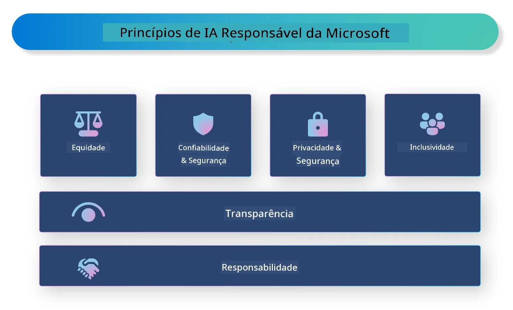

# **Introduzir a IA Responsável**

[Microsoft Responsible AI](https://www.microsoft.com/ai/responsible-ai?WT.mc_id=aiml-138114-kinfeylo) é uma iniciativa que pretende ajudar desenvolvedores e organizações a criar sistemas de IA que sejam transparentes, confiáveis e responsáveis. A iniciativa oferece orientações e recursos para desenvolver soluções de IA responsáveis que estejam alinhadas com princípios éticos, como privacidade, justiça e transparência. Também exploraremos alguns dos desafios e melhores práticas associados à construção de sistemas de IA responsáveis.

## Visão geral do Microsoft Responsible AI

**Princípios éticos**

O Microsoft Responsible AI é orientado por um conjunto de princípios éticos, como privacidade, justiça, transparência, responsabilidade e segurança. Estes princípios foram concebidos para garantir que os sistemas de IA sejam desenvolvidos de forma ética e responsável.

**IA Transparente**

O Microsoft Responsible AI destaca a importância da transparência nos sistemas de IA. Isto inclui fornecer explicações claras sobre o funcionamento dos modelos de IA, bem como garantir que as fontes de dados e os algoritmos estejam disponíveis publicamente.

**IA Responsável**

[Microsoft Responsible AI](https://www.microsoft.com/ai/responsible-ai?WT.mc_id=aiml-138114-kinfeylo) promove o desenvolvimento de sistemas de IA responsáveis, que possam fornecer perceções sobre como os modelos de IA tomam decisões. Isto ajuda os utilizadores a compreender e confiar nos resultados dos sistemas de IA.

**Inclusividade**

Os sistemas de IA devem ser concebidos para beneficiar todas as pessoas. A Microsoft pretende criar uma IA inclusiva que considere diversas perspetivas e evite preconceitos ou discriminação.

**Confiabilidade e Segurança**

Garantir que os sistemas de IA sejam confiáveis e seguros é fundamental. A Microsoft foca-se na construção de modelos robustos que tenham um desempenho consistente e evitem resultados prejudiciais.

**Justiça na IA**

O Microsoft Responsible AI reconhece que os sistemas de IA podem perpetuar preconceitos se forem treinados com dados ou algoritmos enviesados. A iniciativa oferece orientações para desenvolver sistemas de IA justos que não discriminem com base em fatores como raça, género ou idade.

**Privacidade e segurança**

O Microsoft Responsible AI enfatiza a importância de proteger a privacidade dos utilizadores e a segurança dos dados nos sistemas de IA. Isto inclui implementar encriptação forte dos dados e controlos de acesso, bem como realizar auditorias regulares aos sistemas de IA para identificar vulnerabilidades.

**Responsabilidade e prestação de contas**

O Microsoft Responsible AI promove a responsabilidade e prestação de contas no desenvolvimento e implementação da IA. Isto inclui garantir que os desenvolvedores e organizações estejam conscientes dos riscos potenciais associados aos sistemas de IA e tomem medidas para mitigar esses riscos.

## Melhores práticas para construir sistemas de IA responsáveis

**Desenvolver modelos de IA usando conjuntos de dados diversificados**

Para evitar preconceitos nos sistemas de IA, é importante usar conjuntos de dados diversificados que representem uma variedade de perspetivas e experiências.

**Usar técnicas de IA explicável**

As técnicas de IA explicável podem ajudar os utilizadores a compreender como os modelos de IA tomam decisões, o que pode aumentar a confiança no sistema.

**Auditar regularmente os sistemas de IA para identificar vulnerabilidades**

Auditorias regulares dos sistemas de IA podem ajudar a identificar riscos e vulnerabilidades que precisam de ser tratados.

**Implementar encriptação forte dos dados e controlos de acesso**

A encriptação dos dados e os controlos de acesso ajudam a proteger a privacidade e a segurança dos utilizadores nos sistemas de IA.

**Seguir princípios éticos no desenvolvimento da IA**

Seguir princípios éticos, como justiça, transparência e responsabilidade, pode ajudar a construir confiança nos sistemas de IA e garantir que sejam desenvolvidos de forma responsável.

## Utilizar o AI Foundry para IA Responsável

[Azure AI Foundry](https://ai.azure.com?WT.mc_id=aiml-138114-kinfeylo) é uma plataforma poderosa que permite a desenvolvedores e organizações criar rapidamente aplicações inteligentes, inovadoras, prontas para o mercado e responsáveis. Aqui estão algumas funcionalidades e capacidades chave do Azure AI Foundry:

**APIs e Modelos Prontos a Usar**

O Azure AI Foundry oferece APIs e modelos pré-construídos e personalizáveis. Estes cobrem uma vasta gama de tarefas de IA, incluindo IA generativa, processamento de linguagem natural para conversas, pesquisa, monitorização, tradução, voz, visão e tomada de decisão.

**Prompt Flow**

O Prompt Flow no Azure AI Foundry permite criar experiências de IA conversacional. Permite desenhar e gerir fluxos conversacionais, facilitando a construção de chatbots, assistentes virtuais e outras aplicações interativas.

**Retrieval Augmented Generation (RAG)**

O RAG é uma técnica que combina abordagens baseadas em recuperação e geração. Melhora a qualidade das respostas geradas ao aproveitar tanto o conhecimento pré-existente (recuperação) como a geração criativa (geração).

**Métricas de Avaliação e Monitorização para IA Generativa**

O Azure AI Foundry fornece ferramentas para avaliar e monitorizar modelos de IA generativa. Pode avaliar o desempenho, justiça e outras métricas importantes para garantir uma implementação responsável. Além disso, se criou um dashboard, pode usar a interface sem código no Azure Machine Learning Studio para personalizar e gerar um Responsible AI Dashboard e o scorecard associado baseado nas bibliotecas Python do [Responsible AI Toolbox](https://responsibleaitoolbox.ai/?WT.mc_id=aiml-138114-kinfeylo). Este scorecard ajuda a partilhar insights chave relacionados com justiça, importância das características e outras considerações de implementação responsável com stakeholders técnicos e não técnicos.

Para usar o AI Foundry com IA responsável, pode seguir estas melhores práticas:

**Definir o problema e os objetivos do seu sistema de IA**

Antes de iniciar o processo de desenvolvimento, é importante definir claramente o problema ou objetivo que o seu sistema de IA pretende resolver. Isto ajudará a identificar os dados, algoritmos e recursos necessários para construir um modelo eficaz.

**Recolher e pré-processar dados relevantes**

A qualidade e quantidade dos dados usados no treino de um sistema de IA podem ter um impacto significativo no seu desempenho. Por isso, é importante recolher dados relevantes, limpá-los, pré-processá-los e garantir que são representativos da população ou problema que está a tentar resolver.

**Escolher a avaliação adequada**

Existem vários algoritmos de avaliação disponíveis. É importante escolher o algoritmo mais adequado com base nos seus dados e problema.

**Avaliar e interpretar o modelo**

Depois de construir um modelo de IA, é importante avaliar o seu desempenho usando métricas apropriadas e interpretar os resultados de forma transparente. Isto ajudará a identificar quaisquer preconceitos ou limitações no modelo e a fazer melhorias quando necessário.

**Garantir transparência e explicabilidade**

Os sistemas de IA devem ser transparentes e explicáveis para que os utilizadores possam compreender como funcionam e como são tomadas as decisões. Isto é especialmente importante para aplicações que têm impactos significativos na vida das pessoas, como saúde, finanças e sistemas legais.

**Monitorizar e atualizar o modelo**

Os sistemas de IA devem ser continuamente monitorizados e atualizados para garantir que se mantêm precisos e eficazes ao longo do tempo. Isto requer manutenção contínua, testes e re-treino do modelo.

Em conclusão, o Microsoft Responsible AI é uma iniciativa que pretende ajudar desenvolvedores e organizações a construir sistemas de IA que sejam transparentes, confiáveis e responsáveis. Lembre-se que a implementação responsável da IA é crucial, e o Azure AI Foundry pretende tornar isso prático para as organizações. Seguindo princípios éticos e melhores práticas, podemos garantir que os sistemas de IA sejam desenvolvidos e implementados de forma responsável, beneficiando a sociedade como um todo.

**Aviso Legal**:  
Este documento foi traduzido utilizando o serviço de tradução automática [Co-op Translator](https://github.com/Azure/co-op-translator). Embora nos esforcemos para garantir a precisão, por favor tenha em atenção que traduções automáticas podem conter erros ou imprecisões. O documento original na sua língua nativa deve ser considerado a fonte autorizada. Para informações críticas, recomenda-se tradução profissional humana. Não nos responsabilizamos por quaisquer mal-entendidos ou interpretações incorretas decorrentes da utilização desta tradução.