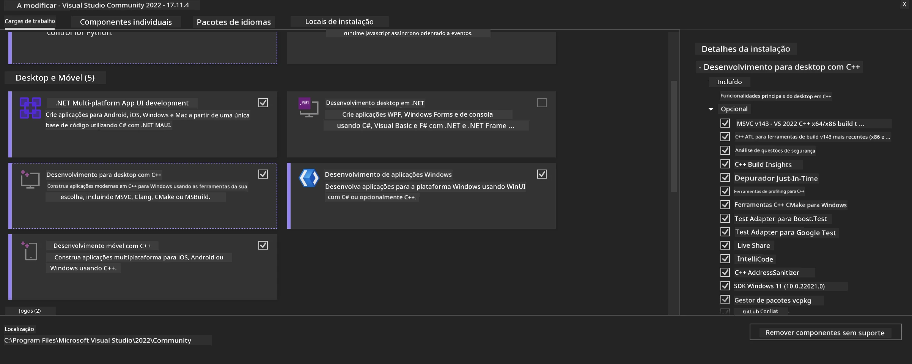
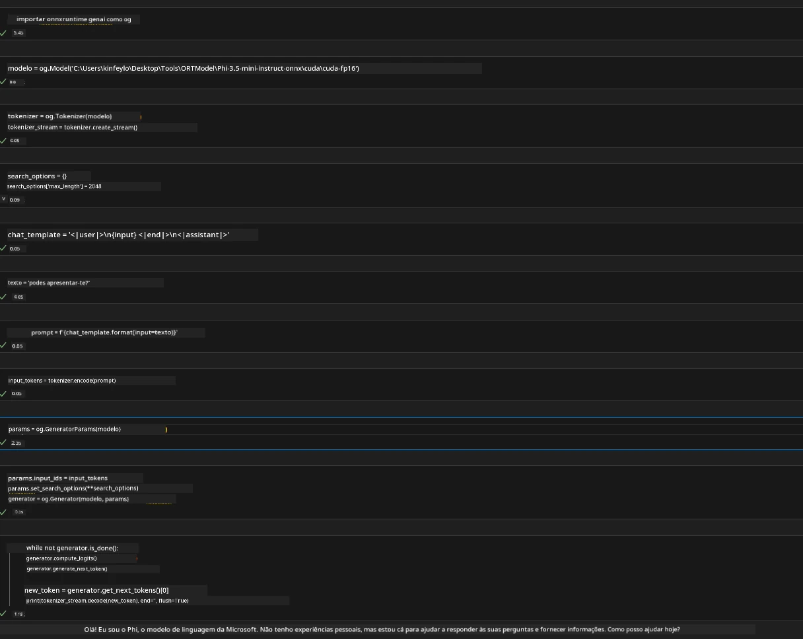
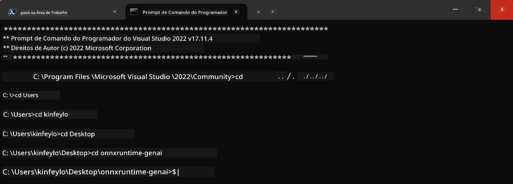

# **Guia para OnnxRuntime GenAI Windows GPU**

Este guia fornece passos para configurar e usar o ONNX Runtime (ORT) com GPUs no Windows. Foi concebido para ajudar a aproveitar a aceleração GPU para os seus modelos, melhorando o desempenho e a eficiência.

O documento fornece orientações sobre:

- Configuração do Ambiente: Instruções para instalar as dependências necessárias, como CUDA, cuDNN e ONNX Runtime.
- Configuração: Como configurar o ambiente e o ONNX Runtime para utilizar os recursos da GPU de forma eficaz.
- Dicas de Otimização: Conselhos sobre como ajustar as configurações da GPU para o desempenho ideal.

### **1. Python 3.10.x /3.11.8**

   ***Nota*** Sugere-se usar [miniforge](https://github.com/conda-forge/miniforge/releases/latest/download/Miniforge3-Windows-x86_64.exe) como o seu ambiente Python

   ```bash

   conda create -n pydev python==3.11.8

   conda activate pydev

   ```

   ***Lembrete*** Se tiver alguma biblioteca Python ONNX instalada, por favor desinstale-a

### **2. Instalar CMake com winget**


   ```bash

   winget install -e --id Kitware.CMake

   ```

### **3. Instalar Visual Studio 2022 - Desenvolvimento para Ambiente de Trabalho com C++**

   ***Nota*** Se não quiser compilar pode saltar este passo




### **4. Instalar Driver NVIDIA**

1. **Driver NVIDIA GPU**  [https://www.nvidia.com/en-us/drivers/](https://www.nvidia.com/en-us/drivers/)

2. **NVIDIA CUDA 12.4** [https://developer.nvidia.com/cuda-12-4-0-download-archive](https://developer.nvidia.com/cuda-12-4-0-download-archive)

3. **NVIDIA CUDNN 9.4**  [https://developer.nvidia.com/cudnn-downloads](https://developer.nvidia.com/cudnn-downloads)

***Lembrete*** Por favor, use as definições predefinidas no processo de instalação

### **5. Definir Ambiente NVIDIA**

Copiar as pastas lib, bin, include da NVIDIA CUDNN 9.4 para as respetivas pastas da NVIDIA CUDA 12.4

- copiar os ficheiros de *'C:\Program Files\NVIDIA\CUDNN\v9.4\bin\12.6'* para *'C:\Program Files\NVIDIA GPU Computing Toolkit\CUDA\v12.4\bin'*

- copiar os ficheiros de *'C:\Program Files\NVIDIA\CUDNN\v9.4\include\12.6'* para *'C:\Program Files\NVIDIA GPU Computing Toolkit\CUDA\v12.4\include'*

- copiar os ficheiros de *'C:\Program Files\NVIDIA\CUDNN\v9.4\lib\12.6'* para *'C:\Program Files\NVIDIA GPU Computing Toolkit\CUDA\v12.4\lib\x64'*


### **6. Descarregar Phi-3.5-mini-instruct-onnx**


   ```bash

   winget install -e --id Git.Git

   winget install -e --id GitHub.GitLFS

   git lfs install

   git clone https://huggingface.co/microsoft/Phi-3.5-mini-instruct-onnx

   ```

### **7. Executar InferencePhi35Instruct.ipynb**

   Abrir [Notebook](../../../../code/09.UpdateSamples/Aug/ortgpu-phi35-instruct.ipynb) e executar 





### **8. Compilar ORT GenAI GPU**


   ***Nota*** 
   
   1. Por favor, desinstale primeiro todas as bibliotecas relacionadas com onnx, onnxruntime e onnxruntime-genai

   
   ```bash

   pip list 
   
   ```

   Depois desinstale todas as bibliotecas onnxruntime, por exemplo 


   ```bash

   pip uninstall onnxruntime

   pip uninstall onnxruntime-genai

   pip uninstall onnxruntume-genai-cuda
   
   ```

   2. Verifique a extensão do Visual Studio 

   Verifique em C:\Program Files\NVIDIA GPU Computing Toolkit\CUDA\v12.4\extras se encontra a pasta C:\Program Files\NVIDIA GPU Computing Toolkit\CUDA\v12.4\extras\visual_studio_integration. 
   
   Se não encontrar, verifique noutras pastas do driver da toolkit CUDA e copie a pasta visual_studio_integration e os seus conteúdos para C:\Program Files\NVIDIA GPU Computing Toolkit\CUDA\v12.4\extras\visual_studio_integration


   - Se não quiser compilar pode saltar este passo


   ```bash

   git clone https://github.com/microsoft/onnxruntime-genai

   ```

   - Descarregue [https://github.com/microsoft/onnxruntime/releases/download/v1.19.2/onnxruntime-win-x64-gpu-1.19.2.zip](https://github.com/microsoft/onnxruntime/releases/download/v1.19.2/onnxruntime-win-x64-gpu-1.19.2.zip)

   - Descompacte onnxruntime-win-x64-gpu-1.19.2.zip, renomeie para **ort**, copie a pasta ort para onnxruntime-genai

   - Usando o Windows Terminal, vá ao Developer Command Prompt para VS 2022 e navegue até onnxruntime-genai 



   - Compile utilizando o seu ambiente python

   
   ```bash

   cd onnxruntime-genai

   python build.py --use_cuda  --cuda_home "C:\Program Files\NVIDIA GPU Computing Toolkit\CUDA\v12.4" --config Release
 

   cd build/Windows/Release/Wheel

   pip install .whl

   ```

---

<!-- CO-OP TRANSLATOR DISCLAIMER START -->
**Aviso Legal**:
Este documento foi traduzido utilizando o serviço de tradução automática [Co-op Translator](https://github.com/Azure/co-op-translator). Embora nos esforcemos pela precisão, esteja ciente de que traduções automáticas podem conter erros ou imprecisões. O documento original na sua língua nativa deve ser considerado a fonte autorizada. Para informações críticas, recomenda-se tradução profissional humana. Não nos responsabilizamos por quaisquer mal-entendidos ou interpretações incorretas resultantes da utilização desta tradução.
<!-- CO-OP TRANSLATOR DISCLAIMER END -->