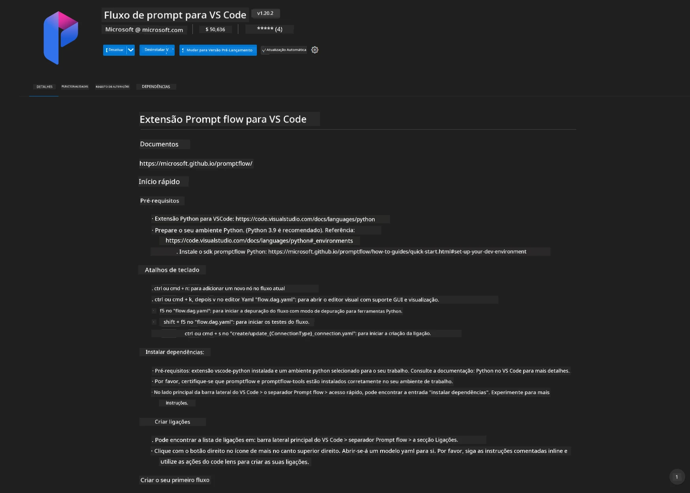
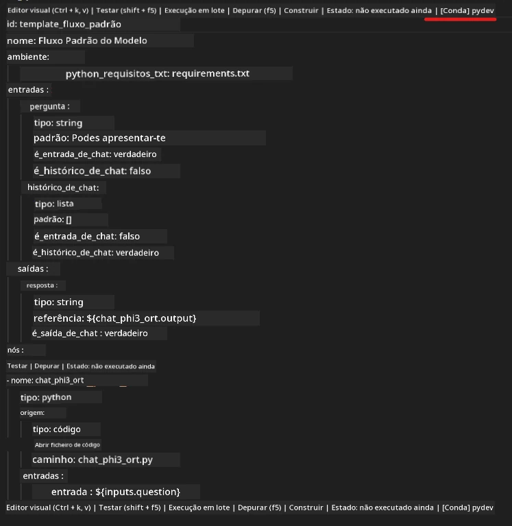
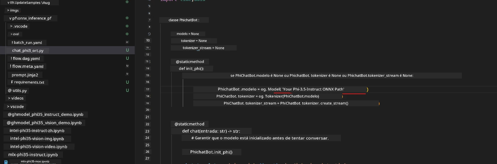
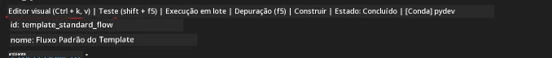
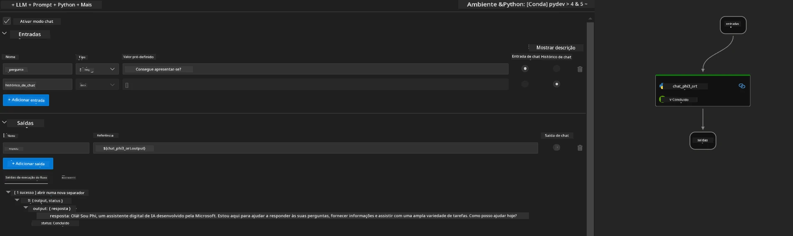

# Utilizar GPU Windows para criar solução Prompt flow com Phi-3.5-Instruct ONNX

O documento seguinte é um exemplo de como usar o PromptFlow com ONNX (Open Neural Network Exchange) para desenvolver aplicações de IA baseadas em modelos Phi-3.

PromptFlow é um conjunto de ferramentas de desenvolvimento concebido para simplificar o ciclo completo de desenvolvimento de aplicações de IA baseadas em LLM (Large Language Model), desde a ideação e prototipagem até aos testes e avaliação.

Ao integrar o PromptFlow com ONNX, os programadores podem:

- Otimizar o desempenho do modelo: tirar partido do ONNX para uma inferência e implementação eficiente do modelo.
- Simplificar o desenvolvimento: usar o PromptFlow para gerir o fluxo de trabalho e automatizar tarefas repetitivas.
- Melhorar a colaboração: facilitar uma melhor colaboração entre os membros da equipa, fornecendo um ambiente de desenvolvimento unificado.

**Prompt flow** é um conjunto de ferramentas de desenvolvimento concebido para simplificar o ciclo completo de desenvolvimento de aplicações de IA baseadas em LLM, desde a ideação, prototipagem, testes, avaliação até à implementação em produção e monitorização. Facilita muito a engenharia de prompts e permite construir aplicações LLM com qualidade de produção.

O Prompt flow pode ligar-se ao OpenAI, Azure OpenAI Service e modelos personalizáveis (Huggingface, LLM/SLM local). Pretendemos implementar o modelo ONNX quantizado do Phi-3.5 em aplicações locais. O Prompt flow pode ajudar-nos a planear melhor o nosso negócio e a completar soluções locais baseadas no Phi-3.5. Neste exemplo, vamos combinar a ONNX Runtime GenAI Library para completar a solução Prompt flow baseada em GPU Windows.

## **Instalação**

### **ONNX Runtime GenAI para GPU Windows**

Leia esta orientação para configurar o ONNX Runtime GenAI para GPU Windows [clicar aqui](./ORTWindowGPUGuideline.md)

### **Configurar Prompt flow no VSCode**

1. Instale a extensão Prompt flow para VS Code



2. Após instalar a extensão Prompt flow para VS Code, clique na extensão e escolha **Installation dependencies** seguindo esta orientação para instalar o SDK do Prompt flow no seu ambiente


3. Descarregue o [Código de Exemplo](../../../../../../code/09.UpdateSamples/Aug/pf/onnx_inference_pf) e abra este exemplo no VS Code


4. Abra o ficheiro **flow.dag.yaml** para escolher o seu ambiente Python



   Abra o ficheiro **chat_phi3_ort.py** para alterar a localização do seu modelo Phi-3.5-instruct ONNX



5. Execute o seu prompt flow para testar

Abra o ficheiro **flow.dag.yaml** e clique no editor visual



Depois de clicar, execute para testar



1. Pode executar em batch no terminal para verificar mais resultados


```bash

pf run create --file batch_run.yaml --stream --name 'Your eval qa name'    

```

Pode consultar os resultados no seu browser predefinido


**Aviso Legal**:  
Este documento foi traduzido utilizando o serviço de tradução automática [Co-op Translator](https://github.com/Azure/co-op-translator). Embora nos esforcemos pela precisão, por favor tenha em conta que traduções automáticas podem conter erros ou imprecisões. O documento original na sua língua nativa deve ser considerado a fonte autorizada. Para informações críticas, recomenda-se tradução profissional humana. Não nos responsabilizamos por quaisquer mal-entendidos ou interpretações incorretas decorrentes da utilização desta tradução.