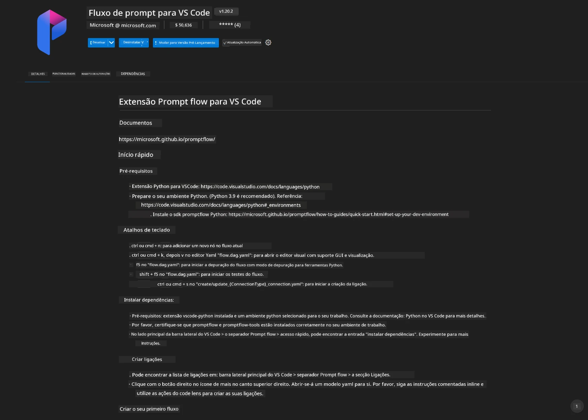
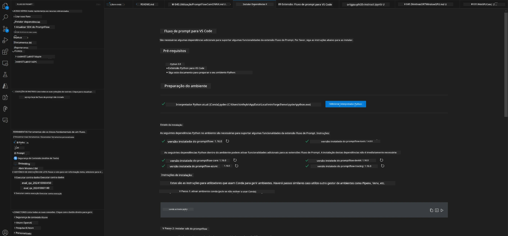
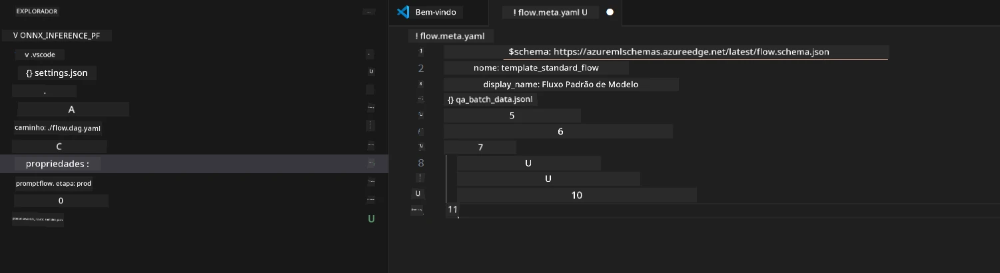
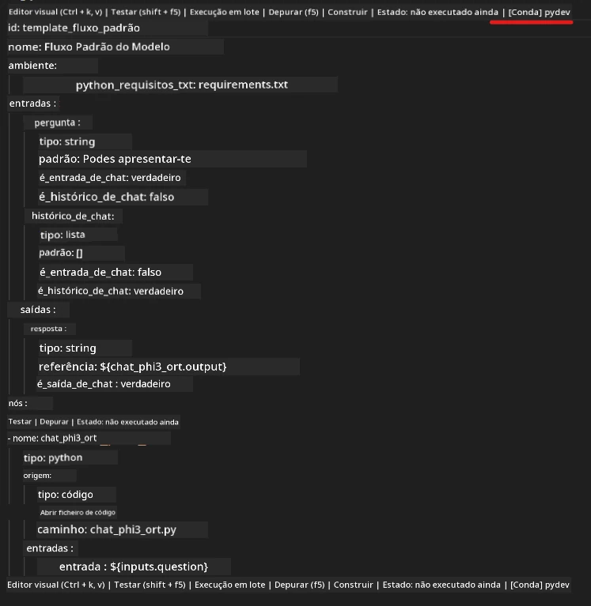
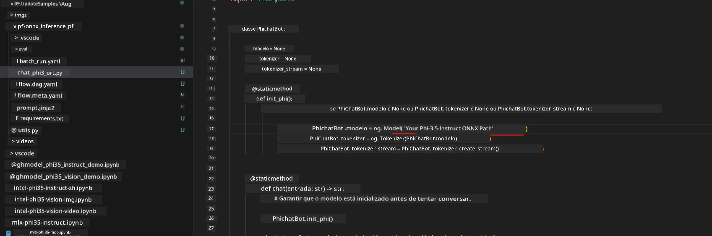
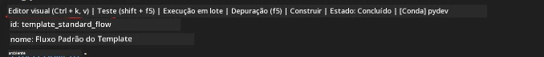
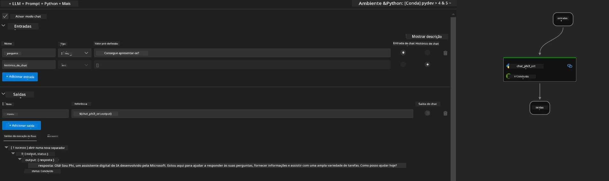
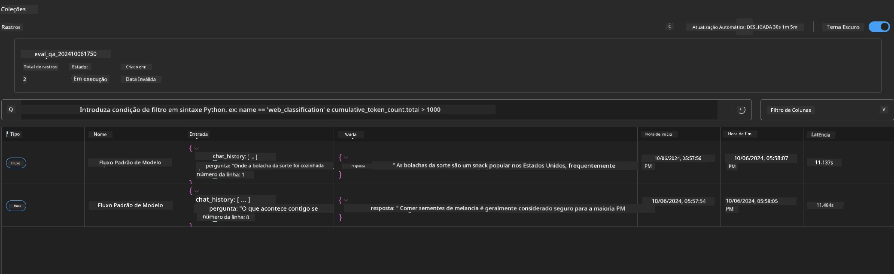

# Utilizar Windows GPU para criar solução Prompt flow com Phi-3.5-Instruct ONNX 

O documento seguinte é um exemplo de como usar PromptFlow com ONNX (Open Neural Network Exchange) para desenvolver aplicações de IA baseadas em modelos Phi-3.

PromptFlow é um conjunto de ferramentas de desenvolvimento concebido para simplificar o ciclo de desenvolvimento completo de aplicações de IA baseadas em LLM (Large Language Model), desde a idealização e prototipagem até à testagem e avaliação.

Ao integrar o PromptFlow com o ONNX, os desenvolvedores podem:

- Otimizar o desempenho do modelo: tirar partido do ONNX para inferência e implementação eficiente do modelo.
- Simplificar o desenvolvimento: utilizar PromptFlow para gerir o fluxo de trabalho e automatizar tarefas repetitivas.
- Melhorar a colaboração: facilitar melhor colaboração entre os membros da equipa ao fornecer um ambiente de desenvolvimento unificado.

**Prompt flow** é um conjunto de ferramentas de desenvolvimento concebido para simplificar o ciclo de desenvolvimento completo de aplicações de IA baseadas em LLM, desde a idealização, prototipagem, testagem, avaliação até à implementação em produção e monitorização. Torna a engenharia de prompts muito mais fácil e permite-lhe construir aplicações LLM com qualidade de produção.

O Prompt flow pode ligar-se ao OpenAI, Azure OpenAI Service, e modelos personalizáveis (Huggingface, LLM/SLM local). Esperamos implementar o modelo ONNX quantizado do Phi-3.5 em aplicações locais. O Prompt flow pode ajudar-nos a planear melhor o nosso negócio e completar soluções locais baseadas no Phi-3.5. Neste exemplo, vamos combinar a Biblioteca ONNX Runtime GenAI para completar a solução Prompt flow baseada em Windows GPU.

## **Instalação**

### **ONNX Runtime GenAI para Windows GPU**

Leia esta orientação para configurar o ONNX Runtime GenAI para Windows GPU  [clique aqui](./ORTWindowGPUGuideline.md)

### **Configurar Prompt flow no VSCode**

1. Instale a Extensão Prompt flow VS Code



2. Após instalar a Extensão Prompt flow VS Code, clique na extensão e escolha **Installation dependencies** e siga esta orientação para instalar o SDK do Prompt flow no seu ambiente



3. Descarregue o [Sample Code](../../../../../../code/09.UpdateSamples/Aug/pf/onnx_inference_pf) e utilize o VS Code para abrir este exemplo



4. Abra o **flow.dag.yaml** para escolher o seu ambiente Python



   Abra o **chat_phi3_ort.py** para alterar a localização do seu Modelo Phi-3.5-instruct ONNX



5. Execute o seu prompt flow para testar

Abra o **flow.dag.yaml** e clique no editor visual



depois de clicar nisto, execute para testar



1. Pode executar em batch no terminal para verificar mais resultados


```bash

pf run create --file batch_run.yaml --stream --name 'Your eval qa name'    

```

Pode verificar os resultados no seu navegador pré-definido




---

<!-- CO-OP TRANSLATOR DISCLAIMER START -->
**Aviso Legal**:
Este documento foi traduzido utilizando o serviço de tradução automática [Co-op Translator](https://github.com/Azure/co-op-translator). Embora nos esforcemos pela precisão, esteja ciente de que traduções automáticas podem conter erros ou imprecisões. O documento original na sua língua nativa deve ser considerado a fonte autorizada. Para informações críticas, recomenda-se tradução profissional humana. Não nos responsabilizamos por quaisquer mal-entendidos ou interpretações incorretas resultantes da utilização desta tradução.
<!-- CO-OP TRANSLATOR DISCLAIMER END -->