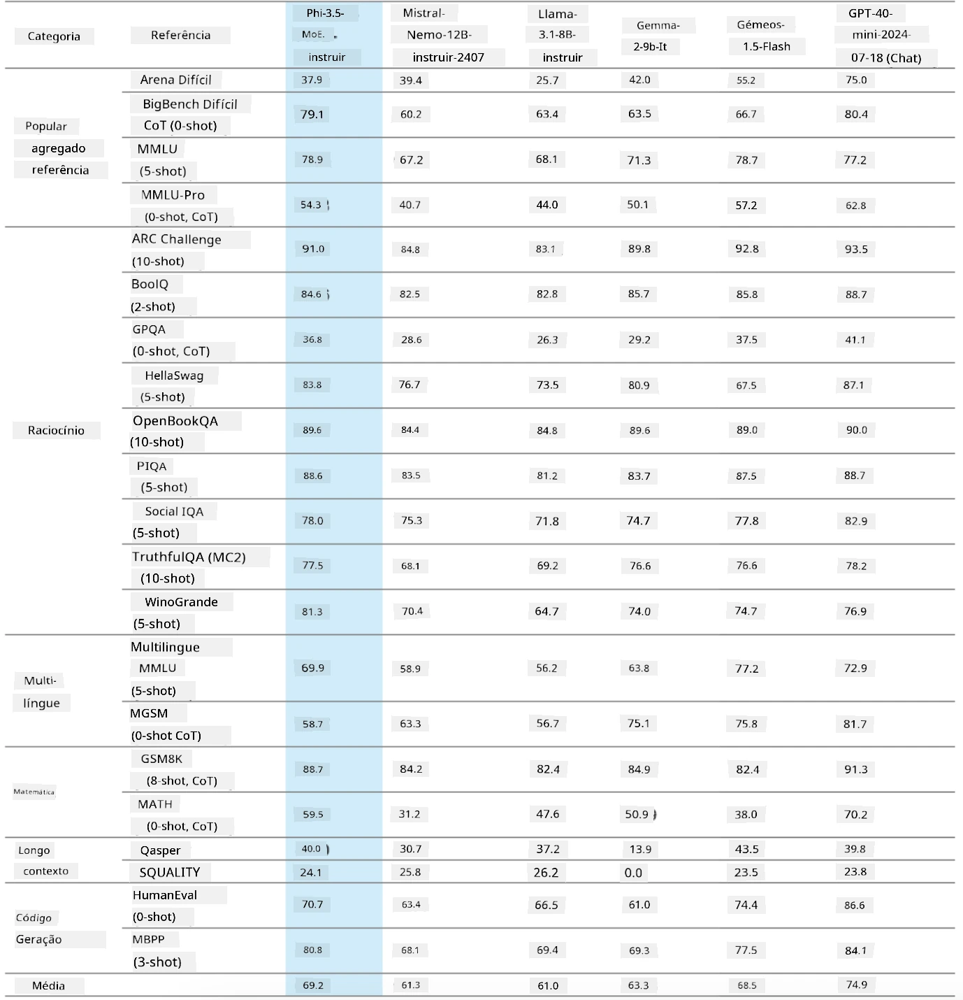
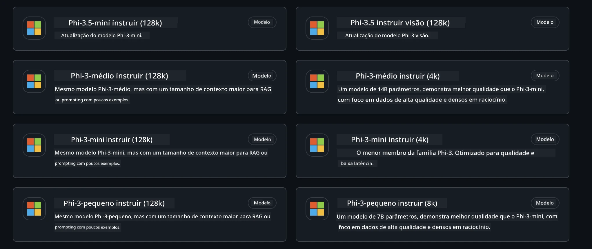
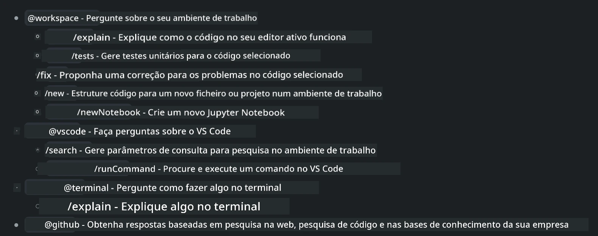
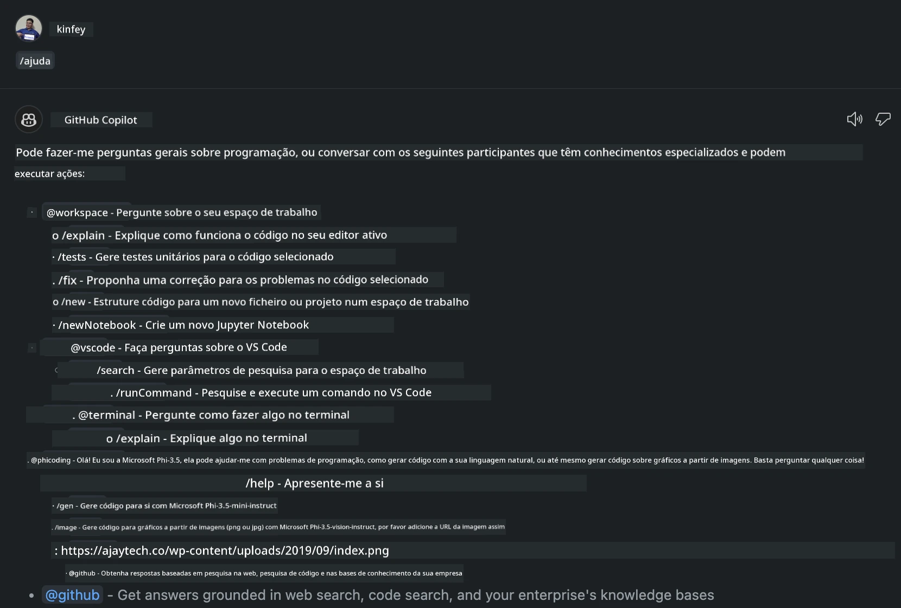
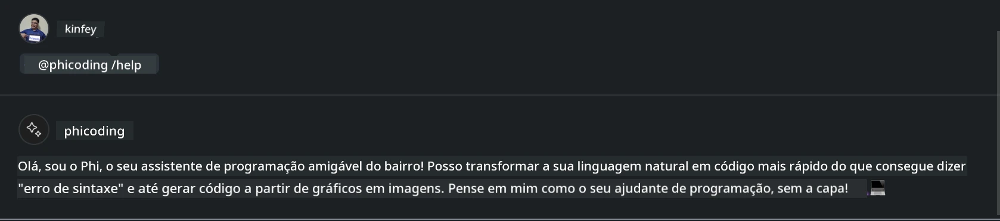
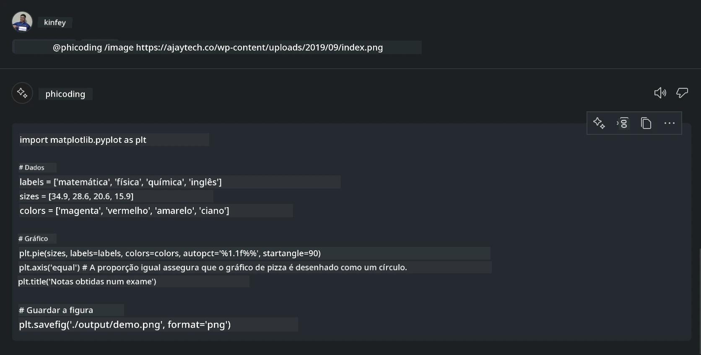

# **Crie o seu próprio Agente Visual Studio Code Chat Copilot com Phi-3.5 pelos Modelos GitHub**

Está a usar o Visual Studio Code Copilot? Especialmente no Chat, pode usar diferentes agentes para melhorar a capacidade de criar, escrever e manter projetos no Visual Studio Code. O Visual Studio Code oferece uma API que permite a empresas e indivíduos criar diferentes agentes baseados no seu negócio para expandir as suas capacidades em diferentes áreas proprietárias. Neste artigo, vamos focar-nos no **Phi-3.5-mini-instruct (128k)** e no **Phi-3.5-vision-instruct (128k)** dos Modelos GitHub para criar o seu próprio Agente Visual Studio Code.

## **Sobre o Phi-3.5 nos Modelos GitHub**

Sabemos que o Phi-3/3.5-mini-instruct da família Phi-3/3.5 tem fortes capacidades de compreensão e geração de código, e apresenta vantagens face ao Gemma-2-9b e ao Mistral-Nemo-12B-instruct-2407.



Os Modelos GitHub mais recentes já disponibilizam acesso aos modelos Phi-3.5-mini-instruct (128k) e Phi-3.5-vision-instruct (128k). Os programadores podem aceder a eles através do OpenAI SDK, Azure AI Inference SDK e REST API.



***Note: *** Recomenda-se o uso do Azure AI Inference SDK aqui, pois permite uma melhor integração com o Azure Model Catalog em ambiente de produção.

A seguir estão os resultados do **Phi-3.5-mini-instruct (128k)** e do **Phi-3.5-vision-instruct (128k)** no cenário de geração de código após a integração com os Modelos GitHub, preparando também para os exemplos seguintes.

**Demo: GitHub Models Phi-3.5-mini-instruct (128k) gera código a partir de Prompt** ([clique neste link](../../../../../../code/09.UpdateSamples/Aug/ghmodel_phi35_instruct_demo.ipynb))

**Demo: GitHub Models Phi-3.5-vision-instruct (128k) gera código a partir de Imagem** ([clique neste link](../../../../../../code/09.UpdateSamples/Aug/ghmodel_phi35_vision_demo.ipynb))


## **Sobre o Agente GitHub Copilot Chat**

O Agente GitHub Copilot Chat pode completar diferentes tarefas em vários cenários de projeto com base no código. O sistema tem quatro agentes: workspace, github, terminal, vscode



Ao adicionar o nome do agente com ‘@’, pode completar rapidamente o trabalho correspondente. Para empresas, se adicionar conteúdos relacionados com o seu negócio, como requisitos, codificação, especificações de teste e lançamento, pode ter funções privadas empresariais mais poderosas baseadas no GitHub Copilot.

O Agente Visual Studio Code Chat lançou oficialmente a sua API, permitindo que empresas ou programadores empresariais desenvolvam agentes baseados em diferentes ecossistemas de software. Com base no método de desenvolvimento de Extensões Visual Studio Code, pode aceder facilmente à interface da API do Agente Visual Studio Code Chat. Podemos desenvolver com base neste processo.


O cenário de desenvolvimento suporta acesso a APIs de modelos de terceiros (como Modelos GitHub, Azure Model Catalog e serviços próprios baseados em modelos open source) e também pode usar os modelos gpt-35-turbo, gpt-4 e gpt-4o fornecidos pelo GitHub Copilot.

## **Adicionar um Agente @phicoding baseado no Phi-3.5**

Tentamos integrar as capacidades de programação do Phi-3.5 para completar tarefas como escrita de código, geração de código a partir de imagens e outras. Criámos um Agente em torno do Phi-3.5 - @PHI, com as seguintes funções:

1. Gerar uma autoapresentação baseada no GPT-4o fornecido pelo GitHub Copilot através do comando **@phicoding /help**

2. Gerar código para diferentes linguagens de programação com base no **Phi-3.5-mini-instruct (128k)** através do comando **@phicoding /gen**

3. Gerar código com base no **Phi-3.5-vision-instruct (128k)** e completar a partir de imagem através do comando **@phicoding /image**


## **Passos relacionados**

1. Instalar o suporte ao desenvolvimento de Extensões Visual Studio Code usando npm

```bash

npm install --global yo generator-code 

```
2. Criar um plugin de Extensão Visual Studio Code (usando o modo de desenvolvimento Typescript, chamado phiext)

```bash

yo code 

```

3. Abrir o projeto criado e modificar o package.json. Aqui estão as instruções e configurações relacionadas, bem como a configuração dos Modelos GitHub. Note que precisa de adicionar o seu token dos Modelos GitHub aqui.

```json

{
  "name": "phiext",
  "displayName": "phiext",
  "description": "",
  "version": "0.0.1",
  "engines": {
    "vscode": "^1.93.0"
  },
  "categories": [
    "AI",
    "Chat"
  ],
  "activationEvents": [],
  "enabledApiProposals": [
      "chatVariableResolver"
  ],
  "main": "./dist/extension.js",
  "contributes": {
    "chatParticipants": [
        {
            "id": "chat.phicoding",
            "name": "phicoding",
            "description": "Hey! I am Microsoft Phi-3.5, She can help me with coding problems, such as generation code with your natural language, or even generation code about chart from images. Just ask me anything!",
            "isSticky": true,
            "commands": [
                {
                    "name": "help",
                    "description": "Introduce myself to you"
                },
                {
                    "name": "gen",
                    "description": "Generate code for you with Microsoft Phi-3.5-mini-instruct"
                },
                {
                    "name": "image",
                    "description": "Generate code for chart from image(png or jpg) with Microsoft Phi-3.5-vision-instruct, please add image url like this : https://ajaytech.co/wp-content/uploads/2019/09/index.png"
                }
            ]
        }
    ],
    "commands": [
        {
            "command": "phicoding.namesInEditor",
            "title": "Use Microsoft Phi 3.5 in Editor"
        }
    ],
    "configuration": {
      "type": "object",
      "title": "githubmodels",
      "properties": {
        "githubmodels.endpoint": {
          "type": "string",
          "default": "https://models.inference.ai.azure.com",
          "description": "Your GitHub Models Endpoint",
          "order": 0
        },
        "githubmodels.api_key": {
          "type": "string",
          "default": "Your GitHub Models Token",
          "description": "Your GitHub Models Token",
          "order": 1
        },
        "githubmodels.phi35instruct": {
          "type": "string",
          "default": "Phi-3.5-mini-instruct",
          "description": "Your Phi-35-Instruct Model",
          "order": 2
        },
        "githubmodels.phi35vision": {
          "type": "string",
          "default": "Phi-3.5-vision-instruct",
          "description": "Your Phi-35-Vision Model",
          "order": 3
        }
      }
    }
  },
  "scripts": {
    "vscode:prepublish": "npm run package",
    "compile": "webpack",
    "watch": "webpack --watch",
    "package": "webpack --mode production --devtool hidden-source-map",
    "compile-tests": "tsc -p . --outDir out",
    "watch-tests": "tsc -p . -w --outDir out",
    "pretest": "npm run compile-tests && npm run compile && npm run lint",
    "lint": "eslint src",
    "test": "vscode-test"
  },
  "devDependencies": {
    "@types/vscode": "^1.93.0",
    "@types/mocha": "^10.0.7",
    "@types/node": "20.x",
    "@typescript-eslint/eslint-plugin": "^8.3.0",
    "@typescript-eslint/parser": "^8.3.0",
    "eslint": "^9.9.1",
    "typescript": "^5.5.4",
    "ts-loader": "^9.5.1",
    "webpack": "^5.94.0",
    "webpack-cli": "^5.1.4",
    "@vscode/test-cli": "^0.0.10",
    "@vscode/test-electron": "^2.4.1"
  },
  "dependencies": {
    "@types/node-fetch": "^2.6.11",
    "node-fetch": "^3.3.2",
    "@azure-rest/ai-inference": "latest",
    "@azure/core-auth": "latest",
    "@azure/core-sse": "latest"
  }
}


```

4. Modificar src/extension.ts

```typescript

// The module 'vscode' contains the VS Code extensibility API
// Import the module and reference it with the alias vscode in your code below
import * as vscode from 'vscode';
import ModelClient from "@azure-rest/ai-inference";
import { AzureKeyCredential } from "@azure/core-auth";


interface IPhiChatResult extends vscode.ChatResult {
    metadata: {
        command: string;
    };
}


const MODEL_SELECTOR: vscode.LanguageModelChatSelector = { vendor: 'copilot', family: 'gpt-4o' };

function isValidImageUrl(url: string): boolean {
    const regex = /^(https?:\/\/.*\.(?:png|jpg))$/i;
    return regex.test(url);
}
  

// This method is called when your extension is activated
// Your extension is activated the very first time the command is executed
export function activate(context: vscode.ExtensionContext) {

    const codinghandler: vscode.ChatRequestHandler = async (request: vscode.ChatRequest, context: vscode.ChatContext, stream: vscode.ChatResponseStream, token: vscode.CancellationToken): Promise<IPhiChatResult> => {


        const config : any = vscode.workspace.getConfiguration('githubmodels');
        const endPoint: string = config.get('endpoint');
        const apiKey: string = config.get('api_key');
        const phi35instruct: string = config.get('phi35instruct');
        const phi35vision: string = config.get('phi35vision');
        
        if (request.command === 'help') {

            const content = "Welcome to Coding assistant with Microsoft Phi-3.5"; 
            stream.progress(content);


            try {
                const [model] = await vscode.lm.selectChatModels(MODEL_SELECTOR);
                if (model) {
                    const messages = [
                        vscode.LanguageModelChatMessage.User("Please help me express this content in a humorous way: I am a programming assistant who can help you convert natural language into code and generate code based on the charts in the images. output format like this : Hey I am Phi ......")
                    ];
                    const chatResponse = await model.sendRequest(messages, {}, token);
                    for await (const fragment of chatResponse.text) {
                        stream.markdown(fragment);
                    }
                }
            } catch(err) {
                console.log(err);
            }


            return { metadata: { command: 'help' } };

        }

        
        if (request.command === 'gen') {

            const content = "Welcome to use phi-3.5 to generate code";

            stream.progress(content);

            const client = new ModelClient(endPoint, new AzureKeyCredential(apiKey));

            const response = await client.path("/chat/completions").post({
              body: {
                messages: [
                  { role:"system", content: "You are a coding assistant.Help answer all code generation questions." },
                  { role:"user", content: request.prompt }
                ],
                model: phi35instruct,
                temperature: 0.4,
                max_tokens: 1000,
                top_p: 1.
              }
            });

            stream.markdown(response.body.choices[0].message.content);

            return { metadata: { command: 'gen' } };

        }


        
        if (request.command === 'image') {


            const content = "Welcome to use phi-3.5 to generate code from image(png or jpg),image url like this:https://ajaytech.co/wp-content/uploads/2019/09/index.png";

            stream.progress(content);

            if (!isValidImageUrl(request.prompt)) {
                stream.markdown('Please provide a valid image URL');
                return { metadata: { command: 'image' } };
            }
            else
            {

                const client = new ModelClient(endPoint, new AzureKeyCredential(apiKey));
    
                const response = await client.path("/chat/completions").post({
                    body: {
                      messages: [
                        { role: "system", content: "You are a helpful assistant that describes images in details." },
                        { role: "user", content: [
                            { type: "text", text: "Please generate code according to the chart in the picture according to the following requirements\n1. Keep all information in the chart, including data and text\n2. Do not generate additional information that is not included in the chart\n3. Please extract data from the picture, do not generate it from csv\n4. Please save the regenerated chart as a chart and save it to ./output/demo.png"},
                            { type: "image_url", image_url: {url: request.prompt}
                            }
                          ]
                        }
                      ],
                      model: phi35vision,
                      temperature: 0.4,
                      max_tokens: 2048,
                      top_p: 1.
                    }
                  });
    
                
                stream.markdown(response.body.choices[0].message.content);
    
                return { metadata: { command: 'image' } };
            }


        }


        return { metadata: { command: '' } };
    };


    const phi_ext = vscode.chat.createChatParticipant("chat.phicoding", codinghandler);

    phi_ext.iconPath = new vscode.ThemeIcon('sparkle');


    phi_ext.followupProvider = {
        provideFollowups(result: IPhiChatResult, context: vscode.ChatContext, token: vscode.CancellationToken) {
            return [{
                prompt: 'Let us coding with Phi-3.5 😋😋😋😋',
                label: vscode.l10n.t('Enjoy coding with Phi-3.5'),
                command: 'help'
            } satisfies vscode.ChatFollowup];
        }
    };

    context.subscriptions.push(phi_ext);
}

// This method is called when your extension is deactivated
export function deactivate() {}


```

6. Execução

***/help***



***@phicoding /help***



***@phicoding /gen***


***@phicoding /image***



Pode descarregar o código de exemplo: [clique](../../../../../../code/09.UpdateSamples/Aug/vscode)

## **Recursos**

1. Registe-se nos Modelos GitHub [https://gh.io/models](https://gh.io/models)

2. Aprenda Desenvolvimento de Extensões Visual Studio Code [https://code.visualstudio.com/api/get-started/your-first-extension](https://code.visualstudio.com/api/get-started/your-first-extension)

3. Saiba mais sobre a API Visual Studio Code Copilot Chat [https://code.visualstudio.com/api/extension-guides/chat](https://code.visualstudio.com/api/extension-guides/chat)

**Aviso Legal**:  
Este documento foi traduzido utilizando o serviço de tradução por IA [Co-op Translator](https://github.com/Azure/co-op-translator). Embora nos esforcemos pela precisão, por favor tenha em conta que traduções automáticas podem conter erros ou imprecisões. O documento original na sua língua nativa deve ser considerado a fonte autorizada. Para informações críticas, recomenda-se tradução profissional humana. Não nos responsabilizamos por quaisquer mal-entendidos ou interpretações incorretas decorrentes da utilização desta tradução.