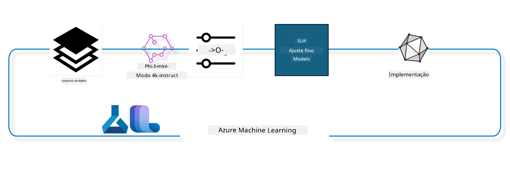

## Como usar componentes de chat-completion do registo de sistema Azure ML para ajustar um modelo

Neste exemplo, vamos realizar o fine tuning do modelo Phi-3-mini-4k-instruct para completar uma conversa entre 2 pessoas usando o conjunto de dados ultrachat_200k.



O exemplo mostrará como realizar fine tuning usando o Azure ML SDK e Python e depois implantar o modelo ajustado num endpoint online para inferência em tempo real.

### Dados de treino

Vamos usar o conjunto de dados ultrachat_200k. Esta é uma versão fortemente filtrada do conjunto de dados UltraChat e foi usada para treinar o Zephyr-7B-β, um modelo de chat 7b de última geração.

### Modelo

Vamos usar o modelo Phi-3-mini-4k-instruct para mostrar como o utilizador pode ajustar um modelo para a tarefa de chat-completion. Se abriu este notebook a partir de um cartão de modelo específico, lembre-se de substituir o nome do modelo específico.

### Tarefas

- Escolher um modelo para ajustar.
- Escolher e explorar os dados de treino.
- Configurar o trabalho de fine tuning.
- Executar o trabalho de fine tuning.
- Rever as métricas de treino e avaliação.
- Registar o modelo ajustado.
- Implantar o modelo ajustado para inferência em tempo real.
- Limpar recursos.

## 1. Configurar pré-requisitos

- Instalar dependências
- Ligar ao AzureML Workspace. Saiba mais em configurar autenticação SDK. Substitua <WORKSPACE_NAME>, <RESOURCE_GROUP> e <SUBSCRIPTION_ID> abaixo.
- Ligar ao registo do sistema azureml
- Definir um nome opcional para a experiência
- Verificar ou criar o compute.

> [!NOTE]
> Requisitos: um único nó GPU pode ter múltiplas placas GPU. Por exemplo, num nó Standard_NC24rs_v3 existem 4 GPUs NVIDIA V100 enquanto num Standard_NC12s_v3 existem 2 GPUs NVIDIA V100. Consulte a documentação para esta informação. O número de GPUs por nó é definido no parâmetro gpus_per_node abaixo. Configurar este valor corretamente garantirá a utilização de todas as GPUs no nó. As SKUs de compute GPU recomendadas podem ser encontradas aqui e aqui.

### Bibliotecas Python

Instale as dependências executando a célula abaixo. Este não é um passo opcional se estiver a executar num ambiente novo.

```bash
pip install azure-ai-ml
pip install azure-identity
pip install datasets==2.9.0
pip install mlflow
pip install azureml-mlflow
```

### Interagir com Azure ML

1. Este script Python é usado para interagir com o serviço Azure Machine Learning (Azure ML). Aqui está um resumo do que faz:

    - Importa módulos necessários dos pacotes azure.ai.ml, azure.identity, e azure.ai.ml.entities. Também importa o módulo time.

    - Tenta autenticar-se usando DefaultAzureCredential(), que fornece uma experiência simplificada de autenticação para começar rapidamente a desenvolver aplicações a correr na cloud Azure. Se isso falhar, recorre a InteractiveBrowserCredential(), que oferece um prompt de login interativo.

    - Depois tenta criar uma instância MLClient usando o método from_config, que lê a configuração do ficheiro config padrão (config.json). Se isso falhar, cria uma instância MLClient fornecendo manualmente subscription_id, resource_group_name e workspace_name.

    - Cria outra instância MLClient, desta vez para o registo Azure ML chamado "azureml". Este registo é onde os modelos, pipelines de fine-tuning e ambientes são armazenados.

    - Define o experiment_name para "chat_completion_Phi-3-mini-4k-instruct".

    - Gera um timestamp único convertendo o tempo atual (em segundos desde a época, como número de ponto flutuante) para um inteiro e depois para uma string. Este timestamp pode ser usado para criar nomes e versões únicos.

    ```python
    # Importar módulos necessários do Azure ML e Azure Identity
    from azure.ai.ml import MLClient
    from azure.identity import (
        DefaultAzureCredential,
        InteractiveBrowserCredential,
    )
    from azure.ai.ml.entities import AmlCompute
    import time  # Importar módulo time
    
    # Tentar autenticar usando DefaultAzureCredential
    try:
        credential = DefaultAzureCredential()
        credential.get_token("https://management.azure.com/.default")
    except Exception as ex:  # Se DefaultAzureCredential falhar, usar InteractiveBrowserCredential
        credential = InteractiveBrowserCredential()
    
    # Tentar criar uma instância MLClient usando o ficheiro de configuração padrão
    try:
        workspace_ml_client = MLClient.from_config(credential=credential)
    except:  # Se isso falhar, criar uma instância MLClient fornecendo manualmente os detalhes
        workspace_ml_client = MLClient(
            credential,
            subscription_id="<SUBSCRIPTION_ID>",
            resource_group_name="<RESOURCE_GROUP>",
            workspace_name="<WORKSPACE_NAME>",
        )
    
    # Criar outra instância MLClient para o registo Azure ML denominado "azureml"
    # Este registo é onde modelos, pipelines de fine-tuning e ambientes são armazenados
    registry_ml_client = MLClient(credential, registry_name="azureml")
    
    # Definir o nome do experimento
    experiment_name = "chat_completion_Phi-3-mini-4k-instruct"
    
    # Gerar um carimbo de data/hora único que pode ser usado para nomes e versões que precisam de ser únicos
    timestamp = str(int(time.time()))
    ```

## 2. Escolher um modelo base para ajustar

1. Phi-3-mini-4k-instruct é um modelo aberto, leve, de última geração com 3.8 mil milhões de parâmetros, construído a partir dos conjuntos de dados usados para Phi-2. O modelo pertence à família Phi-3, e a versão Mini existe em duas variantes 4K e 128K que correspondem ao comprimento de contexto (em tokens) que suporta; é necessário ajustar o modelo para o nosso propósito específico para o usar. Pode explorar estes modelos no Catálogo de Modelos no AzureML Studio, filtrando pela tarefa chat-completion. Neste exemplo, usamos o modelo Phi-3-mini-4k-instruct. Se abriu este notebook para outro modelo, substitua o nome e a versão do modelo conforme adequado.

> [!NOTE]
> a propriedade id do modelo. Esta será passada como entrada para o trabalho de fine tuning. Também está disponível como campo Asset ID na página de detalhes do modelo no Catálogo de Modelos do AzureML Studio.

2. Este script Python interage com o serviço Azure Machine Learning (Azure ML). Aqui está um resumo do que faz:

    - Define o model_name para "Phi-3-mini-4k-instruct".

    - Usa o método get da propriedade models do objeto registry_ml_client para obter a versão mais recente do modelo com o nome especificado do registo Azure ML. O método get é chamado com dois argumentos: o nome do modelo e um rótulo que especifica que a versão mais recente do modelo deve ser obtida.

    - Imprime uma mensagem no console indicando o nome, versão e id do modelo que será usado para o fine tuning. O método format da string é usado para inserir o nome, versão e id do modelo na mensagem. O nome, versão e id do modelo são acedidos como propriedades do objeto foundation_model.

    ```python
    # Definir o nome do modelo
    model_name = "Phi-3-mini-4k-instruct"
    
    # Obter a versão mais recente do modelo do registo Azure ML
    foundation_model = registry_ml_client.models.get(model_name, label="latest")
    
    # Imprimir o nome do modelo, versão e id
    # Esta informação é útil para rastreio e depuração
    print(
        "\n\nUsing model name: {0}, version: {1}, id: {2} for fine tuning".format(
            foundation_model.name, foundation_model.version, foundation_model.id
        )
    )
    ```

## 3. Criar um compute a usar com o trabalho

O trabalho de fine tuning funciona APENAS com compute GPU. O tamanho do compute depende do tamanho do modelo e, na maioria dos casos, pode ser difícil identificar o compute certo para o trabalho. Nesta célula, guiamos o utilizador para selecionar o compute correto para o trabalho.

> [!NOTE]
> Os computes listados abaixo funcionam com a configuração mais otimizada. Qualquer alteração à configuração pode provocar erros de Cuda Out Of Memory. Nestes casos, tente mudar para um compute de tamanho superior.

> [!NOTE]
> Ao selecionar o compute_cluster_size abaixo, certifique-se que o compute está disponível no seu grupo de recursos. Se um determinado compute não estiver disponível, pode requerer acesso aos recursos compute.

### Verificar suporte do modelo para fine tuning

1. Este script Python interage com um modelo Azure Machine Learning (Azure ML). Aqui está um resumo do que faz:

    - Importa o módulo ast, que fornece funções para processar árvores do gramático abstrato Python.

    - Verifica se o objeto foundation_model (que representa um modelo no Azure ML) tem uma tag chamada finetune_compute_allow_list. Tags no Azure ML são pares chave-valor que podem ser criados e usados para filtrar e ordenar modelos.

    - Se a tag finetune_compute_allow_list existir, usa a função ast.literal_eval para analisar seguramente o valor da tag (uma string) para uma lista Python. Esta lista é depois atribuída à variável computes_allow_list. Imprime uma mensagem indicando que um compute deve ser criado a partir da lista.

    - Se a tag finetune_compute_allow_list não existir, define computes_allow_list como None e imprime uma mensagem indicando que a tag finetune_compute_allow_list não faz parte das tags do modelo.

    - Em resumo, este script verifica uma tag específica nos metadados do modelo, converte o valor da tag para uma lista caso exista, e fornece feedback ao utilizador em conformidade.

    ```python
    # Importa o módulo ast, que fornece funções para processar árvores da gramática abstrata de sintaxe do Python
    import ast
    
    # Verifica se a etiqueta 'finetune_compute_allow_list' está presente nas etiquetas do modelo
    if "finetune_compute_allow_list" in foundation_model.tags:
        # Se a etiqueta estiver presente, utiliza ast.literal_eval para analisar de forma segura o valor da etiqueta (uma string) numa lista Python
        computes_allow_list = ast.literal_eval(
            foundation_model.tags["finetune_compute_allow_list"]
        )  # converte string para lista python
        # Imprime uma mensagem a indicar que um compute deve ser criado a partir da lista
        print(f"Please create a compute from the above list - {computes_allow_list}")
    else:
        # Se a etiqueta não estiver presente, define computes_allow_list como None
        computes_allow_list = None
        # Imprime uma mensagem a indicar que a etiqueta 'finetune_compute_allow_list' não faz parte das etiquetas do modelo
        print("`finetune_compute_allow_list` is not part of model tags")
    ```

### Verificar Instância de Compute

1. Este script Python interage com o serviço Azure Machine Learning (Azure ML) e realiza várias verificações numa instância de compute. Aqui está um resumo do que faz:

    - Tenta obter a instância de compute com o nome armazenado em compute_cluster do workspace Azure ML. Se o estado de provisão da instância de compute for "failed", levanta um ValueError.

    - Verifica se computes_allow_list não é None. Se não for, converte todos os tamanhos de compute na lista para minúsculas e verifica se o tamanho do compute atual está na lista. Se não estiver, levanta um ValueError.

    - Se computes_allow_list for None, verifica se o tamanho do compute está numa lista de tamanhos de VM GPU não suportados. Se estiver, levanta um ValueError.

    - Obtém uma lista de todos os tamanhos de compute disponíveis no workspace. Depois itera essa lista e, para cada tamanho de compute, verifica se o seu nome corresponde ao tamanho do compute atual. Se corresponder, obtém o número de GPUs para esse tamanho de compute e define gpu_count_found como True.

    - Se gpu_count_found for True, imprime o número de GPUs na instância de compute. Se gpu_count_found for False, levanta um ValueError.

    - Em suma, este script realiza várias verificações numa instância de compute de um workspace Azure ML, incluindo verificar estado de provisão, tamanho conforme a uma lista permitida ou recusada, e o número de GPUs que possui.

    ```python
    # Imprimir a mensagem da exceção
    print(e)
    # Levantar um ValueError se o tamanho de computação não estiver disponível no espaço de trabalho
    raise ValueError(
        f"WARNING! Compute size {compute_cluster_size} not available in workspace"
    )
    
    # Recuperar a instância de computação do espaço de trabalho Azure ML
    compute = workspace_ml_client.compute.get(compute_cluster)
    # Verificar se o estado de provisionamento da instância de computação é "failed"
    if compute.provisioning_state.lower() == "failed":
        # Levantar um ValueError se o estado de provisionamento for "failed"
        raise ValueError(
            f"Provisioning failed, Compute '{compute_cluster}' is in failed state. "
            f"please try creating a different compute"
        )
    
    # Verificar se computes_allow_list não é None
    if computes_allow_list is not None:
        # Converter todos os tamanhos de computação em computes_allow_list para letras minúsculas
        computes_allow_list_lower_case = [x.lower() for x in computes_allow_list]
        # Verificar se o tamanho da instância de computação está em computes_allow_list_lower_case
        if compute.size.lower() not in computes_allow_list_lower_case:
            # Levantar um ValueError se o tamanho da instância de computação não estiver em computes_allow_list_lower_case
            raise ValueError(
                f"VM size {compute.size} is not in the allow-listed computes for finetuning"
            )
    else:
        # Definir uma lista de tamanhos de VM GPU não suportados
        unsupported_gpu_vm_list = [
            "standard_nc6",
            "standard_nc12",
            "standard_nc24",
            "standard_nc24r",
        ]
        # Verificar se o tamanho da instância de computação está em unsupported_gpu_vm_list
        if compute.size.lower() in unsupported_gpu_vm_list:
            # Levantar um ValueError se o tamanho da instância de computação estiver em unsupported_gpu_vm_list
            raise ValueError(
                f"VM size {compute.size} is currently not supported for finetuning"
            )
    
    # Inicializar uma flag para verificar se o número de GPUs na instância de computação foi encontrado
    gpu_count_found = False
    # Recuperar uma lista de todos os tamanhos de computação disponíveis no espaço de trabalho
    workspace_compute_sku_list = workspace_ml_client.compute.list_sizes()
    available_sku_sizes = []
    # Iterar sobre a lista de tamanhos de computação disponíveis
    for compute_sku in workspace_compute_sku_list:
        available_sku_sizes.append(compute_sku.name)
        # Verificar se o nome do tamanho de computação corresponde ao tamanho da instância de computação
        if compute_sku.name.lower() == compute.size.lower():
            # Se corresponder, recuperar o número de GPUs para esse tamanho de computação e definir gpu_count_found como True
            gpus_per_node = compute_sku.gpus
            gpu_count_found = True
    # Se gpu_count_found for True, imprimir o número de GPUs na instância de computação
    if gpu_count_found:
        print(f"Number of GPU's in compute {compute.size}: {gpus_per_node}")
    else:
        # Se gpu_count_found for False, levantar um ValueError
        raise ValueError(
            f"Number of GPU's in compute {compute.size} not found. Available skus are: {available_sku_sizes}."
            f"This should not happen. Please check the selected compute cluster: {compute_cluster} and try again."
        )
    ```

## 4. Selecionar o conjunto de dados para o fine tuning do modelo

1. Usamos o conjunto de dados ultrachat_200k. O conjunto de dados tem quatro divisões, adequadas para fine tuning supervisionado (sft).
Ranqueamento de geração (gen). O número de exemplos por divisão é mostrado a seguir:

    ```bash
    train_sft test_sft  train_gen  test_gen
    207865  23110  256032  28304
    ```

1. As próximas células mostram preparação básica dos dados para fine tuning:

### Visualizar algumas linhas de dados

Queremos que esta amostra execute rapidamente, por isso guardamos os ficheiros train_sft, test_sft contendo 5% das linhas já filtradas. Isto significa que o modelo ajustado terá menor precisão, pelo que não deverá ser usado em contextos reais.
O download-dataset.py é usado para descarregar o conjunto de dados ultrachat_200k e transformar o conjunto de dados no formato consumível pelo componente pipeline finetune. Como o conjunto é grande, aqui só temos uma parte do mesmo.

1. Executar o script abaixo apenas descarrega 5% dos dados. Este valor pode ser aumentado alterando o parâmetro dataset_split_pc para a percentagem desejada.

> [!NOTE]
> Alguns modelos de linguagem têm códigos de idiomas diferentes pelo que os nomes das colunas no conjunto de dados devem refletir o mesmo.

1. Aqui está um exemplo de como os dados devem parecer
O conjunto de dados chat-completion está armazenado em formato parquet, com entrada usando o esquema seguinte:

    - Este é um documento JSON (JavaScript Object Notation), que é um formato popular de intercâmbio de dados. Não é código executável, mas uma forma de armazenar e transportar dados. Aqui está uma descrição da sua estrutura:

    - "prompt": Esta chave guarda um valor string que representa uma tarefa ou questão apresentada a um assistente AI.

    - "messages": Esta chave guarda um array de objetos. Cada objeto representa uma mensagem numa conversa entre um utilizador e um assistente AI. Cada objeto de mensagem tem duas chaves:

    - "content": Esta chave guarda um valor string que representa o conteúdo da mensagem.
    - "role": Esta chave guarda um valor string que representa o papel da entidade que enviou a mensagem. Pode ser "user" ou "assistant".
    - "prompt_id": Esta chave guarda um valor string que representa um identificador único para o prompt.

1. Neste documento JSON específico, é representada uma conversa onde um utilizador pede a um assistente AI para criar um protagonista para uma história distópica. O assistente responde, e o utilizador pede mais detalhes. O assistente concorda em fornecer mais detalhes. Toda a conversa está associada a um id de prompt específico.

    ```python
    {
        // The task or question posed to an AI assistant
        "prompt": "Create a fully-developed protagonist who is challenged to survive within a dystopian society under the rule of a tyrant. ...",
        
        // An array of objects, each representing a message in a conversation between a user and an AI assistant
        "messages":[
            {
                // The content of the user's message
                "content": "Create a fully-developed protagonist who is challenged to survive within a dystopian society under the rule of a tyrant. ...",
                // The role of the entity that sent the message
                "role": "user"
            },
            {
                // The content of the assistant's message
                "content": "Name: Ava\n\n Ava was just 16 years old when the world as she knew it came crashing down. The government had collapsed, leaving behind a chaotic and lawless society. ...",
                // The role of the entity that sent the message
                "role": "assistant"
            },
            {
                // The content of the user's message
                "content": "Wow, Ava's story is so intense and inspiring! Can you provide me with more details.  ...",
                // The role of the entity that sent the message
                "role": "user"
            }, 
            {
                // The content of the assistant's message
                "content": "Certainly! ....",
                // The role of the entity that sent the message
                "role": "assistant"
            }
        ],
        
        // A unique identifier for the prompt
        "prompt_id": "d938b65dfe31f05f80eb8572964c6673eddbd68eff3db6bd234d7f1e3b86c2af"
    }
    ```

### Descarregar Dados

1. Este script Python é usado para descarregar um conjunto de dados usando um script auxiliar chamado download-dataset.py. Aqui está um resumo do que faz:

    - Importa o módulo os, que fornece uma forma portátil de usar funcionalidades dependentes do sistema operativo.

    - Usa a função os.system para executar o script download-dataset.py na shell com argumentos específicos de linha de comandos. Os argumentos especificam o conjunto de dados a descarregar (HuggingFaceH4/ultrachat_200k), o diretório onde descarregá-lo (ultrachat_200k_dataset), e a percentagem do conjunto de dados a usar (5). A função os.system retorna o estado de saída do comando executado; este estado é armazenado na variável exit_status.

    - Verifica se exit_status é diferente de 0. Em sistemas Unix-like, estado de saída 0 indica sucesso, qualquer valor diferente indica erro. Se exit_status não for 0, levanta uma Exceção com mensagem indicando erro ao descarregar o conjunto de dados.

    - Em suma, este script executa uma linha de comando para descarregar um conjunto de dados usando um script auxiliar, e levanta exceção se o comando falhar.
    
    ```python
    # Importa o módulo os, que fornece uma forma de usar funcionalidades dependentes do sistema operativo
    import os
    
    # Usa a função os.system para executar o script download-dataset.py no shell com argumentos específicos de linha de comando
    # Os argumentos especificam o conjunto de dados a transferir (HuggingFaceH4/ultrachat_200k), o diretório para onde transferir (ultrachat_200k_dataset), e a percentagem do conjunto de dados para dividir (5)
    # A função os.system devolve o estado de saída do comando que executou; este estado é armazenado na variável exit_status
    exit_status = os.system(
        "python ./download-dataset.py --dataset HuggingFaceH4/ultrachat_200k --download_dir ultrachat_200k_dataset --dataset_split_pc 5"
    )
    
    # Verifica se exit_status não é 0
    # Nos sistemas operativos do tipo Unix, um estado de saída 0 normalmente indica que um comando teve sucesso, enquanto qualquer outro número indica um erro
    # Se exit_status não for 0, lança uma Exceção com uma mensagem a indicar que houve um erro ao transferir o conjunto de dados
    if exit_status != 0:
        raise Exception("Error downloading dataset")
    ```

### Carregar Dados para um DataFrame

1. Este script Python carrega um ficheiro JSON Lines para um DataFrame pandas e mostra as primeiras 5 linhas. Aqui está um resumo do que faz:

    - Importa a biblioteca pandas, que é uma biblioteca poderosa para manipulação e análise de dados.

    - Define a largura máxima da coluna para as opções de visualização do pandas para 0. Isto significa que o texto completo de cada coluna será mostrado sem truncar quando o DataFrame for impresso.
    - Utiliza a função pd.read_json para carregar o ficheiro train_sft.jsonl do diretório ultrachat_200k_dataset para um DataFrame. O argumento lines=True indica que o ficheiro está no formato JSON Lines, onde cada linha é um objeto JSON separado.

    - Utiliza o método head para mostrar as primeiras 5 linhas do DataFrame. Se o DataFrame tiver menos de 5 linhas, mostrará todas elas.

    - Em resumo, este script está a carregar um ficheiro JSON Lines num DataFrame e a mostrar as primeiras 5 linhas com texto completo das colunas.
    
    ```python
    # Importar a biblioteca pandas, que é uma biblioteca poderosa para manipulação e análise de dados
    import pandas as pd
    
    # Definir a largura máxima das colunas para as opções de exibição do pandas como 0
    # Isto significa que o texto completo de cada coluna será exibido sem truncamento quando o DataFrame for impresso
    pd.set_option("display.max_colwidth", 0)
    
    # Usar a função pd.read_json para carregar o ficheiro train_sft.jsonl do diretório ultrachat_200k_dataset para um DataFrame
    # O argumento lines=True indica que o ficheiro está no formato JSON Lines, onde cada linha é um objeto JSON separado
    df = pd.read_json("./ultrachat_200k_dataset/train_sft.jsonl", lines=True)
    
    # Usar o método head para mostrar as primeiras 5 linhas do DataFrame
    # Se o DataFrame tiver menos de 5 linhas, irá mostrar todas elas
    df.head()
    ```

## 5. Submeter o trabalho de fine tuning usando o modelo e dados como inputs

Crie o trabalho que usa o componente de pipeline chat-completion. Saiba mais sobre todos os parâmetros suportados para fine tuning.

### Definir parâmetros de fine tune

1. Os parâmetros de fine tune podem ser agrupados em 2 categorias - parâmetros de treino, parâmetros de otimização

1. Os parâmetros de treino definem os aspetos do treino tais como -

    - O otimizador, scheduler a usar
    - A métrica a otimizar no fine tune
    - Número de passos de treino, tamanho do batch, etc.
    - Os parâmetros de otimização ajudam a otimizar a memória da GPU e a usar eficazmente os recursos de cálculo.

1. Em seguida, alguns dos parâmetros que pertencem a esta categoria. Os parâmetros de otimização diferem para cada modelo e estão empacotados com o modelo para gerir essas variações.

    - Ativar o deepspeed e LoRA
    - Ativar treino com precisão mista
    - Ativar treino multi-nodo

> [!NOTE]
> O fine tuning supervisionado pode resultar na perda de alinhamento ou esquecimento catastrófico. Recomendamos verificar este problema e executar uma etapa de alinhamento após o fine tuning.

### Parâmetros de Fine Tuning

1. Este script Python está a configurar parâmetros para o fine tuning de um modelo de machine learning. Eis uma explicação do que faz:

    - Configura os parâmetros padrão de treino, como número de épocas, tamanhos de batch para treino e avaliação, taxa de aprendizagem e tipo de scheduler da taxa de aprendizagem.

    - Configura os parâmetros padrão de otimização, como se se deve aplicar Layer-wise Relevance Propagation (LoRa) e DeepSpeed, e o estágio do DeepSpeed.

    - Combina os parâmetros de treino e otimização num dicionário único chamado finetune_parameters.

    - Verifica se o foundation_model tem parâmetros padrão específicos do modelo. Se tiver, imprime uma mensagem de aviso e atualiza o dicionário finetune_parameters com estes parâmetros específicos do modelo. A função ast.literal_eval é usada para converter os parâmetros específicos do modelo a partir de uma string para um dicionário Python.

    - Imprime o conjunto final de parâmetros de fine tuning que serão usados na execução.

    - Em resumo, este script configura e mostra os parâmetros para fine tuning de um modelo de machine learning, com capacidade para substituir os parâmetros padrão por parâmetros específicos do modelo.

    ```python
    # Definir parâmetros padrão de treino, tais como o número de épocas de treino, tamanhos de batch para treino e avaliação, taxa de aprendizagem, e tipo de scheduler da taxa de aprendizagem
    training_parameters = dict(
        num_train_epochs=3,
        per_device_train_batch_size=1,
        per_device_eval_batch_size=1,
        learning_rate=5e-6,
        lr_scheduler_type="cosine",
    )
    
    # Definir parâmetros padrão de otimização, tais como se se aplica Layer-wise Relevance Propagation (LoRa) e DeepSpeed, e o estágio do DeepSpeed
    optimization_parameters = dict(
        apply_lora="true",
        apply_deepspeed="true",
        deepspeed_stage=2,
    )
    
    # Combinar os parâmetros de treino e de otimização num único dicionário chamado finetune_parameters
    finetune_parameters = {**training_parameters, **optimization_parameters}
    
    # Verificar se o foundation_model tem algum parâmetro padrão específico do modelo
    # Se tiver, imprimir uma mensagem de aviso e atualizar o dicionário finetune_parameters com esses padrões específicos do modelo
    # A função ast.literal_eval é usada para converter os padrões específicos do modelo de uma string para um dicionário Python
    if "model_specific_defaults" in foundation_model.tags:
        print("Warning! Model specific defaults exist. The defaults could be overridden.")
        finetune_parameters.update(
            ast.literal_eval(  # converter string para dicionário Python
                foundation_model.tags["model_specific_defaults"]
            )
        )
    
    # Imprimir o conjunto final de parâmetros de fine-tuning que serão usados para a execução
    print(
        f"The following finetune parameters are going to be set for the run: {finetune_parameters}"
    )
    ```

### Pipeline de Treino

1. Este script Python define uma função para gerar um nome de visualização para uma pipeline de treino de machine learning e depois chama essa função para gerar e imprimir o nome de exibição. Eis o que faz:

1. Define a função get_pipeline_display_name. Esta função gera um nome de visualização com base em vários parâmetros relacionados com a pipeline de treino.

1. Dentro da função, calcula o tamanho total do batch multiplicando o batch size por dispositivo, o número de passos de acumulação de gradiente, o número de GPUs por nodo, e o número de nodos usados para fine tuning.

1. Obtém outros parâmetros, tais como o tipo de scheduler da taxa de aprendizagem, se DeepSpeed está aplicado, o estágio de DeepSpeed, se Layer-wise Relevance Propagation (LoRa) está aplicado, o limite do número de checkpoints de modelo a manter, e o comprimento máximo da sequência.

1. Constrói uma string que inclui todos estes parâmetros, separados por hífens. Se DeepSpeed ou LoRa está aplicado, a string inclui "ds" seguido pelo estágio de DeepSpeed, ou "lora", respetivamente. Se não, inclui "nods" ou "nolora", respetivamente.

1. A função retorna esta string, que serve como o nome de visualização para a pipeline de treino.

1. Após a definição da função, esta é chamada para gerar o nome de visualização, que é então impresso.

1. Em resumo, este script gera um nome de visualização para uma pipeline de treino de machine learning com base em vários parâmetros, e depois imprime esse nome.

    ```python
    # Definir uma função para gerar um nome de exibição para a pipeline de treino
    def get_pipeline_display_name():
        # Calcular o tamanho total do batch multiplicando o tamanho do batch por dispositivo, o número de passos de acumulação de gradiente, o número de GPUs por nó, e o número de nós usados para fine-tuning
        batch_size = (
            int(finetune_parameters.get("per_device_train_batch_size", 1))
            * int(finetune_parameters.get("gradient_accumulation_steps", 1))
            * int(gpus_per_node)
            * int(finetune_parameters.get("num_nodes_finetune", 1))
        )
        # Obter o tipo de scheduler da taxa de aprendizagem
        scheduler = finetune_parameters.get("lr_scheduler_type", "linear")
        # Obter se o DeepSpeed está aplicado
        deepspeed = finetune_parameters.get("apply_deepspeed", "false")
        # Obter o estágio do DeepSpeed
        ds_stage = finetune_parameters.get("deepspeed_stage", "2")
        # Se o DeepSpeed estiver aplicado, incluir "ds" seguido do estágio do DeepSpeed no nome de exibição; caso contrário, incluir "nods"
        if deepspeed == "true":
            ds_string = f"ds{ds_stage}"
        else:
            ds_string = "nods"
        # Obter se o Layer-wise Relevance Propagation (LoRa) está aplicado
        lora = finetune_parameters.get("apply_lora", "false")
        # Se o LoRa estiver aplicado, incluir "lora" no nome de exibição; caso contrário, incluir "nolora"
        if lora == "true":
            lora_string = "lora"
        else:
            lora_string = "nolora"
        # Obter o limite do número de checkpoints do modelo a manter
        save_limit = finetune_parameters.get("save_total_limit", -1)
        # Obter o comprimento máximo da sequência
        seq_len = finetune_parameters.get("max_seq_length", -1)
        # Construir o nome de exibição concatenando todos estes parâmetros, separados por hífens
        return (
            model_name
            + "-"
            + "ultrachat"
            + "-"
            + f"bs{batch_size}"
            + "-"
            + f"{scheduler}"
            + "-"
            + ds_string
            + "-"
            + lora_string
            + f"-save_limit{save_limit}"
            + f"-seqlen{seq_len}"
        )
    
    # Chamar a função para gerar o nome de exibição
    pipeline_display_name = get_pipeline_display_name()
    # Imprimir o nome de exibição
    print(f"Display name used for the run: {pipeline_display_name}")
    ```

### Configuração da Pipeline

Este script Python está a definir e configurar uma pipeline de machine learning usando o Azure Machine Learning SDK. Eis o que faz:

1. Importa os módulos necessários do Azure AI ML SDK.

1. Obtém um componente de pipeline chamado "chat_completion_pipeline" do registo.

1. Define um trabalho de pipeline usando o decorador `@pipeline` e a função `create_pipeline`. O nome da pipeline é definido como `pipeline_display_name`.

1. Dentro da função `create_pipeline`, inicializa o componente de pipeline obtido com vários parâmetros, incluindo o caminho do modelo, clusters de computação para diferentes etapas, divisões do dataset para treino e teste, número de GPUs para fine tuning, e outros parâmetros de fine tuning.

1. Mapeia a saída do trabalho de fine tuning para a saída do trabalho da pipeline. Isto é feito para que o modelo afinado possa ser facilmente registado, o que é necessário para implantar o modelo num endpoint online ou batch.

1. Cria uma instância da pipeline chamando a função `create_pipeline`.

1. Define a configuração `force_rerun` da pipeline como `True`, significando que resultados em cache de trabalhos anteriores não serão usados.

1. Define a configuração `continue_on_step_failure` da pipeline como `False`, significando que a pipeline vai parar se alguma etapa falhar.

1. Em resumo, este script define e configura uma pipeline de machine learning para uma tarefa de conclusão de chat usando o Azure Machine Learning SDK.

    ```python
    # Importar módulos necessários do SDK Azure AI ML
    from azure.ai.ml.dsl import pipeline
    from azure.ai.ml import Input
    
    # Obter o componente de pipeline chamado "chat_completion_pipeline" do registo
    pipeline_component_func = registry_ml_client.components.get(
        name="chat_completion_pipeline", label="latest"
    )
    
    # Definir o trabalho de pipeline usando o decorador @pipeline e a função create_pipeline
    # O nome do pipeline é definido para pipeline_display_name
    @pipeline(name=pipeline_display_name)
    def create_pipeline():
        # Inicializar o componente de pipeline obtido com vários parâmetros
        # Estes incluem o caminho do modelo, clusters de computação para diferentes fases, divisões do conjunto de dados para treino e teste, o número de GPUs a usar para fine-tuning, e outros parâmetros de fine-tuning
        chat_completion_pipeline = pipeline_component_func(
            mlflow_model_path=foundation_model.id,
            compute_model_import=compute_cluster,
            compute_preprocess=compute_cluster,
            compute_finetune=compute_cluster,
            compute_model_evaluation=compute_cluster,
            # Mapear as divisões do conjunto de dados para parâmetros
            train_file_path=Input(
                type="uri_file", path="./ultrachat_200k_dataset/train_sft.jsonl"
            ),
            test_file_path=Input(
                type="uri_file", path="./ultrachat_200k_dataset/test_sft.jsonl"
            ),
            # Configurações de treino
            number_of_gpu_to_use_finetuning=gpus_per_node,  # Definido para o número de GPUs disponíveis na computação
            **finetune_parameters
        )
        return {
            # Mapear a saída do trabalho de fine-tuning para a saída do trabalho de pipeline
            # Isto é feito para que possamos registar facilmente o modelo ajustado
            # Registar o modelo é necessário para implantar o modelo num endpoint online ou batch
            "trained_model": chat_completion_pipeline.outputs.mlflow_model_folder
        }
    
    # Criar uma instância do pipeline chamando a função create_pipeline
    pipeline_object = create_pipeline()
    
    # Não usar resultados em cache de trabalhos anteriores
    pipeline_object.settings.force_rerun = True
    
    # Definir continuar em falha de etapa para False
    # Isto significa que o pipeline irá parar se alguma etapa falhar
    pipeline_object.settings.continue_on_step_failure = False
    ```

### Submeter o Trabalho

1. Este script Python está a submeter um trabalho de pipeline de machine learning para um workspace Azure Machine Learning e depois espera que o trabalho termine. Eis o que faz:

    - Chama o método create_or_update do objeto jobs no workspace_ml_client para submeter o trabalho de pipeline. A pipeline a executar é especificada por pipeline_object, e o experimento sob o qual o trabalho é executado é especificado por experiment_name.

    - Depois chama o método stream do objeto jobs no workspace_ml_client para esperar que o trabalho de pipeline termine. O trabalho a esperar é especificado pelo atributo name do objeto pipeline_job.

    - Em resumo, este script submete um trabalho de pipeline de machine learning para um workspace Azure Machine Learning e depois espera que o trabalho termine.

    ```python
    # Submeter o trabalho do pipeline ao espaço de trabalho do Azure Machine Learning
    # O pipeline a ser executado é especificado por pipeline_object
    # O experimento sob o qual o trabalho é executado é especificado por experiment_name
    pipeline_job = workspace_ml_client.jobs.create_or_update(
        pipeline_object, experiment_name=experiment_name
    )
    
    # Aguardar a conclusão do trabalho do pipeline
    # O trabalho a aguardar é especificado pelo atributo name do objeto pipeline_job
    workspace_ml_client.jobs.stream(pipeline_job.name)
    ```

## 6. Registar o modelo afinado no workspace

Vamos registar o modelo da saída do trabalho de fine tuning. Isto vai rastrear a linhagem entre o modelo afinado e o trabalho de fine tuning. O trabalho de fine tuning, por sua vez, rastreia a linhagem para o foundation model, dados e código de treino.

### Registo do Modelo ML

1. Este script Python está a registar um modelo de machine learning que foi treinado numa pipeline Azure Machine Learning. Eis o que faz:

    - Importa os módulos necessários do Azure AI ML SDK.

    - Verifica se a saída trained_model está disponível a partir do trabalho de pipeline chamando o método get do objeto jobs no workspace_ml_client e acedendo ao seu atributo outputs.

    - Constrói um caminho para o modelo treinado formatando uma string com o nome do trabalho de pipeline e o nome da saída ("trained_model").

    - Define um nome para o modelo afinado, adicionando "-ultrachat-200k" ao nome original do modelo e substituindo quaisquer barras por hífens.

    - Prepara-se para registar o modelo criando um objeto Model com vários parâmetros, incluindo o caminho para o modelo, o tipo do modelo (modelo MLflow), o nome e a versão do modelo, e uma descrição do modelo.

    - Regista o modelo chamando o método create_or_update do objeto models no workspace_ml_client com o objeto Model como argumento.

    - Imprime o modelo registado.

1. Em resumo, este script está a registar um modelo de machine learning que foi treinado numa pipeline Azure Machine Learning.
    
    ```python
    # Importar os módulos necessários do Azure AI ML SDK
    from azure.ai.ml.entities import Model
    from azure.ai.ml.constants import AssetTypes
    
    # Verificar se a saída `trained_model` está disponível a partir do trabalho do pipeline
    print("pipeline job outputs: ", workspace_ml_client.jobs.get(pipeline_job.name).outputs)
    
    # Construir um caminho para o modelo treinado formatando uma string com o nome do trabalho do pipeline e o nome da saída ("trained_model")
    model_path_from_job = "azureml://jobs/{0}/outputs/{1}".format(
        pipeline_job.name, "trained_model"
    )
    
    # Definir um nome para o modelo ajustado adicionando "-ultrachat-200k" ao nome original do modelo e substituindo quaisquer barras por hífens
    finetuned_model_name = model_name + "-ultrachat-200k"
    finetuned_model_name = finetuned_model_name.replace("/", "-")
    
    print("path to register model: ", model_path_from_job)
    
    # Preparar para registar o modelo criando um objeto Model com vários parâmetros
    # Estes incluem o caminho para o modelo, o tipo do modelo (modelo MLflow), o nome e a versão do modelo, e uma descrição do modelo
    prepare_to_register_model = Model(
        path=model_path_from_job,
        type=AssetTypes.MLFLOW_MODEL,
        name=finetuned_model_name,
        version=timestamp,  # Usar timestamp como versão para evitar conflito de versões
        description=model_name + " fine tuned model for ultrachat 200k chat-completion",
    )
    
    print("prepare to register model: \n", prepare_to_register_model)
    
    # Registar o modelo chamando o método create_or_update do objeto models no workspace_ml_client com o objeto Model como argumento
    registered_model = workspace_ml_client.models.create_or_update(
        prepare_to_register_model
    )
    
    # Imprimir o modelo registado
    print("registered model: \n", registered_model)
    ```

## 7. Implantar o modelo afinado num endpoint online

Endpoints online fornecem uma API REST duradoura que pode ser usada para integrar com aplicações que precisam de usar o modelo.

### Gerir Endpoint

1. Este script Python está a criar um endpoint online gerido no Azure Machine Learning para um modelo registado. Eis o que faz:

    - Importa os módulos necessários do Azure AI ML SDK.

    - Define um nome único para o endpoint online, adicionando um timestamp à string "ultrachat-completion-".

    - Prepara-se para criar o endpoint online, criando um objeto ManagedOnlineEndpoint com vários parâmetros, incluindo o nome do endpoint, uma descrição do endpoint, e o modo de autenticação ("key").

    - Cria o endpoint online chamando o método begin_create_or_update do workspace_ml_client com o objeto ManagedOnlineEndpoint como argumento. Depois espera que a operação de criação termine chamando o método wait.

1. Em resumo, este script está a criar um endpoint online gerido no Azure Machine Learning para um modelo registado.

    ```python
    # Importar os módulos necessários do Azure AI ML SDK
    from azure.ai.ml.entities import (
        ManagedOnlineEndpoint,
        ManagedOnlineDeployment,
        ProbeSettings,
        OnlineRequestSettings,
    )
    
    # Definir um nome único para o endpoint online acrescentando um carimbo de data/hora à string "ultrachat-completion-"
    online_endpoint_name = "ultrachat-completion-" + timestamp
    
    # Preparar para criar o endpoint online criando um objeto ManagedOnlineEndpoint com vários parâmetros
    # Estes incluem o nome do endpoint, uma descrição do endpoint e o modo de autenticação ("key")
    endpoint = ManagedOnlineEndpoint(
        name=online_endpoint_name,
        description="Online endpoint for "
        + registered_model.name
        + ", fine tuned model for ultrachat-200k-chat-completion",
        auth_mode="key",
    )
    
    # Criar o endpoint online chamando o método begin_create_or_update do workspace_ml_client com o objeto ManagedOnlineEndpoint como argumento
    # Depois, aguardar pela conclusão da operação de criação chamando o método wait
    workspace_ml_client.begin_create_or_update(endpoint).wait()
    ```

> [!NOTE]
> Pode encontrar aqui a lista de SKUs suportados para implementação - [Managed online endpoints SKU list](https://learn.microsoft.com/azure/machine-learning/reference-managed-online-endpoints-vm-sku-list)

### Implantação do Modelo ML

1. Este script Python está a implantar um modelo de machine learning registado num endpoint online gerido no Azure Machine Learning. Eis o que faz:

    - Importa o módulo ast, que fornece funções para processar árvores da gramática abstrata Python.

    - Define o tipo de instância para a implementação como "Standard_NC6s_v3".

    - Verifica se a tag inference_compute_allow_list está presente no foundation model. Se estiver, converte o valor da tag de uma string para uma lista Python e atribui a inference_computes_allow_list. Se não estiver, define inference_computes_allow_list como None.

    - Verifica se o tipo de instância especificado está na lista de permissão. Se não estiver, imprime uma mensagem pedindo ao utilizador para selecionar um tipo de instância da lista de permissão.

    - Prepara-se para criar a implementação criando um objeto ManagedOnlineDeployment com vários parâmetros, incluindo o nome da implementação, o nome do endpoint, o ID do modelo, o tipo e quantidade de instância, as configurações da probe de vitalidade, e as configurações de requisição.

    - Cria a implementação chamando o método begin_create_or_update do workspace_ml_client com o objeto ManagedOnlineDeployment como argumento. Depois espera que a operação de criação termine chamando o método wait.

    - Define o tráfego do endpoint para direcionar 100% do tráfego para a implementação "demo".

    - Atualiza o endpoint chamando o método begin_create_or_update do workspace_ml_client com o objeto endpoint como argumento. Depois espera que a operação de atualização termine chamando o método result.

1. Em resumo, este script está a implantar um modelo de machine learning registado num endpoint online gerido no Azure Machine Learning.

    ```python
    # Importar o módulo ast, que fornece funções para processar árvores da gramática abstrata da sintaxe Python
    import ast
    
    # Definir o tipo de instância para a implementação
    instance_type = "Standard_NC6s_v3"
    
    # Verificar se a etiqueta `inference_compute_allow_list` está presente no modelo base
    if "inference_compute_allow_list" in foundation_model.tags:
        # Se estiver, converter o valor da etiqueta de uma string para uma lista Python e atribuí-lo a `inference_computes_allow_list`
        inference_computes_allow_list = ast.literal_eval(
            foundation_model.tags["inference_compute_allow_list"]
        )
        print(f"Please create a compute from the above list - {computes_allow_list}")
    else:
        # Se não estiver, definir `inference_computes_allow_list` como `None`
        inference_computes_allow_list = None
        print("`inference_compute_allow_list` is not part of model tags")
    
    # Verificar se o tipo de instância especificado está na lista permitida
    if (
        inference_computes_allow_list is not None
        and instance_type not in inference_computes_allow_list
    ):
        print(
            f"`instance_type` is not in the allow listed compute. Please select a value from {inference_computes_allow_list}"
        )
    
    # Preparar para criar a implementação criando um objeto `ManagedOnlineDeployment` com vários parâmetros
    demo_deployment = ManagedOnlineDeployment(
        name="demo",
        endpoint_name=online_endpoint_name,
        model=registered_model.id,
        instance_type=instance_type,
        instance_count=1,
        liveness_probe=ProbeSettings(initial_delay=600),
        request_settings=OnlineRequestSettings(request_timeout_ms=90000),
    )
    
    # Criar a implementação chamando o método `begin_create_or_update` do `workspace_ml_client` com o objeto `ManagedOnlineDeployment` como argumento
    # Depois, aguardar a conclusão da operação de criação chamando o método `wait`
    workspace_ml_client.online_deployments.begin_create_or_update(demo_deployment).wait()
    
    # Definir o tráfego do endpoint para direcionar 100% do tráfego para a implementação "demo"
    endpoint.traffic = {"demo": 100}
    
    # Atualizar o endpoint chamando o método `begin_create_or_update` do `workspace_ml_client` com o objeto `endpoint` como argumento
    # Depois, aguardar a conclusão da operação de atualização chamando o método `result`
    workspace_ml_client.begin_create_or_update(endpoint).result()
    ```

## 8. Testar o endpoint com dados de exemplo

Vamos obter alguns dados de exemplo do dataset de teste e submeter ao endpoint online para inferência. Depois mostraremos as labels pontuadas junto com as labels verdadeiras.

### Ler os resultados

1. Este script Python está a ler um ficheiro JSON Lines para um DataFrame pandas, a tirar uma amostra aleatória e a redefinir o índice. Eis o que faz:

    - Lê o ficheiro ./ultrachat_200k_dataset/test_gen.jsonl para um DataFrame pandas. A função read_json é usada com o argumento lines=True porque o ficheiro está no formato JSON Lines, onde cada linha é um objeto JSON separado.

    - Tira uma amostra aleatória de 1 linha do DataFrame. A função sample é usada com o argumento n=1 para especificar o número de linhas aleatórias a selecionar.

    - Redefine o índice do DataFrame. A função reset_index é usada com o argumento drop=True para eliminar o índice original e substituí-lo por um novo índice com valores inteiros padrão.

    - Mostra as primeiras 2 linhas do DataFrame usando a função head com o argumento 2. No entanto, como o DataFrame só contém uma linha após a amostragem, mostrará apenas essa linha.

1. Em resumo, este script lê um ficheiro JSON Lines para um DataFrame pandas, tira uma amostra aleatória de 1 linha, redefine o índice, e mostra a primeira linha.
    
    ```python
    # Importar a biblioteca pandas
    import pandas as pd
    
    # Ler o ficheiro JSON Lines './ultrachat_200k_dataset/test_gen.jsonl' para um DataFrame pandas
    # O argumento 'lines=True' indica que o ficheiro está em formato JSON Lines, onde cada linha é um objeto JSON separado
    test_df = pd.read_json("./ultrachat_200k_dataset/test_gen.jsonl", lines=True)
    
    # Obter uma amostra aleatória de 1 linha do DataFrame
    # O argumento 'n=1' especifica o número de linhas aleatórias a selecionar
    test_df = test_df.sample(n=1)
    
    # Repor o índice do DataFrame
    # O argumento 'drop=True' indica que o índice original deve ser eliminado e substituído por um novo índice com valores inteiros por defeito
    # O argumento 'inplace=True' indica que o DataFrame deve ser modificado no local (sem criar um novo objeto)
    test_df.reset_index(drop=True, inplace=True)
    
    # Mostrar as primeiras 2 linhas do DataFrame
    # Contudo, como o DataFrame contém apenas uma linha após a amostragem, isso irá mostrar apenas essa linha
    test_df.head(2)
    ```

### Criar Objeto JSON

1. Este script Python está a criar um objeto JSON com parâmetros específicos e a guardá-lo num ficheiro. Eis o que faz:

    - Importa o módulo json, que fornece funções para trabalhar com dados JSON.
    - Cria um dicionário parameters com chaves e valores que representam parâmetros para um modelo de aprendizagem automática. As chaves são "temperature", "top_p", "do_sample" e "max_new_tokens", e os seus valores correspondentes são 0.6, 0.9, True e 200 respetivamente.

    - Cria outro dicionário test_json com duas chaves: "input_data" e "params". O valor de "input_data" é outro dicionário com as chaves "input_string" e "parameters". O valor de "input_string" é uma lista que contém a primeira mensagem do DataFrame test_df. O valor de "parameters" é o dicionário parameters criado anteriormente. O valor de "params" é um dicionário vazio.

    - Abre um ficheiro chamado sample_score.json
    
    ```python
    # Importe o módulo json, que fornece funções para trabalhar com dados JSON
    import json
    
    # Crie um dicionário `parameters` com chaves e valores que representam parâmetros para um modelo de aprendizagem automática
    # As chaves são "temperature", "top_p", "do_sample" e "max_new_tokens", e os seus valores correspondentes são 0.6, 0.9, True e 200 respetivamente
    parameters = {
        "temperature": 0.6,
        "top_p": 0.9,
        "do_sample": True,
        "max_new_tokens": 200,
    }
    
    # Crie outro dicionário `test_json` com duas chaves: "input_data" e "params"
    # O valor de "input_data" é outro dicionário com as chaves "input_string" e "parameters"
    # O valor de "input_string" é uma lista que contém a primeira mensagem do DataFrame `test_df`
    # O valor de "parameters" é o dicionário `parameters` criado anteriormente
    # O valor de "params" é um dicionário vazio
    test_json = {
        "input_data": {
            "input_string": [test_df["messages"][0]],
            "parameters": parameters,
        },
        "params": {},
    }
    
    # Abra um ficheiro chamado `sample_score.json` no diretório `./ultrachat_200k_dataset` em modo de escrita
    with open("./ultrachat_200k_dataset/sample_score.json", "w") as f:
        # Escreva o dicionário `test_json` no ficheiro em formato JSON usando a função `json.dump`
        json.dump(test_json, f)
    ```

### Invocação do Endpoint

1. Este script Python está a invocar um endpoint online no Azure Machine Learning para avaliar um ficheiro JSON. Aqui está uma explicação do que faz:

    - Chama o método invoke da propriedade online_endpoints do objeto workspace_ml_client. Este método é usado para enviar um pedido a um endpoint online e obter uma resposta.

    - Especifica o nome do endpoint e o deployment com os argumentos endpoint_name e deployment_name. Neste caso, o nome do endpoint está guardado na variável online_endpoint_name e o nome do deployment é "demo".

    - Especifica o caminho para o ficheiro JSON a avaliar com o argumento request_file. Neste caso, o ficheiro é ./ultrachat_200k_dataset/sample_score.json.

    - Armazena a resposta do endpoint na variável response.

    - Imprime a resposta bruta.

1. Em resumo, este script está a invocar um endpoint online no Azure Machine Learning para avaliar um ficheiro JSON e a imprimir a resposta.

    ```python
    # Invocar o endpoint online no Azure Machine Learning para avaliar o ficheiro `sample_score.json`
    # O método `invoke` da propriedade `online_endpoints` do objeto `workspace_ml_client` é usado para enviar uma solicitação a um endpoint online e obter uma resposta
    # O argumento `endpoint_name` especifica o nome do endpoint, que está armazenado na variável `online_endpoint_name`
    # O argumento `deployment_name` especifica o nome do deployment, que é "demo"
    # O argumento `request_file` especifica o caminho para o ficheiro JSON a ser avaliado, que é `./ultrachat_200k_dataset/sample_score.json`
    response = workspace_ml_client.online_endpoints.invoke(
        endpoint_name=online_endpoint_name,
        deployment_name="demo",
        request_file="./ultrachat_200k_dataset/sample_score.json",
    )
    
    # Imprimir a resposta bruta do endpoint
    print("raw response: \n", response, "\n")
    ```

## 9. Eliminar o endpoint online

1. Não se esqueça de eliminar o endpoint online, caso contrário deixará o contador de faturação a funcionar pelo recurso computacional usado pelo endpoint. Esta linha de código Python está a eliminar um endpoint online no Azure Machine Learning. Aqui está uma explicação do que faz:

    - Chama o método begin_delete da propriedade online_endpoints do objeto workspace_ml_client. Este método é usado para iniciar a eliminação de um endpoint online.

    - Especifica o nome do endpoint a eliminar com o argumento name. Neste caso, o nome do endpoint está guardado na variável online_endpoint_name.

    - Chama o método wait para aguardar a conclusão da operação de eliminação. Esta é uma operação bloqueante, o que significa que impedirá o script de continuar até que a eliminação termine.

    - Em resumo, esta linha de código está a iniciar a eliminação de um endpoint online no Azure Machine Learning e a aguardar que a operação termine.

    ```python
    # Eliminar o endpoint online no Azure Machine Learning
    # O método `begin_delete` da propriedade `online_endpoints` do objeto `workspace_ml_client` é usado para iniciar a eliminação de um endpoint online
    # O argumento `name` especifica o nome do endpoint a ser eliminado, que está guardado na variável `online_endpoint_name`
    # O método `wait` é chamado para aguardar a conclusão da operação de eliminação. Esta é uma operação bloqueadora, o que significa que impedirá o script de continuar até que a eliminação esteja concluída
    workspace_ml_client.online_endpoints.begin_delete(name=online_endpoint_name).wait()
    ```

---

<!-- CO-OP TRANSLATOR DISCLAIMER START -->
**Aviso Legal**:  
Este documento foi traduzido utilizando o serviço de tradução por IA [Co-op Translator](https://github.com/Azure/co-op-translator). Embora nos esforcemos para garantir a precisão, por favor esteja ciente de que traduções automáticas podem conter erros ou imprecisões. O documento original na sua língua nativa deve ser considerado a fonte oficial. Para informações críticas, é recomendada a tradução profissional por humanos. Não nos responsabilizamos por quaisquer mal-entendidos ou interpretações incorretas resultantes da utilização desta tradução.
<!-- CO-OP TRANSLATOR DISCLAIMER END -->