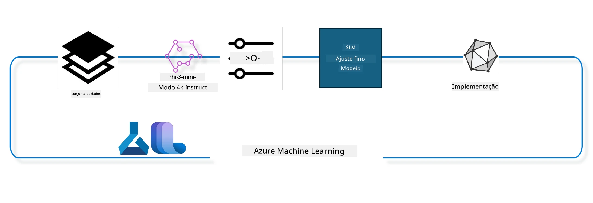

## Como usar componentes de conclusão de chat do registo do sistema Azure ML para ajuste fino de um modelo

Neste exemplo, iremos realizar o ajuste fino do modelo Phi-3-mini-4k-instruct para completar uma conversa entre 2 pessoas usando o conjunto de dados ultrachat_200k.



O exemplo mostrará como realizar o ajuste fino usando o Azure ML SDK e Python e depois implantar o modelo ajustado para um endpoint online para inferência em tempo real.

### Dados de treino

Usaremos o conjunto de dados ultrachat_200k. Esta é uma versão fortemente filtrada do conjunto de dados UltraChat e foi usada para treinar o Zephyr-7B-β, um modelo de chat de última geração com 7b.

### Modelo

Usaremos o modelo Phi-3-mini-4k-instruct para mostrar como o utilizador pode ajustar um modelo para a tarefa de conclusão de chat. Se abriu este notebook a partir de um cartão de modelo específico, lembre-se de substituir o nome do modelo específico.

### Tarefas

- Escolher um modelo para ajustar.
- Escolher e explorar os dados de treino.
- Configurar o trabalho de ajuste fino.
- Executar o trabalho de ajuste fino.
- Rever as métricas de treino e avaliação.
- Registar o modelo ajustado.
- Implantar o modelo ajustado para inferência em tempo real.
- Limpar recursos.

## 1. Configurar pré-requisitos

- Instalar dependências
- Ligar ao Workspace AzureML. Saiba mais em configurar autenticação SDK. Substitua <WORKSPACE_NAME>, <RESOURCE_GROUP> e <SUBSCRIPTION_ID> abaixo.
- Ligar ao registo do sistema azureml
- Definir um nome opcional para o experimento
- Verificar ou criar o compute.

> [!NOTE]
> Os requisitos indicam que um único nó GPU pode ter múltiplas placas GPU. Por exemplo, num nó Standard_NC24rs_v3 existem 4 GPUs NVIDIA V100 enquanto no Standard_NC12s_v3 existem 2 GPUs NVIDIA V100. Consulte a documentação para esta informação. O número de placas GPU por nó é definido no parâmetro gpus_per_node abaixo. Definir este valor corretamente assegurará a utilização de todas as GPUs no nó. As SKUs de compute GPU recomendadas podem ser encontradas aqui e aqui.

### Bibliotecas Python

Instale as dependências executando a célula abaixo. Este passo não é opcional se estiver a correr num ambiente novo.

```bash
pip install azure-ai-ml
pip install azure-identity
pip install datasets==2.9.0
pip install mlflow
pip install azureml-mlflow
```

### Interação com Azure ML

1. Este script Python é usado para interagir com o serviço Azure Machine Learning (Azure ML). Aqui está uma descrição do que faz:

    - Importa módulos necessários dos pacotes azure.ai.ml, azure.identity e azure.ai.ml.entities. Importa também o módulo time.

    - Tenta autenticar usando DefaultAzureCredential(), que oferece uma experiência simplificada para iniciar rapidamente o desenvolvimento de aplicações executadas na cloud Azure. Se falhar, recorre a InteractiveBrowserCredential(), que oferece um prompt de login interativo.

    - Tenta então criar uma instância MLClient usando o método from_config, que lê a configuração do ficheiro config padrão (config.json). Se falhar, cria uma instância MLClient fornecendo manualmente subscription_id, resource_group_name e workspace_name.

    - Cria outra instância MLClient, desta vez para o registo Azure ML chamado "azureml". Este registo é onde modelos, pipelines de ajuste fino e ambientes estão armazenados.

    - Define o experiment_name como "chat_completion_Phi-3-mini-4k-instruct".

    - Gera um timestamp único convertendo o tempo atual (em segundos desde a época, como número de ponto flutuante) para inteiro e depois para string. Este timestamp pode ser usado para criar nomes e versões únicos.

    ```python
    # Importar módulos necessários do Azure ML e Azure Identity
    from azure.ai.ml import MLClient
    from azure.identity import (
        DefaultAzureCredential,
        InteractiveBrowserCredential,
    )
    from azure.ai.ml.entities import AmlCompute
    import time  # Importar módulo time
    
    # Tentar autenticar usando DefaultAzureCredential
    try:
        credential = DefaultAzureCredential()
        credential.get_token("https://management.azure.com/.default")
    except Exception as ex:  # Se DefaultAzureCredential falhar, usar InteractiveBrowserCredential
        credential = InteractiveBrowserCredential()
    
    # Tentar criar uma instância MLClient usando o ficheiro de configuração padrão
    try:
        workspace_ml_client = MLClient.from_config(credential=credential)
    except:  # Se isso falhar, criar uma instância MLClient fornecendo os detalhes manualmente
        workspace_ml_client = MLClient(
            credential,
            subscription_id="<SUBSCRIPTION_ID>",
            resource_group_name="<RESOURCE_GROUP>",
            workspace_name="<WORKSPACE_NAME>",
        )
    
    # Criar outra instância MLClient para o registo Azure ML chamado "azureml"
    # Este registo é onde os modelos, pipelines de fine-tuning, e ambientes são armazenados
    registry_ml_client = MLClient(credential, registry_name="azureml")
    
    # Definir o nome do experimento
    experiment_name = "chat_completion_Phi-3-mini-4k-instruct"
    
    # Gerar um carimbo de data/hora único que pode ser usado para nomes e versões que precisam de ser únicos
    timestamp = str(int(time.time()))
    ```

## 2. Escolher um modelo base para ajuste fino

1. Phi-3-mini-4k-instruct é um modelo leve state-of-the-art com 3.8B de parâmetros, construído sobre datasets usados para o Phi-2. O modelo pertence à família Phi-3, e a versão Mini vem em duas variantes 4K e 128K que é o comprimento do contexto (em tokens) que pode suportar. Precisamos de afinar o modelo para o nosso propósito específico para o usar. Pode explorar estes modelos no Catálogo de Modelos no AzureML Studio, filtrando pela tarefa de conclusão de chat. Neste exemplo, usamos o modelo Phi-3-mini-4k-instruct. Se abriu este notebook para um modelo diferente, substitua o nome e versão do modelo em conformidade.

> [!NOTE]
> a propriedade model id do modelo. Isto será passado como input para o trabalho de ajuste fino. Também está disponível como o campo Asset ID na página de detalhes do modelo no Catálogo de Modelos do AzureML Studio.

2. Este script Python interage com o serviço Azure Machine Learning (Azure ML). Aqui está uma descrição do que faz:

    - Define o model_name como "Phi-3-mini-4k-instruct".

    - Usa o método get da propriedade models do objeto registry_ml_client para obter a versão mais recente do modelo com o nome especificado no registo Azure ML. O método get é chamado com dois argumentos: o nome do modelo e uma etiqueta que especifica para obter a última versão do modelo.

    - Imprime uma mensagem na consola indicando o nome, versão e id do modelo que será usado para ajuste fino. O método format da string é usado para inserir o nome, versão e id do modelo na mensagem. O nome, versão e id do modelo são acedidos como propriedades do objeto foundation_model.

    ```python
    # Definir o nome do modelo
    model_name = "Phi-3-mini-4k-instruct"
    
    # Obter a versão mais recente do modelo do registo Azure ML
    foundation_model = registry_ml_client.models.get(model_name, label="latest")
    
    # Imprimir o nome do modelo, versão e id
    # Esta informação é útil para monitorização e depuração
    print(
        "\n\nUsing model name: {0}, version: {1}, id: {2} for fine tuning".format(
            foundation_model.name, foundation_model.version, foundation_model.id
        )
    )
    ```

## 3. Criar um compute a ser usado no trabalho

O trabalho de ajuste fino funciona APENAS com computação GPU. O tamanho do compute depende do tamanho do modelo e, na maioria dos casos, torna-se complexo identificar o compute certo para o trabalho. Nesta célula, orientamos o utilizador para selecionar o compute adequado.

> [!NOTE]
> Os computes listados abaixo funcionam com a configuração mais otimizada. Qualquer alteração na configuração pode levar a erro Cuda Out Of Memory. Nesses casos, tente atualizar o compute para um tamanho maior.

> [!NOTE]
> Ao selecionar o compute_cluster_size abaixo, certifique-se que o compute está disponível no seu grupo de recursos. Se um compute em particular não estiver disponível, pode solicitar acesso aos recursos compute.

### Verificação do Modelo para Suporte de Ajuste Fino

1. Este script Python interage com um modelo do Azure Machine Learning (Azure ML). Aqui está uma descrição do que faz:

    - Importa o módulo ast, que fornece funções para processar árvores da gramática abstracta Python.

    - Verifica se o objeto foundation_model (que representa um modelo no Azure ML) tem uma tag chamada finetune_compute_allow_list. Tags no Azure ML são pares chave-valor que pode criar e usar para filtrar e ordenar modelos.

    - Se a tag finetune_compute_allow_list estiver presente, usa a função ast.literal_eval para interpretar seguramente o valor da tag (uma string) numa lista Python. Esta lista é então atribuída à variável computes_allow_list. Imprime uma mensagem indicando que um compute deve ser criado a partir da lista.

    - Se a tag finetune_compute_allow_list não estiver presente, define computes_allow_list para None e imprime uma mensagem indicando que a tag não faz parte das tags do modelo.

    - Em resumo, este script verifica uma tag específica nos metadados do modelo, converte o valor da tag numa lista se existir, e fornece feedback ao utilizador em conformidade.

    ```python
    # Importar o módulo ast, que fornece funções para processar árvores da gramática abstracta de sintaxe do Python
    import ast
    
    # Verificar se a etiqueta 'finetune_compute_allow_list' está presente nas etiquetas do modelo
    if "finetune_compute_allow_list" in foundation_model.tags:
        # Se a etiqueta estiver presente, usar ast.literal_eval para analisar com segurança o valor da etiqueta (uma string) numa lista Python
        computes_allow_list = ast.literal_eval(
            foundation_model.tags["finetune_compute_allow_list"]
        )  # converter string em lista Python
        # Imprimir uma mensagem indicando que um compute deve ser criado a partir da lista
        print(f"Please create a compute from the above list - {computes_allow_list}")
    else:
        # Se a etiqueta não estiver presente, definir computes_allow_list como None
        computes_allow_list = None
        # Imprimir uma mensagem indicando que a etiqueta 'finetune_compute_allow_list' não faz parte das etiquetas do modelo
        print("`finetune_compute_allow_list` is not part of model tags")
    ```

### Verificação da Instância Compute

1. Este script Python interage com o serviço Azure Machine Learning (Azure ML) e realiza várias verificações numa instância compute. Aqui está uma descrição do que faz:

    - Tenta obter a instância compute com o nome guardado em compute_cluster do workspace Azure ML. Se o estado de provisionamento da instância compute for "failed", levanta um ValueError.

    - Verifica se computes_allow_list não é None. Se não for, converte todos os tamanhos de compute da lista para minúsculas e verifica se o tamanho da instância compute atual está na lista. Se não estiver, levanta um ValueError.

    - Se computes_allow_list for None, verifica se o tamanho da instância compute está numa lista de tamanhos de VMs GPU não suportados. Se estiver, levanta um ValueError.

    - Obtém uma lista de todos os tamanhos de compute disponíveis no workspace. Depois, itera sobre esta lista, e para cada tamanho compute verifica se o nome corresponde ao tamanho da instância compute atual. Se corresponder, obtém o número de GPUs para esse tamanho compute e define gpu_count_found como True.

    - Se gpu_count_found for True, imprime o número de GPUs na instância compute. Se for False, levanta um ValueError.

    - Em resumo, este script realiza várias verificações numa instância compute num workspace Azure ML, incluindo verificar o estado de provisionamento, o tamanho em relação a uma lista de permissão ou negação, e o número de GPUs que tem.

    ```python
    # Imprimir a mensagem da exceção
    print(e)
    # Levantar um ValueError se o tamanho de computação não estiver disponível no workspace
    raise ValueError(
        f"WARNING! Compute size {compute_cluster_size} not available in workspace"
    )
    
    # Recuperar a instância de computação do workspace Azure ML
    compute = workspace_ml_client.compute.get(compute_cluster)
    # Verificar se o estado de provisionamento da instância de computação é "failed"
    if compute.provisioning_state.lower() == "failed":
        # Levantar um ValueError se o estado de provisionamento for "failed"
        raise ValueError(
            f"Provisioning failed, Compute '{compute_cluster}' is in failed state. "
            f"please try creating a different compute"
        )
    
    # Verificar se computes_allow_list não é None
    if computes_allow_list is not None:
        # Converter todos os tamanhos de computação em computes_allow_list para minúsculas
        computes_allow_list_lower_case = [x.lower() for x in computes_allow_list]
        # Verificar se o tamanho da instância de computação está em computes_allow_list_lower_case
        if compute.size.lower() not in computes_allow_list_lower_case:
            # Levantar um ValueError se o tamanho da instância de computação não estiver em computes_allow_list_lower_case
            raise ValueError(
                f"VM size {compute.size} is not in the allow-listed computes for finetuning"
            )
    else:
        # Definir uma lista de tamanhos de VM GPU não suportados
        unsupported_gpu_vm_list = [
            "standard_nc6",
            "standard_nc12",
            "standard_nc24",
            "standard_nc24r",
        ]
        # Verificar se o tamanho da instância de computação está em unsupported_gpu_vm_list
        if compute.size.lower() in unsupported_gpu_vm_list:
            # Levantar um ValueError se o tamanho da instância de computação estiver em unsupported_gpu_vm_list
            raise ValueError(
                f"VM size {compute.size} is currently not supported for finetuning"
            )
    
    # Inicializar uma flag para verificar se o número de GPUs na instância de computação foi encontrado
    gpu_count_found = False
    # Recuperar uma lista de todos os tamanhos de computação disponíveis no workspace
    workspace_compute_sku_list = workspace_ml_client.compute.list_sizes()
    available_sku_sizes = []
    # Iterar sobre a lista de tamanhos de computação disponíveis
    for compute_sku in workspace_compute_sku_list:
        available_sku_sizes.append(compute_sku.name)
        # Verificar se o nome do tamanho de computação corresponde ao tamanho da instância de computação
        if compute_sku.name.lower() == compute.size.lower():
            # Se corresponder, recuperar o número de GPUs para esse tamanho de computação e definir gpu_count_found como True
            gpus_per_node = compute_sku.gpus
            gpu_count_found = True
    # Se gpu_count_found for True, imprimir o número de GPUs na instância de computação
    if gpu_count_found:
        print(f"Number of GPU's in compute {compute.size}: {gpus_per_node}")
    else:
        # Se gpu_count_found for False, levantar um ValueError
        raise ValueError(
            f"Number of GPU's in compute {compute.size} not found. Available skus are: {available_sku_sizes}."
            f"This should not happen. Please check the selected compute cluster: {compute_cluster} and try again."
        )
    ```

## 4. Escolher o conjunto de dados para ajuste fino do modelo

1. Usamos o conjunto de dados ultrachat_200k. O conjunto de dados tem quatro divisões, adequadas para ajuste fino supervisionado (sft).
Classificação por geração (gen). O número de exemplos por divisão é apresentado a seguir:

    ```bash
    train_sft test_sft  train_gen  test_gen
    207865  23110  256032  28304
    ```

1. As próximas células mostram a preparação básica dos dados para ajuste fino:

### Visualizar algumas linhas de dados

Queremos que esta amostra corra rapidamente, por isso guardamos os ficheiros train_sft, test_sft contendo 5% das linhas já cortadas. Isto significa que o modelo ajustado terá menor precisão, logo não deverá ser usado em ambiente real.
O download-dataset.py é usado para descarregar o conjunto de dados ultrachat_200k e transformar o dataset num formato consumível pelo componente pipeline de ajuste fino. Como o dataset é grande, aqui temos apenas parte do dataset.

1. Executar o script abaixo descarrega apenas 5% dos dados. Isto pode ser aumentado alterando o parâmetro dataset_split_pc para a percentagem desejada.

> [!NOTE]
> Alguns modelos de linguagem têm códigos de linguagem diferentes e, portanto, os nomes das colunas no dataset devem refletir isso.

1. Aqui está um exemplo de como os dados devem parecer
O conjunto de dados de conclusão de chat está armazenado em formato parquet com cada registo usando o seguinte esquema:

    - Este é um documento JSON (JavaScript Object Notation), que é um formato popular para troca de dados. Não é código executável, mas uma forma de armazenar e transportar dados. Aqui está uma descrição da sua estrutura:

    - "prompt": Esta chave contém um valor string que representa uma tarefa ou pergunta colocada a um assistente IA.

    - "messages": Esta chave contém um array de objetos. Cada objeto representa uma mensagem numa conversa entre um utilizador e um assistente IA. Cada objeto mensagem tem duas chaves:

    - "content": Esta chave contém um valor string que representa o conteúdo da mensagem.
    - "role": Esta chave contém um valor string que representa o papel da entidade que enviou a mensagem. Pode ser "user" ou "assistant".
    - "prompt_id": Esta chave contém um valor string que representa um identificador único para o prompt.

1. Neste documento JSON específico, é representada uma conversa onde um utilizador pede a um assistente IA para criar um protagonista para uma história distópica. O assistente responde, e o utilizador pede depois mais detalhes. O assistente concorda em fornecer mais detalhes. Toda a conversa está associada a um id de prompt específico.

    ```python
    {
        // The task or question posed to an AI assistant
        "prompt": "Create a fully-developed protagonist who is challenged to survive within a dystopian society under the rule of a tyrant. ...",
        
        // An array of objects, each representing a message in a conversation between a user and an AI assistant
        "messages":[
            {
                // The content of the user's message
                "content": "Create a fully-developed protagonist who is challenged to survive within a dystopian society under the rule of a tyrant. ...",
                // The role of the entity that sent the message
                "role": "user"
            },
            {
                // The content of the assistant's message
                "content": "Name: Ava\n\n Ava was just 16 years old when the world as she knew it came crashing down. The government had collapsed, leaving behind a chaotic and lawless society. ...",
                // The role of the entity that sent the message
                "role": "assistant"
            },
            {
                // The content of the user's message
                "content": "Wow, Ava's story is so intense and inspiring! Can you provide me with more details.  ...",
                // The role of the entity that sent the message
                "role": "user"
            }, 
            {
                // The content of the assistant's message
                "content": "Certainly! ....",
                // The role of the entity that sent the message
                "role": "assistant"
            }
        ],
        
        // A unique identifier for the prompt
        "prompt_id": "d938b65dfe31f05f80eb8572964c6673eddbd68eff3db6bd234d7f1e3b86c2af"
    }
    ```

### Descarregar Dados

1. Este script Python é usado para descarregar um conjunto de dados usando um script auxiliar chamado download-dataset.py. Aqui está uma descrição do que faz:

    - Importa o módulo os, que fornece uma forma portátil de usar funcionalidades dependentes do sistema operativo.

    - Usa a função os.system para correr o script download-dataset.py no shell com argumentos específicos na linha de comando. Os argumentos especificam o dataset a descarregar (HuggingFaceH4/ultrachat_200k), o diretório de destino (ultrachat_200k_dataset), e a percentagem do dataset para dividir (5). A função os.system devolve o estado de saída do comando executado; este estado é armazenado na variável exit_status.

    - Verifica se exit_status não é 0. Em sistemas operativos tipo Unix, um estado de saída 0 indica sucesso, qualquer outro valor indica erro. Se exit_status não for 0, levanta uma Exceção com uma mensagem indicando que houve erro ao descarregar o dataset.

    - Em resumo, este script executa um comando para descarregar um dataset usando um script auxiliar, e levanta exceção se o comando falhar.
    
    ```python
    # Importar o módulo os, que fornece uma forma de usar funcionalidades dependentes do sistema operativo
    import os
    
    # Usar a função os.system para executar o script download-dataset.py na shell com argumentos específicos na linha de comando
    # Os argumentos especificam o conjunto de dados a descarregar (HuggingFaceH4/ultrachat_200k), o diretório para onde descarregar (ultrachat_200k_dataset), e a percentagem do conjunto de dados para dividir (5)
    # A função os.system retorna o estado de saída do comando que executou; este estado é armazenado na variável exit_status
    exit_status = os.system(
        "python ./download-dataset.py --dataset HuggingFaceH4/ultrachat_200k --download_dir ultrachat_200k_dataset --dataset_split_pc 5"
    )
    
    # Verificar se exit_status não é 0
    # Nos sistemas operativos do tipo Unix, um estado de saída 0 normalmente indica que um comando teve sucesso, enquanto qualquer outro número indica um erro
    # Se exit_status não for 0, levantar uma Exceção com uma mensagem indicando que houve um erro ao descarregar o conjunto de dados
    if exit_status != 0:
        raise Exception("Error downloading dataset")
    ```

### Carregar os Dados num DataFrame
1. Este script Python está a carregar um ficheiro JSON Lines num DataFrame do pandas e a mostrar as primeiras 5 linhas. Aqui está uma explicação do que faz:

    - Importa a biblioteca pandas, que é uma biblioteca poderosa para manipulação e análise de dados.

    - Define a largura máxima das colunas nas opções de visualização do pandas para 0. Isto significa que o texto completo de cada coluna será mostrado sem truncamento quando o DataFrame for impresso.

    - Usa a função pd.read_json para carregar o ficheiro train_sft.jsonl da pasta ultrachat_200k_dataset para um DataFrame. O argumento lines=True indica que o ficheiro está no formato JSON Lines, onde cada linha é um objeto JSON separado.

    - Usa o método head para mostrar as primeiras 5 linhas do DataFrame. Se o DataFrame tiver menos que 5 linhas, mostra todas essas linhas.

    - Em resumo, este script está a carregar um ficheiro JSON Lines num DataFrame e a mostrar as primeiras 5 linhas com o texto completo das colunas.
    
    ```python
    # Importe a biblioteca pandas, que é uma biblioteca poderosa para manipulação e análise de dados
    import pandas as pd
    
    # Defina a largura máxima da coluna nas opções de visualização do pandas para 0
    # Isto significa que o texto completo de cada coluna será exibido sem truncamento quando o DataFrame for impresso
    pd.set_option("display.max_colwidth", 0)
    
    # Use a função pd.read_json para carregar o ficheiro train_sft.jsonl do diretório ultrachat_200k_dataset para um DataFrame
    # O argumento lines=True indica que o ficheiro está no formato JSON Lines, onde cada linha é um objeto JSON separado
    df = pd.read_json("./ultrachat_200k_dataset/train_sft.jsonl", lines=True)
    
    # Use o método head para exibir as primeiras 5 linhas do DataFrame
    # Se o DataFrame tiver menos de 5 linhas, irá exibir todas elas
    df.head()
    ```

## 5. Submeter o trabalho de fine tuning usando o modelo e dados como entradas

Crie o trabalho que usa o componente do pipeline de chat-completion. Saiba mais sobre todos os parâmetros suportados para fine tuning.

### Definir parâmetros de fine tuning

1. Os parâmetros de fine tuning podem ser agrupados em 2 categorias – parâmetros de treino, parâmetros de otimização

1. Os parâmetros de treino definem os aspetos do treino, tais como -

    - O otimizador, scheduler a usar
    - A métrica a otimizar no fine tuning
    - Número de passos de treino e o tamanho do batch, entre outros
    - Os parâmetros de otimização ajudam a otimizar a memória da GPU e a usar eficazmente os recursos computacionais.

1. Abaixo estão alguns dos parâmetros que pertencem a esta categoria. Os parâmetros de otimização diferem para cada modelo e são fornecidos com o modelo para tratar estas variações.

    - Ativar o deepspeed e LoRA
    - Ativar treino com precisão mista
    - Ativar treino multi-nó

> [!NOTE]
> O fine tuning supervisionado pode resultar em perda de alinhamento ou esquecimento catastrófico. Recomendamos verificar este problema e executar uma fase de alinhamento após o fine tuning.

### Parâmetros de Fine Tuning

1. Este script Python está a definir parâmetros para fine tuning de um modelo de machine learning. Aqui está uma explicação do que faz:

    - Define parâmetros padrão de treino, como número de épocas, tamanhos de batch para treino e avaliação, taxa de aprendizagem e tipo de scheduler para a taxa de aprendizagem.

    - Define parâmetros padrão de otimização, como se deve aplicar Layer-wise Relevance Propagation (LoRa) e DeepSpeed, e a fase do DeepSpeed.

    - Combina os parâmetros de treino e otimização num único dicionário chamado finetune_parameters.

    - Verifica se o foundation_model tem parâmetros padrão específicos do modelo. Se tiver, imprime uma mensagem de aviso e atualiza o dicionário finetune_parameters com esses parâmetros específicos do modelo. A função ast.literal_eval é usada para converter os parâmetros específicos do modelo de uma string para um dicionário Python.

    - Imprime o conjunto final de parâmetros de fine tuning que serão usados na execução.

    - Em resumo, este script está a definir e mostrar os parâmetros para fine tuning de um modelo de machine learning, com a possibilidade de substituir os parâmetros padrão pelos específicos do modelo.

    ```python
    # Definir parâmetros padrão de treino, como o número de épocas de treino, tamanhos dos lotes para treino e avaliação, taxa de aprendizagem e tipo de agendador da taxa de aprendizagem
    training_parameters = dict(
        num_train_epochs=3,
        per_device_train_batch_size=1,
        per_device_eval_batch_size=1,
        learning_rate=5e-6,
        lr_scheduler_type="cosine",
    )
    
    # Definir parâmetros padrão de otimização, como se aplica Propagação de Relevância por Camada (LoRa) e DeepSpeed, e a fase do DeepSpeed
    optimization_parameters = dict(
        apply_lora="true",
        apply_deepspeed="true",
        deepspeed_stage=2,
    )
    
    # Combinar os parâmetros de treino e otimização num único dicionário chamado finetune_parameters
    finetune_parameters = {**training_parameters, **optimization_parameters}
    
    # Verificar se o foundation_model tem parâmetros padrão específicos do modelo
    # Se tiver, imprimir uma mensagem de aviso e atualizar o dicionário finetune_parameters com esses padrões específicos do modelo
    # A função ast.literal_eval é usada para converter os padrões específicos do modelo de uma string para um dicionário Python
    if "model_specific_defaults" in foundation_model.tags:
        print("Warning! Model specific defaults exist. The defaults could be overridden.")
        finetune_parameters.update(
            ast.literal_eval(  # converter string para dicionário Python
                foundation_model.tags["model_specific_defaults"]
            )
        )
    
    # Imprimir o conjunto final de parâmetros de ajuste fino que serão usados na execução
    print(
        f"The following finetune parameters are going to be set for the run: {finetune_parameters}"
    )
    ```

### Pipeline de Treino

1. Este script Python está a definir uma função para gerar um nome de apresentação para um pipeline de treino de machine learning, e depois chama essa função para gerar e imprimir o nome de apresentação. Aqui está uma explicação do que faz:

1. A função get_pipeline_display_name é definida. Esta função gera um nome de apresentação com base em vários parâmetros relacionados com o pipeline de treino.

1. No interior da função, calcula o tamanho total do batch multiplicando o tamanho do batch por dispositivo, o número de passos de acumulação de gradiente, o número de GPUs por nó, e o número de nós usados para fine tuning.

1. Obtém vários outros parâmetros, tais como o tipo de scheduler da taxa de aprendizagem, se o DeepSpeed está aplicado, a fase do DeepSpeed, se o Layer-wise Relevance Propagation (LoRa) está aplicado, o limite do número de checkpoints do modelo a manter, e o comprimento máximo da sequência.

1. Constrói uma string que inclui todos estes parâmetros, separados por hífen. Se DeepSpeed ou LoRa estiverem aplicados, a string inclui "ds" seguido da fase do DeepSpeed, ou "lora", respetivamente. Caso contrário, inclui "nods" ou "nolora", respetivamente.

1. A função retorna esta string, que serve como nome de apresentação para o pipeline de treino.

1. Depois de definir a função, esta é chamada para gerar o nome de apresentação, que é então impresso.

1. Em resumo, este script está a gerar um nome de apresentação para um pipeline de treino de machine learning com base em vários parâmetros, e depois a imprimir esse nome.

    ```python
    # Definir uma função para gerar um nome de exibição para o pipeline de treino
    def get_pipeline_display_name():
        # Calcular o tamanho total do lote multiplicando o tamanho do lote por dispositivo, o número de passos de acumulação de gradiente, o número de GPUs por nó e o número de nós usados para o fine-tuning
        batch_size = (
            int(finetune_parameters.get("per_device_train_batch_size", 1))
            * int(finetune_parameters.get("gradient_accumulation_steps", 1))
            * int(gpus_per_node)
            * int(finetune_parameters.get("num_nodes_finetune", 1))
        )
        # Obter o tipo de agendador de taxa de aprendizagem
        scheduler = finetune_parameters.get("lr_scheduler_type", "linear")
        # Obter se o DeepSpeed está aplicado
        deepspeed = finetune_parameters.get("apply_deepspeed", "false")
        # Obter o estágio do DeepSpeed
        ds_stage = finetune_parameters.get("deepspeed_stage", "2")
        # Se o DeepSpeed estiver aplicado, incluir "ds" seguido do estágio do DeepSpeed no nome de exibição; se não, incluir "nods"
        if deepspeed == "true":
            ds_string = f"ds{ds_stage}"
        else:
            ds_string = "nods"
        # Obter se a Propagação de Relevância em Camadas (LoRa) está aplicada
        lora = finetune_parameters.get("apply_lora", "false")
        # Se o LoRa estiver aplicado, incluir "lora" no nome de exibição; se não, incluir "nolora"
        if lora == "true":
            lora_string = "lora"
        else:
            lora_string = "nolora"
        # Obter o limite no número de pontos de controlo do modelo a manter
        save_limit = finetune_parameters.get("save_total_limit", -1)
        # Obter o comprimento máximo da sequência
        seq_len = finetune_parameters.get("max_seq_length", -1)
        # Construir o nome de exibição concatenando todos estes parâmetros, separados por hífens
        return (
            model_name
            + "-"
            + "ultrachat"
            + "-"
            + f"bs{batch_size}"
            + "-"
            + f"{scheduler}"
            + "-"
            + ds_string
            + "-"
            + lora_string
            + f"-save_limit{save_limit}"
            + f"-seqlen{seq_len}"
        )
    
    # Chamar a função para gerar o nome de exibição
    pipeline_display_name = get_pipeline_display_name()
    # Imprimir o nome de exibição
    print(f"Display name used for the run: {pipeline_display_name}")
    ```

### Configurar Pipeline

Este script Python está a definir e configurar um pipeline de machine learning usando o Azure Machine Learning SDK. Aqui está uma explicação do que faz:

1. Importa os módulos necessários do Azure AI ML SDK.

1. Busca um componente de pipeline chamado "chat_completion_pipeline" do registo.

1. Define um trabalho de pipeline usando o decorador `@pipeline` e a função `create_pipeline`. O nome do pipeline é definido como `pipeline_display_name`.

1. Dentro da função `create_pipeline`, inicializa o componente do pipeline obtido com vários parâmetros, incluindo o caminho para o modelo, clusters computacionais para diferentes fases, divisões do dataset para treino e teste, o número de GPUs a usar para fine tuning, e outros parâmetros de fine tuning.

1. Mapeia a saída do trabalho de fine tuning para a saída do trabalho de pipeline. Isto é feito para que o modelo fine tuned possa ser facilmente registado, o que é necessário para implantar o modelo num endpoint online ou batch.

1. Cria uma instância do pipeline chamando a função `create_pipeline`.

1. Define a configuração `force_rerun` do pipeline para `True`, significando que os resultados em cache de trabalhos anteriores não serão utilizados.

1. Define a configuração `continue_on_step_failure` do pipeline para `False`, significando que o pipeline irá parar se algum passo falhar.

1. Em resumo, este script está a definir e configurar um pipeline de machine learning para uma tarefa de chat completion usando o Azure Machine Learning SDK.

    ```python
    # Importe os módulos necessários do SDK Azure AI ML
    from azure.ai.ml.dsl import pipeline
    from azure.ai.ml import Input
    
    # Obtenha o componente do pipeline denominado "chat_completion_pipeline" do registo
    pipeline_component_func = registry_ml_client.components.get(
        name="chat_completion_pipeline", label="latest"
    )
    
    # Defina o trabalho do pipeline usando o decorador @pipeline e a função create_pipeline
    # O nome do pipeline é definido para pipeline_display_name
    @pipeline(name=pipeline_display_name)
    def create_pipeline():
        # Inicialize o componente do pipeline obtido com vários parâmetros
        # Estes incluem o caminho do modelo, clusters de computação para diferentes fases, divisões do conjunto de dados para treino e teste, o número de GPUs a utilizar para o fine-tuning e outros parâmetros de fine-tuning
        chat_completion_pipeline = pipeline_component_func(
            mlflow_model_path=foundation_model.id,
            compute_model_import=compute_cluster,
            compute_preprocess=compute_cluster,
            compute_finetune=compute_cluster,
            compute_model_evaluation=compute_cluster,
            # Mapear as divisões do conjunto de dados para parâmetros
            train_file_path=Input(
                type="uri_file", path="./ultrachat_200k_dataset/train_sft.jsonl"
            ),
            test_file_path=Input(
                type="uri_file", path="./ultrachat_200k_dataset/test_sft.jsonl"
            ),
            # Configurações de treino
            number_of_gpu_to_use_finetuning=gpus_per_node,  # Definido para o número de GPUs disponíveis no computo
            **finetune_parameters
        )
        return {
            # Mapeie a saída do trabalho de fine-tuning para a saída do trabalho do pipeline
            # Isto é feito para que possamos registar facilmente o modelo ajustado
            # O registo do modelo é necessário para implantar o modelo num endpoint online ou batch
            "trained_model": chat_completion_pipeline.outputs.mlflow_model_folder
        }
    
    # Crie uma instância do pipeline chamando a função create_pipeline
    pipeline_object = create_pipeline()
    
    # Não utilize resultados em cache de trabalhos anteriores
    pipeline_object.settings.force_rerun = True
    
    # Definir a continuação em caso de falha da etapa como False
    # Isto significa que o pipeline irá parar se alguma etapa falhar
    pipeline_object.settings.continue_on_step_failure = False
    ```

### Submeter o Trabalho

1. Este script Python está a submeter um trabalho de pipeline de machine learning para um workspace do Azure Machine Learning e depois a esperar que o trabalho termine. Aqui está uma explicação do que faz:

    - Chama o método create_or_update do objeto jobs no workspace_ml_client para submeter o trabalho de pipeline. O pipeline a executar é especificado por pipeline_object, e o experimento sob o qual o trabalho é executado é especificado por experiment_name.

    - Depois, chama o método stream do objeto jobs no workspace_ml_client para esperar que o trabalho de pipeline termine. O trabalho a aguardar é especificado pelo atributo name do objeto pipeline_job.

    - Em resumo, este script está a submeter um trabalho de pipeline de machine learning para um workspace do Azure Machine Learning, e depois a esperar que o trabalho termine.

    ```python
    # Enviar o trabalho de pipeline para o ambiente de trabalho Azure Machine Learning
    # O pipeline a ser executado é especificado por pipeline_object
    # O experimento sob o qual o trabalho é executado é especificado por experiment_name
    pipeline_job = workspace_ml_client.jobs.create_or_update(
        pipeline_object, experiment_name=experiment_name
    )
    
    # Aguardar que o trabalho do pipeline seja concluído
    # O trabalho a aguardar é especificado pelo atributo nome do objeto pipeline_job
    workspace_ml_client.jobs.stream(pipeline_job.name)
    ```

## 6. Registar o modelo fine tuned no workspace

Vamos registar o modelo a partir da saída do trabalho de fine tuning. Isto irá acompanhar a linhagem entre o modelo fine tuned e o trabalho de fine tuning. O trabalho de fine tuning, por sua vez, acompanha a linhagem do modelo base, dados e código de treino.

### Registo do Modelo ML

1. Este script Python está a registar um modelo de machine learning que foi treinado num pipeline do Azure Machine Learning. Aqui está uma explicação do que faz:

    - Importa os módulos necessários do Azure AI ML SDK.

    - Verifica se a saída trained_model está disponível no trabalho do pipeline, chamando o método get do objeto jobs no workspace_ml_client e acedendo ao seu atributo outputs.

    - Constrói um caminho para o modelo treinado formatando uma string com o nome do trabalho do pipeline e o nome da saída ("trained_model").

    - Define um nome para o modelo fine tuned adicionando "-ultrachat-200k" ao nome original do modelo e substituindo quaisquer barras por hífens.

    - Prepara-se para registar o modelo criando um objeto Model com vários parâmetros, incluindo o caminho para o modelo, o tipo do modelo (modelo MLflow), o nome e versão do modelo, e uma descrição do modelo.

    - Regista o modelo chamando o método create_or_update do objeto models no workspace_ml_client com o objeto Model como argumento.

    - Imprime o modelo registado.

1. Em resumo, este script está a registar um modelo de machine learning que foi treinado num pipeline do Azure Machine Learning.
    
    ```python
    # Importar os módulos necessários do SDK Azure AI ML
    from azure.ai.ml.entities import Model
    from azure.ai.ml.constants import AssetTypes
    
    # Verificar se a saída `trained_model` está disponível a partir do trabalho da pipeline
    print("pipeline job outputs: ", workspace_ml_client.jobs.get(pipeline_job.name).outputs)
    
    # Construir um caminho para o modelo treinado formatando uma string com o nome do trabalho da pipeline e o nome da saída ("trained_model")
    model_path_from_job = "azureml://jobs/{0}/outputs/{1}".format(
        pipeline_job.name, "trained_model"
    )
    
    # Definir um nome para o modelo ajustado adicionando "-ultrachat-200k" ao nome original do modelo e substituindo quaisquer barras por hífens
    finetuned_model_name = model_name + "-ultrachat-200k"
    finetuned_model_name = finetuned_model_name.replace("/", "-")
    
    print("path to register model: ", model_path_from_job)
    
    # Preparar o registo do modelo criando um objeto Model com vários parâmetros
    # Estes incluem o caminho para o modelo, o tipo do modelo (modelo MLflow), o nome e a versão do modelo, e uma descrição do modelo
    prepare_to_register_model = Model(
        path=model_path_from_job,
        type=AssetTypes.MLFLOW_MODEL,
        name=finetuned_model_name,
        version=timestamp,  # Usar timestamp como versão para evitar conflito de versões
        description=model_name + " fine tuned model for ultrachat 200k chat-completion",
    )
    
    print("prepare to register model: \n", prepare_to_register_model)
    
    # Registar o modelo chamando o método create_or_update do objeto models no workspace_ml_client com o objeto Model como argumento
    registered_model = workspace_ml_client.models.create_or_update(
        prepare_to_register_model
    )
    
    # Imprimir o modelo registado
    print("registered model: \n", registered_model)
    ```

## 7. Implantar o modelo fine tuned num endpoint online

Endpoints online fornecem uma API REST durável que pode ser usada para integrar com aplicações que precisam usar o modelo.

### Gerir Endpoint

1. Este script Python está a criar um endpoint online gerido no Azure Machine Learning para um modelo registado. Aqui está uma explicação do que faz:

    - Importa os módulos necessários do Azure AI ML SDK.

    - Define um nome único para o endpoint online, adicionando um timestamp à string "ultrachat-completion-".

    - Prepara-se para criar o endpoint online criando um objeto ManagedOnlineEndpoint com vários parâmetros, incluindo o nome do endpoint, uma descrição do endpoint, e o modo de autenticação ("key").

    - Cria o endpoint online chamando o método begin_create_or_update do workspace_ml_client com o objeto ManagedOnlineEndpoint como argumento. Depois espera que a operação de criação termine chamando o método wait.

1. Em resumo, este script está a criar um endpoint online gerido no Azure Machine Learning para um modelo registado.

    ```python
    # Importar módulos necessários do SDK Azure AI ML
    from azure.ai.ml.entities import (
        ManagedOnlineEndpoint,
        ManagedOnlineDeployment,
        ProbeSettings,
        OnlineRequestSettings,
    )
    
    # Definir um nome único para o endpoint online adicionando um timestamp à string "ultrachat-completion-"
    online_endpoint_name = "ultrachat-completion-" + timestamp
    
    # Preparar a criação do endpoint online criando um objeto ManagedOnlineEndpoint com vários parâmetros
    # Estes incluem o nome do endpoint, uma descrição do endpoint e o modo de autenticação ("key")
    endpoint = ManagedOnlineEndpoint(
        name=online_endpoint_name,
        description="Online endpoint for "
        + registered_model.name
        + ", fine tuned model for ultrachat-200k-chat-completion",
        auth_mode="key",
    )
    
    # Criar o endpoint online chamando o método begin_create_or_update do workspace_ml_client com o objeto ManagedOnlineEndpoint como argumento
    # Depois, aguardar que a operação de criação seja concluída chamando o método wait
    workspace_ml_client.begin_create_or_update(endpoint).wait()
    ```

> [!NOTE]
> Pode encontrar aqui a lista de SKU's suportados para implantacão - [Managed online endpoints SKU list](https://learn.microsoft.com/azure/machine-learning/reference-managed-online-endpoints-vm-sku-list)

### Implantar Modelo ML

1. Este script Python está a implantar um modelo de machine learning registado num endpoint online gerido no Azure Machine Learning. Aqui está uma explicação do que faz:

    - Importa o módulo ast, que fornece funções para processar árvores da gramática abstrata do Python.

    - Configura o tipo de instância para a implantação para "Standard_NC6s_v3".

    - Verifica se a tag inference_compute_allow_list está presente no modelo base. Se estiver, converte o valor da tag de uma string para uma lista Python e atribui a inference_computes_allow_list. Caso contrário, define inference_computes_allow_list como None.

    - Verifica se o tipo de instância especificado está na lista permitida. Se não estiver, imprime uma mensagem pedindo ao utilizador para selecionar um tipo de instância da lista permitida.

    - Prepara-se para criar a implantação criando um objeto ManagedOnlineDeployment com vários parâmetros, incluindo o nome da implantação, o nome do endpoint, o ID do modelo, o tipo e número de instâncias, as configurações de sondagem de vivacidade, e as configurações de requisição.

    - Cria a implantação chamando o método begin_create_or_update do workspace_ml_client com o objeto ManagedOnlineDeployment como argumento. Depois espera que a operação de criação termine chamando o método wait.

    - Define o tráfego do endpoint para direcionar 100% do tráfego para a implantação "demo".

    - Atualiza o endpoint chamando o método begin_create_or_update do workspace_ml_client com o objeto endpoint como argumento. Depois espera que a operação de atualização termine chamando o método result.

1. Em resumo, este script está a implantar um modelo de machine learning registado num endpoint online gerido no Azure Machine Learning.

    ```python
    # Importe o módulo ast, que fornece funções para processar árvores da gramática abstrata do Python
    import ast
    
    # Defina o tipo de instância para o deployment
    instance_type = "Standard_NC6s_v3"
    
    # Verifique se a tag `inference_compute_allow_list` está presente no modelo base
    if "inference_compute_allow_list" in foundation_model.tags:
        # Se estiver, converta o valor da tag de uma string para uma lista Python e atribua a `inference_computes_allow_list`
        inference_computes_allow_list = ast.literal_eval(
            foundation_model.tags["inference_compute_allow_list"]
        )
        print(f"Please create a compute from the above list - {computes_allow_list}")
    else:
        # Se não estiver, defina `inference_computes_allow_list` como `None`
        inference_computes_allow_list = None
        print("`inference_compute_allow_list` is not part of model tags")
    
    # Verifique se o tipo de instância especificado está na lista de permissões
    if (
        inference_computes_allow_list is not None
        and instance_type not in inference_computes_allow_list
    ):
        print(
            f"`instance_type` is not in the allow listed compute. Please select a value from {inference_computes_allow_list}"
        )
    
    # Prepare-se para criar o deployment criando um objeto `ManagedOnlineDeployment` com vários parâmetros
    demo_deployment = ManagedOnlineDeployment(
        name="demo",
        endpoint_name=online_endpoint_name,
        model=registered_model.id,
        instance_type=instance_type,
        instance_count=1,
        liveness_probe=ProbeSettings(initial_delay=600),
        request_settings=OnlineRequestSettings(request_timeout_ms=90000),
    )
    
    # Crie o deployment chamando o método `begin_create_or_update` do `workspace_ml_client` com o objeto `ManagedOnlineDeployment` como argumento
    # Depois, aguarde a conclusão da operação de criação chamando o método `wait`
    workspace_ml_client.online_deployments.begin_create_or_update(demo_deployment).wait()
    
    # Defina o tráfego do endpoint para direcionar 100% do tráfego para o deployment "demo"
    endpoint.traffic = {"demo": 100}
    
    # Atualize o endpoint chamando o método `begin_create_or_update` do `workspace_ml_client` com o objeto `endpoint` como argumento
    # Depois, aguarde a conclusão da operação de atualização chamando o método `result`
    workspace_ml_client.begin_create_or_update(endpoint).result()
    ```

## 8. Testar o endpoint com dados de amostra

Vamos buscar alguns dados de amostra do dataset de teste e submetê-los ao endpoint online para inferência. Depois vamos mostrar as labels previstas juntamente com as labels verdadeiras.

### Ler os resultados

1. Este script Python está a ler um ficheiro JSON Lines para um DataFrame do pandas, a tirar uma amostra aleatória e a reiniciar o índice. Aqui está uma explicação do que faz:

    - Lê o ficheiro ./ultrachat_200k_dataset/test_gen.jsonl para um DataFrame do pandas. A função read_json é usada com o argumento lines=True porque o ficheiro está no formato JSON Lines, onde cada linha é um objeto JSON separado.

    - Tira uma amostra aleatória de 1 linha do DataFrame. A função sample é usada com o argumento n=1 para especificar o número de linhas aleatórias a selecionar.

    - Reinicia o índice do DataFrame. A função reset_index é usada com o argumento drop=True para eliminar o índice original e substituí-lo por um novo índice de valores inteiros padrão.

    - Mostra as primeiras 2 linhas do DataFrame usando a função head com o argumento 2. Contudo, como o DataFrame só contém uma linha depois da amostragem, isto só irá mostrar essa linha.

1. Em resumo, este script está a ler um ficheiro JSON Lines para um DataFrame do pandas, a tirar uma amostra aleatória de 1 linha, a reiniciar o índice e a mostrar a primeira linha.
    
    ```python
    # Importar a biblioteca pandas
    import pandas as pd
    
    # Ler o ficheiro JSON Lines './ultrachat_200k_dataset/test_gen.jsonl' para um DataFrame do pandas
    # O argumento 'lines=True' indica que o ficheiro está no formato JSON Lines, onde cada linha é um objeto JSON separado
    test_df = pd.read_json("./ultrachat_200k_dataset/test_gen.jsonl", lines=True)
    
    # Selecionar uma amostra aleatória de 1 linha do DataFrame
    # O argumento 'n=1' especifica o número de linhas aleatórias a selecionar
    test_df = test_df.sample(n=1)
    
    # Reiniciar o índice do DataFrame
    # O argumento 'drop=True' indica que o índice original deve ser descartado e substituído por um novo índice com valores inteiros padrão
    # O argumento 'inplace=True' indica que o DataFrame deve ser modificado no local (sem criar um novo objeto)
    test_df.reset_index(drop=True, inplace=True)
    
    # Mostrar as 2 primeiras linhas do DataFrame
    # No entanto, uma vez que o DataFrame contém apenas uma linha após a amostragem, isto mostrará apenas essa linha
    test_df.head(2)
    ```

### Criar Objeto JSON
1. Este script Python está a criar um objeto JSON com parâmetros específicos e a guardá-lo num ficheiro. Aqui está uma análise do que faz:

    - Importa o módulo json, que fornece funções para trabalhar com dados JSON.

    - Cria um dicionário parameters com chaves e valores que representam parâmetros para um modelo de machine learning. As chaves são "temperature", "top_p", "do_sample", e "max_new_tokens", e os seus valores correspondentes são 0.6, 0.9, True, e 200 respetivamente.

    - Cria outro dicionário test_json com duas chaves: "input_data" e "params". O valor de "input_data" é outro dicionário com as chaves "input_string" e "parameters". O valor de "input_string" é uma lista contendo a primeira mensagem do DataFrame test_df. O valor de "parameters" é o dicionário parameters criado anteriormente. O valor de "params" é um dicionário vazio.

    - Abre um ficheiro chamado sample_score.json
    
    ```python
    # Importa o módulo json, que fornece funções para trabalhar com dados JSON
    import json
    
    # Cria um dicionário `parameters` com chaves e valores que representam parâmetros para um modelo de aprendizagem automática
    # As chaves são "temperature", "top_p", "do_sample" e "max_new_tokens", e os seus valores correspondentes são 0.6, 0.9, True e 200 respetivamente
    parameters = {
        "temperature": 0.6,
        "top_p": 0.9,
        "do_sample": True,
        "max_new_tokens": 200,
    }
    
    # Cria outro dicionário `test_json` com duas chaves: "input_data" e "params"
    # O valor de "input_data" é outro dicionário com as chaves "input_string" e "parameters"
    # O valor de "input_string" é uma lista contendo a primeira mensagem do DataFrame `test_df`
    # O valor de "parameters" é o dicionário `parameters` criado anteriormente
    # O valor de "params" é um dicionário vazio
    test_json = {
        "input_data": {
            "input_string": [test_df["messages"][0]],
            "parameters": parameters,
        },
        "params": {},
    }
    
    # Abre um ficheiro chamado `sample_score.json` no diretório `./ultrachat_200k_dataset` em modo de escrita
    with open("./ultrachat_200k_dataset/sample_score.json", "w") as f:
        # Escreve o dicionário `test_json` no ficheiro em formato JSON usando a função `json.dump`
        json.dump(test_json, f)
    ```

### Invocar Endpoint

1. Este script Python está a invocar um endpoint online no Azure Machine Learning para avaliar um ficheiro JSON. Aqui está uma análise do que faz:

    - Chama o método invoke da propriedade online_endpoints do objeto workspace_ml_client. Este método é usado para enviar uma requisição a um endpoint online e obter uma resposta.

    - Especifica o nome do endpoint e da implementação com os argumentos endpoint_name e deployment_name. Neste caso, o nome do endpoint está armazenado na variável online_endpoint_name e o nome da implementação é "demo".

    - Especifica o caminho para o ficheiro JSON a avaliar com o argumento request_file. Neste caso, o ficheiro é ./ultrachat_200k_dataset/sample_score.json.

    - Guarda a resposta do endpoint na variável response.

    - Imprime a resposta bruta.

1. Em resumo, este script está a invocar um endpoint online no Azure Machine Learning para avaliar um ficheiro JSON e a imprimir a resposta.

    ```python
    # Invocar o endpoint online no Azure Machine Learning para avaliar o ficheiro `sample_score.json`
    # O método `invoke` da propriedade `online_endpoints` do objeto `workspace_ml_client` é usado para enviar um pedido a um endpoint online e obter uma resposta
    # O argumento `endpoint_name` especifica o nome do endpoint, que está armazenado na variável `online_endpoint_name`
    # O argumento `deployment_name` especifica o nome da implementação, que é "demo"
    # O argumento `request_file` especifica o caminho para o ficheiro JSON a ser avaliado, que é `./ultrachat_200k_dataset/sample_score.json`
    response = workspace_ml_client.online_endpoints.invoke(
        endpoint_name=online_endpoint_name,
        deployment_name="demo",
        request_file="./ultrachat_200k_dataset/sample_score.json",
    )
    
    # Imprimir a resposta bruta do endpoint
    print("raw response: \n", response, "\n")
    ```

## 9. Apagar o endpoint online

1. Não se esqueça de apagar o endpoint online, caso contrário continuará a ser cobrada a utilização do recurso computacional pelo endpoint. Esta linha de código Python está a apagar um endpoint online no Azure Machine Learning. Aqui está uma análise do que faz:

    - Chama o método begin_delete da propriedade online_endpoints do objeto workspace_ml_client. Este método é usado para iniciar a eliminação de um endpoint online.

    - Especifica o nome do endpoint a apagar com o argumento name. Neste caso, o nome do endpoint está armazenado na variável online_endpoint_name.

    - Chama o método wait para aguardar que a operação de eliminação seja concluída. Esta é uma operação de bloqueio, o que significa que impede o script de continuar até a eliminação estar concluída.

    - Em resumo, esta linha de código inicia a eliminação de um endpoint online no Azure Machine Learning e aguarda que a operação seja concluída.

    ```python
    # Eliminar o endpoint online no Azure Machine Learning
    # O método `begin_delete` da propriedade `online_endpoints` do objeto `workspace_ml_client` é usado para iniciar a eliminação de um endpoint online
    # O argumento `name` especifica o nome do endpoint a ser eliminado, que está armazenado na variável `online_endpoint_name`
    # O método `wait` é chamado para aguardar a conclusão da operação de eliminação. Esta é uma operação bloqueante, o que significa que impedirá o script de continuar até que a eliminação esteja concluída
    workspace_ml_client.online_endpoints.begin_delete(name=online_endpoint_name).wait()
    ```

---

<!-- CO-OP TRANSLATOR DISCLAIMER START -->
**Aviso Legal**:
Este documento foi traduzido utilizando o serviço de tradução automática [Co-op Translator](https://github.com/Azure/co-op-translator). Embora nos esforcemos por garantir a precisão, tenha em atenção que as traduções automáticas podem conter erros ou imprecisões. O documento original na sua língua nativa deve ser considerado a fonte oficial. Para informações críticas, recomenda-se a tradução profissional por um humano. Não nos responsabilizamos por quaisquer mal-entendidos ou interpretações incorretas resultantes da utilização desta tradução.
<!-- CO-OP TRANSLATOR DISCLAIMER END -->