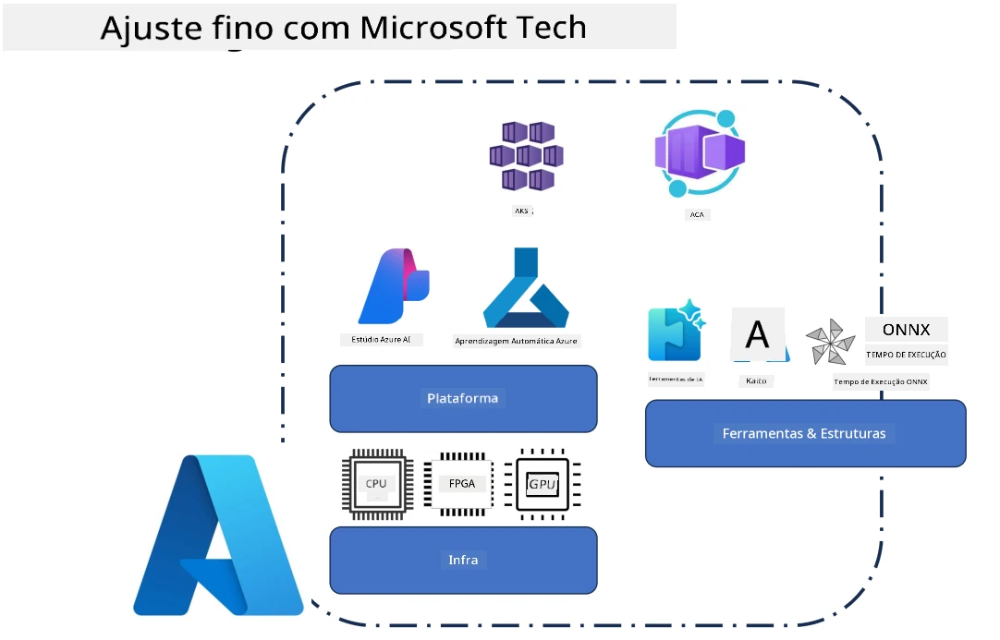
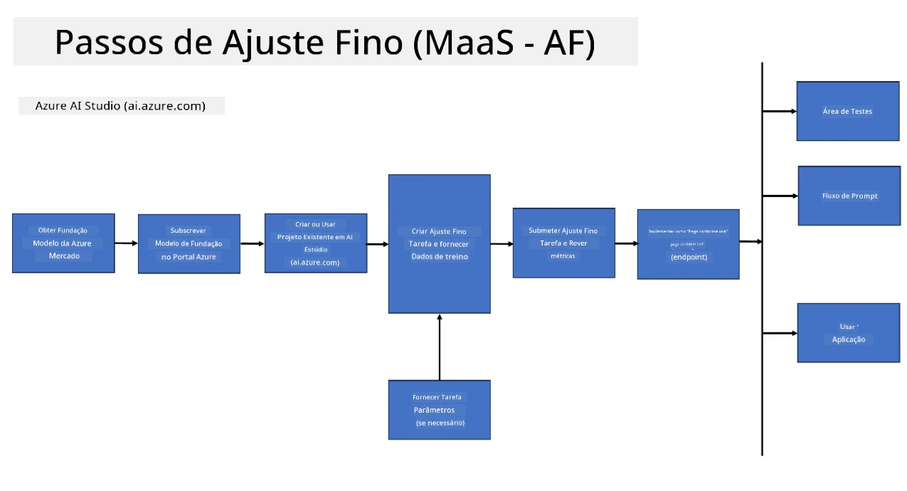
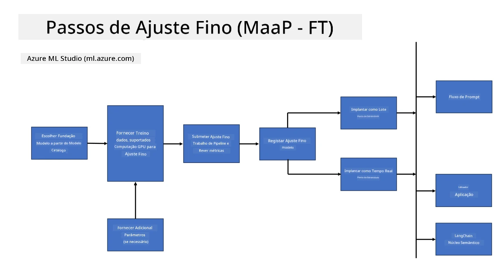
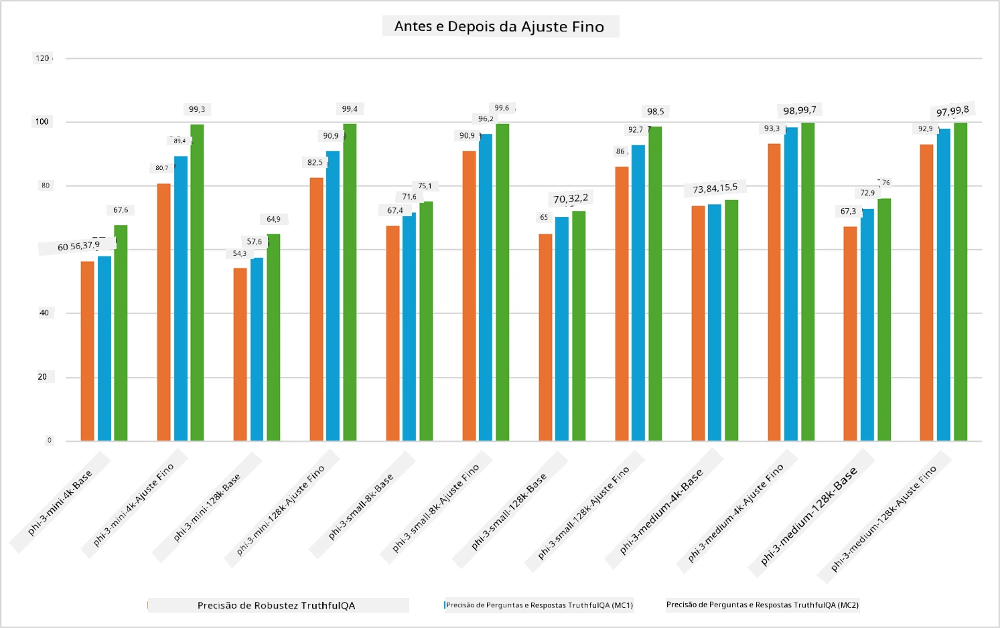

## Cenários de Ajuste Fino

Esta secção fornece uma visão geral dos cenários de ajuste fino em ambientes Microsoft Foundry e Azure, incluindo modelos de implantação, camadas de infraestrutura e técnicas de otimização comuns.

**Plataforma**  
Isto inclui serviços geridos como o Microsoft Foundry (anteriormente Azure AI Foundry) e o Azure Machine Learning, que fornecem gestão de modelos, orquestração, rastreamento de experiências e fluxos de trabalho de implantação.

**Infraestrutura**  
O ajuste fino necessita de recursos de computação escaláveis. Em ambientes Azure, isto inclui tipicamente máquinas virtuais baseadas em GPU e recursos de CPU para cargas de trabalho leves, juntamente com armazenamento escalável para conjuntos de dados e pontos de verificação.

**Ferramentas & Framework**  
Os fluxos de trabalho de ajuste fino recorrem frequentemente a frameworks e bibliotecas de otimização como Hugging Face Transformers, DeepSpeed e PEFT (Fine-Tuning Eficiente em Parâmetros).

O processo de ajuste fino com tecnologias Microsoft abrange serviços de plataforma, infraestrutura de computação e frameworks de treino. Ao compreender como estes componentes funcionam em conjunto, os desenvolvedores podem adaptar eficientemente modelos base a tarefas específicas e cenários de produção.

## Modelo como Serviço

Faça o ajuste fino do modelo utilizando ajuste fino hospedado, sem a necessidade de criar e gerir computação.

O ajuste fino serverless está agora disponível para as famílias de modelos Phi-3, Phi-3.5 e Phi-4, permitindo aos desenvolvedores personalizar rapidamente e facilmente os modelos para cenários na cloud e edge sem ter de providenciar recursos de computação.

## Modelo como Plataforma 

Os utilizadores gerem a sua própria computação para fazer o ajuste fino dos seus modelos.

[Exemplo de Ajuste Fino](https://github.com/Azure/azureml-examples/blob/main/sdk/python/foundation-models/system/finetune/chat-completion/chat-completion.ipynb)

## Comparação de Técnicas de Ajuste Fino

|Cenário|LoRA|QLoRA|PEFT|DeepSpeed|ZeRO|DoRA|
|---|---|---|---|---|---|---|
|Adaptar LLMs pré-treinados a tarefas ou domínios específicos|Sim|Sim|Sim|Sim|Sim|Sim|
|Ajuste fino para tarefas de PLN como classificação de texto, reconhecimento de entidades nomeadas e tradução automática|Sim|Sim|Sim|Sim|Sim|Sim|
|Ajuste fino para tarefas de QA|Sim|Sim|Sim|Sim|Sim|Sim|
|Ajuste fino para gerar respostas similares às humanas em chatbots|Sim|Sim|Sim|Sim|Sim|Sim|
|Ajuste fino para gerar música, arte ou outras formas de criatividade|Sim|Sim|Sim|Sim|Sim|Sim|
|Redução de custos computacionais e financeiros|Sim|Sim|Sim|Sim|Sim|Sim|
|Redução do uso de memória|Sim|Sim|Sim|Sim|Sim|Sim|
|Utilização de menos parâmetros para um ajuste fino eficiente|Sim|Sim|Sim|Não|Não|Sim|
|Forma eficiente em memória de paralelismo de dados que dá acesso à memória agregada das GPUs disponíveis|Não|Não|Não|Sim|Sim|Não|

> [!NOTE]
> LoRA, QLoRA, PEFT e DoRA são métodos de ajuste fino eficientes em parâmetros, enquanto DeepSpeed e ZeRO focam em treino distribuído e otimização de memória.

## Exemplos de Desempenho em Ajuste Fino

---

<!-- CO-OP TRANSLATOR DISCLAIMER START -->
**Aviso Legal**:  
Este documento foi traduzido utilizando o serviço de tradução AI [Co-op Translator](https://github.com/Azure/co-op-translator). Embora nos esforcemos pela precisão, por favor, esteja ciente de que traduções automáticas podem conter erros ou imprecisões. O documento original na sua língua nativa deve ser considerado a fonte oficial. Para informações críticas, recomenda-se tradução profissional humana. Não nos responsabilizamos por quaisquer mal-entendidos ou interpretações incorretas resultantes do uso desta tradução.
<!-- CO-OP TRANSLATOR DISCLAIMER END -->