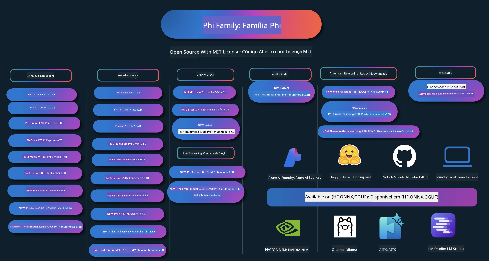

<!--
CO_OP_TRANSLATOR_METADATA:
{
  "original_hash": "ef3a50368712b1a7483d0def1f70c490",
  "translation_date": "2025-12-21T11:16:16+00:00",
  "source_file": "README.md",
  "language_code": "pt"
}
-->
# Phi Cookbook: Hands-On Examples with Microsoft's Phi Models

Phi é uma série de modelos de IA de código aberto desenvolvidos pela Microsoft. 

Atualmente, o Phi é o modelo de linguagem pequena (SLM) mais poderoso e económico, com benchmarks muito bons em multilinguagem, raciocínio, geração de texto/chat, coding, imagens, áudio e outros cenários. 

Pode implantar o Phi na cloud ou em dispositivos edge, e pode facilmente criar aplicações de IA generativa com recursos computacionais limitados.

Siga estes passos para começar a utilizar estes recursos :
1. **Fork the Repository**: Click 
2. **Clone the Repository**:   `git clone https://github.com/microsoft/PhiCookBook.git`
3. [**Junte-se à comunidade Microsoft AI no Discord e conheça especialistas e outros desenvolvedores**](https://discord.com/invite/ByRwuEEgH4?WT.mc_id=aiml-137032-kinfeylo)

### 🌐 Suporte Multilíngue

#### Suportado via GitHub Action (Automatizado e Sempre Atualizado)

<!-- CO-OP TRANSLATOR LANGUAGES TABLE START -->
[Árabe](../ar/README.md) | [Bengalês](../bn/README.md) | [Búlgaro](../bg/README.md) | [Birmanês (Myanmar)](../my/README.md) | [Chinês (Simplificado)](../zh/README.md) | [Chinês (Tradicional, Hong Kong)](../hk/README.md) | [Chinês (Tradicional, Macau)](../mo/README.md) | [Chinês (Tradicional, Taiwan)](../tw/README.md) | [Croata](../hr/README.md) | [Checo](../cs/README.md) | [Dinamarquês](../da/README.md) | [Holandês](../nl/README.md) | [Estónio](../et/README.md) | [Finlandês](../fi/README.md) | [Francês](../fr/README.md) | [Alemão](../de/README.md) | [Grego](../el/README.md) | [Hebraico](../he/README.md) | [Hindi](../hi/README.md) | [Húngaro](../hu/README.md) | [Indonésio](../id/README.md) | [Italiano](../it/README.md) | [Japonês](../ja/README.md) | [Canarês](../kn/README.md) | [Coreano](../ko/README.md) | [Lituano](../lt/README.md) | [Malaio](../ms/README.md) | [Malayalam](../ml/README.md) | [Marathi](../mr/README.md) | [Nepalês](../ne/README.md) | [Pidgin Nigeriano](../pcm/README.md) | [Norueguês](../no/README.md) | [Persa (Farsi)](../fa/README.md) | [Polaco](../pl/README.md) | [Português (Brasil)](../br/README.md) | [Português (Portugal)](./README.md) | [Punjabi (Gurmukhi)](../pa/README.md) | [Romeno](../ro/README.md) | [Russo](../ru/README.md) | [Sérvio (Cirílico)](../sr/README.md) | [Eslovaco](../sk/README.md) | [Esloveno](../sl/README.md) | [Espanhol](../es/README.md) | [Suaíli](../sw/README.md) | [Sueco](../sv/README.md) | [Tagalog (Filipino)](../tl/README.md) | [Tamil](../ta/README.md) | [Telugu](../te/README.md) | [Tailandês](../th/README.md) | [Turco](../tr/README.md) | [Ucraniano](../uk/README.md) | [Urdu](../ur/README.md) | [Vietnamita](../vi/README.md)
<!-- CO-OP TRANSLATOR LANGUAGES TABLE END -->

## Índice

- Introdução
  - [Bem-vindo à família Phi](./md/01.Introduction/01/01.PhiFamily.md)
  - [Configurar o seu ambiente](./md/01.Introduction/01/01.EnvironmentSetup.md)
  - [Compreender as Principais Tecnologias](./md/01.Introduction/01/01.Understandingtech.md)
  - [Segurança de IA para os modelos Phi](./md/01.Introduction/01/01.AISafety.md)
  - [Suporte de Hardware do Phi](./md/01.Introduction/01/01.Hardwaresupport.md)
  - [Modelos Phi e disponibilidade nas plataformas](./md/01.Introduction/01/01.Edgeandcloud.md)
  - [Usar Guidance-ai e Phi](./md/01.Introduction/01/01.Guidance.md)
  - [Modelos do GitHub Marketplace](https://github.com/marketplace/models)
  - [Catálogo de Modelos Azure AI](https://ai.azure.com)

- Inferência do Phi em diferentes ambientes
    -  [Hugging face](./md/01.Introduction/02/01.HF.md)
    -  [GitHub Models](./md/01.Introduction/02/02.GitHubModel.md)
    -  [Azure AI Foundry Model Catalog](./md/01.Introduction/02/03.AzureAIFoundry.md)
    -  [Ollama](./md/01.Introduction/02/04.Ollama.md)
    -  [AI Toolkit VSCode (AITK)](./md/01.Introduction/02/05.AITK.md)
    -  [NVIDIA NIM](./md/01.Introduction/02/06.NVIDIA.md)
    -  [Foundry Local](./md/01.Introduction/02/07.FoundryLocal.md)

- Inferência da Família Phi
    - [Inferência do Phi no iOS](./md/01.Introduction/03/iOS_Inference.md)
    - [Inferência do Phi no Android](./md/01.Introduction/03/Android_Inference.md)
    - [Inferência do Phi no Jetson](./md/01.Introduction/03/Jetson_Inference.md)
    - [Inferência do Phi no AI PC](./md/01.Introduction/03/AIPC_Inference.md)
    - [Inferência do Phi com o Apple MLX Framework](./md/01.Introduction/03/MLX_Inference.md)
    - [Inferência do Phi em Servidor Local](./md/01.Introduction/03/Local_Server_Inference.md)
    - [Inferência do Phi em Servidor Remoto usando o AI Toolkit](./md/01.Introduction/03/Remote_Interence.md)
    - [Inferência do Phi com Rust](./md/01.Introduction/03/Rust_Inference.md)
    - [Inferência do Phi — Visão em Local](./md/01.Introduction/03/Vision_Inference.md)
    - [Inferência do Phi com Kaito AKS, Azure Containers (suporte oficial)](./md/01.Introduction/03/Kaito_Inference.md)
-  [Quantificação da Família Phi](./md/01.Introduction/04/QuantifyingPhi.md)
    - [Quantização do Phi-3.5 / 4 usando llama.cpp](./md/01.Introduction/04/UsingLlamacppQuantifyingPhi.md)
    - [Quantização do Phi-3.5 / 4 usando as extensões Generative AI para onnxruntime](./md/01.Introduction/04/UsingORTGenAIQuantifyingPhi.md)
    - [Quantização do Phi-3.5 / 4 usando Intel OpenVINO](./md/01.Introduction/04/UsingIntelOpenVINOQuantifyingPhi.md)
    - [Quantização do Phi-3.5 / 4 usando o Apple MLX Framework](./md/01.Introduction/04/UsingAppleMLXQuantifyingPhi.md)

-  Avaliação do Phi
    - [IA Responsável](./md/01.Introduction/05/ResponsibleAI.md)
    - [Azure AI Foundry para Avaliação](./md/01.Introduction/05/AIFoundry.md)
    - [Usar o Promptflow para Avaliação](./md/01.Introduction/05/Promptflow.md)
 
- RAG com o Azure AI Search
    - [How to use Phi-4-mini and Phi-4-multimodal(RAG) with Azure AI Search](https://github.com/microsoft/PhiCookBook/blob/main/code/06.E2E/E2E_Phi-4-RAG-Azure-AI-Search.ipynb)

- Exemplos de desenvolvimento de aplicações Phi
  - Aplicações de Texto e Chat
    - Exemplos Phi-4 🆕
      - [📓] [Chat com o Modelo ONNX Phi-4-mini](./md/02.Application/01.TextAndChat/Phi4/ChatWithPhi4ONNX/README.md)
      - [Chat com o Modelo ONNX Phi-4 local (.NET)](../../md/04.HOL/dotnet/src/LabsPhi4-Chat-01OnnxRuntime)
      - [Aplicação de Consola .NET de Chat com Phi-4 ONNX usando Sementic Kernel](../../md/04.HOL/dotnet/src/LabsPhi4-Chat-02SK)
    - Exemplos Phi-3 / 3.5
      - [Chatbot Local no navegador usando Phi3, ONNX Runtime Web e WebGPU](https://github.com/microsoft/onnxruntime-inference-examples/tree/main/js/chat)
      - [Chat OpenVino](./md/02.Application/01.TextAndChat/Phi3/E2E_OpenVino_Chat.md)
      - [Multi Modelo - Phi-3-mini Interactivo e OpenAI Whisper](./md/02.Application/01.TextAndChat/Phi3/E2E_Phi-3-mini_with_whisper.md)
      - [MLFlow - Construir um wrapper e usar o Phi-3 com MLFlow](./md//02.Application/01.TextAndChat/Phi3/E2E_Phi-3-MLflow.md)
      - [Otimização de Modelo - Como otimizar o modelo Phi-3-min para ONNX Runtime Web com Olive](https://github.com/microsoft/Olive/tree/main/examples/phi3)
      - [Aplicação WinUI3 com Phi-3 mini-4k-instruct-onnx](https://github.com/microsoft/Phi3-Chat-WinUI3-Sample/)
      -[Exemplo de Aplicação de Notas Potenciada por IA Multi-Modelo WinUI3](https://github.com/microsoft/ai-powered-notes-winui3-sample)
      - [Ajuste fino e Integração de modelos Phi-3 personalizados com Prompt flow](./md/02.Application/01.TextAndChat/Phi3/E2E_Phi-3-FineTuning_PromptFlow_Integration.md)
      - [Ajuste fino e Integração de modelos Phi-3 personalizados com Prompt flow no Azure AI Foundry](./md/02.Application/01.TextAndChat/Phi3/E2E_Phi-3-FineTuning_PromptFlow_Integration_AIFoundry.md)
      - [Avaliar o Modelo Phi-3 / Phi-3.5 ajustado no Azure AI Foundry com foco nos Princípios de IA Responsável da Microsoft](./md/02.Application/01.TextAndChat/Phi3/E2E_Phi-3-Evaluation_AIFoundry.md)
      - [📓] [Exemplo de predição de linguagem Phi-3.5-mini-instruct (Chinês/Inglês)](./md/02.Application/01.TextAndChat/Phi3/phi3-instruct-demo.ipynb)
      - [Phi-3.5-Instruct WebGPU RAG Chatbot](./md/02.Application/01.TextAndChat/Phi3/WebGPUWithPhi35Readme.md)
      - [Usando GPU do Windows para criar solução Prompt flow com Phi-3.5-Instruct ONNX](./md/02.Application/01.TextAndChat/Phi3/UsingPromptFlowWithONNX.md)
      - [Usando Microsoft Phi-3.5 tflite para criar aplicação Android](./md/02.Application/01.TextAndChat/Phi3/UsingPhi35TFLiteCreateAndroidApp.md)
      - [Exemplo de Q&A .NET usando modelo ONNX Phi-3 local com Microsoft.ML.OnnxRuntime](../../md/04.HOL/dotnet/src/LabsPhi301)
      - [Aplicação de consola .NET para chat com Semantic Kernel e Phi-3](../../md/04.HOL/dotnet/src/LabsPhi302)

  - Azure AI Inference SDK Code Based Samples 
    - Phi-4 Samples 🆕
      - [📓] [Gerar código de projeto usando Phi-4-multimodal](./md/02.Application/02.Code/Phi4/GenProjectCode/README.md)
    - Phi-3 / 3.5 Samples
      - [Construa o seu próprio GitHub Copilot Chat para Visual Studio Code com a família Microsoft Phi-3](./md/02.Application/02.Code/Phi3/VSCodeExt/README.md)
      - [Crie o seu próprio Agente Chat Copilot do Visual Studio Code com Phi-3.5 pelos modelos do GitHub](/md/02.Application/02.Code/Phi3/CreateVSCodeChatAgentWithGitHubModels.md)

  - Advanced Reasoning Samples
    - Phi-4 Samples 🆕
      - [📓] [Amostras Phi-4-mini-reasoning ou Phi-4-reasoning](./md/02.Application/03.AdvancedReasoning/Phi4/AdvancedResoningPhi4mini/README.md)
      - [📓] [Ajuste fino do Phi-4-mini-reasoning com Microsoft Olive](./md/02.Application/03.AdvancedReasoning/Phi4/AdvancedResoningPhi4mini/olive_ft_phi_4_reasoning_with_medicaldata.ipynb)
      - [📓] [Ajuste fino do Phi-4-mini-reasoning com Apple MLX](./md/02.Application/03.AdvancedReasoning/Phi4/AdvancedResoningPhi4mini/mlx_ft_phi_4_reasoning_with_medicaldata.ipynb)
      - [📓] [Phi-4-mini-reasoning com GitHub Models](./md/02.Application/02.Code/Phi4r/github_models_inference.ipynb)
      - [📓] [Phi-4-mini-reasoning com Azure AI Foundry Models](./md/02.Application/02.Code/Phi4r/azure_models_inference.ipynb)
  - Demos
      - [Demos Phi-4-mini alojados no Hugging Face Spaces](https://huggingface.co/spaces/microsoft/phi-4-mini?WT.mc_id=aiml-137032-kinfeylo)
      - [Demos Phi-4-multimodal alojados no Hugginge Face Spaces](https://huggingface.co/spaces/microsoft/phi-4-multimodal?WT.mc_id=aiml-137032-kinfeylo)
  - Vision Samples
    - Phi-4 Samples 🆕
      - [📓] [Usar Phi-4-multimodal para ler imagens e gerar código](./md/02.Application/04.Vision/Phi4/CreateFrontend/README.md) 
    - Phi-3 / 3.5 Samples
      -  [📓][Phi-3-vision-Image text to text](./md/02.Application/04.Vision/Phi3/E2E_Phi-3-vision-image-text-to-text-online-endpoint.ipynb)
      - [Phi-3-vision-ONNX](https://onnxruntime.ai/docs/genai/tutorials/phi3-v.html)
      - [📓][Phi-3-vision CLIP Embedding](./md/02.Application/04.Vision/Phi3/E2E_Phi-3-vision-image-text-to-text-online-endpoint.ipynb)
      - [DEMO: Phi-3 Recycling](https://github.com/jennifermarsman/PhiRecycling/)
      - [Phi-3-vision - Assistente de linguagem visual - com Phi3-Vision e OpenVINO](https://docs.openvino.ai/nightly/notebooks/phi-3-vision-with-output.html)
      - [Phi-3 Vision Nvidia NIM](./md/02.Application/04.Vision/Phi3/E2E_Nvidia_NIM_Vision.md)
      - [Phi-3 Vision OpenVino](./md/02.Application/04.Vision/Phi3/E2E_OpenVino_Phi3Vision.md)
      - [📓][Exemplo Phi-3.5 Vision multi-frame ou multi-imagem](./md/02.Application/04.Vision/Phi3/phi3-vision-demo.ipynb)
      - [Modelo ONNX local Phi-3 Vision usando Microsoft.ML.OnnxRuntime .NET](../../md/04.HOL/dotnet/src/LabsPhi303)
      - [Modelo ONNX local Phi-3 Vision baseado em menu usando Microsoft.ML.OnnxRuntime .NET](../../md/04.HOL/dotnet/src/LabsPhi304)

  - Math Samples
    -  Phi-4-Mini-Flash-Reasoning-Instruct Samples 🆕 [Demonstração de Matemática com Phi-4-Mini-Flash-Reasoning-Instruct](./md/02.Application/09.Math/MathDemo.ipynb)

  - Audio Samples
    - Phi-4 Samples 🆕
      - [📓] [Extrair transcrições de áudio usando Phi-4-multimodal](./md/02.Application/05.Audio/Phi4/Transciption/README.md)
      - [📓] [Exemplo de Áudio Phi-4-multimodal](./md/02.Application/05.Audio/Phi4/Siri/demo.ipynb)
      - [📓] [Exemplo de Tradução de Fala com Phi-4-multimodal](./md/02.Application/05.Audio/Phi4/Translate/demo.ipynb)
      - [.NET console application using Phi-4-multimodal Audio to analyze an audio file and generate transcript](../../md/04.HOL/dotnet/src/LabsPhi4-MultiModal-02Audio)

  - MOE Samples
    - Phi-3 / 3.5 Samples
      - [📓] [Phi-3.5 Mixture of Experts Models (MoEs) Exemplo de Redes Sociais](./md/02.Application/06.MoE/Phi3/phi3_moe_demo.ipynb)
      - [📓] [Construir um Pipeline de Retrieval-Augmented Generation (RAG) com NVIDIA NIM Phi-3 MOE, Azure AI Search e LlamaIndex](./md/02.Application/06.MoE/Phi3/azure-ai-search-nvidia-rag.ipynb)
      - 
  - Function Calling Samples
    - Phi-4 Samples 🆕
      -  [📓] [Usar Function Calling com Phi-4-mini](./md/02.Application/07.FunctionCalling/Phi4/FunctionCallingBasic/README.md)
      -  [📓] [Usar Function Calling para criar multi-agentes com Phi-4-mini](./md/02.Application/07.FunctionCalling/Phi4/Multiagents/Phi_4_mini_multiagent.ipynb)
      -  [📓] [Usar Function Calling com Ollama](./md/02.Application/07.FunctionCalling/Phi4/Ollama/ollama_functioncalling.ipynb)
      -  [📓] [Usar Function Calling com ONNX](../../md/02.Application/07.FunctionCalling/Phi4/ONNX/onnx_parallel_functioncalling_ipynb)
  - Multimodal Mixing Samples
    - Phi-4 Samples 🆕
      -  [📓] [Usar Phi-4-multimodal como jornalista de tecnologia](./md/02.Application/08.Multimodel/Phi4/TechJournalist/phi_4_mm_audio_text_publish_news.ipynb)
      - [.NET console application using Phi-4-multimodal to analyze images](../../md/04.HOL/dotnet/src/LabsPhi4-MultiModal-01Images)

- Fine-tuning Phi Samples
  - [Cenários de Ajuste Fino](./md/03.FineTuning/FineTuning_Scenarios.md)
  - [Ajuste fino vs RAG](./md/03.FineTuning/FineTuning_vs_RAG.md)
  - [Ajuste fino: Transformar o Phi-3 num especialista da indústria](./md/03.FineTuning/LetPhi3gotoIndustriy.md)
  - [Ajuste fino do Phi-3 com AI Toolkit para VS Code](./md/03.FineTuning/Finetuning_VSCodeaitoolkit.md)
  - [Ajuste fino do Phi-3 com Azure Machine Learning Service](./md/03.FineTuning/Introduce_AzureML.md)
  - [Ajuste fino do Phi-3 com Lora](./md/03.FineTuning/FineTuning_Lora.md)
  - [Ajuste fino do Phi-3 com QLora](./md/03.FineTuning/FineTuning_Qlora.md)
  - [Ajuste fino do Phi-3 com Azure AI Foundry](./md/03.FineTuning/FineTuning_AIFoundry.md)
  - [Ajuste fino do Phi-3 com Azure ML CLI/SDK](./md/03.FineTuning/FineTuning_MLSDK.md)
  - [Ajuste fino com Microsoft Olive](./md/03.FineTuning/FineTuning_MicrosoftOlive.md)
  - [Hands-On: Ajuste fino com Microsoft Olive](./md/03.FineTuning/olive-lab/readme.md)
  - [Ajuste fino do Phi-3-vision com Weights and Bias](./md/03.FineTuning/FineTuning_Phi-3-visionWandB.md)
  - [Ajuste fino do Phi-3 com Apple MLX Framework](./md/03.FineTuning/FineTuning_MLX.md)
  - [Ajuste fino do Phi-3-vision (suporte oficial)](./md/03.FineTuning/FineTuning_Vision.md)
  - [Ajuste fino do Phi-3 com Kaito AKS, Azure Containers (suporte oficial)](./md/03.FineTuning/FineTuning_Kaito.md)
  - [Ajuste fino do Phi-3 e 3.5 Vision](https://github.com/2U1/Phi3-Vision-Finetune)

- Hands on Lab
  - [Explorando modelos de ponta: LLMs, SLMs, desenvolvimento local e mais](https://github.com/microsoft/aitour-exploring-cutting-edge-models)
  - [Desbloquear o Potencial do NLP: Ajuste Fino com Microsoft Olive](https://github.com/azure/Ignite_FineTuning_workshop)

- Academic Research Papers and Publications
  - [Textbooks Are All You Need II: relatório técnico phi-1.5](https://arxiv.org/abs/2309.05463)
  - [Relatório Técnico Phi-3: Um Modelo de Linguagem Altamente Capaz Localmente no Seu Telemóvel](https://arxiv.org/abs/2404.14219)
  - [Relatório Técnico Phi-4](https://arxiv.org/abs/2412.08905)
  - [Phi-4-Mini Relatório Técnico: Modelos de Linguagem Multimodais Compactos, mas Poderosos via Mixture-of-LoRAs](https://arxiv.org/abs/2503.01743)
  - [Otimizando Pequenos Modelos de Linguagem para Invocação de Funções em Veículos](https://arxiv.org/abs/2501.02342)
  - [(WhyPHI) Ajuste Fino do PHI-3 para Resolução de Perguntas de Escolha Múltipla: Metodologia, Resultados e Desafios](https://arxiv.org/abs/2501.01588)
  - [Phi-4-reasoning Relatório Técnico](https://www.microsoft.com/en-us/research/wp-content/uploads/2025/04/phi_4_reasoning.pdf)
  - [Phi-4-mini-reasoning Relatório Técnico](https://huggingface.co/microsoft/Phi-4-mini-reasoning/blob/main/Phi-4-Mini-Reasoning.pdf)

## Usar Modelos Phi

### Phi no Azure AI Foundry

Pode aprender a usar o Microsoft Phi e a criar soluções E2E nos seus diferentes dispositivos de hardware. Para experimentar o Phi por si próprio, comece por explorar os modelos e personalizar o Phi para os seus cenários usando o [Azure AI Foundry Azure AI Model Catalog](https://aka.ms/phi3-azure-ai). Pode saber mais em Começar com [Azure AI Foundry](/md/02.QuickStart/AzureAIFoundry_QuickStart.md)

**Playground**
Cada modelo tem um playground dedicado para testar o modelo [Azure AI Playground](https://aka.ms/try-phi3).

### Phi nos Modelos do GitHub

Pode aprender a usar o Microsoft Phi e a criar soluções E2E nos seus diferentes dispositivos de hardware. Para experimentar o Phi por si próprio, comece por explorar o modelo e personalizar o Phi para os seus cenários usando o [GitHub Model Catalog](https://github.com/marketplace/models?WT.mc_id=aiml-137032-kinfeylo). Pode saber mais em Começar com o [GitHub Model Catalog](/md/02.QuickStart/GitHubModel_QuickStart.md)

**Playground**
Cada modelo tem um [playground dedicado para testar o modelo](/md/02.QuickStart/GitHubModel_QuickStart.md).

### Phi no Hugging Face

Também pode encontrar o modelo no [Hugging Face](https://huggingface.co/microsoft)

**Playground**
 [Playground do Hugging Chat](https://huggingface.co/chat/models/microsoft/Phi-3-mini-4k-instruct)

 ## 🎒 Outros Cursos

A nossa equipa produz outros cursos! Veja:

<!-- CO-OP TRANSLATOR OTHER COURSES START -->
### LangChain

---

### Azure / Edge / MCP / Agentes

---
 
### Série de IA Generativa

[-9333EA?style=for-the-badge&labelColor=E5E7EB&color=9333EA)](https://github.com/microsoft/Generative-AI-for-beginners-dotnet?WT.mc_id=academic-105485-koreyst)
[-C084FC?style=for-the-badge&labelColor=E5E7EB&color=C084FC)](https://github.com/microsoft/generative-ai-for-beginners-java?WT.mc_id=academic-105485-koreyst)
[-E879F9?style=for-the-badge&labelColor=E5E7EB&color=E879F9)](https://github.com/microsoft/generative-ai-with-javascript?WT.mc_id=academic-105485-koreyst)

---
 
### Aprendizagem Essencial

---
 
### Série Copilot

<!-- CO-OP TRANSLATOR OTHER COURSES END -->

## IA Responsável 

A Microsoft está empenhada em ajudar os nossos clientes a usar os nossos produtos de IA de forma responsável, partilhando as nossas aprendizagens e construindo parcerias baseadas na confiança através de ferramentas como Notas de Transparência e Avaliações de Impacto. Muitos destes recursos podem ser encontrados em [https://aka.ms/RAI](https://aka.ms/RAI).
A abordagem da Microsoft à IA responsável está assente nos nossos princípios de IA de justiça, fiabilidade e segurança, privacidade e segurança, inclusividade, transparência e responsabilidade.

Modelos de larga escala para linguagem natural, imagem e discurso — como os utilizados neste exemplo — podem potencialmente comportar-se de formas que sejam injustas, pouco fiáveis ou ofensivas, causando danos. Consulte a [Nota de Transparência do serviço Azure OpenAI](https://learn.microsoft.com/legal/cognitive-services/openai/transparency-note?tabs=text) para estar informado sobre riscos e limitações.

A abordagem recomendada para mitigar estes riscos é incluir um sistema de segurança na sua arquitetura que possa detetar e prevenir comportamentos nocivos. O [Azure AI Content Safety](https://learn.microsoft.com/azure/ai-services/content-safety/overview) fornece uma camada independente de proteção, capaz de detetar conteúdos nocivos gerados por utilizadores e por IA em aplicações e serviços. O Azure AI Content Safety inclui APIs de texto e imagem que lhe permitem detetar material potencialmente prejudicial. No Azure AI Foundry, o serviço Content Safety permite-lhe ver, explorar e experimentar exemplos de código para detetar conteúdo nocivo em diferentes modalidades. A seguinte [documentação de quickstart](https://learn.microsoft.com/azure/ai-services/content-safety/quickstart-text?tabs=visual-studio%2Clinux&pivots=programming-language-rest) guia-o no envio de pedidos ao serviço.

Outro aspeto a ter em conta é o desempenho geral da aplicação. Em aplicações multimodais e com múltiplos modelos, consideramos desempenho como a forma como o sistema funciona de acordo com as expectativas suas e dos seus utilizadores, incluindo não gerar resultados nocivos. É importante avaliar o desempenho da sua aplicação global usando os [avaliadores de Performance and Quality and Risk and Safety](https://learn.microsoft.com/azure/ai-studio/concepts/evaluation-metrics-built-in). Também tem a capacidade de criar e avaliar com [avaliadores personalizados](https://learn.microsoft.com/azure/ai-studio/how-to/develop/evaluate-sdk#custom-evaluators).

Pode avaliar a sua aplicação de IA no seu ambiente de desenvolvimento utilizando o [Azure AI Evaluation SDK](https://microsoft.github.io/promptflow/index.html). Dado um conjunto de testes ou um objetivo, as gerações da sua aplicação de IA generativa são medidas quantitativamente com avaliadores integrados ou avaliadores personalizados à sua escolha. Para começar com o azure ai evaluation sdk para avaliar o seu sistema, pode seguir o [guia de início rápido](https://learn.microsoft.com/azure/ai-studio/how-to/develop/flow-evaluate-sdk). Depois de executar uma avaliação, pode [visualizar os resultados no Azure AI Foundry](https://learn.microsoft.com/azure/ai-studio/how-to/evaluate-flow-results). 

## Marcas Comerciais
Este projeto pode conter marcas comerciais ou logótipos de projetos, produtos ou serviços. A utilização autorizada das marcas comerciais ou logótipos da Microsoft está sujeita e deve seguir as [Diretrizes de Marcas e Identidade da Microsoft](https://www.microsoft.com/legal/intellectualproperty/trademarks/usage/general).
A utilização das marcas comerciais ou logótipos da Microsoft em versões modificadas deste projeto não deve causar confusão nem implicar patrocínio da Microsoft. Qualquer utilização de marcas comerciais ou logótipos de terceiros está sujeita às políticas desses terceiros.

## Obter Ajuda

Se ficar bloqueado ou tiver alguma dúvida sobre desenvolver aplicações de IA, junte-se a:

Se tiver feedback sobre o produto ou encontrar erros durante o desenvolvimento, visite:

---

<!-- CO-OP TRANSLATOR DISCLAIMER START -->
Declaração de isenção de responsabilidade:
Este documento foi traduzido utilizando o serviço de tradução automática por IA [Co-op Translator](https://github.com/Azure/co-op-translator). Embora nos esforcemos por garantir a precisão, tenha em atenção que traduções automatizadas podem conter erros ou imprecisões. O documento original no seu idioma deve ser considerado a fonte autoritativa. Para informações críticas, recomenda-se a tradução profissional efetuada por um tradutor humano. Não nos responsabilizamos por quaisquer mal-entendidos ou interpretações erradas decorrentes da utilização desta tradução.
<!-- CO-OP TRANSLATOR DISCLAIMER END -->