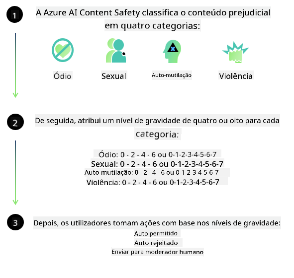
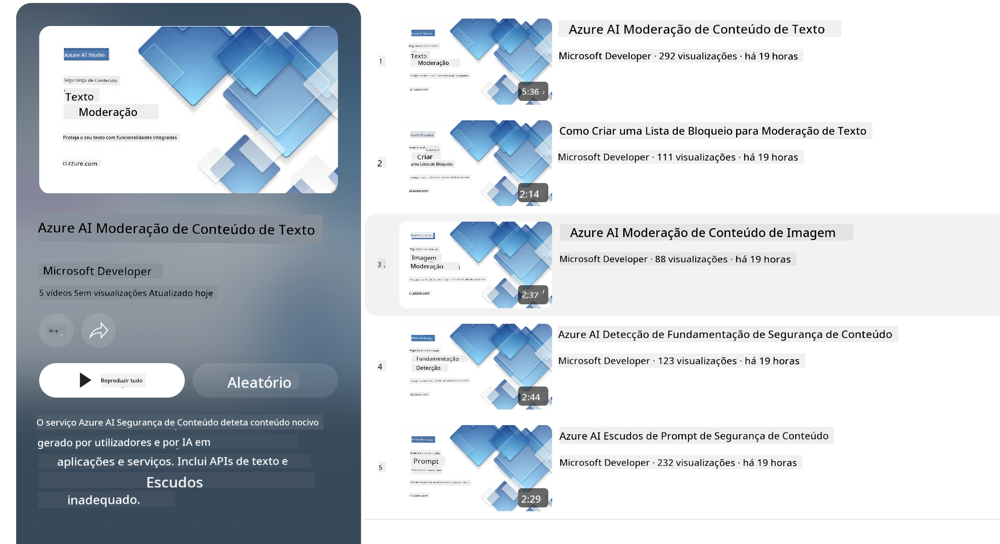

<!--
CO_OP_TRANSLATOR_METADATA:
{
  "original_hash": "c8273672cc57df2be675407a1383aaf0",
  "translation_date": "2025-07-16T17:46:43+00:00",
  "source_file": "md/01.Introduction/01/01.AISafety.md",
  "language_code": "pt"
}
-->
# Segurança de IA para modelos Phi  
A família de modelos Phi foi desenvolvida em conformidade com o [Microsoft Responsible AI Standard](https://query.prod.cms.rt.microsoft.com/cms/api/am/binary/RE5cmFl), um conjunto de requisitos a nível da empresa baseado nos seguintes seis princípios: responsabilidade, transparência, justiça, fiabilidade e segurança, privacidade e segurança, e inclusão, que constituem os [princípios de IA responsável da Microsoft](https://www.microsoft.com/ai/responsible-ai).

Tal como nos modelos Phi anteriores, foi adotada uma avaliação multifacetada de segurança e uma abordagem de pós-treinamento de segurança, com medidas adicionais para considerar as capacidades multilíngues desta versão. A nossa abordagem ao treino e avaliações de segurança, incluindo testes em várias línguas e categorias de risco, está descrita no [Phi Safety Post-Training Paper](https://arxiv.org/abs/2407.13833). Embora os modelos Phi beneficiem desta abordagem, os desenvolvedores devem aplicar as melhores práticas de IA responsável, incluindo mapear, medir e mitigar os riscos associados ao seu caso de uso específico e ao contexto cultural e linguístico.

## Melhores Práticas

Tal como outros modelos, a família de modelos Phi pode potencialmente comportar-se de formas injustas, pouco fiáveis ou ofensivas.

Alguns dos comportamentos limitadores dos SLM e LLM que deve ter em conta incluem:

- **Qualidade do Serviço:** Os modelos Phi são treinados principalmente com texto em inglês. Línguas diferentes do inglês terão um desempenho inferior. Variedades da língua inglesa com menor representação nos dados de treino podem apresentar desempenho inferior ao inglês americano padrão.  
- **Representação de Danos e Perpetuação de Estereótipos:** Estes modelos podem sobre- ou sub-representar grupos de pessoas, apagar a representação de alguns grupos ou reforçar estereótipos depreciativos ou negativos. Apesar do pós-treinamento de segurança, estas limitações podem ainda estar presentes devido a diferentes níveis de representação dos vários grupos ou à prevalência de exemplos de estereótipos negativos nos dados de treino que refletem padrões do mundo real e preconceitos sociais.  
- **Conteúdo Inadequado ou Ofensivo:** Estes modelos podem gerar outros tipos de conteúdo inadequado ou ofensivo, o que pode tornar a sua utilização imprópria em contextos sensíveis sem mitigações adicionais específicas para o caso de uso.  
- **Fiabilidade da Informação:** Modelos de linguagem podem gerar conteúdo sem sentido ou inventar informações que podem parecer razoáveis, mas que são imprecisas ou desatualizadas.  
- **Âmbito Limitado para Código:** A maior parte dos dados de treino do Phi-3 baseia-se em Python e utiliza pacotes comuns como "typing, math, random, collections, datetime, itertools". Se o modelo gerar scripts Python que utilizem outros pacotes ou scripts noutras linguagens, recomendamos fortemente que os utilizadores verifiquem manualmente todas as utilizações da API.

Os desenvolvedores devem aplicar as melhores práticas de IA responsável e são responsáveis por garantir que um caso de uso específico cumpre as leis e regulamentos aplicáveis (ex: privacidade, comércio, etc.).

## Considerações de IA Responsável

Tal como outros modelos de linguagem, os modelos da série Phi podem potencialmente comportar-se de formas injustas, pouco fiáveis ou ofensivas. Alguns dos comportamentos limitadores a ter em conta incluem:

**Qualidade do Serviço:** Os modelos Phi são treinados principalmente com texto em inglês. Línguas diferentes do inglês terão um desempenho inferior. Variedades da língua inglesa com menor representação nos dados de treino podem apresentar desempenho inferior ao inglês americano padrão.

**Representação de Danos e Perpetuação de Estereótipos:** Estes modelos podem sobre- ou sub-representar grupos de pessoas, apagar a representação de alguns grupos ou reforçar estereótipos depreciativos ou negativos. Apesar do pós-treinamento de segurança, estas limitações podem ainda estar presentes devido a diferentes níveis de representação dos vários grupos ou à prevalência de exemplos de estereótipos negativos nos dados de treino que refletem padrões do mundo real e preconceitos sociais.

**Conteúdo Inadequado ou Ofensivo:** Estes modelos podem gerar outros tipos de conteúdo inadequado ou ofensivo, o que pode tornar a sua utilização imprópria em contextos sensíveis sem mitigações adicionais específicas para o caso de uso.  
Fiabilidade da Informação: Modelos de linguagem podem gerar conteúdo sem sentido ou inventar informações que podem parecer razoáveis, mas que são imprecisas ou desatualizadas.

**Âmbito Limitado para Código:** A maior parte dos dados de treino do Phi-3 baseia-se em Python e utiliza pacotes comuns como "typing, math, random, collections, datetime, itertools". Se o modelo gerar scripts Python que utilizem outros pacotes ou scripts noutras linguagens, recomendamos fortemente que os utilizadores verifiquem manualmente todas as utilizações da API.

Os desenvolvedores devem aplicar as melhores práticas de IA responsável e são responsáveis por garantir que um caso de uso específico cumpre as leis e regulamentos aplicáveis (ex: privacidade, comércio, etc.). Áreas importantes a considerar incluem:

**Alocação:** Os modelos podem não ser adequados para cenários que possam ter um impacto significativo no estatuto legal ou na alocação de recursos ou oportunidades de vida (ex: habitação, emprego, crédito, etc.) sem avaliações adicionais e técnicas de redução de viés suplementares.

**Cenários de Alto Risco:** Os desenvolvedores devem avaliar a adequação do uso dos modelos em cenários de alto risco onde saídas injustas, pouco fiáveis ou ofensivas possam ser extremamente dispendiosas ou causar danos. Isto inclui fornecer aconselhamento em domínios sensíveis ou especializados onde a precisão e fiabilidade são críticas (ex: aconselhamento jurídico ou de saúde). Salvaguardas adicionais devem ser implementadas ao nível da aplicação, conforme o contexto de implementação.

**Desinformação:** Os modelos podem produzir informação incorreta. Os desenvolvedores devem seguir as melhores práticas de transparência e informar os utilizadores finais de que estão a interagir com um sistema de IA. Ao nível da aplicação, os desenvolvedores podem criar mecanismos de feedback e pipelines para fundamentar as respostas em informação contextual e específica do caso de uso, uma técnica conhecida como Retrieval Augmented Generation (RAG).

**Geração de Conteúdo Prejudicial:** Os desenvolvedores devem avaliar as saídas no seu contexto e usar classificadores de segurança disponíveis ou soluções personalizadas adequadas ao seu caso de uso.

**Uso Indevido:** Outras formas de uso indevido, como fraude, spam ou produção de malware, podem ser possíveis, e os desenvolvedores devem garantir que as suas aplicações não violam leis e regulamentos aplicáveis.

### Ajuste Fino e Segurança de Conteúdo de IA

Após o ajuste fino de um modelo, recomendamos vivamente a utilização das medidas do [Azure AI Content Safety](https://learn.microsoft.com/azure/ai-services/content-safety/overview) para monitorizar o conteúdo gerado pelos modelos, identificar e bloquear potenciais riscos, ameaças e problemas de qualidade.

O [Azure AI Content Safety](https://learn.microsoft.com/azure/ai-services/content-safety/overview) suporta conteúdos de texto e imagem. Pode ser implementado na cloud, em contentores desconectados e em dispositivos edge/embarcados.

## Visão Geral do Azure AI Content Safety

O Azure AI Content Safety não é uma solução universal; pode ser personalizado para alinhar com as políticas específicas das empresas. Além disso, os seus modelos multilíngues permitem compreender várias línguas simultaneamente.

- **Azure AI Content Safety**  
- **Microsoft Developer**  
- **5 vídeos**

O serviço Azure AI Content Safety deteta conteúdos prejudiciais gerados por utilizadores e por IA em aplicações e serviços. Inclui APIs de texto e imagem que permitem detetar material prejudicial ou inadequado.

[AI Content Safety Playlist](https://www.youtube.com/playlist?list=PLlrxD0HtieHjaQ9bJjyp1T7FeCbmVcPkQ)

**Aviso Legal**:  
Este documento foi traduzido utilizando o serviço de tradução automática [Co-op Translator](https://github.com/Azure/co-op-translator). Embora nos esforcemos por garantir a precisão, por favor tenha em conta que traduções automáticas podem conter erros ou imprecisões. O documento original na sua língua nativa deve ser considerado a fonte autorizada. Para informações críticas, recomenda-se a tradução profissional humana. Não nos responsabilizamos por quaisquer mal-entendidos ou interpretações incorretas decorrentes da utilização desta tradução.