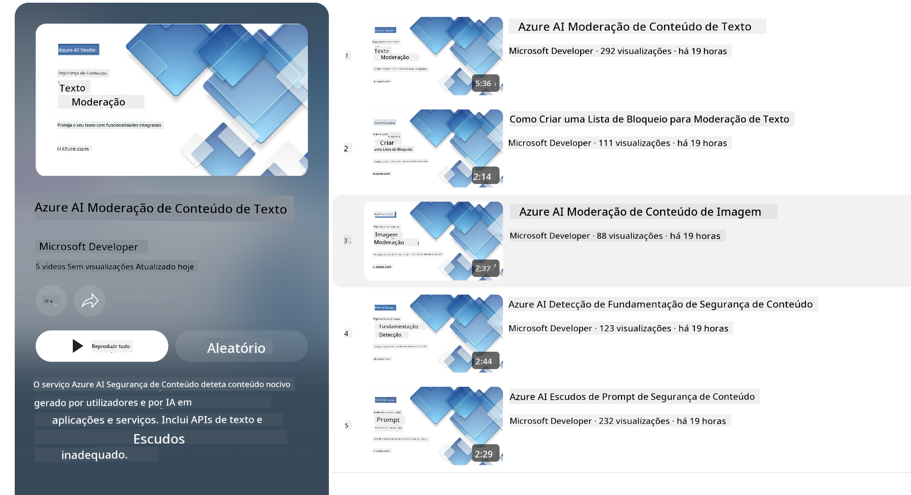

<!--
CO_OP_TRANSLATOR_METADATA:
{
  "original_hash": "839ccc4b3886ef10cfd4e64977f5792d",
  "translation_date": "2026-01-05T02:51:39+00:00",
  "source_file": "md/01.Introduction/01/01.AISafety.md",
  "language_code": "pt"
}
-->
# Segurança de IA para os modelos Phi
A família de modelos Phi foi desenvolvida de acordo com o [Microsoft Responsible AI Standard](https://www.microsoft.com/ai/principles-and-approach#responsible-ai-standard), que é um conjunto de requisitos a nível da empresa baseado nos seguintes seis princípios: responsabilização, transparência, equidade, fiabilidade e segurança, privacidade e segurança, e inclusão que formam os [Microsoft’s Responsible AI principles](https://www.microsoft.com/ai/responsible-ai). 

Tal como os modelos Phi anteriores, foi adotada uma abordagem multifacetada de avaliação de segurança e de pós-treinamento de segurança, com medidas adicionais tomadas para ter em conta as capacidades multilíngues desta versão. A nossa abordagem ao treino de segurança e às avaliações, incluindo testes em várias línguas e categorias de risco, está descrita no [Phi Safety Post-Training Paper](https://arxiv.org/abs/2407.13833). Embora os modelos Phi beneficiem desta abordagem, os desenvolvedores devem aplicar as melhores práticas de IA responsável, incluindo mapear, medir e mitigar riscos associados ao seu caso de uso específico e ao contexto cultural e linguístico.

## Melhores Práticas

Tal como outros modelos, a família de modelos Phi pode potencialmente comportar-se de maneiras que são injustas, pouco fiáveis ou ofensivas.

Alguns dos comportamentos limitadores de SLM e LLM que deve ter em atenção incluem:

- **Quality of Service:** Os modelos Phi são treinados principalmente em texto em inglês. Idiomas diferentes do inglês apresentarão um desempenho inferior. Variedades da língua inglesa com menor representação nos dados de treino poderão ter um desempenho pior do que o inglês americano padrão.
- **Representation of Harms & Perpetuation of Stereotypes:** Estes modelos podem sobre-representar ou sub-representar grupos de pessoas, apagar a representação de alguns grupos, ou reforçar estereótipos denegridores ou negativos. Apesar do pós-treinamento de segurança, estas limitações podem ainda estar presentes devido a níveis diferentes de representação de grupos distintos ou à prevalência de exemplos de estereótipos negativos nos dados de treino que refletem padrões do mundo real e preconceitos societais.
- **Inappropriate or Offensive Content:** Estes modelos podem produzir outros tipos de conteúdo impróprio ou ofensivo, o que pode tornar inadequado implementar o modelo em contextos sensíveis sem mitigações adicionais específicas ao caso de uso.
Information Reliability: Os modelos de linguagem podem gerar conteúdo sem sentido ou fabricar conteúdo que pode soar razoável mas que é inexato ou desatualizado.
- **Limited Scope for Code:** A maioria dos dados de treino do Phi-3 baseia-se em Python e utiliza pacotes comuns tais como "typing, math, random, collections, datetime, itertools". Se o modelo gerar scripts Python que utilizem outros pacotes ou scripts noutros idiomas, recomendamos vivamente que os utilizadores verifiquem manualmente todas as utilizações de API.

Os desenvolvedores devem aplicar as melhores práticas de IA responsável e são responsáveis por assegurar que um caso de uso específico cumpre as leis e regulamentos relevantes (por exemplo, privacidade, comércio, etc.). 

## Considerações sobre IA Responsável

Tal como outros modelos de linguagem, a série Phi pode potencialmente comportar-se de maneiras que são injustas, pouco fiáveis ou ofensivas. Alguns dos comportamentos limitadores a ter em atenção incluem:

**Quality of Service:** Os modelos Phi são treinados principalmente em texto em inglês. Idiomas diferentes do inglês apresentarão um desempenho inferior. Variedades da língua inglesa com menor representação nos dados de treino poderão ter um desempenho pior do que o inglês americano padrão.

**Representation of Harms & Perpetuation of Stereotypes:** Estes modelos podem sobre-representar ou sub-representar grupos de pessoas, apagar a representação de alguns grupos, ou reforçar estereótipos denegridores ou negativos. Apesar do pós-treinamento de segurança, estas limitações podem ainda estar presentes devido a níveis diferentes de representação de grupos distintos ou à prevalência de exemplos de estereótipos negativos nos dados de treino que refletem padrões do mundo real e preconceitos societais.

**Inappropriate or Offensive Content:** Estes modelos podem produzir outros tipos de conteúdo impróprio ou ofensivo, o que pode tornar inadequado implementar o modelo em contextos sensíveis sem mitigações adicionais específicas ao caso de uso.
Information Reliability: Os modelos de linguagem podem gerar conteúdo sem sentido ou fabricar conteúdo que pode soar razoável mas que é inexato ou desatualizado.

**Limited Scope for Code:** A maioria dos dados de treino do Phi-3 baseia-se em Python e utiliza pacotes comuns tais como "typing, math, random, collections, datetime, itertools". Se o modelo gerar scripts Python que utilizem outros pacotes ou scripts noutros idiomas, recomendamos vivamente que os utilizadores verifiquem manualmente todas as utilizações de API.

Os desenvolvedores devem aplicar as melhores práticas de IA responsável e são responsáveis por assegurar que um caso de uso específico cumpre as leis e regulamentos relevantes (por exemplo, privacidade, comércio, etc.). Áreas importantes a considerar incluem:

**Allocation:** Os modelos podem não ser adequados para cenários que possam ter um impacto consequente no estatuto legal ou na distribuição de recursos ou oportunidades de vida (ex: habitação, emprego, crédito, etc.) sem avaliações adicionais e técnicas de redução de viés suplementares.

**High-Risk Scenarios:** Os desenvolvedores devem avaliar a adequação do uso de modelos em cenários de alto risco onde saídas injustas, pouco fiáveis ou ofensivas possam ser extremamente dispendiosas ou conduzir a danos. Isto inclui fornecer aconselhamento em domínios sensíveis ou especializados onde a precisão e a fiabilidade são críticas (ex: aconselhamento jurídico ou de saúde). Salvaguardas adicionais devem ser implementadas ao nível da aplicação de acordo com o contexto de implementação.

**Misinformation:** Os modelos podem produzir informação incorreta. Os desenvolvedores devem seguir as melhores práticas de transparência e informar os utilizadores finais de que estão a interagir com um sistema de IA. Ao nível da aplicação, os desenvolvedores podem construir mecanismos de feedback e pipelines para fundamentar respostas em informação contextual específica do caso de uso, uma técnica conhecida como Retrieval Augmented Generation (RAG).

**Generation of Harmful Content:** Os desenvolvedores devem avaliar as saídas no seu contexto e usar classificadores de segurança disponíveis ou soluções personalizadas apropriadas ao seu caso de uso.

**Misuse:** Outras formas de uso indevido, como fraude, spam ou produção de malware, podem ser possíveis, e os desenvolvedores devem assegurar que as suas aplicações não violam leis e regulamentos aplicáveis.

### Ajuste fino e Azure AI Content Safety

Após o ajuste fino de um modelo, recomendamos vivamente aproveitar as medidas do [Azure AI Content Safety](https://learn.microsoft.com/azure/ai-services/content-safety/overview) para monitorizar o conteúdo gerado pelos modelos, identificar e bloquear riscos potenciais, ameaças e problemas de qualidade.

[Azure AI Content Safety](https://learn.microsoft.com/azure/ai-services/content-safety/overview) suporta tanto conteúdo de texto como de imagem. Pode ser implementado na cloud, em contentores desconectados, e em dispositivos edge/embarcados.

## Visão geral do Azure AI Content Safety

- **Azure AI Content Safety**
- **Microsoft Developer**
- **5 vídeos**

O serviço Azure AI Content Safety deteta conteúdo gerado por utilizadores e por IA que seja prejudicial em aplicações e serviços. Inclui APIs de texto e imagem que lhe permitem detetar material prejudicial ou inapropriado.

[Playlist de AI Content Safety](https://www.youtube.com/playlist?list=PLlrxD0HtieHjaQ9bJjyp1T7FeCbmVcPkQ)

---

<!-- CO-OP TRANSLATOR DISCLAIMER START -->
**Aviso legal**:
Este documento foi traduzido utilizando o serviço de tradução por IA [Co-op Translator](https://github.com/Azure/co-op-translator). Embora nos esforcemos por garantir a precisão, tenha em atenção que as traduções automáticas podem conter erros ou imprecisões. O documento original na sua língua nativa deve ser considerado a fonte autoritativa. Para informação crítica, recomenda-se a tradução profissional realizada por um tradutor humano. Não nos responsabilizamos por quaisquer mal-entendidos ou interpretações incorretas decorrentes da utilização desta tradução.
<!-- CO-OP TRANSLATOR DISCLAIMER END -->