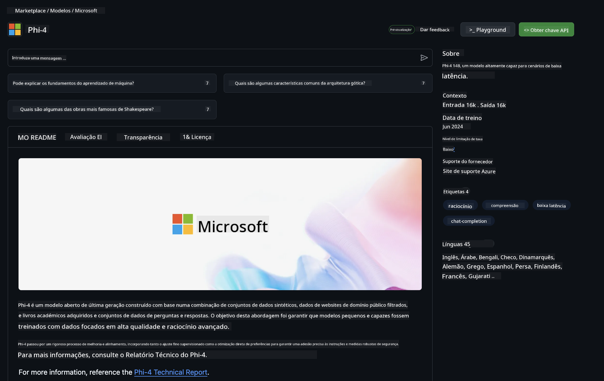

<!--
CO_OP_TRANSLATOR_METADATA:
{
  "original_hash": "fb67a08b9fc911a10ed58081fadef416",
  "translation_date": "2025-07-16T19:00:06+00:00",
  "source_file": "md/01.Introduction/02/02.GitHubModel.md",
  "language_code": "pt"
}
-->
## Família Phi nos Modelos GitHub

Bem-vindo ao [GitHub Models](https://github.com/marketplace/models)! Temos tudo preparado para que explores os Modelos de IA alojados no Azure AI.


Para mais informações sobre os Modelos disponíveis no GitHub Models, consulta o [GitHub Model Marketplace](https://github.com/marketplace/models)

## Modelos Disponíveis

Cada modelo tem um playground dedicado e código de exemplo


### Família Phi no Catálogo de Modelos GitHub

- [Phi-4](https://github.com/marketplace/models/azureml/Phi-4)

- [Phi-3.5-MoE instruct (128k)](https://github.com/marketplace/models/azureml/Phi-3-5-MoE-instruct)

- [Phi-3.5-vision instruct (128k)](https://github.com/marketplace/models/azureml/Phi-3-5-vision-instruct)

- [Phi-3.5-mini instruct (128k)](https://github.com/marketplace/models/azureml/Phi-3-5-mini-instruct)

- [Phi-3-Medium-128k-Instruct](https://github.com/marketplace/models/azureml/Phi-3-medium-128k-instruct)

- [Phi-3-medium-4k-instruct](https://github.com/marketplace/models/azureml/Phi-3-medium-4k-instruct)

- [Phi-3-mini-128k-instruct](https://github.com/marketplace/models/azureml/Phi-3-mini-128k-instruct)

- [Phi-3-mini-4k-instruct](https://github.com/marketplace/models/azureml/Phi-3-mini-4k-instruct)

- [Phi-3-small-128k-instruct](https://github.com/marketplace/models/azureml/Phi-3-small-128k-instruct)

- [Phi-3-small-8k-instruct](https://github.com/marketplace/models/azureml/Phi-3-small-8k-instruct)

## Primeiros Passos

Existem alguns exemplos básicos prontos para executar. Podes encontrá-los na pasta samples. Se quiseres ir diretamente para a tua linguagem preferida, os exemplos estão disponíveis nas seguintes linguagens:

- Python
- JavaScript
- C#
- Java
- cURL

Existe também um ambiente Codespaces dedicado para executar os exemplos e modelos.


## Código de Exemplo

A seguir tens trechos de código para alguns casos de uso. Para mais informações sobre o Azure AI Inference SDK, consulta a documentação completa e os exemplos.

## Configuração

1. Cria um token de acesso pessoal  
Não é necessário atribuir permissões ao token. Nota que o token será enviado a um serviço da Microsoft.

Para usar os trechos de código abaixo, cria uma variável de ambiente para definir o teu token como chave para o código cliente.

Se estiveres a usar bash:  
```
export GITHUB_TOKEN="<your-github-token-goes-here>"
```  
Se estiveres no powershell:  

```
$Env:GITHUB_TOKEN="<your-github-token-goes-here>"
```  

Se estiveres a usar o prompt de comando do Windows:  

```
set GITHUB_TOKEN=<your-github-token-goes-here>
```  

## Exemplo em Python

### Instalar dependências  
Instala o Azure AI Inference SDK usando pip (Requer: Python >=3.8):

```
pip install azure-ai-inference
```  
### Executar um exemplo básico de código

Este exemplo demonstra uma chamada básica à API de chat completion. Está a usar o endpoint de inferência do modelo AI do GitHub e o teu token GitHub. A chamada é síncrona.

```python
import os
from azure.ai.inference import ChatCompletionsClient
from azure.ai.inference.models import SystemMessage, UserMessage
from azure.core.credentials import AzureKeyCredential

endpoint = "https://models.inference.ai.azure.com"
model_name = "Phi-4"
token = os.environ["GITHUB_TOKEN"]

client = ChatCompletionsClient(
    endpoint=endpoint,
    credential=AzureKeyCredential(token),
)

response = client.complete(
    messages=[
        UserMessage(content="I have $20,000 in my savings account, where I receive a 4% profit per year and payments twice a year. Can you please tell me how long it will take for me to become a millionaire? Also, can you please explain the math step by step as if you were explaining it to an uneducated person?"),
    ],
    temperature=0.4,
    top_p=1.0,
    max_tokens=2048,
    model=model_name
)

print(response.choices[0].message.content)
```

### Executar uma conversa multi-turno

Este exemplo demonstra uma conversa multi-turno com a API de chat completion. Ao usar o modelo numa aplicação de chat, precisas de gerir o histórico dessa conversa e enviar as mensagens mais recentes para o modelo.

```
import os
from azure.ai.inference import ChatCompletionsClient
from azure.ai.inference.models import AssistantMessage, SystemMessage, UserMessage
from azure.core.credentials import AzureKeyCredential

token = os.environ["GITHUB_TOKEN"]
endpoint = "https://models.inference.ai.azure.com"
# Replace Model_Name
model_name = "Phi-4"

client = ChatCompletionsClient(
    endpoint=endpoint,
    credential=AzureKeyCredential(token),
)

messages = [
    SystemMessage(content="You are a helpful assistant."),
    UserMessage(content="What is the capital of France?"),
    AssistantMessage(content="The capital of France is Paris."),
    UserMessage(content="What about Spain?"),
]

response = client.complete(messages=messages, model=model_name)

print(response.choices[0].message.content)
```

### Transmitir a saída

Para uma melhor experiência do utilizador, vais querer transmitir a resposta do modelo para que o primeiro token apareça rapidamente e evites esperar por respostas longas.

```
import os
from azure.ai.inference import ChatCompletionsClient
from azure.ai.inference.models import SystemMessage, UserMessage
from azure.core.credentials import AzureKeyCredential

token = os.environ["GITHUB_TOKEN"]
endpoint = "https://models.inference.ai.azure.com"
# Replace Model_Name
model_name = "Phi-4"

client = ChatCompletionsClient(
    endpoint=endpoint,
    credential=AzureKeyCredential(token),
)

response = client.complete(
    stream=True,
    messages=[
        SystemMessage(content="You are a helpful assistant."),
        UserMessage(content="Give me 5 good reasons why I should exercise every day."),
    ],
    model=model_name,
)

for update in response:
    if update.choices:
        print(update.choices[0].delta.content or "", end="")

client.close()
```

## Utilização GRATUITA e Limites de Taxa para os Modelos GitHub



Os [limites de taxa para o playground e uso gratuito da API](https://docs.github.com/en/github-models/prototyping-with-ai-models#rate-limits) destinam-se a ajudar-te a experimentar os modelos e a prototipar a tua aplicação de IA. Para uso além desses limites, e para escalar a tua aplicação, deves provisionar recursos a partir de uma conta Azure e autenticar a partir daí, em vez do teu token de acesso pessoal do GitHub. Não precisas de alterar mais nada no teu código. Usa este link para descobrir como ultrapassar os limites da camada gratuita no Azure AI.

### Avisos

Lembra-te que ao interagir com um modelo estás a experimentar IA, pelo que erros no conteúdo são possíveis.

A funcionalidade está sujeita a vários limites (incluindo pedidos por minuto, pedidos por dia, tokens por pedido e pedidos concorrentes) e não é destinada a casos de uso em produção.

O GitHub Models usa o Azure AI Content Safety. Estes filtros não podem ser desativados como parte da experiência GitHub Models. Se decidires usar modelos através de um serviço pago, por favor configura os teus filtros de conteúdo para satisfazer as tuas necessidades.

Este serviço está sujeito aos Termos de Pré-lançamento do GitHub.

**Aviso Legal**:  
Este documento foi traduzido utilizando o serviço de tradução automática [Co-op Translator](https://github.com/Azure/co-op-translator). Embora nos esforcemos para garantir a precisão, por favor tenha em atenção que traduções automáticas podem conter erros ou imprecisões. O documento original na sua língua nativa deve ser considerado a fonte autorizada. Para informações críticas, recomenda-se a tradução profissional humana. Não nos responsabilizamos por quaisquer mal-entendidos ou interpretações incorretas decorrentes da utilização desta tradução.