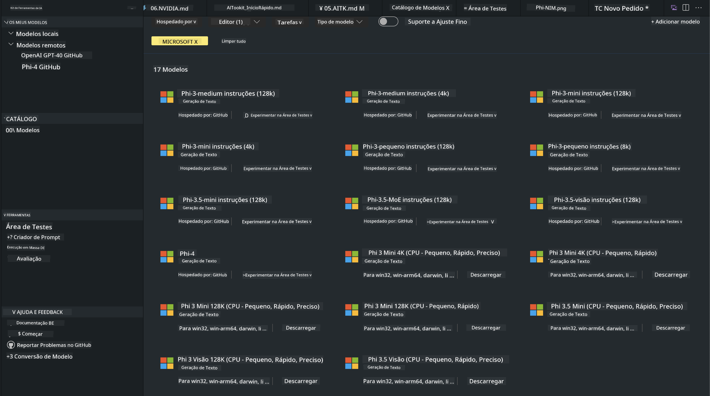
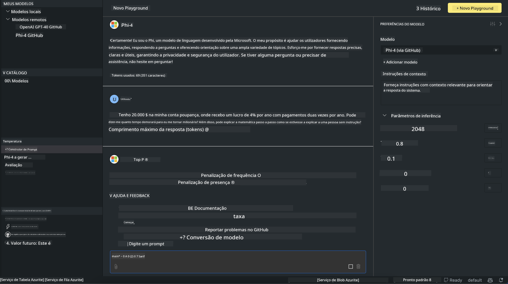

<!--
CO_OP_TRANSLATOR_METADATA:
{
  "original_hash": "4951d458c0b60c02cd1e751b40903877",
  "translation_date": "2025-07-16T19:25:01+00:00",
  "source_file": "md/01.Introduction/02/05.AITK.md",
  "language_code": "pt"
}
-->
# Família Phi no AITK

[AI Toolkit para VS Code](https://marketplace.visualstudio.com/items?itemName=ms-windows-ai-studio.windows-ai-studio) simplifica o desenvolvimento de aplicações de IA generativa ao reunir ferramentas e modelos de desenvolvimento de IA de ponta do Azure AI Foundry Catalog e outros catálogos como o Hugging Face. Poderá navegar pelo catálogo de modelos de IA alimentado pelos GitHub Models e Azure AI Foundry Model Catalogs, descarregá-los localmente ou remotamente, ajustar, testar e usar nos seus projetos.

A pré-visualização do AI Toolkit será executada localmente. A inferência local ou o ajuste fino dependem do modelo selecionado, podendo ser necessário ter uma GPU como a NVIDIA CUDA GPU. Também pode executar os GitHub Models diretamente com o AITK.

## Começar

[Saiba mais sobre como instalar o subsistema Windows para Linux](https://learn.microsoft.com/windows/wsl/install?WT.mc_id=aiml-137032-kinfeylo)

e [como alterar a distribuição padrão](https://learn.microsoft.com/windows/wsl/install#change-the-default-linux-distribution-installed).

[Repositório GitHub do AI Toolkit](https://github.com/microsoft/vscode-ai-toolkit/)

- Windows, Linux, macOS
  
- Para ajuste fino tanto no Windows como no Linux, é necessária uma GPU Nvidia. Além disso, **no Windows** é necessário o subsistema para Linux com a distribuição Ubuntu 18.4 ou superior. [Saiba mais sobre como instalar o subsistema Windows para Linux](https://learn.microsoft.com/windows/wsl/install) e [como alterar a distribuição padrão](https://learn.microsoft.com/windows/wsl/install#change-the-default-linux-distribution-installed).

### Instalar o AI Toolkit

O AI Toolkit é distribuído como uma [Extensão do Visual Studio Code](https://code.visualstudio.com/docs/setup/additional-components#_vs-code-extensions), por isso precisa de instalar primeiro o [VS Code](https://code.visualstudio.com/docs/setup/windows?WT.mc_id=aiml-137032-kinfeylo) e depois descarregar o AI Toolkit a partir do [VS Marketplace](https://marketplace.visualstudio.com/items?itemName=ms-windows-ai-studio.windows-ai-studio).  
O [AI Toolkit está disponível no Visual Studio Marketplace](https://marketplace.visualstudio.com/items?itemName=ms-windows-ai-studio.windows-ai-studio) e pode ser instalado como qualquer outra extensão do VS Code.

Se não estiver familiarizado com a instalação de extensões no VS Code, siga estes passos:

### Iniciar sessão

1. Na Barra de Atividades do VS Code selecione **Extensões**
1. Na barra de pesquisa das Extensões escreva "AI Toolkit"
1. Selecione "AI Toolkit for Visual Studio code"
1. Clique em **Instalar**

Agora está pronto para usar a extensão!

Será solicitado que inicie sessão no GitHub, por isso clique em "Permitir" para continuar. Será redirecionado para a página de login do GitHub.

Por favor, inicie sessão e siga os passos do processo. Após a conclusão com sucesso, será redirecionado para o VS Code.

Depois de instalada a extensão, verá o ícone do AI Toolkit aparecer na sua Barra de Atividades.

Vamos explorar as ações disponíveis!

### Ações Disponíveis

A barra lateral principal do AI Toolkit está organizada em  

- **Modelos**
- **Recursos**
- **Playground**  
- **Ajuste fino**
- **Avaliação**

Estão disponíveis na secção Recursos. Para começar, selecione **Catálogo de Modelos**.

### Descarregar um modelo do catálogo

Ao abrir o AI Toolkit a partir da barra lateral do VS Code, pode escolher entre as seguintes opções:



- Encontrar um modelo suportado no **Catálogo de Modelos** e descarregar localmente
- Testar a inferência do modelo no **Playground do Modelo**
- Ajustar o modelo localmente ou remotamente em **Ajuste Fino do Modelo**
- Desdobrar modelos ajustados para a cloud via a paleta de comandos do AI Toolkit
- Avaliar modelos

> [!NOTE]
>
> **GPU Vs CPU**
>
> Vai reparar que as cartas dos modelos mostram o tamanho do modelo, a plataforma e o tipo de acelerador (CPU, GPU). Para um desempenho otimizado em **dispositivos Windows que tenham pelo menos uma GPU**, selecione versões de modelos que sejam apenas para Windows.
>
> Isto garante que tem um modelo otimizado para o acelerador DirectML.
>
> Os nomes dos modelos seguem o formato
>
> - `{model_name}-{accelerator}-{quantization}-{format}`.
>
>Para verificar se tem uma GPU no seu dispositivo Windows, abra o **Gestor de Tarefas** e selecione o separador **Desempenho**. Se tiver GPU(s), elas aparecerão listadas com nomes como "GPU 0" ou "GPU 1".

### Executar o modelo no playground

Depois de definir todos os parâmetros, clique em **Gerar Projeto**.

Assim que o seu modelo for descarregado, selecione **Carregar no Playground** na carta do modelo no catálogo:

- Iniciar o descarregamento do modelo
- Instalar todos os pré-requisitos e dependências
- Criar o espaço de trabalho no VS Code



### Usar a REST API na sua aplicação

O AI Toolkit inclui um servidor web local REST API **na porta 5272** que usa o [formato de chat completions da OpenAI](https://platform.openai.com/docs/api-reference/chat/create).

Isto permite testar a sua aplicação localmente sem depender de um serviço de modelo de IA na cloud. Por exemplo, o seguinte ficheiro JSON mostra como configurar o corpo do pedido:

```json
{
    "model": "Phi-4",
    "messages": [
        {
            "role": "user",
            "content": "what is the golden ratio?"
        }
    ],
    "temperature": 0.7,
    "top_p": 1,
    "top_k": 10,
    "max_tokens": 100,
    "stream": true
}
```

Pode testar a REST API usando (por exemplo) o [Postman](https://www.postman.com/) ou a ferramenta CURL (Client URL):

```bash
curl -vX POST http://127.0.0.1:5272/v1/chat/completions -H 'Content-Type: application/json' -d @body.json
```

### Usar a biblioteca cliente OpenAI para Python

```python
from openai import OpenAI

client = OpenAI(
    base_url="http://127.0.0.1:5272/v1/", 
    api_key="x" # required for the API but not used
)

chat_completion = client.chat.completions.create(
    messages=[
        {
            "role": "user",
            "content": "what is the golden ratio?",
        }
    ],
    model="Phi-4",
)

print(chat_completion.choices[0].message.content)
```

### Usar a biblioteca cliente Azure OpenAI para .NET

Adicione a [biblioteca cliente Azure OpenAI para .NET](https://www.nuget.org/packages/Azure.AI.OpenAI/) ao seu projeto usando o NuGet:

```bash
dotnet add {project_name} package Azure.AI.OpenAI --version 1.0.0-beta.17
```

Adicione um ficheiro C# chamado **OverridePolicy.cs** ao seu projeto e cole o seguinte código:

```csharp
// OverridePolicy.cs
using Azure.Core.Pipeline;
using Azure.Core;

internal partial class OverrideRequestUriPolicy(Uri overrideUri)
    : HttpPipelineSynchronousPolicy
{
    private readonly Uri _overrideUri = overrideUri;

    public override void OnSendingRequest(HttpMessage message)
    {
        message.Request.Uri.Reset(_overrideUri);
    }
}
```

De seguida, cole o seguinte código no seu ficheiro **Program.cs**:

```csharp
// Program.cs
using Azure.AI.OpenAI;

Uri localhostUri = new("http://localhost:5272/v1/chat/completions");

OpenAIClientOptions clientOptions = new();
clientOptions.AddPolicy(
    new OverrideRequestUriPolicy(localhostUri),
    Azure.Core.HttpPipelinePosition.BeforeTransport);
OpenAIClient client = new(openAIApiKey: "unused", clientOptions);

ChatCompletionsOptions options = new()
{
    DeploymentName = "Phi-4",
    Messages =
    {
        new ChatRequestSystemMessage("You are a helpful assistant. Be brief and succinct."),
        new ChatRequestUserMessage("What is the golden ratio?"),
    }
};

StreamingResponse<StreamingChatCompletionsUpdate> streamingChatResponse
    = await client.GetChatCompletionsStreamingAsync(options);

await foreach (StreamingChatCompletionsUpdate chatChunk in streamingChatResponse)
{
    Console.Write(chatChunk.ContentUpdate);
}
```


## Ajuste Fino com AI Toolkit

- Comece com a descoberta de modelos e playground.
- Ajuste fino e inferência de modelos usando recursos computacionais locais.
- Ajuste fino e inferência remotos usando recursos Azure

[Ajuste Fino com AI Toolkit](../../03.FineTuning/Finetuning_VSCodeaitoolkit.md)

## Recursos de Q&A do AI Toolkit

Consulte a nossa [página de Q&A](https://github.com/microsoft/vscode-ai-toolkit/blob/main/archive/QA.md) para as questões mais comuns e respetivas soluções

**Aviso Legal**:  
Este documento foi traduzido utilizando o serviço de tradução automática [Co-op Translator](https://github.com/Azure/co-op-translator). Embora nos esforcemos pela precisão, por favor tenha em conta que traduções automáticas podem conter erros ou imprecisões. O documento original na sua língua nativa deve ser considerado a fonte autorizada. Para informações críticas, recomenda-se tradução profissional humana. Não nos responsabilizamos por quaisquer mal-entendidos ou interpretações erradas decorrentes da utilização desta tradução.