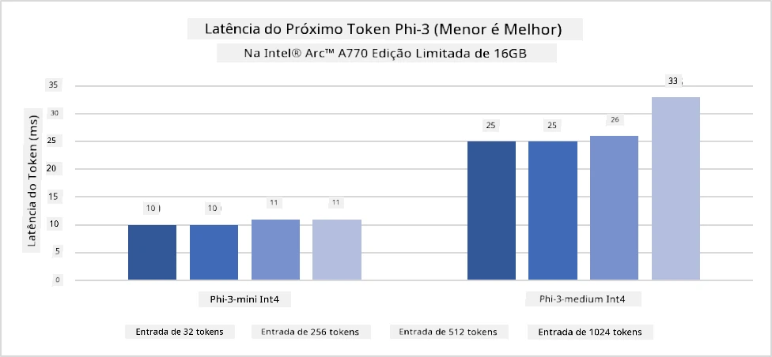
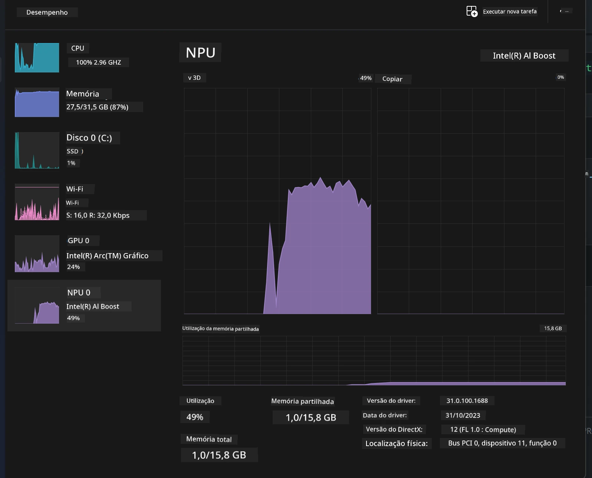
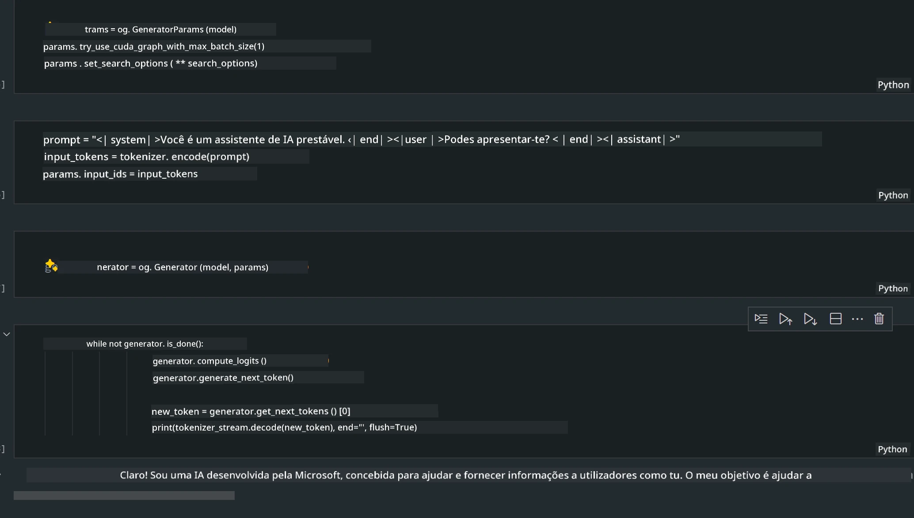
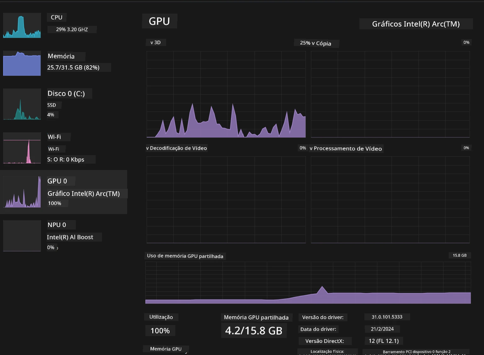

<!--
CO_OP_TRANSLATOR_METADATA:
{
  "original_hash": "e08ce816e23ad813244a09ca34ebb8ac",
  "translation_date": "2025-07-16T19:59:35+00:00",
  "source_file": "md/01.Introduction/03/AIPC_Inference.md",
  "language_code": "pt"
}
-->
# **Inferência Phi-3 em PC com IA**

Com o avanço da IA generativa e a melhoria das capacidades de hardware dos dispositivos edge, um número crescente de modelos de IA generativa pode agora ser integrado nos dispositivos Bring Your Own Device (BYOD) dos utilizadores. Os PCs com IA estão entre esses modelos. A partir de 2024, a Intel, AMD e Qualcomm colaboraram com fabricantes de PCs para lançar PCs com IA que facilitam a implementação de modelos de IA generativa localizados através de modificações de hardware. Nesta discussão, vamos focar-nos nos PCs com IA da Intel e explorar como implementar o Phi-3 num PC com IA da Intel.

### O que é NPU

Uma NPU (Unidade de Processamento Neural) é um processador dedicado ou unidade de processamento num SoC maior, projetado especificamente para acelerar operações de redes neurais e tarefas de IA. Ao contrário das CPUs e GPUs de uso geral, as NPUs são otimizadas para computação paralela orientada a dados, tornando-as altamente eficientes no processamento de grandes volumes de dados multimédia, como vídeos e imagens, e no processamento de dados para redes neurais. São particularmente eficazes em tarefas relacionadas com IA, como reconhecimento de voz, desfocagem de fundo em videochamadas e processos de edição de fotos ou vídeos, como deteção de objetos.

## NPU vs GPU

Embora muitas cargas de trabalho de IA e machine learning sejam executadas em GPUs, existe uma distinção importante entre GPUs e NPUs.  
As GPUs são conhecidas pelas suas capacidades de computação paralela, mas nem todas as GPUs são igualmente eficientes para além do processamento gráfico. As NPUs, por outro lado, são construídas especificamente para os cálculos complexos envolvidos nas operações de redes neurais, tornando-as muito eficazes para tarefas de IA.

Em resumo, as NPUs são os especialistas matemáticos que aceleram as computações de IA, desempenhando um papel fundamental na nova era dos PCs com IA!

***Este exemplo baseia-se no mais recente Processador Intel Core Ultra da Intel***

## **1. Usar NPU para executar o modelo Phi-3**

O dispositivo Intel® NPU é um acelerador de inferência de IA integrado com CPUs cliente Intel, a partir da geração Intel® Core™ Ultra (anteriormente conhecida como Meteor Lake). Permite a execução energeticamente eficiente de tarefas de redes neurais artificiais.




**Intel NPU Acceleration Library**

A Intel NPU Acceleration Library [https://github.com/intel/intel-npu-acceleration-library](https://github.com/intel/intel-npu-acceleration-library) é uma biblioteca Python concebida para aumentar a eficiência das suas aplicações, aproveitando o poder da Unidade de Processamento Neural (NPU) da Intel para realizar cálculos de alta velocidade em hardware compatível.

Exemplo do Phi-3-mini num PC com IA alimentado por processadores Intel® Core™ Ultra.


Instale a biblioteca Python com pip

```bash

   pip install intel-npu-acceleration-library

```

***Nota*** O projeto ainda está em desenvolvimento, mas o modelo de referência já está bastante completo.

### **Executar Phi-3 com Intel NPU Acceleration Library**

Usando a aceleração Intel NPU, esta biblioteca não afeta o processo tradicional de codificação. Só precisa de usar esta biblioteca para quantizar o modelo original Phi-3, como FP16, INT8, INT4, por exemplo

```python
from transformers import AutoTokenizer, pipeline,TextStreamer
from intel_npu_acceleration_library import NPUModelForCausalLM, int4
from intel_npu_acceleration_library.compiler import CompilerConfig
import warnings

model_id = "microsoft/Phi-3-mini-4k-instruct"

compiler_conf = CompilerConfig(dtype=int4)
model = NPUModelForCausalLM.from_pretrained(
    model_id, use_cache=True, config=compiler_conf, attn_implementation="sdpa"
).eval()

tokenizer = AutoTokenizer.from_pretrained(model_id)

text_streamer = TextStreamer(tokenizer, skip_prompt=True)
```

Após a quantização ser bem-sucedida, continue a execução para chamar a NPU e executar o modelo Phi-3.

```python
generation_args = {
   "max_new_tokens": 1024,
   "return_full_text": False,
   "temperature": 0.3,
   "do_sample": False,
   "streamer": text_streamer,
}

pipe = pipeline(
   "text-generation",
   model=model,
   tokenizer=tokenizer,
)

query = "<|system|>You are a helpful AI assistant.<|end|><|user|>Can you introduce yourself?<|end|><|assistant|>"

with warnings.catch_warnings():
    warnings.simplefilter("ignore")
    pipe(query, **generation_args)
```

Ao executar o código, podemos visualizar o estado de funcionamento da NPU através do Gestor de Tarefas



***Exemplos*** : [AIPC_NPU_DEMO.ipynb](../../../../../code/03.Inference/AIPC/AIPC_NPU_DEMO.ipynb)

## **2. Usar DirectML + ONNX Runtime para executar o modelo Phi-3**

### **O que é DirectML**

[DirectML](https://github.com/microsoft/DirectML) é uma biblioteca DirectX 12 acelerada por hardware e de alto desempenho para machine learning. O DirectML fornece aceleração por GPU para tarefas comuns de machine learning numa ampla gama de hardware e drivers suportados, incluindo todas as GPUs compatíveis com DirectX 12 de fornecedores como AMD, Intel, NVIDIA e Qualcomm.

Quando usado isoladamente, a API DirectML é uma biblioteca de baixo nível do DirectX 12, adequada para aplicações de alto desempenho e baixa latência, como frameworks, jogos e outras aplicações em tempo real. A interoperabilidade perfeita do DirectML com o Direct3D 12, bem como o seu baixo overhead e conformidade em diferentes hardwares, torna o DirectML ideal para acelerar machine learning quando se deseja alto desempenho e a fiabilidade e previsibilidade dos resultados em diferentes hardwares é crítica.

***Nota*** : O DirectML mais recente já suporta NPU (https://devblogs.microsoft.com/directx/introducing-neural-processor-unit-npu-support-in-directml-developer-preview/)

### DirectML e CUDA em termos de capacidades e desempenho:

**DirectML** é uma biblioteca de machine learning desenvolvida pela Microsoft. Foi concebida para acelerar cargas de trabalho de machine learning em dispositivos Windows, incluindo desktops, portáteis e dispositivos edge.  
- Baseado em DX12: O DirectML é construído sobre o DirectX 12 (DX12), que oferece uma ampla compatibilidade de hardware em GPUs, incluindo NVIDIA e AMD.  
- Suporte mais amplo: Como utiliza DX12, o DirectML pode funcionar com qualquer GPU que suporte DX12, mesmo GPUs integradas.  
- Processamento de imagens: O DirectML processa imagens e outros dados usando redes neurais, sendo adequado para tarefas como reconhecimento de imagens, deteção de objetos, entre outras.  
- Facilidade de configuração: Configurar o DirectML é simples e não requer SDKs ou bibliotecas específicas dos fabricantes de GPU.  
- Desempenho: Em alguns casos, o DirectML apresenta bom desempenho e pode ser mais rápido que o CUDA, especialmente para certas cargas de trabalho.  
- Limitações: Contudo, há situações em que o DirectML pode ser mais lento, particularmente para grandes lotes em float16.

**CUDA** é a plataforma de computação paralela e modelo de programação da NVIDIA. Permite aos desenvolvedores aproveitar o poder das GPUs NVIDIA para computação geral, incluindo machine learning e simulações científicas.  
- Específico para NVIDIA: O CUDA está fortemente integrado com GPUs NVIDIA e foi projetado especificamente para elas.  
- Altamente otimizado: Proporciona excelente desempenho para tarefas aceleradas por GPU, especialmente com GPUs NVIDIA.  
- Amplamente utilizado: Muitos frameworks e bibliotecas de machine learning (como TensorFlow e PyTorch) suportam CUDA.  
- Personalização: Os desenvolvedores podem ajustar as configurações do CUDA para tarefas específicas, o que pode levar a um desempenho ótimo.  
- Limitações: No entanto, a dependência do CUDA em hardware NVIDIA pode ser limitadora se desejar compatibilidade mais ampla com diferentes GPUs.

### Escolher entre DirectML e CUDA

A escolha entre DirectML e CUDA depende do seu caso de uso específico, disponibilidade de hardware e preferências.  
Se procura maior compatibilidade e facilidade de configuração, o DirectML pode ser uma boa opção. Contudo, se tem GPUs NVIDIA e precisa de desempenho altamente otimizado, o CUDA continua a ser uma escolha forte. Em resumo, ambos têm pontos fortes e fracos, por isso considere os seus requisitos e hardware disponível ao tomar uma decisão.

### **IA generativa com ONNX Runtime**

Na era da IA, a portabilidade dos modelos de IA é muito importante. O ONNX Runtime permite implementar facilmente modelos treinados em diferentes dispositivos. Os desenvolvedores não precisam de se preocupar com o framework de inferência e usam uma API unificada para completar a inferência do modelo. Na era da IA generativa, o ONNX Runtime também realizou otimizações de código (https://onnxruntime.ai/docs/genai/). Através do ONNX Runtime otimizado, o modelo de IA generativa quantizado pode ser inferido em diferentes terminais. No Generative AI com ONNX Runtime, pode inferir modelos de IA através de APIs em Python, C#, C/C++. Claro que a implementação no iPhone pode tirar partido da API Generative AI com ONNX Runtime em C++.

[Código de exemplo](https://github.com/Azure-Samples/Phi-3MiniSamples/tree/main/onnx)

***Compilar a biblioteca generative AI com ONNX Runtime***

```bash

winget install --id=Kitware.CMake  -e

git clone https://github.com/microsoft/onnxruntime.git

cd .\onnxruntime\

./build.bat --build_shared_lib --skip_tests --parallel --use_dml --config Release

cd ../

git clone https://github.com/microsoft/onnxruntime-genai.git

cd .\onnxruntime-genai\

mkdir ort

cd ort

mkdir include

mkdir lib

copy ..\onnxruntime\include\onnxruntime\core\providers\dml\dml_provider_factory.h ort\include

copy ..\onnxruntime\include\onnxruntime\core\session\onnxruntime_c_api.h ort\include

copy ..\onnxruntime\build\Windows\Release\Release\*.dll ort\lib

copy ..\onnxruntime\build\Windows\Release\Release\onnxruntime.lib ort\lib

python build.py --use_dml


```

**Instalar biblioteca**

```bash

pip install .\onnxruntime_genai_directml-0.3.0.dev0-cp310-cp310-win_amd64.whl

```

Este é o resultado da execução



***Exemplos*** : [AIPC_DirectML_DEMO.ipynb](../../../../../code/03.Inference/AIPC/AIPC_DirectML_DEMO.ipynb)

## **3. Usar Intel OpenVino para executar o modelo Phi-3**

### **O que é OpenVINO**

[OpenVINO](https://github.com/openvinotoolkit/openvino) é um toolkit open-source para otimizar e implementar modelos de deep learning. Proporciona desempenho melhorado para modelos de visão, áudio e linguagem de frameworks populares como TensorFlow, PyTorch, entre outros. Comece a usar o OpenVINO. O OpenVINO pode também ser usado em combinação com CPU e GPU para executar o modelo Phi-3.

***Nota***: Atualmente, o OpenVINO não suporta NPU.

### **Instalar biblioteca OpenVINO**

```bash

 pip install git+https://github.com/huggingface/optimum-intel.git

 pip install git+https://github.com/openvinotoolkit/nncf.git

 pip install openvino-nightly

```

### **Executar Phi-3 com OpenVINO**

Tal como a NPU, o OpenVINO executa a chamada dos modelos de IA generativa através da execução de modelos quantizados. Primeiro, é necessário quantizar o modelo Phi-3 e completar a quantização do modelo na linha de comandos através do optimum-cli

**INT4**

```bash

optimum-cli export openvino --model "microsoft/Phi-3-mini-4k-instruct" --task text-generation-with-past --weight-format int4 --group-size 128 --ratio 0.6  --sym  --trust-remote-code ./openvinomodel/phi3/int4

```

**FP16**

```bash

optimum-cli export openvino --model "microsoft/Phi-3-mini-4k-instruct" --task text-generation-with-past --weight-format fp16 --trust-remote-code ./openvinomodel/phi3/fp16

```

o formato convertido, assim


Carregue os caminhos do modelo (model_dir), configurações relacionadas (ov_config = {"PERFORMANCE_HINT": "LATENCY", "NUM_STREAMS": "1", "CACHE_DIR": ""}) e dispositivos acelerados por hardware (GPU.0) através do OVModelForCausalLM

```python

ov_model = OVModelForCausalLM.from_pretrained(
     model_dir,
     device='GPU.0',
     ov_config=ov_config,
     config=AutoConfig.from_pretrained(model_dir, trust_remote_code=True),
     trust_remote_code=True,
)

```

Ao executar o código, podemos visualizar o estado de funcionamento da GPU através do Gestor de Tarefas



***Exemplos*** : [AIPC_OpenVino_Demo.ipynb](../../../../../code/03.Inference/AIPC/AIPC_OpenVino_Demo.ipynb)

### ***Nota*** : Os três métodos acima têm as suas vantagens, mas recomenda-se usar a aceleração NPU para inferência em PCs com IA.

**Aviso Legal**:  
Este documento foi traduzido utilizando o serviço de tradução automática [Co-op Translator](https://github.com/Azure/co-op-translator). Embora nos esforcemos pela precisão, por favor tenha em conta que traduções automáticas podem conter erros ou imprecisões. O documento original na sua língua nativa deve ser considerado a fonte autorizada. Para informações críticas, recomenda-se tradução profissional humana. Não nos responsabilizamos por quaisquer mal-entendidos ou interpretações erradas decorrentes da utilização desta tradução.