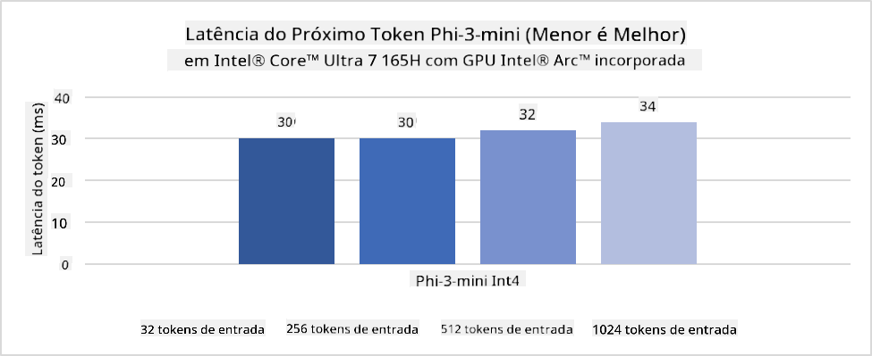
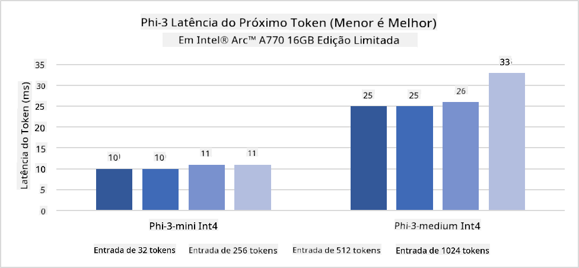
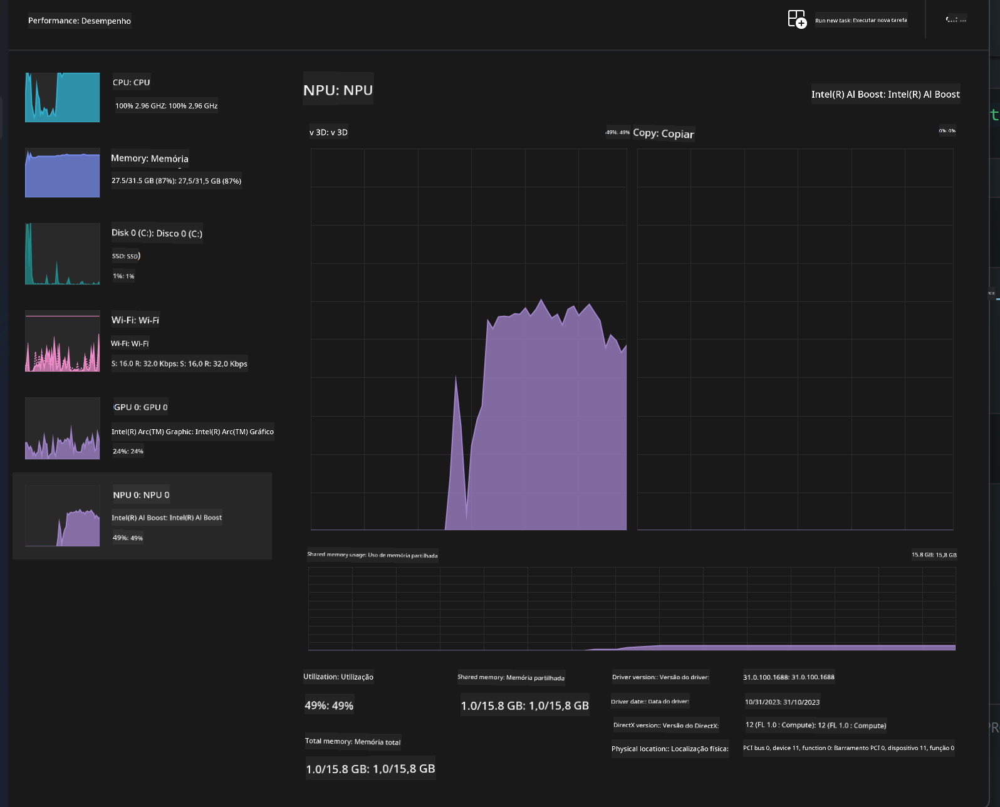
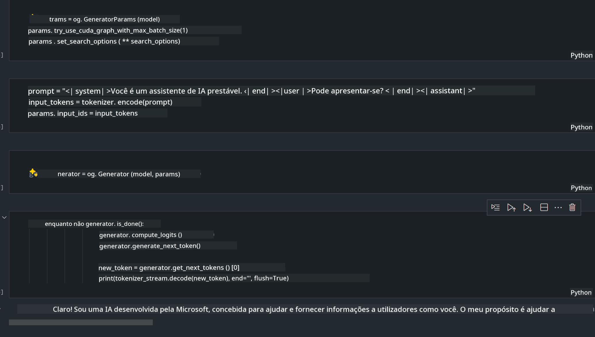
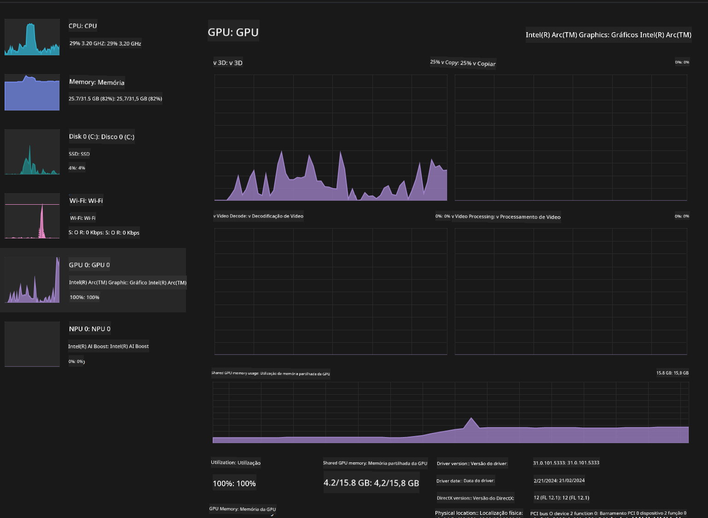

<!--
CO_OP_TRANSLATOR_METADATA:
{
  "original_hash": "e08ce816e23ad813244a09ca34ebb8ac",
  "translation_date": "2025-05-09T10:11:54+00:00",
  "source_file": "md/01.Introduction/03/AIPC_Inference.md",
  "language_code": "pt"
}
-->
# **Inferência Phi-3 em AI PC**

Com o avanço da IA generativa e a melhoria nas capacidades de hardware dos dispositivos de borda, um número crescente de modelos de IA generativa pode agora ser integrado aos dispositivos Bring Your Own Device (BYOD) dos usuários. Os AI PCs estão entre esses modelos. A partir de 2024, Intel, AMD e Qualcomm colaboraram com fabricantes de PCs para lançar AI PCs que facilitam a implantação de modelos generativos locais por meio de modificações no hardware. Nesta discussão, focaremos nos AI PCs da Intel e exploraremos como implantar o Phi-3 em um AI PC Intel.

### O que é NPU

Uma NPU (Unidade de Processamento Neural) é um processador ou unidade de processamento dedicada em um SoC maior, projetada especificamente para acelerar operações de redes neurais e tarefas de IA. Diferente de CPUs e GPUs de uso geral, as NPUs são otimizadas para computação paralela orientada a dados, tornando-as altamente eficientes no processamento de grandes volumes de dados multimídia como vídeos e imagens, além de dados para redes neurais. Elas são especialmente habilidosas em lidar com tarefas relacionadas à IA, como reconhecimento de fala, desfoque de fundo em chamadas de vídeo e processos de edição de fotos ou vídeos, como detecção de objetos.

## NPU vs GPU

Embora muitas cargas de trabalho de IA e aprendizado de máquina rodem em GPUs, há uma distinção importante entre GPUs e NPUs.  
As GPUs são conhecidas por suas capacidades de computação paralela, mas nem todas as GPUs são igualmente eficientes além do processamento gráfico. As NPUs, por outro lado, são construídas para cálculos complexos envolvidos em operações de redes neurais, tornando-as altamente eficazes para tarefas de IA.

Resumindo, as NPUs são os especialistas em matemática que aceleram os cálculos de IA, desempenhando um papel fundamental na nova era dos AI PCs!

***Este exemplo é baseado no mais recente processador Intel Core Ultra da Intel***

## **1. Usando NPU para rodar o modelo Phi-3**

O dispositivo Intel® NPU é um acelerador de inferência de IA integrado às CPUs cliente Intel, a partir da geração Intel® Core™ Ultra (anteriormente conhecida como Meteor Lake). Ele permite a execução energeticamente eficiente de tarefas de redes neurais artificiais.





**Biblioteca de Aceleração Intel NPU**

A Intel NPU Acceleration Library [https://github.com/intel/intel-npu-acceleration-library](https://github.com/intel/intel-npu-acceleration-library) é uma biblioteca Python projetada para aumentar a eficiência das suas aplicações, aproveitando o poder da Intel Neural Processing Unit (NPU) para realizar cálculos em alta velocidade em hardware compatível.

Exemplo do Phi-3-mini em AI PC com processadores Intel® Core™ Ultra.


Instale a biblioteca Python com pip

```bash

   pip install intel-npu-acceleration-library

```

***Nota*** O projeto ainda está em desenvolvimento, mas o modelo de referência já está bastante completo.

### **Executando Phi-3 com Intel NPU Acceleration Library**

Usando a aceleração Intel NPU, esta biblioteca não afeta o processo tradicional de codificação. Você só precisa usar esta biblioteca para quantizar o modelo original Phi-3, como FP16, INT8, INT4, por exemplo:

```python
from transformers import AutoTokenizer, pipeline,TextStreamer
from intel_npu_acceleration_library import NPUModelForCausalLM, int4
from intel_npu_acceleration_library.compiler import CompilerConfig
import warnings

model_id = "microsoft/Phi-3-mini-4k-instruct"

compiler_conf = CompilerConfig(dtype=int4)
model = NPUModelForCausalLM.from_pretrained(
    model_id, use_cache=True, config=compiler_conf, attn_implementation="sdpa"
).eval()

tokenizer = AutoTokenizer.from_pretrained(model_id)

text_streamer = TextStreamer(tokenizer, skip_prompt=True)
```

Após a quantização ser concluída com sucesso, continue a execução para chamar a NPU e rodar o modelo Phi-3.

```python
generation_args = {
   "max_new_tokens": 1024,
   "return_full_text": False,
   "temperature": 0.3,
   "do_sample": False,
   "streamer": text_streamer,
}

pipe = pipeline(
   "text-generation",
   model=model,
   tokenizer=tokenizer,
)

query = "<|system|>You are a helpful AI assistant.<|end|><|user|>Can you introduce yourself?<|end|><|assistant|>"

with warnings.catch_warnings():
    warnings.simplefilter("ignore")
    pipe(query, **generation_args)
```

Ao executar o código, podemos visualizar o status da NPU pelo Gerenciador de Tarefas



***Exemplos*** : [AIPC_NPU_DEMO.ipynb](../../../../../code/03.Inference/AIPC/AIPC_NPU_DEMO.ipynb)

## **2. Usando DirectML + ONNX Runtime para rodar o modelo Phi-3**

### **O que é DirectML**

[DirectML](https://github.com/microsoft/DirectML) é uma biblioteca DirectX 12 acelerada por hardware e de alto desempenho para aprendizado de máquina. O DirectML oferece aceleração por GPU para tarefas comuns de aprendizado de máquina em uma ampla variedade de hardware e drivers suportados, incluindo todas as GPUs compatíveis com DirectX 12 de fabricantes como AMD, Intel, NVIDIA e Qualcomm.

Quando usado isoladamente, a API DirectML é uma biblioteca de baixo nível do DirectX 12, adequada para aplicações de alto desempenho e baixa latência, como frameworks, jogos e outras aplicações em tempo real. A interoperabilidade perfeita do DirectML com o Direct3D 12, assim como sua baixa sobrecarga e conformidade em diferentes hardwares, tornam o DirectML ideal para acelerar aprendizado de máquina quando se deseja alto desempenho, confiabilidade e previsibilidade dos resultados em diferentes hardwares.

***Nota*** : A versão mais recente do DirectML já suporta NPU (https://devblogs.microsoft.com/directx/introducing-neural-processor-unit-npu-support-in-directml-developer-preview/)

### DirectML e CUDA em termos de capacidades e desempenho:

**DirectML** é uma biblioteca de aprendizado de máquina desenvolvida pela Microsoft. Ela foi criada para acelerar cargas de trabalho de aprendizado de máquina em dispositivos Windows, incluindo desktops, laptops e dispositivos de borda.  
- Baseada em DX12: DirectML é construída sobre o DirectX 12 (DX12), que oferece ampla compatibilidade de hardware em GPUs, incluindo NVIDIA e AMD.  
- Suporte Amplo: Como usa DX12, DirectML pode funcionar com qualquer GPU que suporte DX12, até mesmo GPUs integradas.  
- Processamento de Imagens: DirectML processa imagens e outros dados usando redes neurais, sendo adequada para tarefas como reconhecimento de imagens, detecção de objetos, entre outras.  
- Facilidade de Configuração: Configurar o DirectML é simples e não requer SDKs ou bibliotecas específicas dos fabricantes de GPU.  
- Desempenho: Em alguns casos, o DirectML apresenta bom desempenho e pode ser mais rápido que o CUDA, especialmente para certas cargas de trabalho.  
- Limitações: Contudo, há situações em que o DirectML pode ser mais lento, principalmente para lotes grandes em float16.

**CUDA** é a plataforma de computação paralela e modelo de programação da NVIDIA. Ela permite que desenvolvedores aproveitem o poder das GPUs NVIDIA para computação geral, incluindo aprendizado de máquina e simulações científicas.  
- Específico para NVIDIA: CUDA é fortemente integrado às GPUs NVIDIA e projetado especificamente para elas.  
- Altamente Otimizado: Proporciona excelente desempenho para tarefas aceleradas por GPU, especialmente com GPUs NVIDIA.  
- Amplamente Usado: Muitos frameworks e bibliotecas de aprendizado de máquina (como TensorFlow e PyTorch) suportam CUDA.  
- Personalização: Desenvolvedores podem ajustar configurações do CUDA para tarefas específicas, o que pode levar a desempenho ideal.  
- Limitações: A dependência do hardware NVIDIA pode ser limitante se você busca compatibilidade mais ampla entre diferentes GPUs.

### Escolhendo entre DirectML e CUDA

A escolha entre DirectML e CUDA depende do seu caso de uso, disponibilidade de hardware e preferências.  
Se você busca compatibilidade mais ampla e facilidade de configuração, o DirectML pode ser uma boa escolha. Porém, se possui GPUs NVIDIA e precisa de desempenho altamente otimizado, o CUDA continua sendo uma opção forte. Em resumo, ambos têm pontos fortes e fracos, então considere suas necessidades e o hardware disponível ao decidir.

### **IA Generativa com ONNX Runtime**

Na era da IA, a portabilidade dos modelos de IA é muito importante. O ONNX Runtime permite implantar modelos treinados facilmente em diferentes dispositivos. Os desenvolvedores não precisam se preocupar com o framework de inferência e podem usar uma API unificada para realizar a inferência do modelo. Na era da IA generativa, o ONNX Runtime também realizou otimizações de código (https://onnxruntime.ai/docs/genai/). Por meio do ONNX Runtime otimizado, o modelo generativo quantizado pode ser inferido em diferentes terminais. Na IA Generativa com ONNX Runtime, você pode inferir modelos de IA via APIs em Python, C#, C/C++. Claro, a implantação no iPhone pode aproveitar a API de IA Generativa com ONNX Runtime em C++.

[Código de Exemplo](https://github.com/Azure-Samples/Phi-3MiniSamples/tree/main/onnx)

***Compilando biblioteca de IA generativa com ONNX Runtime***

```bash

winget install --id=Kitware.CMake  -e

git clone https://github.com/microsoft/onnxruntime.git

cd .\onnxruntime\

./build.bat --build_shared_lib --skip_tests --parallel --use_dml --config Release

cd ../

git clone https://github.com/microsoft/onnxruntime-genai.git

cd .\onnxruntime-genai\

mkdir ort

cd ort

mkdir include

mkdir lib

copy ..\onnxruntime\include\onnxruntime\core\providers\dml\dml_provider_factory.h ort\include

copy ..\onnxruntime\include\onnxruntime\core\session\onnxruntime_c_api.h ort\include

copy ..\onnxruntime\build\Windows\Release\Release\*.dll ort\lib

copy ..\onnxruntime\build\Windows\Release\Release\onnxruntime.lib ort\lib

python build.py --use_dml


```

**Instalar biblioteca**

```bash

pip install .\onnxruntime_genai_directml-0.3.0.dev0-cp310-cp310-win_amd64.whl

```

Este é o resultado da execução



***Exemplos*** : [AIPC_DirectML_DEMO.ipynb](../../../../../code/03.Inference/AIPC/AIPC_DirectML_DEMO.ipynb)

## **3. Usando Intel OpenVino para rodar o modelo Phi-3**

### **O que é OpenVINO**

[OpenVINO](https://github.com/openvinotoolkit/openvino) é um kit de ferramentas open-source para otimização e implantação de modelos de deep learning. Ele oferece desempenho aprimorado para modelos de visão, áudio e linguagem de frameworks populares como TensorFlow, PyTorch e outros. Comece com o OpenVINO. O OpenVINO também pode ser usado em combinação com CPU e GPU para rodar o modelo Phi-3.

***Nota***: Atualmente, o OpenVINO não suporta NPU.

### **Instalando a biblioteca OpenVINO**

```bash

 pip install git+https://github.com/huggingface/optimum-intel.git

 pip install git+https://github.com/openvinotoolkit/nncf.git

 pip install openvino-nightly

```

### **Executando Phi-3 com OpenVINO**

Assim como a NPU, o OpenVINO realiza a chamada dos modelos generativos executando modelos quantizados. Primeiro, precisamos quantizar o modelo Phi-3 e completar a quantização do modelo na linha de comando via optimum-cli.

**INT4**

```bash

optimum-cli export openvino --model "microsoft/Phi-3-mini-4k-instruct" --task text-generation-with-past --weight-format int4 --group-size 128 --ratio 0.6  --sym  --trust-remote-code ./openvinomodel/phi3/int4

```

**FP16**

```bash

optimum-cli export openvino --model "microsoft/Phi-3-mini-4k-instruct" --task text-generation-with-past --weight-format fp16 --trust-remote-code ./openvinomodel/phi3/fp16

```

o formato convertido, assim:


Carregue os caminhos do modelo (model_dir), as configurações relacionadas (ov_config = {"PERFORMANCE_HINT": "LATENCY", "NUM_STREAMS": "1", "CACHE_DIR": ""}) e os dispositivos acelerados por hardware (GPU.0) via OVModelForCausalLM

```python

ov_model = OVModelForCausalLM.from_pretrained(
     model_dir,
     device='GPU.0',
     ov_config=ov_config,
     config=AutoConfig.from_pretrained(model_dir, trust_remote_code=True),
     trust_remote_code=True,
)

```

Ao executar o código, podemos visualizar o status da GPU pelo Gerenciador de Tarefas



***Exemplos*** : [AIPC_OpenVino_Demo.ipynb](../../../../../code/03.Inference/AIPC/AIPC_OpenVino_Demo.ipynb)

### ***Nota*** : Os três métodos acima têm suas vantagens, mas recomenda-se usar a aceleração NPU para inferência em AI PC.

**Aviso Legal**:  
Este documento foi traduzido utilizando o serviço de tradução por IA [Co-op Translator](https://github.com/Azure/co-op-translator). Embora nos esforcemos para garantir a precisão, esteja ciente de que traduções automáticas podem conter erros ou imprecisões. O documento original em seu idioma nativo deve ser considerado a fonte autorizada. Para informações críticas, recomenda-se tradução profissional humana. Não nos responsabilizamos por quaisquer mal-entendidos ou interpretações incorretas decorrentes do uso desta tradução.