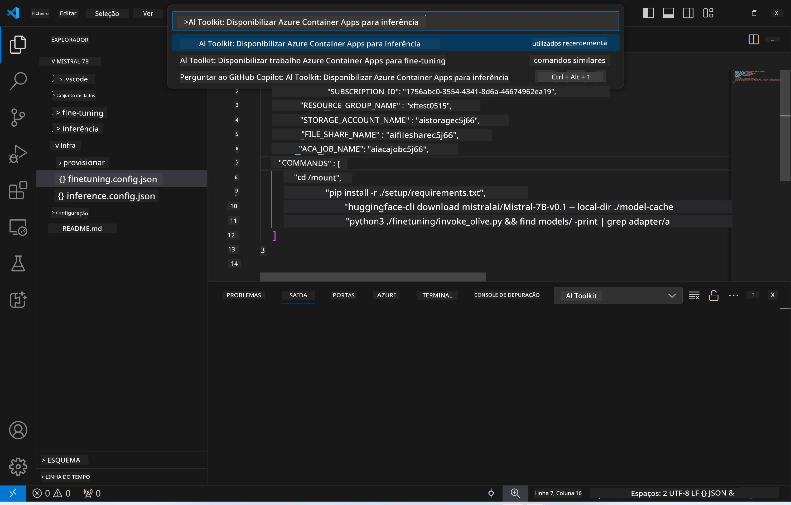
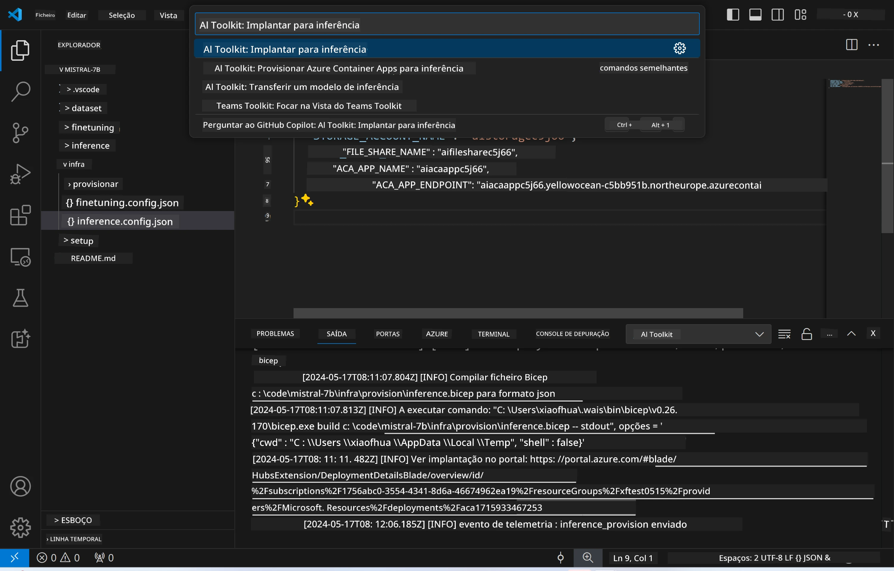
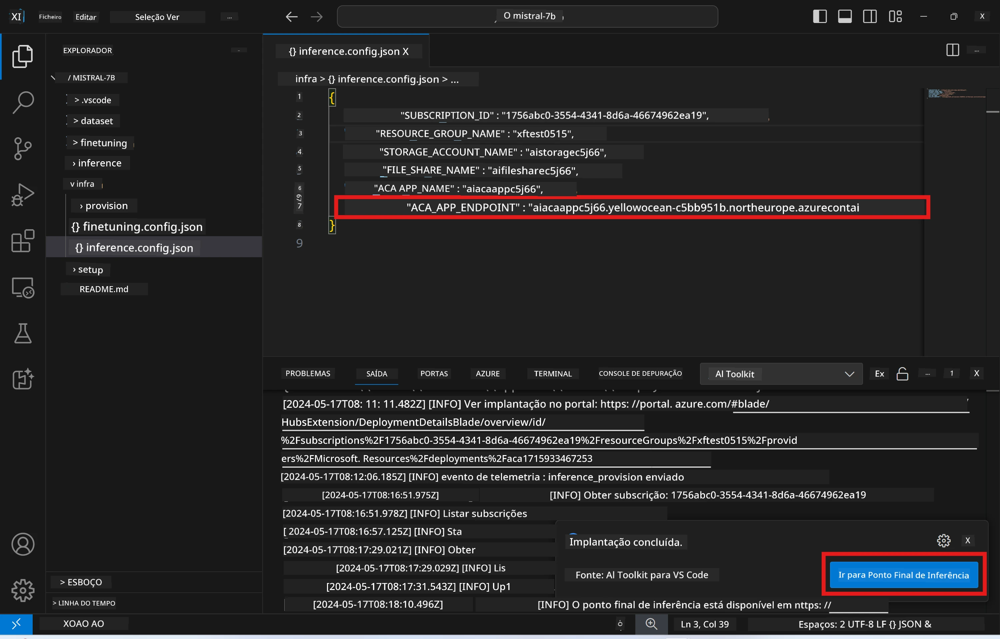

<!--
CO_OP_TRANSLATOR_METADATA:
{
  "original_hash": "a54cd3d65b6963e4e8ce21e143c3ab04",
  "translation_date": "2025-07-16T21:18:03+00:00",
  "source_file": "md/01.Introduction/03/Remote_Interence.md",
  "language_code": "pt"
}
-->
# Inferência Remota com o modelo ajustado

Depois de os adaptadores serem treinados no ambiente remoto, utilize uma aplicação simples Gradio para interagir com o modelo.


### Provisionar Recursos Azure  
É necessário configurar os Recursos Azure para inferência remota executando o comando `AI Toolkit: Provision Azure Container Apps for inference` a partir da paleta de comandos. Durante esta configuração, será solicitado que selecione a sua Subscrição Azure e o grupo de recursos.  

   
Por padrão, a subscrição e o grupo de recursos para inferência devem ser os mesmos usados para o fine-tuning. A inferência irá utilizar o mesmo Ambiente Azure Container App e aceder ao modelo e ao adaptador de modelo armazenados no Azure Files, que foram gerados durante a etapa de fine-tuning.

## Utilização do AI Toolkit

### Desdobramento para Inferência  
Se desejar rever o código de inferência ou recarregar o modelo de inferência, execute o comando `AI Toolkit: Deploy for inference`. Isto irá sincronizar o seu código mais recente com o ACA e reiniciar a réplica.



Após a conclusão bem-sucedida do desdobramento, o modelo estará pronto para avaliação através deste endpoint.

### Aceder à API de Inferência

Pode aceder à API de inferência clicando no botão "*Go to Inference Endpoint*" exibido na notificação do VSCode. Alternativamente, o endpoint da API web pode ser encontrado em `ACA_APP_ENDPOINT` no ficheiro `./infra/inference.config.json` e no painel de saída.



> **Note:** O endpoint de inferência pode demorar alguns minutos a ficar totalmente operacional.

## Componentes de Inferência Incluídos no Template

| Pasta | Conteúdos |
| ------ |--------- |
| `infra` | Contém todas as configurações necessárias para operações remotas. |
| `infra/provision/inference.parameters.json` | Contém os parâmetros para os templates bicep, usados para provisionar recursos Azure para inferência. |
| `infra/provision/inference.bicep` | Contém os templates para provisionar recursos Azure para inferência. |
| `infra/inference.config.json` | O ficheiro de configuração, gerado pelo comando `AI Toolkit: Provision Azure Container Apps for inference`. É usado como input para outros comandos remotos na paleta. |

### Utilizar o AI Toolkit para configurar o Provisionamento de Recursos Azure  
Configure o [AI Toolkit](https://marketplace.visualstudio.com/items?itemName=ms-windows-ai-studio.windows-ai-studio)

Execute o comando `Provision Azure Container Apps for inference`.

Pode encontrar os parâmetros de configuração no ficheiro `./infra/provision/inference.parameters.json`. Aqui estão os detalhes:  
| Parâmetro | Descrição |
| --------- |------------ |
| `defaultCommands` | Comandos para iniciar uma API web. |
| `maximumInstanceCount` | Define a capacidade máxima de instâncias GPU. |
| `location` | Localização onde os recursos Azure são provisionados. O valor padrão é o mesmo da localização do grupo de recursos escolhido. |
| `storageAccountName`, `fileShareName`, `acaEnvironmentName`, `acaEnvironmentStorageName`, `acaAppName`, `acaLogAnalyticsName` | Estes parâmetros são usados para nomear os recursos Azure a provisionar. Por padrão, serão iguais ao nome do recurso usado no fine-tuning. Pode inserir um nome novo e não utilizado para criar recursos personalizados, ou pode inserir o nome de um recurso Azure já existente caso prefira usá-lo. Para mais detalhes, consulte a secção [Using existing Azure Resources](../../../../../md/01.Introduction/03). |

### Utilizar Recursos Azure Existentes

Por padrão, o provisionamento para inferência usa o mesmo Ambiente Azure Container App, Conta de Armazenamento, Azure File Share e Azure Log Analytics que foram usados no fine-tuning. É criado um Azure Container App separado exclusivamente para a API de inferência.

Se personalizou os recursos Azure durante o fine-tuning ou pretende usar os seus próprios recursos Azure existentes para inferência, especifique os seus nomes no ficheiro `./infra/inference.parameters.json`. Depois, execute o comando `AI Toolkit: Provision Azure Container Apps for inference` na paleta de comandos. Isto atualiza os recursos especificados e cria os que estiverem em falta.

Por exemplo, se tiver um ambiente de contentor Azure existente, o seu ficheiro `./infra/finetuning.parameters.json` deverá ser semelhante a este:

```json
{
    "$schema": "https://schema.management.azure.com/schemas/2019-04-01/deploymentParameters.json#",
    "contentVersion": "1.0.0.0",
    "parameters": {
      ...
      "acaEnvironmentName": {
        "value": "<your-aca-env-name>"
      },
      "acaEnvironmentStorageName": {
        "value": null
      },
      ...
    }
  }
```

### Provisionamento Manual  
Se preferir configurar manualmente os recursos Azure, pode usar os ficheiros bicep fornecidos nas pastas `./infra/provision`. Se já tiver configurado todos os recursos Azure sem usar a paleta de comandos do AI Toolkit, pode simplesmente inserir os nomes dos recursos no ficheiro `inference.config.json`.

Por exemplo:

```json
{
  "SUBSCRIPTION_ID": "<your-subscription-id>",
  "RESOURCE_GROUP_NAME": "<your-resource-group-name>",
  "STORAGE_ACCOUNT_NAME": "<your-storage-account-name>",
  "FILE_SHARE_NAME": "<your-file-share-name>",
  "ACA_APP_NAME": "<your-aca-name>",
  "ACA_APP_ENDPOINT": "<your-aca-endpoint>"
}
```

**Aviso Legal**:  
Este documento foi traduzido utilizando o serviço de tradução automática [Co-op Translator](https://github.com/Azure/co-op-translator). Embora nos esforcemos pela precisão, por favor tenha em conta que traduções automáticas podem conter erros ou imprecisões. O documento original na sua língua nativa deve ser considerado a fonte autorizada. Para informações críticas, recomenda-se tradução profissional humana. Não nos responsabilizamos por quaisquer mal-entendidos ou interpretações incorretas decorrentes da utilização desta tradução.