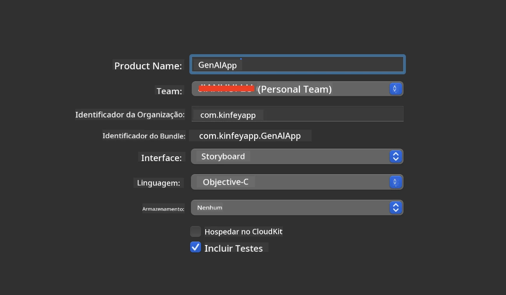
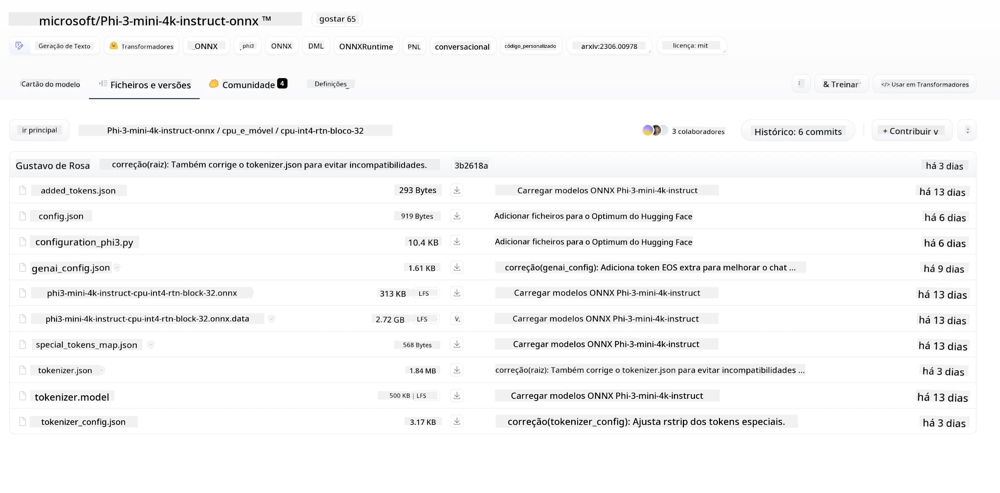
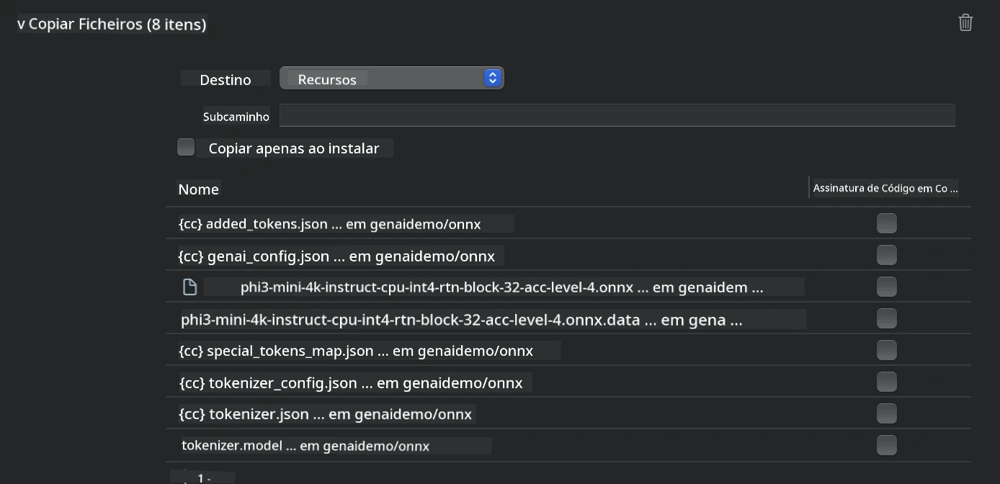
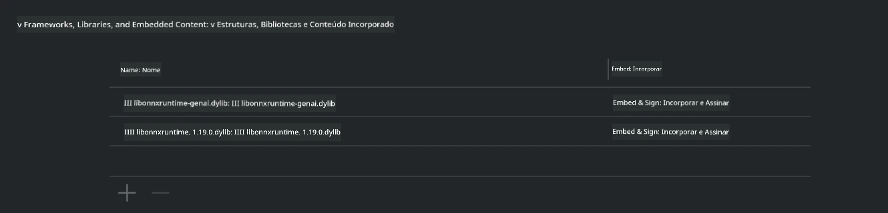
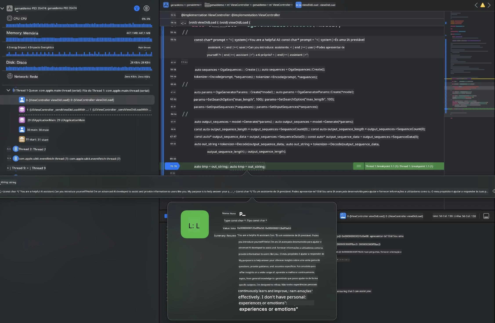

<!--
CO_OP_TRANSLATOR_METADATA:
{
  "original_hash": "82af197df38d25346a98f1f0e84d1698",
  "translation_date": "2025-07-16T20:20:38+00:00",
  "source_file": "md/01.Introduction/03/iOS_Inference.md",
  "language_code": "pt"
}
-->
# **Inferência Phi-3 no iOS**

Phi-3-mini é uma nova série de modelos da Microsoft que permite a implementação de Large Language Models (LLMs) em dispositivos edge e dispositivos IoT. O Phi-3-mini está disponível para implementações em iOS, Android e dispositivos Edge, permitindo que a IA generativa seja implementada em ambientes BYOD. O exemplo seguinte demonstra como implementar o Phi-3-mini no iOS.

## **1. Preparação**

- **a.** macOS 14+
- **b.** Xcode 15+
- **c.** iOS SDK 17.x (iPhone 14 A16 ou superior)
- **d.** Instalar Python 3.10+ (recomenda-se Conda)
- **e.** Instalar a biblioteca Python: `python-flatbuffers`
- **f.** Instalar CMake

### Semantic Kernel e Inferência

Semantic Kernel é um framework de aplicação que permite criar aplicações compatíveis com Azure OpenAI Service, modelos OpenAI e até modelos locais. Aceder a serviços locais através do Semantic Kernel facilita a integração com o seu servidor de modelos Phi-3-mini auto-hospedado.

### Chamar Modelos Quantizados com Ollama ou LlamaEdge

Muitos utilizadores preferem usar modelos quantizados para executar modelos localmente. [Ollama](https://ollama.com) e [LlamaEdge](https://llamaedge.com) permitem aos utilizadores chamar diferentes modelos quantizados:

#### **Ollama**

Pode executar `ollama run phi3` diretamente ou configurá-lo offline. Crie um Modelfile com o caminho para o seu ficheiro `gguf`. Código de exemplo para executar o modelo quantizado Phi-3-mini:

```gguf
FROM {Add your gguf file path}
TEMPLATE \"\"\"<|user|> .Prompt<|end|> <|assistant|>\"\"\"
PARAMETER stop <|end|>
PARAMETER num_ctx 4096
```

#### **LlamaEdge**

Se quiser usar `gguf` tanto na cloud como em dispositivos edge simultaneamente, o LlamaEdge é uma excelente opção.

## **2. Compilar ONNX Runtime para iOS**

```bash

git clone https://github.com/microsoft/onnxruntime.git

cd onnxruntime

./build.sh --build_shared_lib --ios --skip_tests --parallel --build_dir ./build_ios --ios --apple_sysroot iphoneos --osx_arch arm64 --apple_deploy_target 17.5 --cmake_generator Xcode --config Release

cd ../

```

### **Aviso**

- **a.** Antes de compilar, certifique-se de que o Xcode está corretamente configurado e defina-o como o diretório ativo de desenvolvimento no terminal:

    ```bash
    sudo xcode-select -switch /Applications/Xcode.app/Contents/Developer
    ```

- **b.** O ONNX Runtime precisa de ser compilado para diferentes plataformas. Para iOS, pode compilar para `arm64` ou `x86_64`.

- **c.** Recomenda-se usar o SDK iOS mais recente para a compilação. No entanto, pode também usar uma versão mais antiga se precisar de compatibilidade com SDKs anteriores.

## **3. Compilar IA Generativa com ONNX Runtime para iOS**

> **Nota:** Como a IA Generativa com ONNX Runtime está em pré-visualização, esteja atento a possíveis alterações.

```bash

git clone https://github.com/microsoft/onnxruntime-genai
 
cd onnxruntime-genai
 
mkdir ort
 
cd ort
 
mkdir include
 
mkdir lib
 
cd ../
 
cp ../onnxruntime/include/onnxruntime/core/session/onnxruntime_c_api.h ort/include
 
cp ../onnxruntime/build_ios/Release/Release-iphoneos/libonnxruntime*.dylib* ort/lib
 
export OPENCV_SKIP_XCODEBUILD_FORCE_TRYCOMPILE_DEBUG=1
 
python3 build.py --parallel --build_dir ./build_ios --ios --ios_sysroot iphoneos --ios_arch arm64 --ios_deployment_target 17.5 --cmake_generator Xcode --cmake_extra_defines CMAKE_XCODE_ATTRIBUTE_CODE_SIGNING_ALLOWED=NO

```

## **4. Criar uma aplicação App no Xcode**

Escolhi Objective-C como método de desenvolvimento da App, porque ao usar a API C++ do ONNX Runtime para IA Generativa, o Objective-C é mais compatível. Claro que também pode completar as chamadas relacionadas através do bridging com Swift.



## **5. Copiar o modelo ONNX quantizado INT4 para o projeto da aplicação App**

Precisamos importar o modelo de quantização INT4 em formato ONNX, que deve ser descarregado primeiro.



Depois de descarregar, é necessário adicioná-lo à diretoria Resources do projeto no Xcode.



## **6. Adicionar a API C++ nos ViewControllers**

> **Aviso:**

- **a.** Adicione os ficheiros header C++ correspondentes ao projeto.

  

- **b.** Inclua a biblioteca dinâmica `onnxruntime-genai` no Xcode.

  

- **c.** Use o código de exemplos em C para testes. Pode também adicionar funcionalidades adicionais como ChatUI para mais funcionalidades.

- **d.** Como precisa de usar C++ no seu projeto, renomeie `ViewController.m` para `ViewController.mm` para ativar o suporte Objective-C++.

```objc

    NSString *llmPath = [[NSBundle mainBundle] resourcePath];
    char const *modelPath = llmPath.cString;

    auto model =  OgaModel::Create(modelPath);

    auto tokenizer = OgaTokenizer::Create(*model);

    const char* prompt = "<|system|>You are a helpful AI assistant.<|end|><|user|>Can you introduce yourself?<|end|><|assistant|>";

    auto sequences = OgaSequences::Create();
    tokenizer->Encode(prompt, *sequences);

    auto params = OgaGeneratorParams::Create(*model);
    params->SetSearchOption("max_length", 100);
    params->SetInputSequences(*sequences);

    auto output_sequences = model->Generate(*params);
    const auto output_sequence_length = output_sequences->SequenceCount(0);
    const auto* output_sequence_data = output_sequences->SequenceData(0);
    auto out_string = tokenizer->Decode(output_sequence_data, output_sequence_length);
    
    auto tmp = out_string;

```

## **7. Executar a Aplicação**

Depois de concluir a configuração, pode executar a aplicação para ver os resultados da inferência do modelo Phi-3-mini.



Para mais código de exemplo e instruções detalhadas, visite o [repositório Phi-3 Mini Samples](https://github.com/Azure-Samples/Phi-3MiniSamples/tree/main/ios).

**Aviso Legal**:  
Este documento foi traduzido utilizando o serviço de tradução automática [Co-op Translator](https://github.com/Azure/co-op-translator). Embora nos esforcemos para garantir a precisão, por favor tenha em conta que traduções automáticas podem conter erros ou imprecisões. O documento original na sua língua nativa deve ser considerado a fonte autorizada. Para informações críticas, recomenda-se a tradução profissional humana. Não nos responsabilizamos por quaisquer mal-entendidos ou interpretações erradas decorrentes da utilização desta tradução.