<!--
CO_OP_TRANSLATOR_METADATA:
{
  "original_hash": "455be2b7b9c3390d367d528f8fab2aa0",
  "translation_date": "2025-07-17T00:23:03+00:00",
  "source_file": "md/02.Application/01.TextAndChat/Phi3/E2E_Phi-3-FineTuning_PromptFlow_Integration.md",
  "language_code": "pt"
}
-->
# Ajustar e Integrar modelos Phi-3 personalizados com Prompt flow

Este exemplo de ponta a ponta (E2E) baseia-se no guia "[Fine-Tune and Integrate Custom Phi-3 Models with Prompt Flow: Step-by-Step Guide](https://techcommunity.microsoft.com/t5/educator-developer-blog/fine-tune-and-integrate-custom-phi-3-models-with-prompt-flow/ba-p/4178612?WT.mc_id=aiml-137032-kinfeylo)" da Microsoft Tech Community. Apresenta os processos de ajuste fino, implementação e integração de modelos Phi-3 personalizados com Prompt flow.

## Visão geral

Neste exemplo E2E, irá aprender como ajustar o modelo Phi-3 e integrá-lo com Prompt flow. Ao tirar partido do Azure Machine Learning e do Prompt flow, irá estabelecer um fluxo de trabalho para implementar e utilizar modelos de IA personalizados. Este exemplo E2E está dividido em três cenários:

**Cenário 1: Configurar recursos Azure e preparar para ajuste fino**

**Cenário 2: Ajustar o modelo Phi-3 e implementar no Azure Machine Learning Studio**

**Cenário 3: Integrar com Prompt flow e conversar com o seu modelo personalizado**

Aqui está uma visão geral deste exemplo E2E.


### Índice

1. **[Cenário 1: Configurar recursos Azure e preparar para ajuste fino](../../../../../../md/02.Application/01.TextAndChat/Phi3)**
    - [Criar um Workspace Azure Machine Learning](../../../../../../md/02.Application/01.TextAndChat/Phi3)
    - [Solicitar quotas de GPU na subscrição Azure](../../../../../../md/02.Application/01.TextAndChat/Phi3)
    - [Adicionar atribuição de função](../../../../../../md/02.Application/01.TextAndChat/Phi3)
    - [Configurar projeto](../../../../../../md/02.Application/01.TextAndChat/Phi3)
    - [Preparar conjunto de dados para ajuste fino](../../../../../../md/02.Application/01.TextAndChat/Phi3)

1. **[Cenário 2: Ajustar o modelo Phi-3 e implementar no Azure Machine Learning Studio](../../../../../../md/02.Application/01.TextAndChat/Phi3)**
    - [Configurar Azure CLI](../../../../../../md/02.Application/01.TextAndChat/Phi3)
    - [Ajustar o modelo Phi-3](../../../../../../md/02.Application/01.TextAndChat/Phi3)
    - [Implementar o modelo ajustado](../../../../../../md/02.Application/01.TextAndChat/Phi3)

1. **[Cenário 3: Integrar com Prompt flow e conversar com o seu modelo personalizado](../../../../../../md/02.Application/01.TextAndChat/Phi3)**
    - [Integrar o modelo Phi-3 personalizado com Prompt flow](../../../../../../md/02.Application/01.TextAndChat/Phi3)
    - [Conversar com o seu modelo personalizado](../../../../../../md/02.Application/01.TextAndChat/Phi3)

## Cenário 1: Configurar recursos Azure e preparar para ajuste fino

### Criar um Workspace Azure Machine Learning

1. Escreva *azure machine learning* na **barra de pesquisa** no topo da página do portal e selecione **Azure Machine Learning** nas opções que aparecem.

    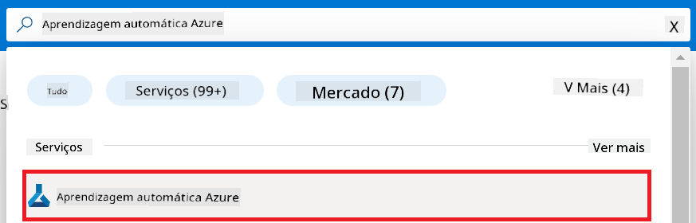

1. Selecione **+ Create** no menu de navegação.

1. Selecione **New workspace** no menu de navegação.

    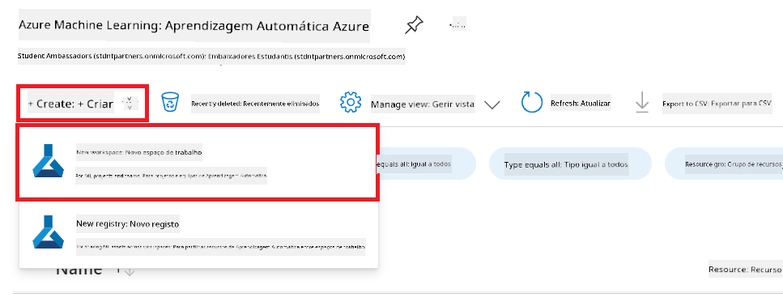

1. Execute as seguintes tarefas:

    - Selecione a sua **Subscrição** Azure.
    - Selecione o **Grupo de recursos** a utilizar (crie um novo se necessário).
    - Introduza o **Nome do Workspace**. Deve ser um valor único.
    - Selecione a **Região** que pretende usar.
    - Selecione a **Conta de armazenamento** a utilizar (crie uma nova se necessário).
    - Selecione o **Key vault** a utilizar (crie um novo se necessário).
    - Selecione o **Application insights** a utilizar (crie um novo se necessário).
    - Selecione o **Container registry** a utilizar (crie um novo se necessário).

    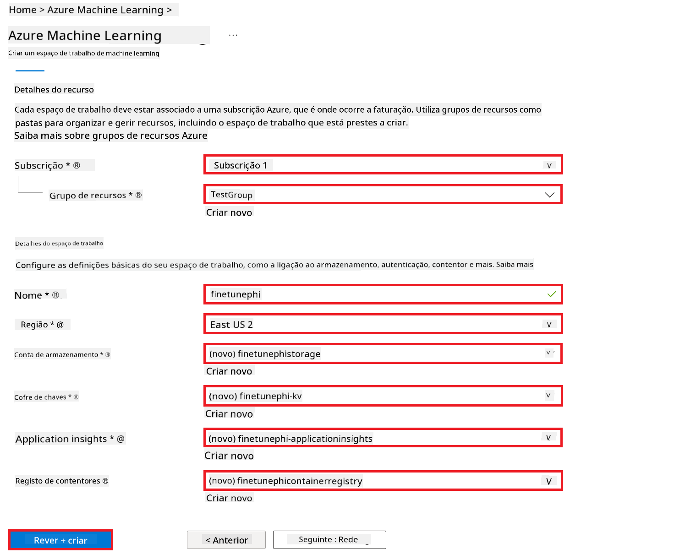

1. Selecione **Review + Create**.

1. Selecione **Create**.

### Solicitar quotas de GPU na subscrição Azure

Neste exemplo E2E, irá usar a *Standard_NC24ads_A100_v4 GPU* para ajuste fino, que requer um pedido de quota, e a *Standard_E4s_v3* CPU para implementação, que não requer pedido de quota.

> [!NOTE]
>
> Apenas subscrições Pay-As-You-Go (tipo de subscrição padrão) são elegíveis para alocação de GPU; subscrições de benefício não são atualmente suportadas.
>
> Para quem usa subscrições de benefício (como Visual Studio Enterprise Subscription) ou para quem pretende testar rapidamente o processo de ajuste fino e implementação, este tutorial também fornece orientação para ajuste fino com um conjunto de dados mínimo usando CPU. No entanto, é importante notar que os resultados do ajuste fino são significativamente melhores quando se usa uma GPU com conjuntos de dados maiores.

1. Visite [Azure ML Studio](https://ml.azure.com/home?wt.mc_id=studentamb_279723).

1. Execute as seguintes tarefas para solicitar quota da família *Standard NCADSA100v4*:

    - Selecione **Quota** na aba do lado esquerdo.
    - Selecione a **família de máquinas virtuais** a usar. Por exemplo, selecione **Standard NCADSA100v4 Family Cluster Dedicated vCPUs**, que inclui a GPU *Standard_NC24ads_A100_v4*.
    - Selecione **Request quota** no menu de navegação.

        

    - Na página Request quota, introduza o **Novo limite de núcleos** que pretende usar. Por exemplo, 24.
    - Na página Request quota, selecione **Submit** para solicitar a quota de GPU.

> [!NOTE]
> Pode selecionar a GPU ou CPU adequada às suas necessidades consultando o documento [Sizes for Virtual Machines in Azure](https://learn.microsoft.com/azure/virtual-machines/sizes/overview?tabs=breakdownseries%2Cgeneralsizelist%2Ccomputesizelist%2Cmemorysizelist%2Cstoragesizelist%2Cgpusizelist%2Cfpgasizelist%2Chpcsizelist).

### Adicionar atribuição de função

Para ajustar e implementar os seus modelos, deve primeiro criar uma Identidade Gerida Atribuída pelo Utilizador (User Assigned Managed Identity - UAI) e atribuir-lhe as permissões adequadas. Esta UAI será usada para autenticação durante a implementação.

#### Criar User Assigned Managed Identity (UAI)

1. Escreva *managed identities* na **barra de pesquisa** no topo da página do portal e selecione **Managed Identities** nas opções que aparecem.

    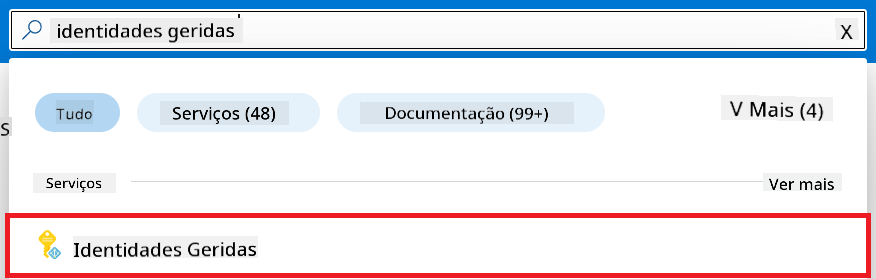

1. Selecione **+ Create**.

    

1. Execute as seguintes tarefas:

    - Selecione a sua **Subscrição** Azure.
    - Selecione o **Grupo de recursos** a utilizar (crie um novo se necessário).
    - Selecione a **Região** que pretende usar.
    - Introduza o **Nome**. Deve ser um valor único.

1. Selecione **Review + create**.

1. Selecione **+ Create**.

#### Adicionar atribuição de função Contributor à Managed Identity

1. Navegue até ao recurso Managed Identity que criou.

1. Selecione **Azure role assignments** na aba do lado esquerdo.

1. Selecione **+Add role assignment** no menu de navegação.

1. Na página Add role assignment, execute as seguintes tarefas:
    - Selecione o **Âmbito** para **Resource group**.
    - Selecione a sua **Subscrição** Azure.
    - Selecione o **Grupo de recursos** a utilizar.
    - Selecione a **Função** para **Contributor**.

    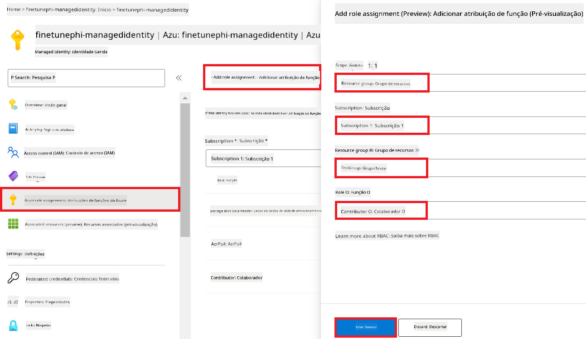

1. Selecione **Save**.

#### Adicionar atribuição de função Storage Blob Data Reader à Managed Identity

1. Escreva *storage accounts* na **barra de pesquisa** no topo da página do portal e selecione **Storage accounts** nas opções que aparecem.

    

1. Selecione a conta de armazenamento associada ao workspace Azure Machine Learning que criou. Por exemplo, *finetunephistorage*.

1. Execute as seguintes tarefas para navegar até à página Add role assignment:

    - Navegue até à conta de armazenamento Azure que criou.
    - Selecione **Access Control (IAM)** na aba do lado esquerdo.
    - Selecione **+ Add** no menu de navegação.
    - Selecione **Add role assignment** no menu de navegação.

    

1. Na página Add role assignment, execute as seguintes tarefas:

    - Na página Role, escreva *Storage Blob Data Reader* na **barra de pesquisa** e selecione **Storage Blob Data Reader** nas opções que aparecem.
    - Na página Role, selecione **Next**.
    - Na página Members, selecione **Assign access to** **Managed identity**.
    - Na página Members, selecione **+ Select members**.
    - Na página Select managed identities, selecione a sua **Subscrição** Azure.
    - Na página Select managed identities, selecione a **Managed identity** para **Manage Identity**.
    - Na página Select managed identities, selecione a Managed Identity que criou. Por exemplo, *finetunephi-managedidentity*.
    - Na página Select managed identities, selecione **Select**.

    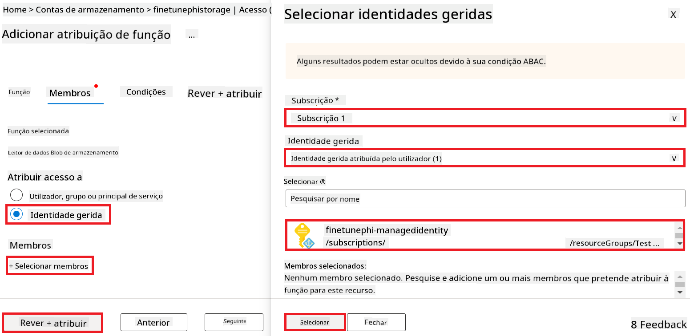

1. Selecione **Review + assign**.

#### Adicionar atribuição de função AcrPull à Managed Identity

1. Escreva *container registries* na **barra de pesquisa** no topo da página do portal e selecione **Container registries** nas opções que aparecem.

    

1. Selecione o container registry associado ao workspace Azure Machine Learning. Por exemplo, *finetunephicontainerregistries*

1. Execute as seguintes tarefas para navegar até à página Add role assignment:

    - Selecione **Access Control (IAM)** na aba do lado esquerdo.
    - Selecione **+ Add** no menu de navegação.
    - Selecione **Add role assignment** no menu de navegação.

1. Na página Add role assignment, execute as seguintes tarefas:

    - Na página Role, escreva *AcrPull* na **barra de pesquisa** e selecione **AcrPull** nas opções que aparecem.
    - Na página Role, selecione **Next**.
    - Na página Members, selecione **Assign access to** **Managed identity**.
    - Na página Members, selecione **+ Select members**.
    - Na página Select managed identities, selecione a sua **Subscrição** Azure.
    - Na página Select managed identities, selecione a **Managed identity** para **Manage Identity**.
    - Na página Select managed identities, selecione a Managed Identity que criou. Por exemplo, *finetunephi-managedidentity*.
    - Na página Select managed identities, selecione **Select**.
    - Selecione **Review + assign**.

### Configurar projeto

Agora, irá criar uma pasta para trabalhar e configurar um ambiente virtual para desenvolver um programa que interage com os utilizadores e usa o histórico de conversas armazenado no Azure Cosmos DB para informar as suas respostas.

#### Criar uma pasta para trabalhar dentro dela

1. Abra uma janela de terminal e escreva o seguinte comando para criar uma pasta chamada *finetune-phi* no caminho predefinido.

    ```console
    mkdir finetune-phi
    ```

1. Escreva o seguinte comando no terminal para navegar até à pasta *finetune-phi* que criou.

    ```console
    cd finetune-phi
    ```

#### Criar um ambiente virtual

1. Escreva o seguinte comando no terminal para criar um ambiente virtual chamado *.venv*.

    ```console
    python -m venv .venv
    ```

1. Escreva o seguinte comando no terminal para ativar o ambiente virtual.

    ```console
    .venv\Scripts\activate.bat
    ```
> [!NOTE]
>
> Se correu bem, deverá ver *(.venv)* antes do prompt de comando.
#### Instalar os pacotes necessários

1. Digite os seguintes comandos no seu terminal para instalar os pacotes necessários.

    ```console
    pip install datasets==2.19.1
    pip install transformers==4.41.1
    pip install azure-ai-ml==1.16.0
    pip install torch==2.3.1
    pip install trl==0.9.4
    pip install promptflow==1.12.0
    ```

#### Criar ficheiros do projeto

Neste exercício, irá criar os ficheiros essenciais para o nosso projeto. Estes ficheiros incluem scripts para descarregar o conjunto de dados, configurar o ambiente Azure Machine Learning, ajustar o modelo Phi-3 e implementar o modelo ajustado. Também irá criar um ficheiro *conda.yml* para configurar o ambiente de fine-tuning.

Neste exercício, irá:

- Criar um ficheiro *download_dataset.py* para descarregar o conjunto de dados.
- Criar um ficheiro *setup_ml.py* para configurar o ambiente Azure Machine Learning.
- Criar um ficheiro *fine_tune.py* na pasta *finetuning_dir* para ajustar o modelo Phi-3 usando o conjunto de dados.
- Criar um ficheiro *conda.yml* para configurar o ambiente de fine-tuning.
- Criar um ficheiro *deploy_model.py* para implementar o modelo ajustado.
- Criar um ficheiro *integrate_with_promptflow.py*, para integrar o modelo ajustado e executar o modelo usando o Prompt flow.
- Criar um ficheiro flow.dag.yml, para configurar a estrutura do workflow para o Prompt flow.
- Criar um ficheiro *config.py* para inserir as informações do Azure.

> [!NOTE]
>
> Estrutura completa da pasta:
>
> ```text
> └── YourUserName
> .    └── finetune-phi
> .        ├── finetuning_dir
> .        │      └── fine_tune.py
> .        ├── conda.yml
> .        ├── config.py
> .        ├── deploy_model.py
> .        ├── download_dataset.py
> .        ├── flow.dag.yml
> .        ├── integrate_with_promptflow.py
> .        └── setup_ml.py
> ```

1. Abra o **Visual Studio Code**.

1. Selecione **File** na barra de menu.

1. Selecione **Open Folder**.

1. Selecione a pasta *finetune-phi* que criou, localizada em *C:\Users\yourUserName\finetune-phi*.

    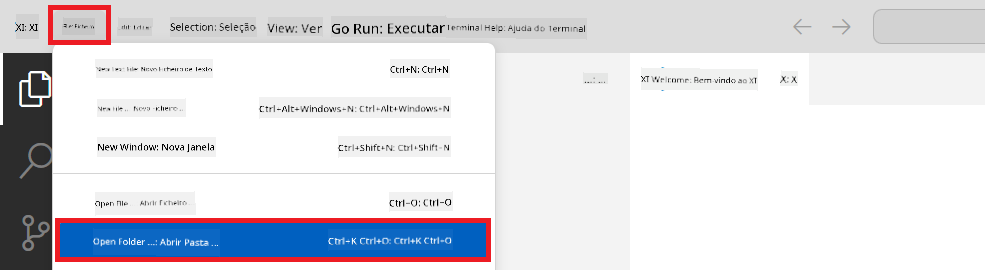

1. No painel esquerdo do Visual Studio Code, clique com o botão direito e selecione **New File** para criar um novo ficheiro chamado *download_dataset.py*.

1. No painel esquerdo do Visual Studio Code, clique com o botão direito e selecione **New File** para criar um novo ficheiro chamado *setup_ml.py*.

1. No painel esquerdo do Visual Studio Code, clique com o botão direito e selecione **New File** para criar um novo ficheiro chamado *deploy_model.py*.

    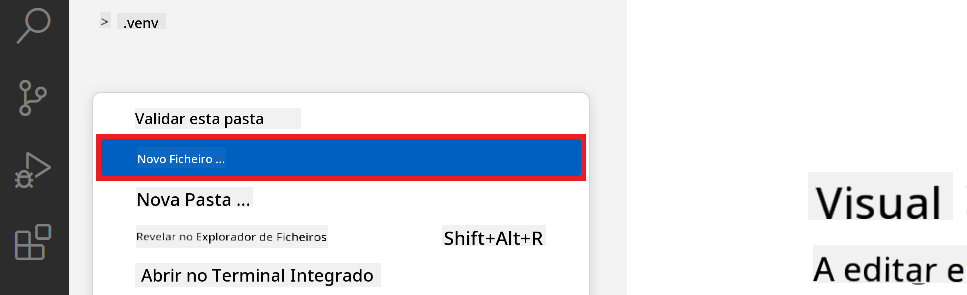

1. No painel esquerdo do Visual Studio Code, clique com o botão direito e selecione **New Folder** para criar uma nova pasta chamada *finetuning_dir*.

1. Na pasta *finetuning_dir*, crie um novo ficheiro chamado *fine_tune.py*.

#### Criar e configurar o ficheiro *conda.yml*

1. No painel esquerdo do Visual Studio Code, clique com o botão direito e selecione **New File** para criar um novo ficheiro chamado *conda.yml*.

1. Adicione o seguinte código ao ficheiro *conda.yml* para configurar o ambiente de fine-tuning para o modelo Phi-3.

    ```yml
    name: phi-3-training-env
    channels:
      - defaults
      - conda-forge
    dependencies:
      - python=3.10
      - pip
      - numpy<2.0
      - pip:
          - torch==2.4.0
          - torchvision==0.19.0
          - trl==0.8.6
          - transformers==4.41
          - datasets==2.21.0
          - azureml-core==1.57.0
          - azure-storage-blob==12.19.0
          - azure-ai-ml==1.16
          - azure-identity==1.17.1
          - accelerate==0.33.0
          - mlflow==2.15.1
          - azureml-mlflow==1.57.0
    ```

#### Criar e configurar o ficheiro *config.py*

1. No painel esquerdo do Visual Studio Code, clique com o botão direito e selecione **New File** para criar um novo ficheiro chamado *config.py*.

1. Adicione o seguinte código ao ficheiro *config.py* para incluir as suas informações do Azure.

    ```python
    # Azure settings
    AZURE_SUBSCRIPTION_ID = "your_subscription_id"
    AZURE_RESOURCE_GROUP_NAME = "your_resource_group_name" # "TestGroup"

    # Azure Machine Learning settings
    AZURE_ML_WORKSPACE_NAME = "your_workspace_name" # "finetunephi-workspace"

    # Azure Managed Identity settings
    AZURE_MANAGED_IDENTITY_CLIENT_ID = "your_azure_managed_identity_client_id"
    AZURE_MANAGED_IDENTITY_NAME = "your_azure_managed_identity_name" # "finetunephi-mangedidentity"
    AZURE_MANAGED_IDENTITY_RESOURCE_ID = f"/subscriptions/{AZURE_SUBSCRIPTION_ID}/resourceGroups/{AZURE_RESOURCE_GROUP_NAME}/providers/Microsoft.ManagedIdentity/userAssignedIdentities/{AZURE_MANAGED_IDENTITY_NAME}"

    # Dataset file paths
    TRAIN_DATA_PATH = "data/train_data.jsonl"
    TEST_DATA_PATH = "data/test_data.jsonl"

    # Fine-tuned model settings
    AZURE_MODEL_NAME = "your_fine_tuned_model_name" # "finetune-phi-model"
    AZURE_ENDPOINT_NAME = "your_fine_tuned_model_endpoint_name" # "finetune-phi-endpoint"
    AZURE_DEPLOYMENT_NAME = "your_fine_tuned_model_deployment_name" # "finetune-phi-deployment"

    AZURE_ML_API_KEY = "your_fine_tuned_model_api_key"
    AZURE_ML_ENDPOINT = "your_fine_tuned_model_endpoint_uri" # "https://{your-endpoint-name}.{your-region}.inference.ml.azure.com/score"
    ```

#### Adicionar variáveis de ambiente do Azure

1. Execute as seguintes tarefas para adicionar o ID da subscrição Azure:

    - Digite *subscriptions* na **barra de pesquisa** no topo da página do portal e selecione **Subscriptions** nas opções que aparecem.
    - Selecione a subscrição Azure que está a usar atualmente.
    - Copie e cole o seu Subscription ID no ficheiro *config.py*.

    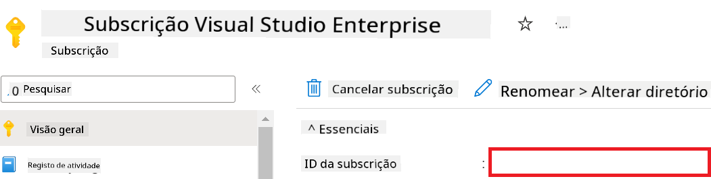

1. Execute as seguintes tarefas para adicionar o nome do Workspace Azure:

    - Navegue até ao recurso Azure Machine Learning que criou.
    - Copie e cole o nome da sua conta no ficheiro *config.py*.

    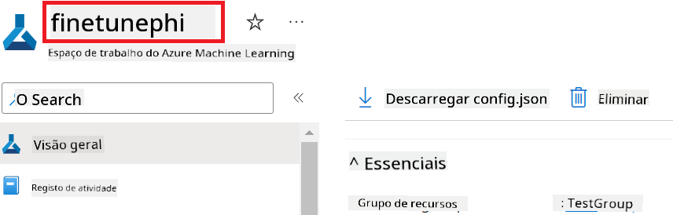

1. Execute as seguintes tarefas para adicionar o nome do Grupo de Recursos Azure:

    - Navegue até ao recurso Azure Machine Learning que criou.
    - Copie e cole o nome do seu Grupo de Recursos Azure no ficheiro *config.py*.

    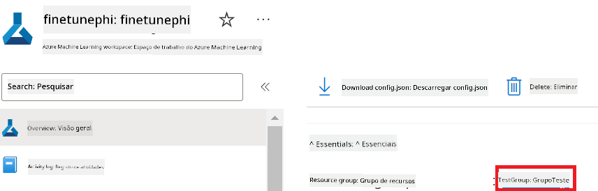

2. Execute as seguintes tarefas para adicionar o nome da Identidade Gerida Azure

    - Navegue até ao recurso Managed Identities que criou.
    - Copie e cole o nome da sua Identidade Gerida Azure no ficheiro *config.py*.

    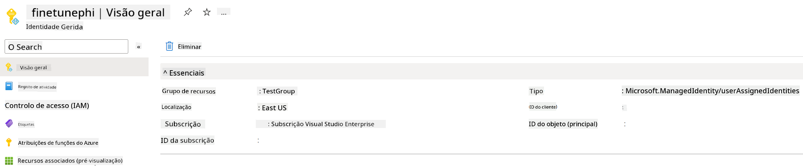

### Preparar o conjunto de dados para fine-tuning

Neste exercício, irá executar o ficheiro *download_dataset.py* para descarregar os conjuntos de dados *ULTRACHAT_200k* para o seu ambiente local. Depois, irá usar estes conjuntos de dados para ajustar o modelo Phi-3 no Azure Machine Learning.

#### Descarregar o seu conjunto de dados usando *download_dataset.py*

1. Abra o ficheiro *download_dataset.py* no Visual Studio Code.

1. Adicione o seguinte código no *download_dataset.py*.

    ```python
    import json
    import os
    from datasets import load_dataset
    from config import (
        TRAIN_DATA_PATH,
        TEST_DATA_PATH)

    def load_and_split_dataset(dataset_name, config_name, split_ratio):
        """
        Load and split a dataset.
        """
        # Load the dataset with the specified name, configuration, and split ratio
        dataset = load_dataset(dataset_name, config_name, split=split_ratio)
        print(f"Original dataset size: {len(dataset)}")
        
        # Split the dataset into train and test sets (80% train, 20% test)
        split_dataset = dataset.train_test_split(test_size=0.2)
        print(f"Train dataset size: {len(split_dataset['train'])}")
        print(f"Test dataset size: {len(split_dataset['test'])}")
        
        return split_dataset

    def save_dataset_to_jsonl(dataset, filepath):
        """
        Save a dataset to a JSONL file.
        """
        # Create the directory if it does not exist
        os.makedirs(os.path.dirname(filepath), exist_ok=True)
        
        # Open the file in write mode
        with open(filepath, 'w', encoding='utf-8') as f:
            # Iterate over each record in the dataset
            for record in dataset:
                # Dump the record as a JSON object and write it to the file
                json.dump(record, f)
                # Write a newline character to separate records
                f.write('\n')
        
        print(f"Dataset saved to {filepath}")

    def main():
        """
        Main function to load, split, and save the dataset.
        """
        # Load and split the ULTRACHAT_200k dataset with a specific configuration and split ratio
        dataset = load_and_split_dataset("HuggingFaceH4/ultrachat_200k", 'default', 'train_sft[:1%]')
        
        # Extract the train and test datasets from the split
        train_dataset = dataset['train']
        test_dataset = dataset['test']

        # Save the train dataset to a JSONL file
        save_dataset_to_jsonl(train_dataset, TRAIN_DATA_PATH)
        
        # Save the test dataset to a separate JSONL file
        save_dataset_to_jsonl(test_dataset, TEST_DATA_PATH)

    if __name__ == "__main__":
        main()

    ```

> [!TIP]
>
> **Orientações para fine-tuning com um conjunto de dados mínimo usando CPU**
>
> Se quiser usar uma CPU para o fine-tuning, esta abordagem é ideal para quem tem subscrições com benefícios (como a Visual Studio Enterprise Subscription) ou para testar rapidamente o processo de fine-tuning e implementação.
>
> Substitua `dataset = load_and_split_dataset("HuggingFaceH4/ultrachat_200k", 'default', 'train_sft[:1%]')` por `dataset = load_and_split_dataset("HuggingFaceH4/ultrachat_200k", 'default', 'train_sft[:10]')`
>

1. Digite o seguinte comando no seu terminal para executar o script e descarregar o conjunto de dados para o seu ambiente local.

    ```console
    python download_data.py
    ```

1. Verifique se os conjuntos de dados foram guardados com sucesso na sua pasta local *finetune-phi/data*.

> [!NOTE]
>
> **Tamanho do conjunto de dados e tempo de fine-tuning**
>
> Neste exemplo E2E, usa apenas 1% do conjunto de dados (`train_sft[:1%]`). Isto reduz significativamente a quantidade de dados, acelerando tanto o upload como o processo de fine-tuning. Pode ajustar a percentagem para encontrar o equilíbrio certo entre o tempo de treino e o desempenho do modelo. Usar um subconjunto menor do conjunto de dados reduz o tempo necessário para o fine-tuning, tornando o processo mais gerível para um exemplo E2E.

## Cenário 2: Ajustar o modelo Phi-3 e implementar no Azure Machine Learning Studio

### Configurar o Azure CLI

É necessário configurar o Azure CLI para autenticar o seu ambiente. O Azure CLI permite gerir recursos Azure diretamente a partir da linha de comandos e fornece as credenciais necessárias para que o Azure Machine Learning aceda a esses recursos. Para começar, instale o [Azure CLI](https://learn.microsoft.com/cli/azure/install-azure-cli)

1. Abra uma janela de terminal e digite o seguinte comando para iniciar sessão na sua conta Azure.

    ```console
    az login
    ```

1. Selecione a sua conta Azure para usar.

1. Selecione a sua subscrição Azure para usar.

    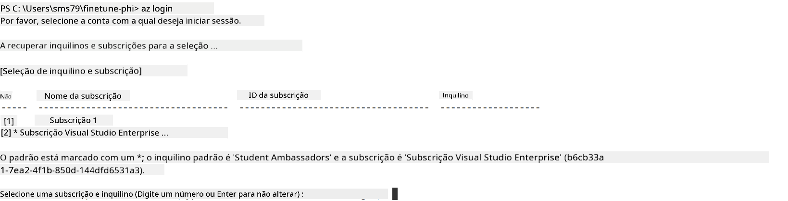

> [!TIP]
>
> Se estiver com dificuldades para iniciar sessão no Azure, experimente usar um código de dispositivo. Abra uma janela de terminal e digite o seguinte comando para iniciar sessão na sua conta Azure:
>
> ```console
> az login --use-device-code
> ```
>

### Ajustar o modelo Phi-3

Neste exercício, irá ajustar o modelo Phi-3 usando o conjunto de dados fornecido. Primeiro, irá definir o processo de fine-tuning no ficheiro *fine_tune.py*. Depois, irá configurar o ambiente Azure Machine Learning e iniciar o processo de fine-tuning executando o ficheiro *setup_ml.py*. Este script garante que o fine-tuning ocorre dentro do ambiente Azure Machine Learning.

Ao executar *setup_ml.py*, irá iniciar o processo de fine-tuning no ambiente Azure Machine Learning.

#### Adicionar código ao ficheiro *fine_tune.py*

1. Navegue até à pasta *finetuning_dir* e abra o ficheiro *fine_tune.py* no Visual Studio Code.

1. Adicione o seguinte código no *fine_tune.py*.

    ```python
    import argparse
    import sys
    import logging
    import os
    from datasets import load_dataset
    import torch
    import mlflow
    from transformers import AutoModelForCausalLM, AutoTokenizer, TrainingArguments
    from trl import SFTTrainer

    # To avoid the INVALID_PARAMETER_VALUE error in MLflow, disable MLflow integration
    os.environ["DISABLE_MLFLOW_INTEGRATION"] = "True"

    # Logging setup
    logging.basicConfig(
        format="%(asctime)s - %(levelname)s - %(name)s - %(message)s",
        datefmt="%Y-%m-%d %H:%M:%S",
        handlers=[logging.StreamHandler(sys.stdout)],
        level=logging.WARNING
    )
    logger = logging.getLogger(__name__)

    def initialize_model_and_tokenizer(model_name, model_kwargs):
        """
        Initialize the model and tokenizer with the given pretrained model name and arguments.
        """
        model = AutoModelForCausalLM.from_pretrained(model_name, **model_kwargs)
        tokenizer = AutoTokenizer.from_pretrained(model_name)
        tokenizer.model_max_length = 2048
        tokenizer.pad_token = tokenizer.unk_token
        tokenizer.pad_token_id = tokenizer.convert_tokens_to_ids(tokenizer.pad_token)
        tokenizer.padding_side = 'right'
        return model, tokenizer

    def apply_chat_template(example, tokenizer):
        """
        Apply a chat template to tokenize messages in the example.
        """
        messages = example["messages"]
        if messages[0]["role"] != "system":
            messages.insert(0, {"role": "system", "content": ""})
        example["text"] = tokenizer.apply_chat_template(
            messages, tokenize=False, add_generation_prompt=False
        )
        return example

    def load_and_preprocess_data(train_filepath, test_filepath, tokenizer):
        """
        Load and preprocess the dataset.
        """
        train_dataset = load_dataset('json', data_files=train_filepath, split='train')
        test_dataset = load_dataset('json', data_files=test_filepath, split='train')
        column_names = list(train_dataset.features)

        train_dataset = train_dataset.map(
            apply_chat_template,
            fn_kwargs={"tokenizer": tokenizer},
            num_proc=10,
            remove_columns=column_names,
            desc="Applying chat template to train dataset",
        )

        test_dataset = test_dataset.map(
            apply_chat_template,
            fn_kwargs={"tokenizer": tokenizer},
            num_proc=10,
            remove_columns=column_names,
            desc="Applying chat template to test dataset",
        )

        return train_dataset, test_dataset

    def train_and_evaluate_model(train_dataset, test_dataset, model, tokenizer, output_dir):
        """
        Train and evaluate the model.
        """
        training_args = TrainingArguments(
            bf16=True,
            do_eval=True,
            output_dir=output_dir,
            eval_strategy="epoch",
            learning_rate=5.0e-06,
            logging_steps=20,
            lr_scheduler_type="cosine",
            num_train_epochs=3,
            overwrite_output_dir=True,
            per_device_eval_batch_size=4,
            per_device_train_batch_size=4,
            remove_unused_columns=True,
            save_steps=500,
            seed=0,
            gradient_checkpointing=True,
            gradient_accumulation_steps=1,
            warmup_ratio=0.2,
        )

        trainer = SFTTrainer(
            model=model,
            args=training_args,
            train_dataset=train_dataset,
            eval_dataset=test_dataset,
            max_seq_length=2048,
            dataset_text_field="text",
            tokenizer=tokenizer,
            packing=True
        )

        train_result = trainer.train()
        trainer.log_metrics("train", train_result.metrics)

        mlflow.transformers.log_model(
            transformers_model={"model": trainer.model, "tokenizer": tokenizer},
            artifact_path=output_dir,
        )

        tokenizer.padding_side = 'left'
        eval_metrics = trainer.evaluate()
        eval_metrics["eval_samples"] = len(test_dataset)
        trainer.log_metrics("eval", eval_metrics)

    def main(train_file, eval_file, model_output_dir):
        """
        Main function to fine-tune the model.
        """
        model_kwargs = {
            "use_cache": False,
            "trust_remote_code": True,
            "torch_dtype": torch.bfloat16,
            "device_map": None,
            "attn_implementation": "eager"
        }

        # pretrained_model_name = "microsoft/Phi-3-mini-4k-instruct"
        pretrained_model_name = "microsoft/Phi-3.5-mini-instruct"

        with mlflow.start_run():
            model, tokenizer = initialize_model_and_tokenizer(pretrained_model_name, model_kwargs)
            train_dataset, test_dataset = load_and_preprocess_data(train_file, eval_file, tokenizer)
            train_and_evaluate_model(train_dataset, test_dataset, model, tokenizer, model_output_dir)

    if __name__ == "__main__":
        parser = argparse.ArgumentParser()
        parser.add_argument("--train-file", type=str, required=True, help="Path to the training data")
        parser.add_argument("--eval-file", type=str, required=True, help="Path to the evaluation data")
        parser.add_argument("--model_output_dir", type=str, required=True, help="Directory to save the fine-tuned model")
        args = parser.parse_args()
        main(args.train_file, args.eval_file, args.model_output_dir)

    ```

1. Guarde e feche o ficheiro *fine_tune.py*.

> [!TIP]
> **Pode ajustar o modelo Phi-3.5**
>
> No ficheiro *fine_tune.py*, pode alterar o `pretrained_model_name` de `"microsoft/Phi-3-mini-4k-instruct"` para qualquer modelo que queira ajustar. Por exemplo, se alterar para `"microsoft/Phi-3.5-mini-instruct"`, estará a usar o modelo Phi-3.5-mini-instruct para o fine-tuning. Para encontrar e usar o nome do modelo que preferir, visite [Hugging Face](https://huggingface.co/), pesquise o modelo que lhe interessa e copie e cole o nome no campo `pretrained_model_name` no seu script.
>
> :::image type="content" source="../../imgs/03/FineTuning-PromptFlow/finetunephi3.5.png" alt-text="Ajustar Phi-3.5.":::
>

#### Adicionar código ao ficheiro *setup_ml.py*

1. Abra o ficheiro *setup_ml.py* no Visual Studio Code.

1. Adicione o seguinte código no *setup_ml.py*.

    ```python
    import logging
    from azure.ai.ml import MLClient, command, Input
    from azure.ai.ml.entities import Environment, AmlCompute
    from azure.identity import AzureCliCredential
    from config import (
        AZURE_SUBSCRIPTION_ID,
        AZURE_RESOURCE_GROUP_NAME,
        AZURE_ML_WORKSPACE_NAME,
        TRAIN_DATA_PATH,
        TEST_DATA_PATH
    )

    # Constants

    # Uncomment the following lines to use a CPU instance for training
    # COMPUTE_INSTANCE_TYPE = "Standard_E16s_v3" # cpu
    # COMPUTE_NAME = "cpu-e16s-v3"
    # DOCKER_IMAGE_NAME = "mcr.microsoft.com/azureml/openmpi4.1.0-ubuntu20.04:latest"

    # Uncomment the following lines to use a GPU instance for training
    COMPUTE_INSTANCE_TYPE = "Standard_NC24ads_A100_v4"
    COMPUTE_NAME = "gpu-nc24s-a100-v4"
    DOCKER_IMAGE_NAME = "mcr.microsoft.com/azureml/curated/acft-hf-nlp-gpu:59"

    CONDA_FILE = "conda.yml"
    LOCATION = "eastus2" # Replace with the location of your compute cluster
    FINETUNING_DIR = "./finetuning_dir" # Path to the fine-tuning script
    TRAINING_ENV_NAME = "phi-3-training-environment" # Name of the training environment
    MODEL_OUTPUT_DIR = "./model_output" # Path to the model output directory in azure ml

    # Logging setup to track the process
    logger = logging.getLogger(__name__)
    logging.basicConfig(
        format="%(asctime)s - %(levelname)s - %(name)s - %(message)s",
        datefmt="%Y-%m-%d %H:%M:%S",
        level=logging.WARNING
    )

    def get_ml_client():
        """
        Initialize the ML Client using Azure CLI credentials.
        """
        credential = AzureCliCredential()
        return MLClient(credential, AZURE_SUBSCRIPTION_ID, AZURE_RESOURCE_GROUP_NAME, AZURE_ML_WORKSPACE_NAME)

    def create_or_get_environment(ml_client):
        """
        Create or update the training environment in Azure ML.
        """
        env = Environment(
            image=DOCKER_IMAGE_NAME,  # Docker image for the environment
            conda_file=CONDA_FILE,  # Conda environment file
            name=TRAINING_ENV_NAME,  # Name of the environment
        )
        return ml_client.environments.create_or_update(env)

    def create_or_get_compute_cluster(ml_client, compute_name, COMPUTE_INSTANCE_TYPE, location):
        """
        Create or update the compute cluster in Azure ML.
        """
        try:
            compute_cluster = ml_client.compute.get(compute_name)
            logger.info(f"Compute cluster '{compute_name}' already exists. Reusing it for the current run.")
        except Exception:
            logger.info(f"Compute cluster '{compute_name}' does not exist. Creating a new one with size {COMPUTE_INSTANCE_TYPE}.")
            compute_cluster = AmlCompute(
                name=compute_name,
                size=COMPUTE_INSTANCE_TYPE,
                location=location,
                tier="Dedicated",  # Tier of the compute cluster
                min_instances=0,  # Minimum number of instances
                max_instances=1  # Maximum number of instances
            )
            ml_client.compute.begin_create_or_update(compute_cluster).wait()  # Wait for the cluster to be created
        return compute_cluster

    def create_fine_tuning_job(env, compute_name):
        """
        Set up the fine-tuning job in Azure ML.
        """
        return command(
            code=FINETUNING_DIR,  # Path to fine_tune.py
            command=(
                "python fine_tune.py "
                "--train-file ${{inputs.train_file}} "
                "--eval-file ${{inputs.eval_file}} "
                "--model_output_dir ${{inputs.model_output}}"
            ),
            environment=env,  # Training environment
            compute=compute_name,  # Compute cluster to use
            inputs={
                "train_file": Input(type="uri_file", path=TRAIN_DATA_PATH),  # Path to the training data file
                "eval_file": Input(type="uri_file", path=TEST_DATA_PATH),  # Path to the evaluation data file
                "model_output": MODEL_OUTPUT_DIR
            }
        )

    def main():
        """
        Main function to set up and run the fine-tuning job in Azure ML.
        """
        # Initialize ML Client
        ml_client = get_ml_client()

        # Create Environment
        env = create_or_get_environment(ml_client)
        
        # Create or get existing compute cluster
        create_or_get_compute_cluster(ml_client, COMPUTE_NAME, COMPUTE_INSTANCE_TYPE, LOCATION)

        # Create and Submit Fine-Tuning Job
        job = create_fine_tuning_job(env, COMPUTE_NAME)
        returned_job = ml_client.jobs.create_or_update(job)  # Submit the job
        ml_client.jobs.stream(returned_job.name)  # Stream the job logs
        
        # Capture the job name
        job_name = returned_job.name
        print(f"Job name: {job_name}")

    if __name__ == "__main__":
        main()

    ```

1. Substitua `COMPUTE_INSTANCE_TYPE`, `COMPUTE_NAME` e `LOCATION` pelos seus detalhes específicos.

    ```python
   # Uncomment the following lines to use a GPU instance for training
    COMPUTE_INSTANCE_TYPE = "Standard_NC24ads_A100_v4"
    COMPUTE_NAME = "gpu-nc24s-a100-v4"
    ...
    LOCATION = "eastus2" # Replace with the location of your compute cluster
    ```

> [!TIP]
>
> **Orientações para fine-tuning com um conjunto de dados mínimo usando CPU**
>
> Se quiser usar uma CPU para o fine-tuning, esta abordagem é ideal para quem tem subscrições com benefícios (como a Visual Studio Enterprise Subscription) ou para testar rapidamente o processo de fine-tuning e implementação.
>
> 1. Abra o ficheiro *setup_ml*.
> 1. Substitua `COMPUTE_INSTANCE_TYPE`, `COMPUTE_NAME` e `DOCKER_IMAGE_NAME` pelo seguinte. Se não tiver acesso a *Standard_E16s_v3*, pode usar uma instância CPU equivalente ou pedir uma nova quota.
> 1. Substitua `LOCATION` pelos seus detalhes específicos.
>
>    ```python
>    # Uncomment the following lines to use a CPU instance for training
>    COMPUTE_INSTANCE_TYPE = "Standard_E16s_v3" # cpu
>    COMPUTE_NAME = "cpu-e16s-v3"
>    DOCKER_IMAGE_NAME = "mcr.microsoft.com/azureml/openmpi4.1.0-ubuntu20.04:latest"
>    LOCATION = "eastus2" # Replace with the location of your compute cluster
>    ```
>

1. Digite o seguinte comando para executar o script *setup_ml.py* e iniciar o processo de fine-tuning no Azure Machine Learning.

    ```python
    python setup_ml.py
    ```

1. Neste exercício, ajustou com sucesso o modelo Phi-3 usando o Azure Machine Learning. Ao executar o script *setup_ml.py*, configurou o ambiente Azure Machine Learning e iniciou o processo de fine-tuning definido no ficheiro *fine_tune.py*. Note que o processo de fine-tuning pode demorar algum tempo. Após executar o comando `python setup_ml.py`, terá de aguardar até o processo terminar. Pode monitorizar o estado do trabalho de fine-tuning seguindo o link fornecido no terminal para o portal Azure Machine Learning.

    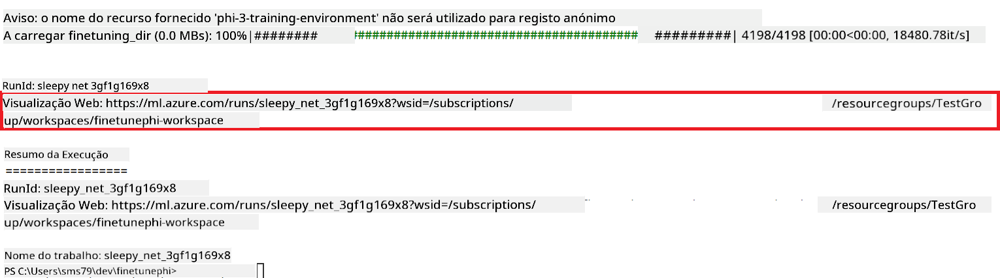

### Implementar o modelo ajustado

Para integrar o modelo Phi-3 ajustado com o Prompt Flow, precisa de implementar o modelo para que esteja acessível para inferência em tempo real. Este processo envolve registar o modelo, criar um endpoint online e implementar o modelo.

#### Definir o nome do modelo, nome do endpoint e nome da implementação para a implementação

1. Abra o ficheiro *config.py*.

1. Substitua `AZURE_MODEL_NAME = "your_fine_tuned_model_name"` pelo nome desejado para o seu modelo.

1. Substitua `AZURE_ENDPOINT_NAME = "your_fine_tuned_model_endpoint_name"` pelo nome desejado para o seu endpoint.

1. Substitua `AZURE_DEPLOYMENT_NAME = "your_fine_tuned_model_deployment_name"` pelo nome desejado para a sua implementação.

#### Adicionar código ao ficheiro *deploy_model.py*

Executar o ficheiro *deploy_model.py* automatiza todo o processo de implementação. Ele regista o modelo, cria um endpoint e executa a implementação com base nas definições especificadas no ficheiro config.py, que inclui o nome do modelo, nome do endpoint e nome da implementação.

1. Abra o ficheiro *deploy_model.py* no Visual Studio Code.

1. Adicione o seguinte código no *deploy_model.py*.

    ```python
    import logging
    from azure.identity import AzureCliCredential
    from azure.ai.ml import MLClient
    from azure.ai.ml.entities import Model, ProbeSettings, ManagedOnlineEndpoint, ManagedOnlineDeployment, IdentityConfiguration, ManagedIdentityConfiguration, OnlineRequestSettings
    from azure.ai.ml.constants import AssetTypes

    # Configuration imports
    from config import (
        AZURE_SUBSCRIPTION_ID,
        AZURE_RESOURCE_GROUP_NAME,
        AZURE_ML_WORKSPACE_NAME,
        AZURE_MANAGED_IDENTITY_RESOURCE_ID,
        AZURE_MANAGED_IDENTITY_CLIENT_ID,
        AZURE_MODEL_NAME,
        AZURE_ENDPOINT_NAME,
        AZURE_DEPLOYMENT_NAME
    )

    # Constants
    JOB_NAME = "your-job-name"
    COMPUTE_INSTANCE_TYPE = "Standard_E4s_v3"

    deployment_env_vars = {
        "SUBSCRIPTION_ID": AZURE_SUBSCRIPTION_ID,
        "RESOURCE_GROUP_NAME": AZURE_RESOURCE_GROUP_NAME,
        "UAI_CLIENT_ID": AZURE_MANAGED_IDENTITY_CLIENT_ID,
    }

    # Logging setup
    logging.basicConfig(
        format="%(asctime)s - %(levelname)s - %(name)s - %(message)s",
        datefmt="%Y-%m-%d %H:%M:%S",
        level=logging.DEBUG
    )
    logger = logging.getLogger(__name__)

    def get_ml_client():
        """Initialize and return the ML Client."""
        credential = AzureCliCredential()
        return MLClient(credential, AZURE_SUBSCRIPTION_ID, AZURE_RESOURCE_GROUP_NAME, AZURE_ML_WORKSPACE_NAME)

    def register_model(ml_client, model_name, job_name):
        """Register a new model."""
        model_path = f"azureml://jobs/{job_name}/outputs/artifacts/paths/model_output"
        logger.info(f"Registering model {model_name} from job {job_name} at path {model_path}.")
        run_model = Model(
            path=model_path,
            name=model_name,
            description="Model created from run.",
            type=AssetTypes.MLFLOW_MODEL,
        )
        model = ml_client.models.create_or_update(run_model)
        logger.info(f"Registered model ID: {model.id}")
        return model

    def delete_existing_endpoint(ml_client, endpoint_name):
        """Delete existing endpoint if it exists."""
        try:
            endpoint_result = ml_client.online_endpoints.get(name=endpoint_name)
            logger.info(f"Deleting existing endpoint {endpoint_name}.")
            ml_client.online_endpoints.begin_delete(name=endpoint_name).result()
            logger.info(f"Deleted existing endpoint {endpoint_name}.")
        except Exception as e:
            logger.info(f"No existing endpoint {endpoint_name} found to delete: {e}")

    def create_or_update_endpoint(ml_client, endpoint_name, description=""):
        """Create or update an endpoint."""
        delete_existing_endpoint(ml_client, endpoint_name)
        logger.info(f"Creating new endpoint {endpoint_name}.")
        endpoint = ManagedOnlineEndpoint(
            name=endpoint_name,
            description=description,
            identity=IdentityConfiguration(
                type="user_assigned",
                user_assigned_identities=[ManagedIdentityConfiguration(resource_id=AZURE_MANAGED_IDENTITY_RESOURCE_ID)]
            )
        )
        endpoint_result = ml_client.online_endpoints.begin_create_or_update(endpoint).result()
        logger.info(f"Created new endpoint {endpoint_name}.")
        return endpoint_result

    def create_or_update_deployment(ml_client, endpoint_name, deployment_name, model):
        """Create or update a deployment."""

        logger.info(f"Creating deployment {deployment_name} for endpoint {endpoint_name}.")
        deployment = ManagedOnlineDeployment(
            name=deployment_name,
            endpoint_name=endpoint_name,
            model=model.id,
            instance_type=COMPUTE_INSTANCE_TYPE,
            instance_count=1,
            environment_variables=deployment_env_vars,
            request_settings=OnlineRequestSettings(
                max_concurrent_requests_per_instance=3,
                request_timeout_ms=180000,
                max_queue_wait_ms=120000
            ),
            liveness_probe=ProbeSettings(
                failure_threshold=30,
                success_threshold=1,
                period=100,
                initial_delay=500,
            ),
            readiness_probe=ProbeSettings(
                failure_threshold=30,
                success_threshold=1,
                period=100,
                initial_delay=500,
            ),
        )
        deployment_result = ml_client.online_deployments.begin_create_or_update(deployment).result()
        logger.info(f"Created deployment {deployment.name} for endpoint {endpoint_name}.")
        return deployment_result

    def set_traffic_to_deployment(ml_client, endpoint_name, deployment_name):
        """Set traffic to the specified deployment."""
        try:
            # Fetch the current endpoint details
            endpoint = ml_client.online_endpoints.get(name=endpoint_name)
            
            # Log the current traffic allocation for debugging
            logger.info(f"Current traffic allocation: {endpoint.traffic}")
            
            # Set the traffic allocation for the deployment
            endpoint.traffic = {deployment_name: 100}
            
            # Update the endpoint with the new traffic allocation
            endpoint_poller = ml_client.online_endpoints.begin_create_or_update(endpoint)
            updated_endpoint = endpoint_poller.result()
            
            # Log the updated traffic allocation for debugging
            logger.info(f"Updated traffic allocation: {updated_endpoint.traffic}")
            logger.info(f"Set traffic to deployment {deployment_name} at endpoint {endpoint_name}.")
            return updated_endpoint
        except Exception as e:
            # Log any errors that occur during the process
            logger.error(f"Failed to set traffic to deployment: {e}")
            raise


    def main():
        ml_client = get_ml_client()

        registered_model = register_model(ml_client, AZURE_MODEL_NAME, JOB_NAME)
        logger.info(f"Registered model ID: {registered_model.id}")

        endpoint = create_or_update_endpoint(ml_client, AZURE_ENDPOINT_NAME, "Endpoint for finetuned Phi-3 model")
        logger.info(f"Endpoint {AZURE_ENDPOINT_NAME} is ready.")

        try:
            deployment = create_or_update_deployment(ml_client, AZURE_ENDPOINT_NAME, AZURE_DEPLOYMENT_NAME, registered_model)
            logger.info(f"Deployment {AZURE_DEPLOYMENT_NAME} is created for endpoint {AZURE_ENDPOINT_NAME}.")

            set_traffic_to_deployment(ml_client, AZURE_ENDPOINT_NAME, AZURE_DEPLOYMENT_NAME)
            logger.info(f"Traffic is set to deployment {AZURE_DEPLOYMENT_NAME} at endpoint {AZURE_ENDPOINT_NAME}.")
        except Exception as e:
            logger.error(f"Failed to create or update deployment: {e}")

    if __name__ == "__main__":
        main()

    ```

1. Execute as seguintes tarefas para obter o `JOB_NAME`:

    - Navegue até ao recurso Azure Machine Learning que criou.
    - Selecione **Studio web URL** para abrir o workspace Azure Machine Learning.
    - Selecione **Jobs** na aba do lado esquerdo.
    - Selecione o experimento de fine-tuning. Por exemplo, *finetunephi*.
    - Selecione o trabalho que criou.
- Copie e cole o nome do seu trabalho em `JOB_NAME = "your-job-name"` no ficheiro *deploy_model.py*.

1. Substitua `COMPUTE_INSTANCE_TYPE` pelos seus detalhes específicos.

1. Escreva o seguinte comando para executar o script *deploy_model.py* e iniciar o processo de deployment no Azure Machine Learning.

    ```python
    python deploy_model.py
    ```


> [!WARNING]
> Para evitar custos adicionais na sua conta, certifique-se de eliminar o endpoint criado no workspace do Azure Machine Learning.
>

#### Verificar o estado do deployment no Azure Machine Learning Workspace

1. Aceda a [Azure ML Studio](https://ml.azure.com/home?wt.mc_id=studentamb_279723).

1. Navegue até ao workspace do Azure Machine Learning que criou.

1. Selecione **Studio web URL** para abrir o workspace do Azure Machine Learning.

1. Selecione **Endpoints** no separador do lado esquerdo.

    

2. Selecione o endpoint que criou.

    

3. Nesta página, pode gerir os endpoints criados durante o processo de deployment.

## Cenário 3: Integrar com Prompt flow e conversar com o seu modelo personalizado

### Integrar o modelo Phi-3 personalizado com Prompt flow

Após ter feito o deployment com sucesso do seu modelo afinado, pode agora integrá-lo com o Prompt flow para usar o seu modelo em aplicações em tempo real, permitindo uma variedade de tarefas interativas com o seu modelo Phi-3 personalizado.

#### Definir a chave api e o URI do endpoint do modelo Phi-3 afinado

1. Navegue até ao workspace do Azure Machine Learning que criou.
1. Selecione **Endpoints** no separador do lado esquerdo.
1. Selecione o endpoint que criou.
1. Selecione **Consume** no menu de navegação.
1. Copie e cole o seu **REST endpoint** no ficheiro *config.py*, substituindo `AZURE_ML_ENDPOINT = "your_fine_tuned_model_endpoint_uri"` pelo seu **REST endpoint**.
1. Copie e cole a sua **Primary key** no ficheiro *config.py*, substituindo `AZURE_ML_API_KEY = "your_fine_tuned_model_api_key"` pela sua **Primary key**.

    

#### Adicionar código ao ficheiro *flow.dag.yml*

1. Abra o ficheiro *flow.dag.yml* no Visual Studio Code.

1. Adicione o seguinte código ao *flow.dag.yml*.

    ```yml
    inputs:
      input_data:
        type: string
        default: "Who founded Microsoft?"

    outputs:
      answer:
        type: string
        reference: ${integrate_with_promptflow.output}

    nodes:
    - name: integrate_with_promptflow
      type: python
      source:
        type: code
        path: integrate_with_promptflow.py
      inputs:
        input_data: ${inputs.input_data}
    ```

#### Adicionar código ao ficheiro *integrate_with_promptflow.py*

1. Abra o ficheiro *integrate_with_promptflow.py* no Visual Studio Code.

1. Adicione o seguinte código ao *integrate_with_promptflow.py*.

    ```python
    import logging
    import requests
    from promptflow.core import tool
    import asyncio
    import platform
    from config import (
        AZURE_ML_ENDPOINT,
        AZURE_ML_API_KEY
    )

    # Logging setup
    logging.basicConfig(
        format="%(asctime)s - %(levelname)s - %(name)s - %(message)s",
        datefmt="%Y-%m-%d %H:%M:%S",
        level=logging.DEBUG
    )
    logger = logging.getLogger(__name__)

    def query_azml_endpoint(input_data: list, endpoint_url: str, api_key: str) -> str:
        """
        Send a request to the Azure ML endpoint with the given input data.
        """
        headers = {
            "Content-Type": "application/json",
            "Authorization": f"Bearer {api_key}"
        }
        data = {
            "input_data": [input_data],
            "params": {
                "temperature": 0.7,
                "max_new_tokens": 128,
                "do_sample": True,
                "return_full_text": True
            }
        }
        try:
            response = requests.post(endpoint_url, json=data, headers=headers)
            response.raise_for_status()
            result = response.json()[0]
            logger.info("Successfully received response from Azure ML Endpoint.")
            return result
        except requests.exceptions.RequestException as e:
            logger.error(f"Error querying Azure ML Endpoint: {e}")
            raise

    def setup_asyncio_policy():
        """
        Setup asyncio event loop policy for Windows.
        """
        if platform.system() == 'Windows':
            asyncio.set_event_loop_policy(asyncio.WindowsSelectorEventLoopPolicy())
            logger.info("Set Windows asyncio event loop policy.")

    @tool
    def my_python_tool(input_data: str) -> str:
        """
        Tool function to process input data and query the Azure ML endpoint.
        """
        setup_asyncio_policy()
        return query_azml_endpoint(input_data, AZURE_ML_ENDPOINT, AZURE_ML_API_KEY)

    ```

### Conversar com o seu modelo personalizado

1. Escreva o seguinte comando para executar o script *deploy_model.py* e iniciar o processo de deployment no Azure Machine Learning.

    ```python
    pf flow serve --source ./ --port 8080 --host localhost
    ```

1. Aqui está um exemplo dos resultados: Agora pode conversar com o seu modelo Phi-3 personalizado. Recomenda-se fazer perguntas baseadas nos dados usados para o fine-tuning.

    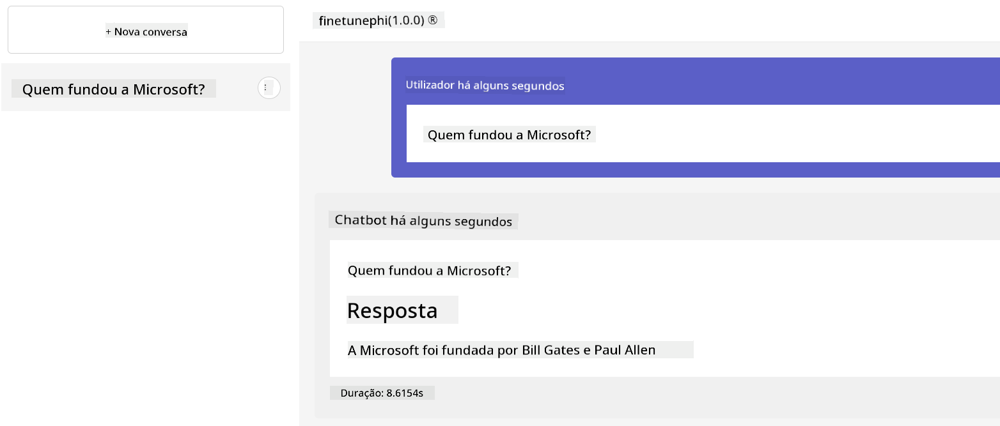

**Aviso Legal**:  
Este documento foi traduzido utilizando o serviço de tradução automática [Co-op Translator](https://github.com/Azure/co-op-translator). Embora nos esforcemos pela precisão, por favor tenha em conta que traduções automáticas podem conter erros ou imprecisões. O documento original na sua língua nativa deve ser considerado a fonte autorizada. Para informações críticas, recomenda-se tradução profissional humana. Não nos responsabilizamos por quaisquer mal-entendidos ou interpretações incorretas decorrentes da utilização desta tradução.