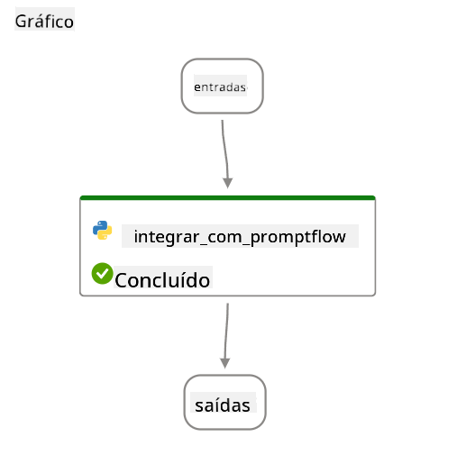

<!--
CO_OP_TRANSLATOR_METADATA:
{
  "original_hash": "ecbd9179a21edbaafaf114d47f09f3e3",
  "translation_date": "2025-05-09T18:00:35+00:00",
  "source_file": "md/02.Application/01.TextAndChat/Phi3/E2E_Phi-3-FineTuning_PromptFlow_Integration_AIFoundry.md",
  "language_code": "pt"
}
-->
# Ajuste fino e integração de modelos Phi-3 personalizados com Prompt flow no Azure AI Foundry

Este exemplo de ponta a ponta (E2E) é baseado no guia "[Fine-Tune and Integrate Custom Phi-3 Models with Prompt Flow in Azure AI Foundry](https://techcommunity.microsoft.com/t5/educator-developer-blog/fine-tune-and-integrate-custom-phi-3-models-with-prompt-flow-in/ba-p/4191726?WT.mc_id=aiml-137032-kinfeylo)" da Microsoft Tech Community. Ele apresenta os processos de ajuste fino, implantação e integração de modelos Phi-3 personalizados com Prompt flow no Azure AI Foundry.  
Diferente do exemplo E2E, "[Fine-Tune and Integrate Custom Phi-3 Models with Prompt Flow](./E2E_Phi-3-FineTuning_PromptFlow_Integration.md)", que envolvia executar código localmente, este tutorial foca totalmente no ajuste fino e na integração do seu modelo dentro do Azure AI / ML Studio.

## Visão geral

Neste exemplo E2E, você aprenderá como ajustar fino o modelo Phi-3 e integrá-lo com Prompt flow no Azure AI Foundry. Aproveitando o Azure AI / ML Studio, você estabelecerá um fluxo de trabalho para implantar e utilizar modelos de IA personalizados. Este exemplo E2E está dividido em três cenários:

**Cenário 1: Configurar recursos do Azure e preparar para ajuste fino**

**Cenário 2: Ajustar fino o modelo Phi-3 e implantar no Azure Machine Learning Studio**

**Cenário 3: Integrar com Prompt flow e conversar com seu modelo personalizado no Azure AI Foundry**

Aqui está uma visão geral deste exemplo E2E.


### Sumário

1. **[Cenário 1: Configurar recursos do Azure e preparar para ajuste fino](../../../../../../md/02.Application/01.TextAndChat/Phi3)**
    - [Criar um Workspace do Azure Machine Learning](../../../../../../md/02.Application/01.TextAndChat/Phi3)
    - [Solicitar cotas de GPU na assinatura do Azure](../../../../../../md/02.Application/01.TextAndChat/Phi3)
    - [Adicionar atribuição de função](../../../../../../md/02.Application/01.TextAndChat/Phi3)
    - [Configurar projeto](../../../../../../md/02.Application/01.TextAndChat/Phi3)
    - [Preparar dataset para ajuste fino](../../../../../../md/02.Application/01.TextAndChat/Phi3)

1. **[Cenário 2: Ajustar fino o modelo Phi-3 e implantar no Azure Machine Learning Studio](../../../../../../md/02.Application/01.TextAndChat/Phi3)**
    - [Ajustar fino o modelo Phi-3](../../../../../../md/02.Application/01.TextAndChat/Phi3)
    - [Implantar o modelo Phi-3 ajustado](../../../../../../md/02.Application/01.TextAndChat/Phi3)

1. **[Cenário 3: Integrar com Prompt flow e conversar com seu modelo personalizado no Azure AI Foundry](../../../../../../md/02.Application/01.TextAndChat/Phi3)**
    - [Integrar o modelo Phi-3 personalizado com Prompt flow](../../../../../../md/02.Application/01.TextAndChat/Phi3)
    - [Conversar com seu modelo Phi-3 personalizado](../../../../../../md/02.Application/01.TextAndChat/Phi3)

## Cenário 1: Configurar recursos do Azure e preparar para ajuste fino

### Criar um Workspace do Azure Machine Learning

1. Digite *azure machine learning* na **barra de pesquisa** no topo da página do portal e selecione **Azure Machine Learning** nas opções que aparecerem.

    

2. Selecione **+ Criar** no menu de navegação.

3. Selecione **Novo workspace** no menu de navegação.

    

4. Realize as seguintes tarefas:

    - Selecione sua **Assinatura** do Azure.
    - Selecione o **Grupo de recursos** que deseja usar (crie um novo se necessário).
    - Insira o **Nome do Workspace**. Deve ser um valor único.
    - Selecione a **Região** que deseja utilizar.
    - Selecione a **Conta de armazenamento** que deseja usar (crie uma nova se necessário).
    - Selecione o **Key vault** que deseja usar (crie um novo se necessário).
    - Selecione o **Application insights** que deseja usar (crie um novo se necessário).
    - Selecione o **Container registry** que deseja usar (crie um novo se necessário).

    

5. Selecione **Revisar + criar**.

6. Selecione **Criar**.

### Solicitar cotas de GPU na assinatura do Azure

Neste tutorial, você aprenderá como ajustar fino e implantar um modelo Phi-3 usando GPUs. Para o ajuste fino, você usará a GPU *Standard_NC24ads_A100_v4*, que requer solicitação de cota. Para a implantação, usará a GPU *Standard_NC6s_v3*, que também requer solicitação de cota.

> [!NOTE]
>
> Apenas assinaturas Pay-As-You-Go (tipo padrão de assinatura) são elegíveis para alocação de GPU; assinaturas de benefício não são suportadas no momento.
>

1. Acesse [Azure ML Studio](https://ml.azure.com/home?wt.mc_id=studentamb_279723).

1. Realize as seguintes tarefas para solicitar a cota da família *Standard NCADSA100v4*:

    - Selecione **Quota** na aba lateral esquerda.
    - Selecione a **família de máquinas virtuais** que deseja usar. Por exemplo, selecione **Standard NCADSA100v4 Family Cluster Dedicated vCPUs**, que inclui a GPU *Standard_NC24ads_A100_v4*.
    - Selecione **Solicitar cota** no menu de navegação.

        

    - Na página de solicitação de cota, insira o **Novo limite de núcleos** que deseja usar. Por exemplo, 24.
    - Na página de solicitação de cota, selecione **Enviar** para solicitar a cota da GPU.

1. Realize as seguintes tarefas para solicitar a cota da família *Standard NCSv3*:

    - Selecione **Quota** na aba lateral esquerda.
    - Selecione a **família de máquinas virtuais** que deseja usar. Por exemplo, selecione **Standard NCSv3 Family Cluster Dedicated vCPUs**, que inclui a GPU *Standard_NC6s_v3*.
    - Selecione **Solicitar cota** no menu de navegação.
    - Na página de solicitação de cota, insira o **Novo limite de núcleos** que deseja usar. Por exemplo, 24.
    - Na página de solicitação de cota, selecione **Enviar** para solicitar a cota da GPU.

### Adicionar atribuição de função

Para ajustar fino e implantar seus modelos, você deve primeiro criar uma Identidade Gerenciada Atribuída pelo Usuário (User Assigned Managed Identity - UAI) e atribuir as permissões apropriadas. Essa UAI será usada para autenticação durante a implantação.

#### Criar User Assigned Managed Identity (UAI)

1. Digite *managed identities* na **barra de pesquisa** no topo da página do portal e selecione **Managed Identities** nas opções que aparecerem.

    

1. Selecione **+ Criar**.

    

1. Realize as seguintes tarefas:

    - Selecione sua **Assinatura** do Azure.
    - Selecione o **Grupo de recursos** que deseja usar (crie um novo se necessário).
    - Selecione a **Região** que deseja utilizar.
    - Insira o **Nome**. Deve ser um valor único.

    

1. Selecione **Revisar + criar**.

1. Selecione **+ Criar**.

#### Adicionar atribuição de função Contributor à Managed Identity

1. Navegue até o recurso Managed Identity que você criou.

1. Selecione **Azure role assignments** na aba lateral esquerda.

1. Selecione **+ Adicionar atribuição de função** no menu de navegação.

1. Na página Adicionar atribuição de função, realize as seguintes tarefas:
    - Selecione o **Escopo** como **Grupo de recursos**.
    - Selecione sua **Assinatura** do Azure.
    - Selecione o **Grupo de recursos** que deseja usar.
    - Selecione a **Função** como **Contributor**.

    

2. Selecione **Salvar**.

#### Adicionar atribuição de função Storage Blob Data Reader à Managed Identity

1. Digite *storage accounts* na **barra de pesquisa** no topo da página do portal e selecione **Storage accounts** nas opções que aparecerem.

    

1. Selecione a conta de armazenamento associada ao workspace Azure Machine Learning que você criou. Por exemplo, *finetunephistorage*.

1. Realize as seguintes tarefas para navegar até a página Adicionar atribuição de função:

    - Navegue até a conta de armazenamento do Azure que você criou.
    - Selecione **Controle de acesso (IAM)** na aba lateral esquerda.
    - Selecione **+ Adicionar** no menu de navegação.
    - Selecione **Adicionar atribuição de função** no menu de navegação.

    

1. Na página Adicionar atribuição de função, realize as seguintes tarefas:

    - Na página Função, digite *Storage Blob Data Reader* na **barra de pesquisa** e selecione **Storage Blob Data Reader** nas opções que aparecerem.
    - Na página Função, selecione **Avançar**.
    - Na página Membros, selecione **Atribuir acesso a** **Managed identity**.
    - Na página Membros, selecione **+ Selecionar membros**.
    - Na página Selecionar identidades gerenciadas, selecione sua **Assinatura** do Azure.
    - Na página Selecionar identidades gerenciadas, selecione a **Managed identity**.
    - Na página Selecionar identidades gerenciadas, selecione a Managed Identity que você criou. Por exemplo, *finetunephi-managedidentity*.
    - Na página Selecionar identidades gerenciadas, selecione **Selecionar**.

    

1. Selecione **Revisar + atribuir**.

#### Adicionar atribuição de função AcrPull à Managed Identity

1. Digite *container registries* na **barra de pesquisa** no topo da página do portal e selecione **Container registries** nas opções que aparecerem.

    

1. Selecione o container registry associado ao workspace Azure Machine Learning. Por exemplo, *finetunephicontainerregistry*

1. Realize as seguintes tarefas para navegar até a página Adicionar atribuição de função:

    - Selecione **Controle de acesso (IAM)** na aba lateral esquerda.
    - Selecione **+ Adicionar** no menu de navegação.
    - Selecione **Adicionar atribuição de função** no menu de navegação.

1. Na página Adicionar atribuição de função, realize as seguintes tarefas:

    - Na página Função, digite *AcrPull* na **barra de pesquisa** e selecione **AcrPull** nas opções que aparecerem.
    - Na página Função, selecione **Avançar**.
    - Na página Membros, selecione **Atribuir acesso a** **Managed identity**.
    - Na página Membros, selecione **+ Selecionar membros**.
    - Na página Selecionar identidades gerenciadas, selecione sua **Assinatura** do Azure.
    - Na página Selecionar identidades gerenciadas, selecione a **Managed identity**.
    - Na página Selecionar identidades gerenciadas, selecione a Managed Identity que você criou. Por exemplo, *finetunephi-managedidentity*.
    - Na página Selecionar identidades gerenciadas, selecione **Selecionar**.
    - Selecione **Revisar + atribuir**.

### Configurar projeto

Para baixar os datasets necessários para ajuste fino, você vai configurar um ambiente local.

Neste exercício, você irá:

- Criar uma pasta para trabalhar dentro dela.
- Criar um ambiente virtual.
- Instalar os pacotes necessários.
- Criar um arquivo *download_dataset.py* para baixar o dataset.

#### Criar uma pasta para trabalhar dentro dela

1. Abra uma janela do terminal e digite o seguinte comando para criar uma pasta chamada *finetune-phi* no caminho padrão.

    ```console
    mkdir finetune-phi
    ```

2. Digite o seguinte comando no terminal para navegar até a pasta *finetune-phi* que você criou.

    ```console
    cd finetune-phi
    ```

#### Criar um ambiente virtual

1. Digite o seguinte comando no terminal para criar um ambiente virtual chamado *.venv*.

    ```console
    python -m venv .venv
    ```

2. Digite o seguinte comando no terminal para ativar o ambiente virtual.

    ```console
    .venv\Scripts\activate.bat
    ```

> [!NOTE]
> Se funcionou, você deve ver *(.venv)* antes do prompt de comando.

#### Instalar os pacotes necessários

1. Digite os seguintes comandos no terminal para instalar os pacotes necessários.

    ```console
    pip install datasets==2.19.1
    ```

#### Criar `download_dataset.py`

> [!NOTE]
> Estrutura completa da pasta:
>
> ```text
> └── YourUserName
> .    └── finetune-phi
> .        └── download_dataset.py
> ```

1. Abra o **Visual Studio Code**.

1. Selecione **Arquivo** na barra de menu.

1. Selecione **Abrir Pasta**.

1. Selecione a pasta *finetune-phi* que você criou, localizada em *C:\Users\seuNomeDeUsuario\finetune-phi*.

    

1. No painel esquerdo do Visual Studio Code, clique com o botão direito e selecione **Novo Arquivo** para criar um novo arquivo chamado *download_dataset.py*.

    

### Preparar dataset para ajuste fino

Neste exercício, você executará o arquivo *download_dataset.py* para baixar os datasets *ultrachat_200k* para seu ambiente local. Você usará esses datasets para ajustar fino o modelo Phi-3 no Azure Machine Learning.

Neste exercício, você irá:

- Adicionar código ao arquivo *download_dataset.py* para baixar os datasets.
- Executar o arquivo *download_dataset.py* para baixar os datasets para seu ambiente local.

#### Baixar seu dataset usando *download_dataset.py*

1. Abra o arquivo *download_dataset.py* no Visual Studio Code.

1. Adicione o seguinte código no arquivo *download_dataset.py*.

    ```python
    import json
    import os
    from datasets import load_dataset

    def load_and_split_dataset(dataset_name, config_name, split_ratio):
        """
        Load and split a dataset.
        """
        # Load the dataset with the specified name, configuration, and split ratio
        dataset = load_dataset(dataset_name, config_name, split=split_ratio)
        print(f"Original dataset size: {len(dataset)}")
        
        # Split the dataset into train and test sets (80% train, 20% test)
        split_dataset = dataset.train_test_split(test_size=0.2)
        print(f"Train dataset size: {len(split_dataset['train'])}")
        print(f"Test dataset size: {len(split_dataset['test'])}")
        
        return split_dataset

    def save_dataset_to_jsonl(dataset, filepath):
        """
        Save a dataset to a JSONL file.
        """
        # Create the directory if it does not exist
        os.makedirs(os.path.dirname(filepath), exist_ok=True)
        
        # Open the file in write mode
        with open(filepath, 'w', encoding='utf-8') as f:
            # Iterate over each record in the dataset
            for record in dataset:
                # Dump the record as a JSON object and write it to the file
                json.dump(record, f)
                # Write a newline character to separate records
                f.write('\n')
        
        print(f"Dataset saved to {filepath}")

    def main():
        """
        Main function to load, split, and save the dataset.
        """
        # Load and split the ULTRACHAT_200k dataset with a specific configuration and split ratio
        dataset = load_and_split_dataset("HuggingFaceH4/ultrachat_200k", 'default', 'train_sft[:1%]')
        
        # Extract the train and test datasets from the split
        train_dataset = dataset['train']
        test_dataset = dataset['test']

        # Save the train dataset to a JSONL file
        save_dataset_to_jsonl(train_dataset, "data/train_data.jsonl")
        
        # Save the test dataset to a separate JSONL file
        save_dataset_to_jsonl(test_dataset, "data/test_data.jsonl")

    if __name__ == "__main__":
        main()

    ```

1. Digite o seguinte comando no terminal para executar o script e baixar o dataset para seu ambiente local.

    ```console
    python download_dataset.py
    ```

1. Verifique se os datasets foram salvos com sucesso no diretório local *finetune-phi/data*.

> [!NOTE]
>
> #### Nota sobre o tamanho do dataset e o tempo de ajuste fino
>
> Neste tutorial, você usa apenas 1% do dataset (`split='train[:1%]'`). Isso reduz significativamente a quantidade de dados, acelerando tanto o upload quanto o processo de ajuste fino. Você pode ajustar a porcentagem para encontrar o equilíbrio certo entre o tempo de treinamento e o desempenho do modelo. Usar um subconjunto menor do dataset reduz o tempo necessário para o ajuste fino, tornando o processo mais gerenciável para um tutorial.

## Cenário 2: Ajustar fino o modelo Phi-3 e implantar no Azure Machine Learning Studio

### Ajustar fino o modelo Phi-3

Neste exercício, você vai ajustar fino o modelo Phi-3 no Azure Machine Learning Studio.

Neste exercício, você irá:

- Criar um cluster de computação para ajuste fino.
- Ajustar fino o modelo Phi-3 no Azure Machine Learning Studio.

#### Criar cluster de computação para ajuste fino
1. Acesse [Azure ML Studio](https://ml.azure.com/home?wt.mc_id=studentamb_279723).

1. Selecione **Compute** na aba do lado esquerdo.

1. Selecione **Compute clusters** no menu de navegação.

1. Clique em **+ New**.

    

1. Realize as seguintes tarefas:

    - Selecione a **Região** que deseja usar.
    - Defina o **Virtual machine tier** para **Dedicated**.
    - Defina o **Virtual machine type** para **GPU**.
    - No filtro de **Virtual machine size**, selecione **Select from all options**.
    - Escolha o **Virtual machine size** como **Standard_NC24ads_A100_v4**.

    

1. Clique em **Next**.

1. Realize as seguintes tarefas:

    - Insira o **Compute name**. Deve ser um valor único.
    - Defina o **Minimum number of nodes** para **0**.
    - Defina o **Maximum number of nodes** para **1**.
    - Defina o tempo de **Idle seconds before scale down** para **120**.

    

1. Clique em **Create**.

#### Ajuste fino do modelo Phi-3

1. Acesse [Azure ML Studio](https://ml.azure.com/home?wt.mc_id=studentamb_279723).

1. Selecione o workspace do Azure Machine Learning que você criou.

    

1. Realize as seguintes tarefas:

    - Selecione **Model catalog** na aba do lado esquerdo.
    - Digite *phi-3-mini-4k* na **barra de busca** e selecione **Phi-3-mini-4k-instruct** entre as opções que aparecerem.

    

1. Selecione **Fine-tune** no menu de navegação.

    

1. Realize as seguintes tarefas:

    - Defina **Select task type** para **Chat completion**.
    - Clique em **+ Select data** para enviar os **Training data**.
    - Defina o tipo de upload dos dados de validação para **Provide different validation data**.
    - Clique em **+ Select data** para enviar os **Validation data**.

    

    > [!TIP]
    >
    > Você pode selecionar **Advanced settings** para personalizar configurações como **learning_rate** e **lr_scheduler_type** para otimizar o processo de fine-tuning conforme suas necessidades específicas.

1. Clique em **Finish**.

1. Neste exercício, você ajustou com sucesso o modelo Phi-3 usando Azure Machine Learning. Note que o processo de fine-tuning pode levar um tempo considerável. Após iniciar o trabalho de fine-tuning, será necessário aguardar sua conclusão. Você pode monitorar o status do trabalho na aba Jobs, localizada no lado esquerdo do seu workspace Azure Machine Learning. Na próxima etapa, você fará o deploy do modelo ajustado e o integrará com o Prompt flow.

    

### Faça o deploy do modelo Phi-3 ajustado

Para integrar o modelo Phi-3 ajustado com o Prompt flow, é necessário fazer o deploy do modelo para torná-lo acessível para inferência em tempo real. Esse processo envolve registrar o modelo, criar um endpoint online e fazer o deploy do modelo.

Neste exercício, você irá:

- Registrar o modelo ajustado no workspace Azure Machine Learning.
- Criar um endpoint online.
- Fazer o deploy do modelo Phi-3 ajustado registrado.

#### Registrar o modelo ajustado

1. Acesse [Azure ML Studio](https://ml.azure.com/home?wt.mc_id=studentamb_279723).

1. Selecione o workspace Azure Machine Learning que você criou.

    

1. Selecione **Models** na aba do lado esquerdo.
1. Clique em **+ Register**.
1. Selecione **From a job output**.

    

1. Selecione o job que você criou.

    

1. Clique em **Next**.

1. Defina o **Model type** para **MLflow**.

1. Certifique-se que **Job output** está selecionado; isso deve acontecer automaticamente.

    

2. Clique em **Next**.

3. Clique em **Register**.

    

4. Você pode visualizar seu modelo registrado navegando até o menu **Models** na aba do lado esquerdo.

    

#### Fazer o deploy do modelo ajustado

1. Acesse o workspace Azure Machine Learning que você criou.

1. Selecione **Endpoints** na aba do lado esquerdo.

1. Selecione **Real-time endpoints** no menu de navegação.

    

1. Clique em **Create**.

1. Selecione o modelo registrado que você criou.

    

1. Clique em **Select**.

1. Realize as seguintes tarefas:

    - Defina **Virtual machine** para *Standard_NC6s_v3*.
    - Escolha a **Instance count** que deseja usar. Por exemplo, *1*.
    - Defina o **Endpoint** como **New** para criar um novo endpoint.
    - Insira o **Endpoint name**. Deve ser um valor único.
    - Insira o **Deployment name**. Deve ser um valor único.

    

1. Clique em **Deploy**.

> [!WARNING]
> Para evitar cobranças adicionais na sua conta, certifique-se de excluir o endpoint criado no workspace Azure Machine Learning.
>

#### Verificar status do deploy no Azure Machine Learning Workspace

1. Acesse o workspace Azure Machine Learning que você criou.

1. Selecione **Endpoints** na aba do lado esquerdo.

1. Selecione o endpoint que você criou.

    

1. Nesta página, você pode gerenciar os endpoints durante o processo de deploy.

> [!NOTE]
> Assim que o deploy for concluído, verifique se o **Live traffic** está definido para **100%**. Se não estiver, selecione **Update traffic** para ajustar as configurações de tráfego. Note que você não poderá testar o modelo se o tráfego estiver definido como 0%.
>
> 
>

## Cenário 3: Integrar com Prompt flow e conversar com seu modelo personalizado no Azure AI Foundry

### Integrar o modelo Phi-3 personalizado com Prompt flow

Após fazer o deploy do seu modelo ajustado com sucesso, agora você pode integrá-lo ao Prompt Flow para usar seu modelo em aplicações em tempo real, permitindo uma variedade de tarefas interativas com seu modelo Phi-3 personalizado.

Neste exercício, você irá:

- Criar um Azure AI Foundry Hub.
- Criar um projeto Azure AI Foundry.
- Criar um Prompt flow.
- Adicionar uma conexão personalizada para o modelo Phi-3 ajustado.
- Configurar o Prompt flow para conversar com seu modelo Phi-3 personalizado.

> [!NOTE]
> Você também pode integrar com o Promptflow usando o Azure ML Studio. O mesmo processo de integração pode ser aplicado ao Azure ML Studio.

#### Criar Azure AI Foundry Hub

Você precisa criar um Hub antes de criar o Projeto. Um Hub funciona como um Grupo de Recursos, permitindo organizar e gerenciar múltiplos Projetos dentro do Azure AI Foundry.

1. Acesse [Azure AI Foundry](https://ai.azure.com/?WT.mc_id=aiml-137032-kinfeylo).

1. Selecione **All hubs** na aba do lado esquerdo.

1. Clique em **+ New hub** no menu de navegação.

    

1. Realize as seguintes tarefas:

    - Insira o **Hub name**. Deve ser um valor único.
    - Selecione sua **Subscription** do Azure.
    - Escolha o **Resource group** a ser usado (crie um novo, se necessário).
    - Selecione a **Location** que deseja usar.
    - Selecione **Connect Azure AI Services** para usar (crie um novo, se necessário).
    - Selecione **Connect Azure AI Search** como **Skip connecting**.

    

1. Clique em **Next**.

#### Criar projeto Azure AI Foundry

1. No Hub que você criou, selecione **All projects** na aba do lado esquerdo.

1. Clique em **+ New project** no menu de navegação.

    

1. Insira o **Project name**. Deve ser um valor único.

    

1. Clique em **Create a project**.

#### Adicionar uma conexão personalizada para o modelo Phi-3 ajustado

Para integrar seu modelo Phi-3 personalizado com o Prompt flow, você precisa salvar o endpoint e a chave do modelo em uma conexão personalizada. Essa configuração garante o acesso ao seu modelo Phi-3 personalizado no Prompt flow.

#### Definir a chave de API e o URI do endpoint do modelo Phi-3 ajustado

1. Acesse [Azure ML Studio](https://ml.azure.com/home?WT.mc_id=aiml-137032-kinfeylo).

1. Navegue até o workspace Azure Machine Learning que você criou.

1. Selecione **Endpoints** na aba do lado esquerdo.

    

1. Selecione o endpoint que você criou.

    

1. Selecione **Consume** no menu de navegação.

1. Copie seu **REST endpoint** e a **Primary key**.


#### Adicionar a Conexão Personalizada

1. Acesse o [Azure AI Foundry](https://ai.azure.com/?WT.mc_id=aiml-137032-kinfeylo).

1. Navegue até o projeto Azure AI Foundry que você criou.

1. No projeto que você criou, selecione **Configurações** na aba lateral esquerda.

1. Selecione **+ Nova conexão**.

    

1. Selecione **Chaves personalizadas** no menu de navegação.

    

1. Realize as seguintes tarefas:

    - Selecione **+ Adicionar pares chave-valor**.
    - Para o nome da chave, digite **endpoint** e cole o endpoint que você copiou do Azure ML Studio no campo de valor.
    - Selecione **+ Adicionar pares chave-valor** novamente.
    - Para o nome da chave, digite **key** e cole a chave que você copiou do Azure ML Studio no campo de valor.
    - Após adicionar as chaves, selecione **é segredo** para evitar que a chave seja exposta.

    

1. Selecione **Adicionar conexão**.

#### Criar Prompt flow

Você adicionou uma conexão personalizada no Azure AI Foundry. Agora, vamos criar um Prompt flow seguindo os passos abaixo. Em seguida, você conectará esse Prompt flow à conexão personalizada para poder usar o modelo ajustado dentro do Prompt flow.

1. Navegue até o projeto Azure AI Foundry que você criou.

1. Selecione **Prompt flow** na aba lateral esquerda.

1. Selecione **+ Criar** no menu de navegação.

    

1. Selecione **Chat flow** no menu de navegação.

    

1. Digite o **Nome da pasta** a ser usado.

    

2. Selecione **Criar**.

#### Configurar Prompt flow para conversar com seu modelo Phi-3 personalizado

Você precisa integrar o modelo Phi-3 ajustado em um Prompt flow. Porém, o Prompt flow existente não foi projetado para esse propósito. Portanto, é necessário redesenhar o Prompt flow para permitir a integração do modelo personalizado.

1. No Prompt flow, execute as seguintes tarefas para reconstruir o fluxo existente:

    - Selecione **Modo de arquivo bruto**.
    - Apague todo o código existente no arquivo *flow.dag.yml*.
    - Adicione o código abaixo no arquivo *flow.dag.yml*.

        ```yml
        inputs:
          input_data:
            type: string
            default: "Who founded Microsoft?"

        outputs:
          answer:
            type: string
            reference: ${integrate_with_promptflow.output}

        nodes:
        - name: integrate_with_promptflow
          type: python
          source:
            type: code
            path: integrate_with_promptflow.py
          inputs:
            input_data: ${inputs.input_data}
        ```

    - Selecione **Salvar**.

    

1. Adicione o código abaixo no arquivo *integrate_with_promptflow.py* para usar o modelo Phi-3 personalizado no Prompt flow.

    ```python
    import logging
    import requests
    from promptflow import tool
    from promptflow.connections import CustomConnection

    # Logging setup
    logging.basicConfig(
        format="%(asctime)s - %(levelname)s - %(name)s - %(message)s",
        datefmt="%Y-%m-%d %H:%M:%S",
        level=logging.DEBUG
    )
    logger = logging.getLogger(__name__)

    def query_phi3_model(input_data: str, connection: CustomConnection) -> str:
        """
        Send a request to the Phi-3 model endpoint with the given input data using Custom Connection.
        """

        # "connection" is the name of the Custom Connection, "endpoint", "key" are the keys in the Custom Connection
        endpoint_url = connection.endpoint
        api_key = connection.key

        headers = {
            "Content-Type": "application/json",
            "Authorization": f"Bearer {api_key}"
        }
        data = {
            "input_data": {
                "input_string": [
                    {"role": "user", "content": input_data}
                ],
                "parameters": {
                    "temperature": 0.7,
                    "max_new_tokens": 128
                }
            }
        }
        try:
            response = requests.post(endpoint_url, json=data, headers=headers)
            response.raise_for_status()
            
            # Log the full JSON response
            logger.debug(f"Full JSON response: {response.json()}")

            result = response.json()["output"]
            logger.info("Successfully received response from Azure ML Endpoint.")
            return result
        except requests.exceptions.RequestException as e:
            logger.error(f"Error querying Azure ML Endpoint: {e}")
            raise

    @tool
    def my_python_tool(input_data: str, connection: CustomConnection) -> str:
        """
        Tool function to process input data and query the Phi-3 model.
        """
        return query_phi3_model(input_data, connection)

    ```

    

> [!NOTE]
> Para informações mais detalhadas sobre o uso do Prompt flow no Azure AI Foundry, consulte [Prompt flow no Azure AI Foundry](https://learn.microsoft.com/azure/ai-studio/how-to/prompt-flow).

1. Selecione **Entrada de chat**, **Saída de chat** para habilitar a conversa com seu modelo.

    

1. Agora você está pronto para conversar com seu modelo Phi-3 personalizado. No próximo exercício, você aprenderá como iniciar o Prompt flow e usá-lo para conversar com seu modelo Phi-3 ajustado.

> [!NOTE]
>
> O fluxo reconstruído deve ficar parecido com a imagem abaixo:
>
> 
>

### Conversar com seu modelo Phi-3 personalizado

Agora que você ajustou e integrou seu modelo Phi-3 personalizado com o Prompt flow, está pronto para começar a interagir com ele. Este exercício vai guiá-lo pelo processo de configuração e início de uma conversa com seu modelo usando o Prompt flow. Seguindo esses passos, você poderá aproveitar ao máximo as capacidades do seu modelo Phi-3 ajustado para diversas tarefas e diálogos.

- Converse com seu modelo Phi-3 personalizado usando o Prompt flow.

#### Iniciar Prompt flow

1. Selecione **Iniciar sessões de computação** para iniciar o Prompt flow.

    

1. Selecione **Validar e analisar entrada** para renovar os parâmetros.

    

1. Selecione o **Valor** da **conexão** para a conexão personalizada que você criou. Por exemplo, *connection*.

    

#### Conversar com seu modelo personalizado

1. Selecione **Chat**.

    

1. Aqui está um exemplo dos resultados: agora você pode conversar com seu modelo Phi-3 personalizado. Recomenda-se fazer perguntas baseadas nos dados usados para o ajuste fino.

    

**Aviso Legal**:  
Este documento foi traduzido utilizando o serviço de tradução por IA [Co-op Translator](https://github.com/Azure/co-op-translator). Embora nos esforcemos pela precisão, por favor, esteja ciente de que traduções automáticas podem conter erros ou imprecisões. O documento original em seu idioma nativo deve ser considerado a fonte autorizada. Para informações críticas, recomenda-se tradução profissional feita por humanos. Não nos responsabilizamos por quaisquer mal-entendidos ou interpretações incorretas decorrentes do uso desta tradução.