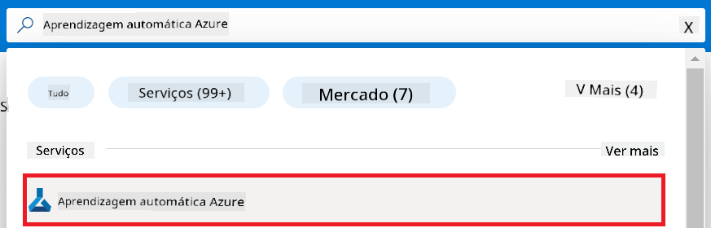
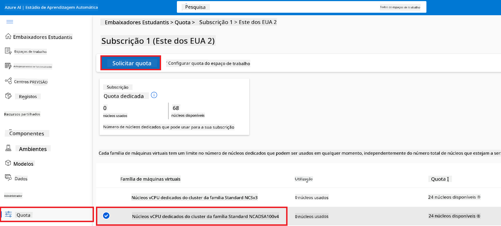
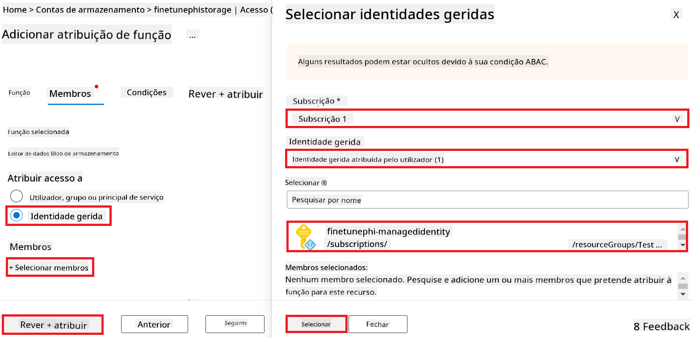

<!--
CO_OP_TRANSLATOR_METADATA:
{
  "original_hash": "ecbd9179a21edbaafaf114d47f09f3e3",
  "translation_date": "2025-07-17T01:22:47+00:00",
  "source_file": "md/02.Application/01.TextAndChat/Phi3/E2E_Phi-3-FineTuning_PromptFlow_Integration_AIFoundry.md",
  "language_code": "pt"
}
-->
# Ajustar e Integrar modelos Phi-3 personalizados com Prompt flow no Azure AI Foundry

Este exemplo de ponta a ponta (E2E) baseia-se no guia "[Fine-Tune and Integrate Custom Phi-3 Models with Prompt Flow in Azure AI Foundry](https://techcommunity.microsoft.com/t5/educator-developer-blog/fine-tune-and-integrate-custom-phi-3-models-with-prompt-flow-in/ba-p/4191726?WT.mc_id=aiml-137032-kinfeylo)" da Microsoft Tech Community. Apresenta os processos de ajuste fino, implementação e integração de modelos Phi-3 personalizados com Prompt flow no Azure AI Foundry.  
Ao contrário do exemplo E2E, "[Fine-Tune and Integrate Custom Phi-3 Models with Prompt Flow](./E2E_Phi-3-FineTuning_PromptFlow_Integration.md)", que envolvia a execução de código localmente, este tutorial foca-se inteiramente no ajuste fino e integração do seu modelo dentro do Azure AI / ML Studio.

## Visão geral

Neste exemplo E2E, irá aprender a ajustar o modelo Phi-3 e integrá-lo com Prompt flow no Azure AI Foundry. Aproveitando o Azure AI / ML Studio, irá estabelecer um fluxo de trabalho para implementar e utilizar modelos de IA personalizados. Este exemplo E2E está dividido em três cenários:

**Cenário 1: Configurar recursos Azure e preparar para ajuste fino**

**Cenário 2: Ajustar o modelo Phi-3 e implementar no Azure Machine Learning Studio**

**Cenário 3: Integrar com Prompt flow e conversar com o seu modelo personalizado no Azure AI Foundry**

Aqui está uma visão geral deste exemplo E2E.


### Índice

1. **[Cenário 1: Configurar recursos Azure e preparar para ajuste fino](../../../../../../md/02.Application/01.TextAndChat/Phi3)**
    - [Criar um Azure Machine Learning Workspace](../../../../../../md/02.Application/01.TextAndChat/Phi3)
    - [Solicitar quotas de GPU na subscrição Azure](../../../../../../md/02.Application/01.TextAndChat/Phi3)
    - [Adicionar atribuição de função](../../../../../../md/02.Application/01.TextAndChat/Phi3)
    - [Configurar projeto](../../../../../../md/02.Application/01.TextAndChat/Phi3)
    - [Preparar conjunto de dados para ajuste fino](../../../../../../md/02.Application/01.TextAndChat/Phi3)

1. **[Cenário 2: Ajustar o modelo Phi-3 e implementar no Azure Machine Learning Studio](../../../../../../md/02.Application/01.TextAndChat/Phi3)**
    - [Ajustar o modelo Phi-3](../../../../../../md/02.Application/01.TextAndChat/Phi3)
    - [Implementar o modelo Phi-3 ajustado](../../../../../../md/02.Application/01.TextAndChat/Phi3)

1. **[Cenário 3: Integrar com Prompt flow e conversar com o seu modelo personalizado no Azure AI Foundry](../../../../../../md/02.Application/01.TextAndChat/Phi3)**
    - [Integrar o modelo Phi-3 personalizado com Prompt flow](../../../../../../md/02.Application/01.TextAndChat/Phi3)
    - [Conversar com o seu modelo Phi-3 personalizado](../../../../../../md/02.Application/01.TextAndChat/Phi3)

## Cenário 1: Configurar recursos Azure e preparar para ajuste fino

### Criar um Azure Machine Learning Workspace

1. Escreva *azure machine learning* na **barra de pesquisa** no topo da página do portal e selecione **Azure Machine Learning** nas opções que surgirem.

    

2. Selecione **+ Create** no menu de navegação.

3. Selecione **New workspace** no menu de navegação.

    

4. Execute as seguintes tarefas:

    - Selecione a sua **Subscrição** Azure.
    - Selecione o **Grupo de recursos** a utilizar (crie um novo se necessário).
    - Insira o **Nome do Workspace**. Deve ser um valor único.
    - Selecione a **Região** que pretende usar.
    - Selecione a **Conta de armazenamento** a utilizar (crie uma nova se necessário).
    - Selecione o **Key vault** a utilizar (crie um novo se necessário).
    - Selecione o **Application insights** a utilizar (crie um novo se necessário).
    - Selecione o **Container registry** a utilizar (crie um novo se necessário).

    

5. Selecione **Review + Create**.

6. Selecione **Create**.

### Solicitar quotas de GPU na subscrição Azure

Neste tutorial, irá aprender a ajustar e implementar um modelo Phi-3, usando GPUs. Para o ajuste fino, irá usar a GPU *Standard_NC24ads_A100_v4*, que requer um pedido de quota. Para a implementação, irá usar a GPU *Standard_NC6s_v3*, que também requer um pedido de quota.

> [!NOTE]
>
> Apenas subscrições Pay-As-You-Go (o tipo de subscrição padrão) são elegíveis para alocação de GPU; subscrições de benefício não são atualmente suportadas.
>

1. Visite [Azure ML Studio](https://ml.azure.com/home?wt.mc_id=studentamb_279723).

1. Execute as seguintes tarefas para solicitar quota da família *Standard NCADSA100v4*:

    - Selecione **Quota** na aba do lado esquerdo.
    - Selecione a **família de máquinas virtuais** a usar. Por exemplo, selecione **Standard NCADSA100v4 Family Cluster Dedicated vCPUs**, que inclui a GPU *Standard_NC24ads_A100_v4*.
    - Selecione **Request quota** no menu de navegação.

        

    - Na página Request quota, insira o **Novo limite de núcleos** que pretende usar. Por exemplo, 24.
    - Na página Request quota, selecione **Submit** para solicitar a quota da GPU.

1. Execute as seguintes tarefas para solicitar quota da família *Standard NCSv3*:

    - Selecione **Quota** na aba do lado esquerdo.
    - Selecione a **família de máquinas virtuais** a usar. Por exemplo, selecione **Standard NCSv3 Family Cluster Dedicated vCPUs**, que inclui a GPU *Standard_NC6s_v3*.
    - Selecione **Request quota** no menu de navegação.
    - Na página Request quota, insira o **Novo limite de núcleos** que pretende usar. Por exemplo, 24.
    - Na página Request quota, selecione **Submit** para solicitar a quota da GPU.

### Adicionar atribuição de função

Para ajustar e implementar os seus modelos, deve primeiro criar uma Identidade Gerida Atribuída pelo Utilizador (User Assigned Managed Identity - UAI) e atribuir-lhe as permissões adequadas. Esta UAI será usada para autenticação durante a implementação.

#### Criar User Assigned Managed Identity (UAI)

1. Escreva *managed identities* na **barra de pesquisa** no topo da página do portal e selecione **Managed Identities** nas opções que surgirem.

    

1. Selecione **+ Create**.

    

1. Execute as seguintes tarefas:

    - Selecione a sua **Subscrição** Azure.
    - Selecione o **Grupo de recursos** a utilizar (crie um novo se necessário).
    - Selecione a **Região** que pretende usar.
    - Insira o **Nome**. Deve ser um valor único.

    

1. Selecione **Review + create**.

1. Selecione **+ Create**.

#### Adicionar atribuição de função Contributor à Managed Identity

1. Navegue até ao recurso Managed Identity que criou.

1. Selecione **Azure role assignments** na aba do lado esquerdo.

1. Selecione **+Add role assignment** no menu de navegação.

1. Na página Add role assignment, execute as seguintes tarefas:
    - Selecione o **Escopo** para **Resource group**.
    - Selecione a sua **Subscrição** Azure.
    - Selecione o **Grupo de recursos** a utilizar.
    - Selecione a **Função** para **Contributor**.

    

2. Selecione **Save**.

#### Adicionar atribuição de função Storage Blob Data Reader à Managed Identity

1. Escreva *storage accounts* na **barra de pesquisa** no topo da página do portal e selecione **Storage accounts** nas opções que surgirem.

    

1. Selecione a conta de armazenamento associada ao Azure Machine Learning workspace que criou. Por exemplo, *finetunephistorage*.

1. Execute as seguintes tarefas para navegar até à página Add role assignment:

    - Navegue até à conta de armazenamento Azure que criou.
    - Selecione **Access Control (IAM)** na aba do lado esquerdo.
    - Selecione **+ Add** no menu de navegação.
    - Selecione **Add role assignment** no menu de navegação.

    

1. Na página Add role assignment, execute as seguintes tarefas:

    - Na página Role, escreva *Storage Blob Data Reader* na **barra de pesquisa** e selecione **Storage Blob Data Reader** nas opções que surgirem.
    - Na página Role, selecione **Next**.
    - Na página Members, selecione **Assign access to** **Managed identity**.
    - Na página Members, selecione **+ Select members**.
    - Na página Select managed identities, selecione a sua **Subscrição** Azure.
    - Na página Select managed identities, selecione a **Managed identity** para **Manage Identity**.
    - Na página Select managed identities, selecione a Managed Identity que criou. Por exemplo, *finetunephi-managedidentity*.
    - Na página Select managed identities, selecione **Select**.

    

1. Selecione **Review + assign**.

#### Adicionar atribuição de função AcrPull à Managed Identity

1. Escreva *container registries* na **barra de pesquisa** no topo da página do portal e selecione **Container registries** nas opções que surgirem.

    

1. Selecione o container registry associado ao Azure Machine Learning workspace. Por exemplo, *finetunephicontainerregistry*

1. Execute as seguintes tarefas para navegar até à página Add role assignment:

    - Selecione **Access Control (IAM)** na aba do lado esquerdo.
    - Selecione **+ Add** no menu de navegação.
    - Selecione **Add role assignment** no menu de navegação.

1. Na página Add role assignment, execute as seguintes tarefas:

    - Na página Role, escreva *AcrPull* na **barra de pesquisa** e selecione **AcrPull** nas opções que surgirem.
    - Na página Role, selecione **Next**.
    - Na página Members, selecione **Assign access to** **Managed identity**.
    - Na página Members, selecione **+ Select members**.
    - Na página Select managed identities, selecione a sua **Subscrição** Azure.
    - Na página Select managed identities, selecione a **Managed identity** para **Manage Identity**.
    - Na página Select managed identities, selecione a Managed Identity que criou. Por exemplo, *finetunephi-managedidentity*.
    - Na página Select managed identities, selecione **Select**.
    - Selecione **Review + assign**.

### Configurar projeto

Para descarregar os conjuntos de dados necessários para o ajuste fino, irá configurar um ambiente local.

Neste exercício, irá

- Criar uma pasta para trabalhar dentro dela.
- Criar um ambiente virtual.
- Instalar os pacotes necessários.
- Criar um ficheiro *download_dataset.py* para descarregar o conjunto de dados.

#### Criar uma pasta para trabalhar dentro dela

1. Abra uma janela de terminal e escreva o seguinte comando para criar uma pasta chamada *finetune-phi* no caminho predefinido.

    ```console
    mkdir finetune-phi
    ```

2. Escreva o seguinte comando no terminal para navegar até à pasta *finetune-phi* que criou.
#### Criar um ambiente virtual

1. Digite o seguinte comando no seu terminal para criar um ambiente virtual chamado *.venv*.

    ```console
    python -m venv .venv
    ```

2. Digite o seguinte comando no seu terminal para ativar o ambiente virtual.

    ```console
    .venv\Scripts\activate.bat
    ```


> [!NOTE]
> Se funcionou, deverá ver *(.venv)* antes do prompt de comando.

#### Instalar os pacotes necessários

1. Digite os seguintes comandos no seu terminal para instalar os pacotes necessários.

    ```console
    pip install datasets==2.19.1
    ```

#### Criar `download_dataset.py`

> [!NOTE]
> Estrutura completa da pasta:
>
> ```text
> └── YourUserName
> .    └── finetune-phi
> .        └── download_dataset.py
> ```

1. Abra o **Visual Studio Code**.

1. Selecione **File** na barra de menu.

1. Selecione **Open Folder**.

1. Selecione a pasta *finetune-phi* que criou, localizada em *C:\Users\yourUserName\finetune-phi*.

    

1. No painel esquerdo do Visual Studio Code, clique com o botão direito e selecione **New File** para criar um novo ficheiro chamado *download_dataset.py*.

    

### Preparar o dataset para fine-tuning

Neste exercício, irá executar o ficheiro *download_dataset.py* para descarregar os datasets *ultrachat_200k* para o seu ambiente local. Depois, irá usar estes datasets para fazer fine-tuning do modelo Phi-3 no Azure Machine Learning.

Neste exercício, irá:

- Adicionar código ao ficheiro *download_dataset.py* para descarregar os datasets.
- Executar o ficheiro *download_dataset.py* para descarregar os datasets para o seu ambiente local.

#### Descarregar o seu dataset usando *download_dataset.py*

1. Abra o ficheiro *download_dataset.py* no Visual Studio Code.

1. Adicione o seguinte código no ficheiro *download_dataset.py*.

    ```python
    import json
    import os
    from datasets import load_dataset

    def load_and_split_dataset(dataset_name, config_name, split_ratio):
        """
        Load and split a dataset.
        """
        # Load the dataset with the specified name, configuration, and split ratio
        dataset = load_dataset(dataset_name, config_name, split=split_ratio)
        print(f"Original dataset size: {len(dataset)}")
        
        # Split the dataset into train and test sets (80% train, 20% test)
        split_dataset = dataset.train_test_split(test_size=0.2)
        print(f"Train dataset size: {len(split_dataset['train'])}")
        print(f"Test dataset size: {len(split_dataset['test'])}")
        
        return split_dataset

    def save_dataset_to_jsonl(dataset, filepath):
        """
        Save a dataset to a JSONL file.
        """
        # Create the directory if it does not exist
        os.makedirs(os.path.dirname(filepath), exist_ok=True)
        
        # Open the file in write mode
        with open(filepath, 'w', encoding='utf-8') as f:
            # Iterate over each record in the dataset
            for record in dataset:
                # Dump the record as a JSON object and write it to the file
                json.dump(record, f)
                # Write a newline character to separate records
                f.write('\n')
        
        print(f"Dataset saved to {filepath}")

    def main():
        """
        Main function to load, split, and save the dataset.
        """
        # Load and split the ULTRACHAT_200k dataset with a specific configuration and split ratio
        dataset = load_and_split_dataset("HuggingFaceH4/ultrachat_200k", 'default', 'train_sft[:1%]')
        
        # Extract the train and test datasets from the split
        train_dataset = dataset['train']
        test_dataset = dataset['test']

        # Save the train dataset to a JSONL file
        save_dataset_to_jsonl(train_dataset, "data/train_data.jsonl")
        
        # Save the test dataset to a separate JSONL file
        save_dataset_to_jsonl(test_dataset, "data/test_data.jsonl")

    if __name__ == "__main__":
        main()

    ```

1. Digite o seguinte comando no seu terminal para executar o script e descarregar o dataset para o seu ambiente local.

    ```console
    python download_dataset.py
    ```

1. Verifique se os datasets foram guardados com sucesso na sua pasta local *finetune-phi/data*.

> [!NOTE]
>
> #### Nota sobre o tamanho do dataset e o tempo de fine-tuning
>
> Neste tutorial, usa apenas 1% do dataset (`split='train[:1%]'`). Isto reduz significativamente a quantidade de dados, acelerando tanto o upload como o processo de fine-tuning. Pode ajustar a percentagem para encontrar o equilíbrio certo entre o tempo de treino e o desempenho do modelo. Usar um subconjunto menor do dataset reduz o tempo necessário para o fine-tuning, tornando o processo mais gerível para um tutorial.

## Cenário 2: Fazer fine-tuning do modelo Phi-3 e implementar no Azure Machine Learning Studio

### Fazer fine-tuning do modelo Phi-3

Neste exercício, irá fazer fine-tuning do modelo Phi-3 no Azure Machine Learning Studio.

Neste exercício, irá:

- Criar um cluster de computação para o fine-tuning.
- Fazer fine-tuning do modelo Phi-3 no Azure Machine Learning Studio.

#### Criar cluster de computação para fine-tuning

1. Visite [Azure ML Studio](https://ml.azure.com/home?wt.mc_id=studentamb_279723).

1. Selecione **Compute** no separador do lado esquerdo.

1. Selecione **Compute clusters** no menu de navegação.

1. Selecione **+ New**.

    

1. Realize as seguintes tarefas:

    - Selecione a **Região** que pretende usar.
    - Selecione o **Virtual machine tier** para **Dedicated**.
    - Selecione o **Virtual machine type** para **GPU**.
    - Selecione o filtro **Virtual machine size** para **Select from all options**.
    - Selecione o **Virtual machine size** para **Standard_NC24ads_A100_v4**.

    

1. Selecione **Next**.

1. Realize as seguintes tarefas:

    - Insira o **Compute name**. Deve ser um valor único.
    - Selecione o **Minimum number of nodes** para **0**.
    - Selecione o **Maximum number of nodes** para **1**.
    - Selecione o **Idle seconds before scale down** para **120**.

    

1. Selecione **Create**.

#### Fazer fine-tuning do modelo Phi-3

1. Visite [Azure ML Studio](https://ml.azure.com/home?wt.mc_id=studentamb_279723).

1. Selecione o workspace Azure Machine Learning que criou.

    

1. Realize as seguintes tarefas:

    - Selecione **Model catalog** no separador do lado esquerdo.
    - Escreva *phi-3-mini-4k* na **barra de pesquisa** e selecione **Phi-3-mini-4k-instruct** nas opções que aparecem.

    

1. Selecione **Fine-tune** no menu de navegação.

    

1. Realize as seguintes tarefas:

    - Selecione **Select task type** para **Chat completion**.
    - Selecione **+ Select data** para carregar os **Training data**.
    - Selecione o tipo de upload dos dados de validação para **Provide different validation data**.
    - Selecione **+ Select data** para carregar os **Validation data**.

    

    > [!TIP]
    >
    > Pode selecionar **Advanced settings** para personalizar configurações como **learning_rate** e **lr_scheduler_type** para otimizar o processo de fine-tuning conforme as suas necessidades específicas.

1. Selecione **Finish**.

1. Neste exercício, fez fine-tuning com sucesso do modelo Phi-3 usando o Azure Machine Learning. Note que o processo de fine-tuning pode demorar algum tempo. Após iniciar o trabalho de fine-tuning, terá de aguardar até que este termine. Pode acompanhar o estado do trabalho na aba Jobs, no lado esquerdo do seu workspace Azure Machine Learning. Na próxima série, irá implementar o modelo fine-tuned e integrá-lo com o Prompt flow.

    

### Implementar o modelo Phi-3 fine-tuned

Para integrar o modelo Phi-3 fine-tuned com o Prompt flow, precisa de implementar o modelo para que esteja acessível para inferência em tempo real. Este processo envolve registar o modelo, criar um endpoint online e implementar o modelo.

Neste exercício, irá:

- Registar o modelo fine-tuned no workspace Azure Machine Learning.
- Criar um endpoint online.
- Implementar o modelo Phi-3 fine-tuned registado.

#### Registar o modelo fine-tuned

1. Visite [Azure ML Studio](https://ml.azure.com/home?wt.mc_id=studentamb_279723).

1. Selecione o workspace Azure Machine Learning que criou.

    

1. Selecione **Models** no separador do lado esquerdo.

1. Selecione **+ Register**.

1. Selecione **From a job output**.

    

1. Selecione o trabalho que criou.

    

1. Selecione **Next**.

1. Selecione **Model type** para **MLflow**.

1. Certifique-se de que **Job output** está selecionado; deverá estar selecionado automaticamente.

    

2. Selecione **Next**.

3. Selecione **Register**.

    

4. Pode ver o seu modelo registado navegando até ao menu **Models** no separador do lado esquerdo.

    

#### Implementar o modelo fine-tuned

1. Navegue até ao workspace Azure Machine Learning que criou.

1. Selecione **Endpoints** no separador do lado esquerdo.

1. Selecione **Real-time endpoints** no menu de navegação.

    

1. Selecione **Create**.

1. Selecione o modelo registado que criou.

    

1. Selecione **Select**.

1. Realize as seguintes tarefas:

    - Selecione **Virtual machine** para *Standard_NC6s_v3*.
    - Selecione o **Instance count** que pretende usar. Por exemplo, *1*.
    - Selecione o **Endpoint** para **New** para criar um endpoint.
    - Insira o **Endpoint name**. Deve ser um valor único.
    - Insira o **Deployment name**. Deve ser um valor único.

    

1. Selecione **Deploy**.

> [!WARNING]
> Para evitar custos adicionais na sua conta, certifique-se de eliminar o endpoint criado no workspace Azure Machine Learning.
>

#### Verificar o estado da implementação no Azure Machine Learning Workspace

1. Navegue até ao workspace Azure Machine Learning que criou.

1. Selecione **Endpoints** no separador do lado esquerdo.

1. Selecione o endpoint que criou.

    

1. Nesta página, pode gerir os endpoints durante o processo de implementação.

> [!NOTE]
> Assim que a implementação estiver concluída, certifique-se de que o **Live traffic** está definido para **100%**. Se não estiver, selecione **Update traffic** para ajustar as definições de tráfego. Note que não pode testar o modelo se o tráfego estiver definido para 0%.
>
> 
>

## Cenário 3: Integrar com Prompt flow e conversar com o seu modelo personalizado no Azure AI Foundry

### Integrar o modelo Phi-3 personalizado com Prompt flow

Depois de implementar com sucesso o seu modelo fine-tuned, pode agora integrá-lo com o Prompt Flow para usar o seu modelo em aplicações em tempo real, permitindo uma variedade de tarefas interativas com o seu modelo Phi-3 personalizado.

Neste exercício, irá:

- Criar o Azure AI Foundry Hub.
- Criar o projeto Azure AI Foundry.
- Criar o Prompt flow.
- Adicionar uma ligação personalizada para o modelo Phi-3 fine-tuned.
- Configurar o Prompt flow para conversar com o seu modelo Phi-3 personalizado.
> [!NOTE]
> Também pode integrar com o Promptflow usando o Azure ML Studio. O mesmo processo de integração pode ser aplicado ao Azure ML Studio.
#### Criar Azure AI Foundry Hub

É necessário criar um Hub antes de criar o Projeto. Um Hub funciona como um Grupo de Recursos, permitindo organizar e gerir vários Projetos dentro do Azure AI Foundry.

1. Visite [Azure AI Foundry](https://ai.azure.com/?WT.mc_id=aiml-137032-kinfeylo).

1. Selecione **All hubs** no separador do lado esquerdo.

1. Selecione **+ New hub** no menu de navegação.

    

1. Realize as seguintes tarefas:

    - Introduza o **Hub name**. Deve ser um valor único.
    - Selecione a sua **Subscription** Azure.
    - Selecione o **Resource group** a utilizar (crie um novo se necessário).
    - Selecione a **Location** que pretende usar.
    - Selecione o **Connect Azure AI Services** a utilizar (crie um novo se necessário).
    - Selecione **Connect Azure AI Search** para **Skip connecting**.

    

1. Selecione **Next**.

#### Criar Projeto Azure AI Foundry

1. No Hub que criou, selecione **All projects** no separador do lado esquerdo.

1. Selecione **+ New project** no menu de navegação.

    

1. Introduza o **Project name**. Deve ser um valor único.

    

1. Selecione **Create a project**.

#### Adicionar uma ligação personalizada para o modelo Phi-3 ajustado

Para integrar o seu modelo Phi-3 personalizado com o Prompt flow, precisa de guardar o endpoint e a chave do modelo numa ligação personalizada. Esta configuração garante o acesso ao seu modelo Phi-3 personalizado no Prompt flow.

#### Definir a api key e o endpoint uri do modelo Phi-3 ajustado

1. Visite [Azure ML Studio](https://ml.azure.com/home?WT.mc_id=aiml-137032-kinfeylo).

1. Navegue até ao workspace Azure Machine learning que criou.

1. Selecione **Endpoints** no separador do lado esquerdo.

    

1. Selecione o endpoint que criou.

    

1. Selecione **Consume** no menu de navegação.

1. Copie o seu **REST endpoint** e a **Primary key**.

    

#### Adicionar a Ligação Personalizada

1. Visite [Azure AI Foundry](https://ai.azure.com/?WT.mc_id=aiml-137032-kinfeylo).

1. Navegue até ao projeto Azure AI Foundry que criou.

1. No Projeto que criou, selecione **Settings** no separador do lado esquerdo.

1. Selecione **+ New connection**.

    

1. Selecione **Custom keys** no menu de navegação.

    

1. Realize as seguintes tarefas:

    - Selecione **+ Add key value pairs**.
    - Para o nome da chave, introduza **endpoint** e cole o endpoint que copiou do Azure ML Studio no campo do valor.
    - Selecione novamente **+ Add key value pairs**.
    - Para o nome da chave, introduza **key** e cole a chave que copiou do Azure ML Studio no campo do valor.
    - Depois de adicionar as chaves, selecione **is secret** para evitar que a chave seja exposta.

    

1. Selecione **Add connection**.

#### Criar Prompt flow

Adicionou uma ligação personalizada no Azure AI Foundry. Agora, vamos criar um Prompt flow seguindo os passos abaixo. Depois, irá ligar este Prompt flow à ligação personalizada para poder usar o modelo ajustado dentro do Prompt flow.

1. Navegue até ao projeto Azure AI Foundry que criou.

1. Selecione **Prompt flow** no separador do lado esquerdo.

1. Selecione **+ Create** no menu de navegação.

    

1. Selecione **Chat flow** no menu de navegação.

    

1. Introduza o **Folder name** a usar.

    

2. Selecione **Create**.

#### Configurar Prompt flow para conversar com o seu modelo Phi-3 personalizado

É necessário integrar o modelo Phi-3 ajustado num Prompt flow. No entanto, o Prompt flow existente não foi concebido para este propósito. Por isso, deve redesenhar o Prompt flow para permitir a integração do modelo personalizado.

1. No Prompt flow, realize as seguintes tarefas para reconstruir o fluxo existente:

    - Selecione **Raw file mode**.
    - Apague todo o código existente no ficheiro *flow.dag.yml*.
    - Adicione o seguinte código ao ficheiro *flow.dag.yml*.

        ```yml
        inputs:
          input_data:
            type: string
            default: "Who founded Microsoft?"

        outputs:
          answer:
            type: string
            reference: ${integrate_with_promptflow.output}

        nodes:
        - name: integrate_with_promptflow
          type: python
          source:
            type: code
            path: integrate_with_promptflow.py
          inputs:
            input_data: ${inputs.input_data}
        ```

    - Selecione **Save**.

    

1. Adicione o seguinte código ao ficheiro *integrate_with_promptflow.py* para usar o modelo Phi-3 personalizado no Prompt flow.

    ```python
    import logging
    import requests
    from promptflow import tool
    from promptflow.connections import CustomConnection

    # Logging setup
    logging.basicConfig(
        format="%(asctime)s - %(levelname)s - %(name)s - %(message)s",
        datefmt="%Y-%m-%d %H:%M:%S",
        level=logging.DEBUG
    )
    logger = logging.getLogger(__name__)

    def query_phi3_model(input_data: str, connection: CustomConnection) -> str:
        """
        Send a request to the Phi-3 model endpoint with the given input data using Custom Connection.
        """

        # "connection" is the name of the Custom Connection, "endpoint", "key" are the keys in the Custom Connection
        endpoint_url = connection.endpoint
        api_key = connection.key

        headers = {
            "Content-Type": "application/json",
            "Authorization": f"Bearer {api_key}"
        }
        data = {
            "input_data": {
                "input_string": [
                    {"role": "user", "content": input_data}
                ],
                "parameters": {
                    "temperature": 0.7,
                    "max_new_tokens": 128
                }
            }
        }
        try:
            response = requests.post(endpoint_url, json=data, headers=headers)
            response.raise_for_status()
            
            # Log the full JSON response
            logger.debug(f"Full JSON response: {response.json()}")

            result = response.json()["output"]
            logger.info("Successfully received response from Azure ML Endpoint.")
            return result
        except requests.exceptions.RequestException as e:
            logger.error(f"Error querying Azure ML Endpoint: {e}")
            raise

    @tool
    def my_python_tool(input_data: str, connection: CustomConnection) -> str:
        """
        Tool function to process input data and query the Phi-3 model.
        """
        return query_phi3_model(input_data, connection)

    ```

    

> [!NOTE]
> Para informações mais detalhadas sobre como usar o Prompt flow no Azure AI Foundry, pode consultar [Prompt flow in Azure AI Foundry](https://learn.microsoft.com/azure/ai-studio/how-to/prompt-flow).

1. Selecione **Chat input**, **Chat output** para ativar a conversa com o seu modelo.

    

1. Agora está pronto para conversar com o seu modelo Phi-3 personalizado. No próximo exercício, irá aprender como iniciar o Prompt flow e usá-lo para conversar com o seu modelo Phi-3 ajustado.

> [!NOTE]
>
> O fluxo reconstruído deverá parecer com a imagem abaixo:
>
> 
>

### Conversar com o seu modelo Phi-3 personalizado

Agora que ajustou e integrou o seu modelo Phi-3 personalizado com o Prompt flow, está pronto para começar a interagir com ele. Este exercício irá guiá-lo no processo de configuração e início de uma conversa com o seu modelo usando o Prompt flow. Seguindo estes passos, poderá tirar o máximo proveito das capacidades do seu modelo Phi-3 ajustado para várias tarefas e conversas.

- Converse com o seu modelo Phi-3 personalizado usando o Prompt flow.

#### Iniciar Prompt flow

1. Selecione **Start compute sessions** para iniciar o Prompt flow.

    

1. Selecione **Validate and parse input** para renovar os parâmetros.

    

1. Selecione o **Value** da **connection** para a ligação personalizada que criou. Por exemplo, *connection*.

    

#### Conversar com o seu modelo personalizado

1. Selecione **Chat**.

    

1. Aqui está um exemplo dos resultados: Agora pode conversar com o seu modelo Phi-3 personalizado. Recomenda-se fazer perguntas baseadas nos dados usados para o ajuste.

    

**Aviso Legal**:  
Este documento foi traduzido utilizando o serviço de tradução automática [Co-op Translator](https://github.com/Azure/co-op-translator). Embora nos esforcemos pela precisão, por favor tenha em conta que traduções automáticas podem conter erros ou imprecisões. O documento original na sua língua nativa deve ser considerado a fonte autorizada. Para informações críticas, recomenda-se tradução profissional humana. Não nos responsabilizamos por quaisquer mal-entendidos ou interpretações incorretas decorrentes da utilização desta tradução.