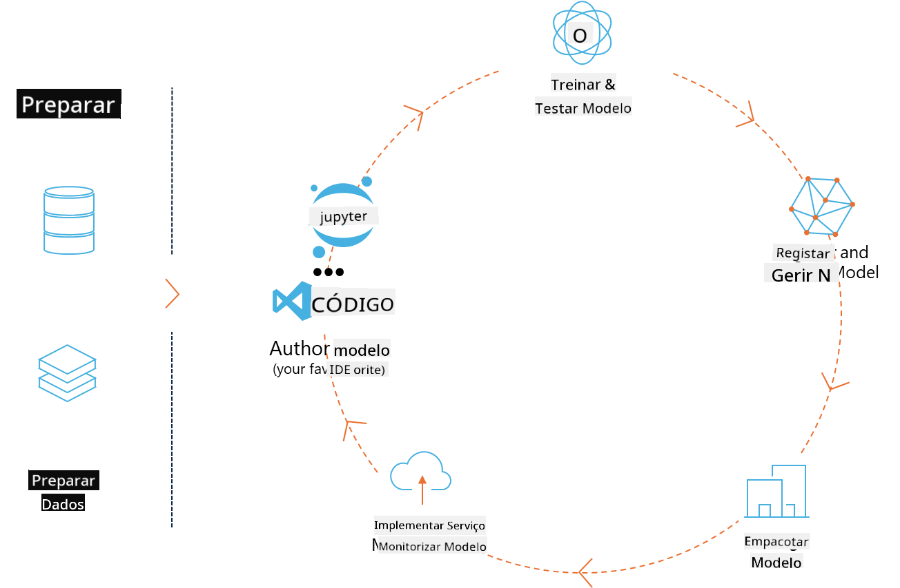
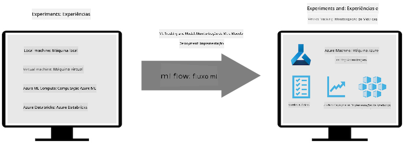

<!--
CO_OP_TRANSLATOR_METADATA:
{
  "original_hash": "f61c383bbf0c3dac97e43f833c258731",
  "translation_date": "2025-07-17T02:30:09+00:00",
  "source_file": "md/02.Application/01.TextAndChat/Phi3/E2E_Phi-3-MLflow.md",
  "language_code": "pt"
}
-->
# MLflow

[MLflow](https://mlflow.org/) é uma plataforma open-source concebida para gerir o ciclo de vida completo do machine learning.



O MLFlow é utilizado para gerir o ciclo de vida do ML, incluindo experimentação, reprodutibilidade, deployment e um registo central de modelos. Atualmente, o MLflow oferece quatro componentes.

- **MLflow Tracking:** Registar e consultar experimentos, código, configuração de dados e resultados.
- **MLflow Projects:** Empacotar código de ciência de dados num formato que permite reproduzir execuções em qualquer plataforma.
- **Mlflow Models:** Fazer deployment de modelos de machine learning em diversos ambientes de serving.
- **Model Registry:** Armazenar, anotar e gerir modelos num repositório central.

Inclui funcionalidades para rastrear experimentos, empacotar código em execuções reproduzíveis, e partilhar e fazer deployment de modelos. O MLFlow está integrado no Databricks e suporta várias bibliotecas de ML, sendo agnóstico em relação a bibliotecas. Pode ser usado com qualquer biblioteca de machine learning e em qualquer linguagem de programação, pois disponibiliza uma API REST e uma CLI para maior conveniência.



As principais funcionalidades do MLFlow incluem:

- **Rastreamento de Experimentos:** Registar e comparar parâmetros e resultados.
- **Gestão de Modelos:** Fazer deployment de modelos para várias plataformas de serving e inferência.
- **Model Registry:** Gerir colaborativamente o ciclo de vida dos modelos MLflow, incluindo versionamento e anotações.
- **Projects:** Empacotar código ML para partilha ou uso em produção.

O MLFlow também suporta o ciclo MLOps, que inclui preparar dados, registar e gerir modelos, empacotar modelos para execução, fazer deployment de serviços e monitorizar modelos. O objetivo é simplificar o processo de transição de um protótipo para um fluxo de trabalho de produção, especialmente em ambientes cloud e edge.

## Cenário E2E - Construir um wrapper e usar o Phi-3 como modelo MLFlow

Neste exemplo E2E vamos demonstrar duas abordagens diferentes para construir um wrapper em torno do modelo de linguagem pequeno Phi-3 (SLM) e depois executá-lo como um modelo MLFlow, localmente ou na cloud, por exemplo, no Azure Machine Learning workspace.


| Projeto | Descrição | Localização |
| ------------ | ----------- | -------- |
| Transformer Pipeline | O Transformer Pipeline é a opção mais simples para construir um wrapper se quiser usar um modelo HuggingFace com o flavour experimental de transformers do MLFlow. | [**TransformerPipeline.ipynb**](../../../../../../code/06.E2E/E2E_Phi-3-MLflow_TransformerPipeline.ipynb) |
| Custom Python Wrapper | No momento da escrita, o transformer pipeline não suportava a geração de wrappers MLFlow para modelos HuggingFace em formato ONNX, mesmo com o pacote experimental optimum Python. Para casos como este, pode construir o seu wrapper Python personalizado para o modo MLFlow. | [**CustomPythonWrapper.ipynb**](../../../../../../code/06.E2E/E2E_Phi-3-MLflow_CustomPythonWrapper.ipynb) |

## Projeto: Transformer Pipeline

1. Vai precisar dos pacotes Python relevantes do MLFlow e HuggingFace:

    ``` Python
    import mlflow
    import transformers
    ```

2. De seguida, deve iniciar um transformer pipeline referenciando o modelo Phi-3 alvo no registo HuggingFace. Como pode ser visto no cartão do modelo _Phi-3-mini-4k-instruct_, a sua tarefa é do tipo “Text Generation”:

    ``` Python
    pipeline = transformers.pipeline(
        task = "text-generation",
        model = "microsoft/Phi-3-mini-4k-instruct"
    )
    ```

3. Agora pode guardar o transformer pipeline do seu modelo Phi-3 no formato MLFlow e fornecer detalhes adicionais como o caminho para os artefactos, configurações específicas do modelo e tipo de API de inferência:

    ``` Python
    model_info = mlflow.transformers.log_model(
        transformers_model = pipeline,
        artifact_path = "phi3-mlflow-model",
        model_config = model_config,
        task = "llm/v1/chat"
    )
    ```

## Projeto: Custom Python Wrapper

1. Podemos aqui utilizar a [API generate() do ONNX Runtime](https://github.com/microsoft/onnxruntime-genai) da Microsoft para a inferência do modelo ONNX e codificação/decodificação de tokens. Deve escolher o pacote _onnxruntime_genai_ para o seu ambiente de computação alvo, com o exemplo abaixo a visar CPU:

    ``` Python
    import mlflow
    from mlflow.models import infer_signature
    import onnxruntime_genai as og
    ```

1. A nossa classe personalizada implementa dois métodos: _load_context()_ para inicializar o **modelo ONNX** do Phi-3 Mini 4K Instruct, os **parâmetros do gerador** e o **tokenizer**; e _predict()_ para gerar tokens de saída para o prompt fornecido:

    ``` Python
    class Phi3Model(mlflow.pyfunc.PythonModel):
        def load_context(self, context):
            # Retrieving model from the artifacts
            model_path = context.artifacts["phi3-mini-onnx"]
            model_options = {
                 "max_length": 300,
                 "temperature": 0.2,         
            }
        
            # Defining the model
            self.phi3_model = og.Model(model_path)
            self.params = og.GeneratorParams(self.phi3_model)
            self.params.set_search_options(**model_options)
            
            # Defining the tokenizer
            self.tokenizer = og.Tokenizer(self.phi3_model)
    
        def predict(self, context, model_input):
            # Retrieving prompt from the input
            prompt = model_input["prompt"][0]
            self.params.input_ids = self.tokenizer.encode(prompt)
    
            # Generating the model's response
            response = self.phi3_model.generate(self.params)
    
            return self.tokenizer.decode(response[0][len(self.params.input_ids):])
    ```

1. Pode agora usar a função _mlflow.pyfunc.log_model()_ para gerar um wrapper Python personalizado (em formato pickle) para o modelo Phi-3, juntamente com o modelo ONNX original e as dependências necessárias:

    ``` Python
    model_info = mlflow.pyfunc.log_model(
        artifact_path = artifact_path,
        python_model = Phi3Model(),
        artifacts = {
            "phi3-mini-onnx": "cpu_and_mobile/cpu-int4-rtn-block-32-acc-level-4",
        },
        input_example = input_example,
        signature = infer_signature(input_example, ["Run"]),
        extra_pip_requirements = ["torch", "onnxruntime_genai", "numpy"],
    )
    ```

## Assinaturas dos modelos MLFlow gerados

1. No passo 3 do projeto Transformer Pipeline acima, definimos a tarefa do modelo MLFlow como “_llm/v1/chat_”. Esta instrução gera um wrapper da API do modelo, compatível com a API Chat da OpenAI, como mostrado abaixo:

    ``` Python
    {inputs: 
      ['messages': Array({content: string (required), name: string (optional), role: string (required)}) (required), 'temperature': double (optional), 'max_tokens': long (optional), 'stop': Array(string) (optional), 'n': long (optional), 'stream': boolean (optional)],
    outputs: 
      ['id': string (required), 'object': string (required), 'created': long (required), 'model': string (required), 'choices': Array({finish_reason: string (required), index: long (required), message: {content: string (required), name: string (optional), role: string (required)} (required)}) (required), 'usage': {completion_tokens: long (required), prompt_tokens: long (required), total_tokens: long (required)} (required)],
    params: 
      None}
    ```

1. Como resultado, pode submeter o seu prompt no seguinte formato:

    ``` Python
    messages = [{"role": "user", "content": "What is the capital of Spain?"}]
    ```

1. Depois, use um pós-processamento compatível com a API OpenAI, por exemplo, _response[0][‘choices’][0][‘message’][‘content’]_, para embelezar a sua saída para algo como isto:

    ``` JSON
    Question: What is the capital of Spain?
    
    Answer: The capital of Spain is Madrid. It is the largest city in Spain and serves as the political, economic, and cultural center of the country. Madrid is located in the center of the Iberian Peninsula and is known for its rich history, art, and architecture, including the Royal Palace, the Prado Museum, and the Plaza Mayor.
    
    Usage: {'prompt_tokens': 11, 'completion_tokens': 73, 'total_tokens': 84}
    ```

1. No passo 3 do projeto Custom Python Wrapper acima, permitimos que o pacote MLFlow gere a assinatura do modelo a partir de um exemplo de input dado. A assinatura do nosso wrapper MLFlow ficará assim:

    ``` Python
    {inputs: 
      ['prompt': string (required)],
    outputs: 
      [string (required)],
    params: 
      None}
    ```

1. Portanto, o nosso prompt deverá conter a chave do dicionário "prompt", semelhante a isto:

    ``` Python
    {"prompt": "<|system|>You are a stand-up comedian.<|end|><|user|>Tell me a joke about atom<|end|><|assistant|>",}
    ```

1. A saída do modelo será então fornecida em formato string:

    ``` JSON
    Alright, here's a little atom-related joke for you!
    
    Why don't electrons ever play hide and seek with protons?
    
    Because good luck finding them when they're always "sharing" their electrons!
    
    Remember, this is all in good fun, and we're just having a little atomic-level humor!
    ```

**Aviso Legal**:  
Este documento foi traduzido utilizando o serviço de tradução automática [Co-op Translator](https://github.com/Azure/co-op-translator). Embora nos esforcemos pela precisão, por favor tenha em conta que traduções automáticas podem conter erros ou imprecisões. O documento original na sua língua nativa deve ser considerado a fonte autorizada. Para informações críticas, recomenda-se tradução profissional humana. Não nos responsabilizamos por quaisquer mal-entendidos ou interpretações incorretas decorrentes da utilização desta tradução.