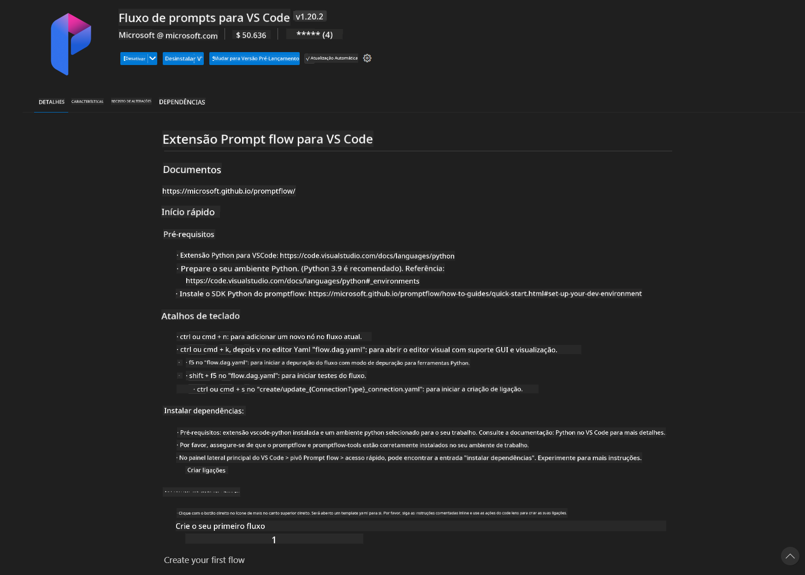
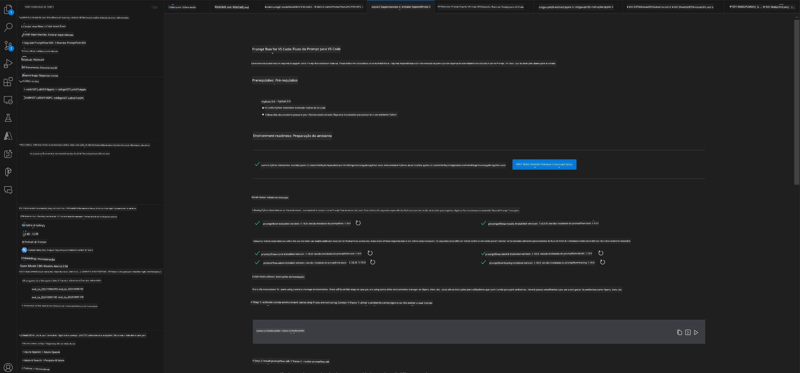
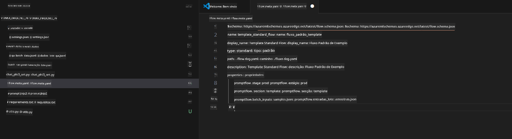
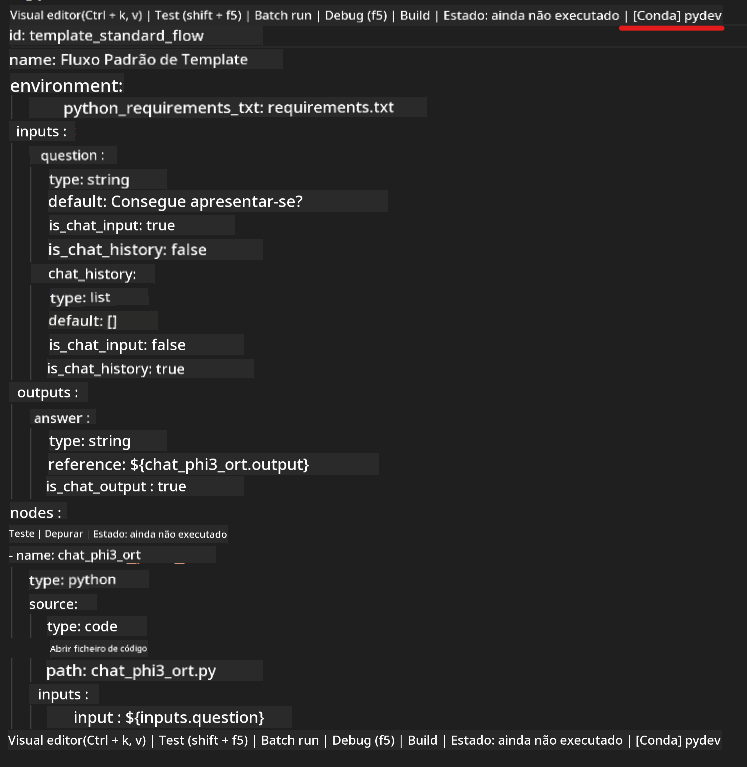
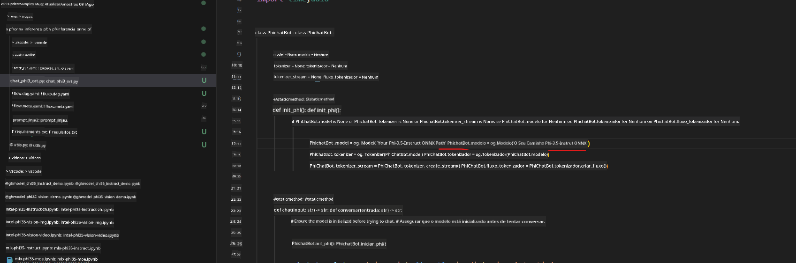
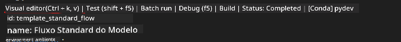
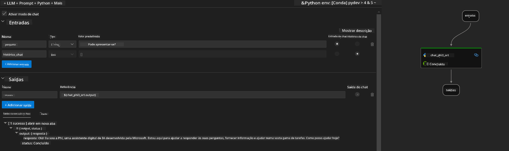
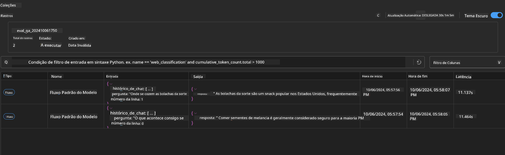

<!--
CO_OP_TRANSLATOR_METADATA:
{
  "original_hash": "92e7dac1e5af0dd7c94170fdaf6860fe",
  "translation_date": "2025-05-09T18:52:09+00:00",
  "source_file": "md/02.Application/01.TextAndChat/Phi3/UsingPromptFlowWithONNX.md",
  "language_code": "pt"
}
-->
# Usando GPU do Windows para criar solução Prompt flow com Phi-3.5-Instruct ONNX

O documento a seguir é um exemplo de como usar o PromptFlow com ONNX (Open Neural Network Exchange) para desenvolver aplicações de IA baseadas nos modelos Phi-3.

PromptFlow é um conjunto de ferramentas de desenvolvimento projetado para simplificar o ciclo completo de desenvolvimento de aplicações de IA baseadas em LLM (Large Language Model), desde a ideação e prototipagem até os testes e avaliação.

Ao integrar o PromptFlow com ONNX, os desenvolvedores podem:

- Otimizar o desempenho do modelo: aproveitar o ONNX para inferência e implantação eficiente do modelo.
- Simplificar o desenvolvimento: usar o PromptFlow para gerenciar o fluxo de trabalho e automatizar tarefas repetitivas.
- Melhorar a colaboração: facilitar uma melhor colaboração entre os membros da equipe, oferecendo um ambiente de desenvolvimento unificado.

**Prompt flow** é um conjunto de ferramentas de desenvolvimento criado para simplificar o ciclo completo de desenvolvimento de aplicações de IA baseadas em LLM, desde ideação, prototipagem, testes, avaliação até implantação em produção e monitoramento. Ele torna a engenharia de prompt muito mais fácil e permite construir aplicativos LLM com qualidade de produção.

O Prompt flow pode se conectar ao OpenAI, Azure OpenAI Service e modelos personalizáveis (Huggingface, LLM/SLM locais). Nosso objetivo é implantar o modelo ONNX quantizado do Phi-3.5 em aplicações locais. O Prompt flow pode nos ajudar a planejar melhor nossos negócios e completar soluções locais baseadas no Phi-3.5. Neste exemplo, combinaremos a biblioteca ONNX Runtime GenAI para completar a solução Prompt flow baseada em GPU do Windows.

## **Instalação**

### **ONNX Runtime GenAI para GPU do Windows**

Leia este guia para configurar o ONNX Runtime GenAI para GPU do Windows [clique aqui](./ORTWindowGPUGuideline.md)

### **Configurar Prompt flow no VSCode**

1. Instale a extensão Prompt flow para VS Code



2. Após instalar a extensão Prompt flow para VS Code, clique na extensão e escolha **Installation dependencies**. Siga este guia para instalar o SDK do Prompt flow no seu ambiente



3. Baixe o [Código de Exemplo](../../../../../../code/09.UpdateSamples/Aug/pf/onnx_inference_pf) e abra este exemplo usando o VS Code



4. Abra o arquivo **flow.dag.yaml** para escolher seu ambiente Python



   Abra o arquivo **chat_phi3_ort.py** para alterar o local do seu modelo Phi-3.5-instruct ONNX



5. Execute seu prompt flow para teste

Abra o **flow.dag.yaml** e clique no editor visual



Após clicar, execute para testar



1. Você pode executar em batch no terminal para verificar mais resultados


```bash

pf run create --file batch_run.yaml --stream --name 'Your eval qa name'    

```

Você pode conferir os resultados no seu navegador padrão




**Aviso Legal**:  
Este documento foi traduzido utilizando o serviço de tradução por IA [Co-op Translator](https://github.com/Azure/co-op-translator). Embora nos esforcemos para garantir a precisão, por favor, esteja ciente de que traduções automáticas podem conter erros ou imprecisões. O documento original em seu idioma nativo deve ser considerado a fonte autorizada. Para informações críticas, recomenda-se tradução profissional humana. Não nos responsabilizamos por quaisquer mal-entendidos ou interpretações incorretas decorrentes do uso desta tradução.