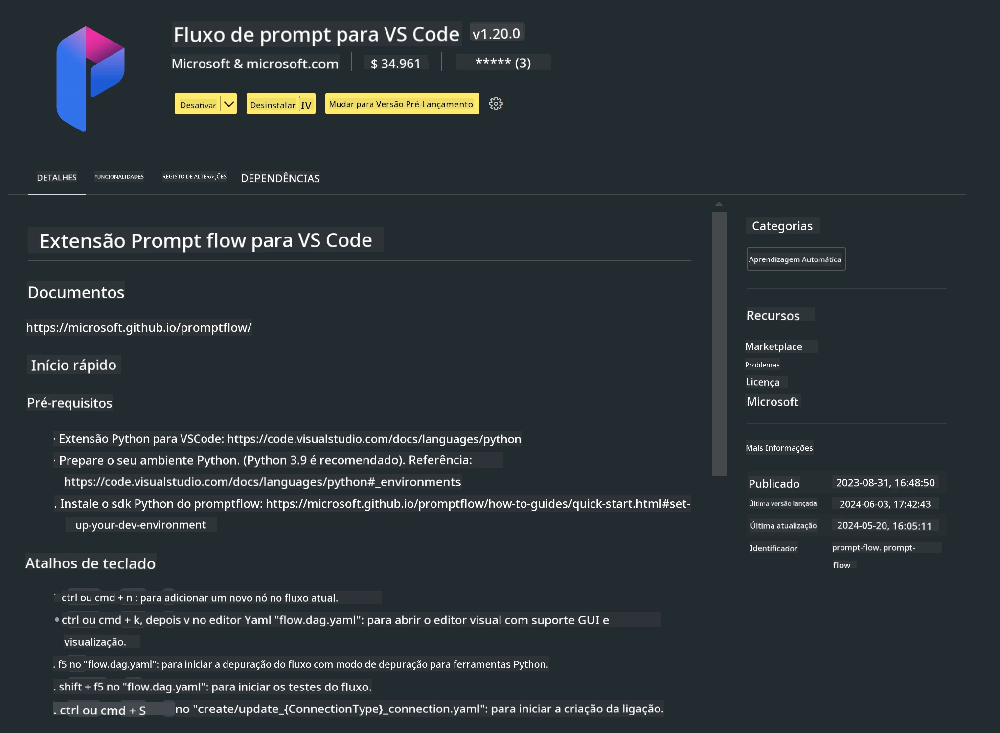

<!--
CO_OP_TRANSLATOR_METADATA:
{
  "original_hash": "4b16264917d9b93169745d92b8ce8c65",
  "translation_date": "2025-07-17T04:18:25+00:00",
  "source_file": "md/02.Application/02.Code/Phi3/VSCodeExt/HOL/Apple/01.Installations.md",
  "language_code": "pt"
}
-->
# **Lab 0 - Instalação**

Quando entramos no Lab, precisamos configurar o ambiente relevante:


### **1. Python 3.11+**

Recomenda-se usar o miniforge para configurar o seu ambiente Python

Para configurar o miniforge, consulte [https://github.com/conda-forge/miniforge](https://github.com/conda-forge/miniforge)

Depois de configurar o miniforge, execute o seguinte comando no Power Shell

```bash

conda create -n pyenv python==3.11.8 -y

conda activate pyenv

```


### **2. Instalar o Prompt flow SDK**

No Lab 1, usamos o Prompt flow, por isso precisa de configurar o Prompt flow SDK.

```bash

pip install promptflow --upgrade

```

Pode verificar o promptflow sdk com este comando


```bash

pf --version

```

### **3. Instalar a Extensão Prompt flow do Visual Studio Code**



### **4. Framework MLX da Apple**

O MLX é um framework para investigação em machine learning em Apple silicon, desenvolvido pela equipa de investigação em machine learning da Apple. Pode usar o **Apple MLX framework** para acelerar LLM / SLM com Apple Silicon. Se quiser saber mais, pode ler [https://github.com/microsoft/PhiCookBook/blob/main/md/01.Introduction/03/MLX_Inference.md](https://github.com/microsoft/PhiCookBook/blob/main/md/01.Introduction/03/MLX_Inference.md).

Instale a biblioteca do framework MLX em bash


```bash

pip install mlx-lm

```


### **5. Outras Bibliotecas Python**


crie o ficheiro requirements.txt e adicione este conteúdo

```txt

notebook
numpy 
scipy 
scikit-learn 
matplotlib 
pandas 
pillow 
graphviz

```


### **6. Instalar NVM**

instale o nvm no Powershell


```bash

brew install nvm

```

instale o nodejs 18.20


```bash

nvm install 18.20.0

nvm use 18.20.0

```

### **7. Instalar Suporte de Desenvolvimento do Visual Studio Code**


```bash

npm install --global yo generator-code

```

Parabéns! Configurou com sucesso o SDK. A seguir, avance para os passos práticos.

**Aviso Legal**:  
Este documento foi traduzido utilizando o serviço de tradução automática [Co-op Translator](https://github.com/Azure/co-op-translator). Embora nos esforcemos pela precisão, por favor tenha em conta que traduções automáticas podem conter erros ou imprecisões. O documento original na sua língua nativa deve ser considerado a fonte autorizada. Para informações críticas, recomenda-se tradução profissional humana. Não nos responsabilizamos por quaisquer mal-entendidos ou interpretações erradas decorrentes da utilização desta tradução.