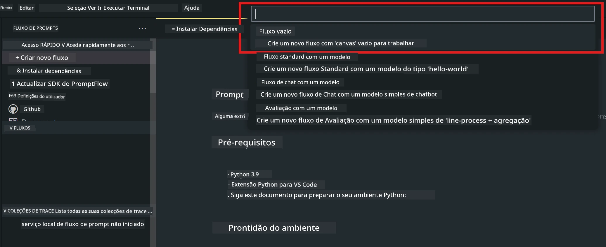
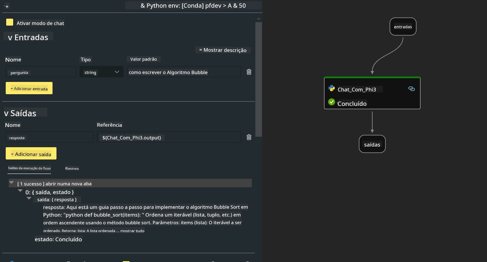
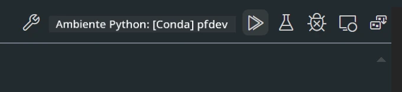

<!--
CO_OP_TRANSLATOR_METADATA:
{
  "original_hash": "3dbbf568625b1ee04b354c2dc81d3248",
  "translation_date": "2025-07-17T04:25:15+00:00",
  "source_file": "md/02.Application/02.Code/Phi3/VSCodeExt/HOL/Apple/02.PromptflowWithMLX.md",
  "language_code": "pt"
}
-->
# **Lab 2 - Executar Prompt flow com Phi-3-mini em AIPC**

## **O que é o Prompt flow**

Prompt flow é um conjunto de ferramentas de desenvolvimento concebidas para simplificar o ciclo completo de desenvolvimento de aplicações de IA baseadas em LLM, desde a ideação, prototipagem, testes, avaliação até à implementação em produção e monitorização. Facilita muito a engenharia de prompts e permite construir aplicações LLM com qualidade de produção.

Com o prompt flow, poderá:

- Criar fluxos que ligam LLMs, prompts, código Python e outras ferramentas num fluxo de trabalho executável.

- Depurar e iterar os seus fluxos, especialmente a interação com LLMs, de forma simples.

- Avaliar os seus fluxos, calcular métricas de qualidade e desempenho com conjuntos de dados maiores.

- Integrar os testes e avaliações no seu sistema CI/CD para garantir a qualidade do seu fluxo.

- Implementar os seus fluxos na plataforma de serviço que escolher ou integrar facilmente no código da sua aplicação.

- (Opcional, mas altamente recomendado) Colaborar com a sua equipa aproveitando a versão cloud do Prompt flow no Azure AI.

## **Construir fluxos de geração de código em Apple Silicon**

***Note*** ：Se ainda não completou a instalação do ambiente, por favor visite [Lab 0 -Installations](./01.Installations.md)

1. Abra a extensão Prompt flow no Visual Studio Code e crie um projeto de fluxo vazio



2. Adicione parâmetros de Inputs e Outputs e adicione Código Python como novo fluxo



Pode consultar esta estrutura (flow.dag.yaml) para construir o seu fluxo

```yaml

inputs:
  prompt:
    type: string
    default: Write python code for Fibonacci serie. Please use markdown as output
outputs:
  result:
    type: string
    reference: ${gen_code_by_phi3.output}
nodes:
- name: gen_code_by_phi3
  type: python
  source:
    type: code
    path: gen_code_by_phi3.py
  inputs:
    prompt: ${inputs.prompt}


```

3. Quantificar phi-3-mini

Pretendemos executar melhor o SLM em dispositivos locais. Geralmente, quantificamos o modelo (INT4, FP16, FP32)

```bash

python -m mlx_lm.convert --hf-path microsoft/Phi-3-mini-4k-instruct

```

**Note:** a pasta padrão é mlx_model

4. Adicione o código em ***Chat_With_Phi3.py***

```python


from promptflow import tool

from mlx_lm import load, generate


# The inputs section will change based on the arguments of the tool function, after you save the code
# Adding type to arguments and return value will help the system show the types properly
# Please update the function name/signature per need
@tool
def my_python_tool(prompt: str) -> str:

    model_id = './mlx_model_phi3_mini'

    model, tokenizer = load(model_id)

    # <|user|>\nWrite python code for Fibonacci serie. Please use markdown as output<|end|>\n<|assistant|>

    response = generate(model, tokenizer, prompt="<|user|>\n" + prompt  + "<|end|>\n<|assistant|>", max_tokens=2048, verbose=True)

    return response


```

4. Pode testar o fluxo a partir do Debug ou Run para verificar se a geração de código está correta



5. Execute o fluxo como API de desenvolvimento no terminal

```

pf flow serve --source ./ --port 8080 --host localhost   

```

Pode testar no Postman / Thunder Client

### **Note**

1. A primeira execução demora bastante tempo. Recomenda-se fazer o download do modelo phi-3 através do Hugging face CLI.

2. Considerando a capacidade limitada de computação do Intel NPU, recomenda-se usar o Phi-3-mini-4k-instruct

3. Usamos a aceleração Intel NPU para quantizar a conversão INT4, mas se reiniciar o serviço, é necessário apagar as pastas cache e nc_workshop.

## **Recursos**

1. Aprender Promptflow [https://microsoft.github.io/promptflow/](https://microsoft.github.io/promptflow/)

2. Aprender Intel NPU Acceleration [https://github.com/intel/intel-npu-acceleration-library](https://github.com/intel/intel-npu-acceleration-library)

3. Código de exemplo, descarregar [Local NPU Agent Sample Code](../../../../../../../../../code/07.Lab/01/AIPC/local-npu-agent)

**Aviso Legal**:  
Este documento foi traduzido utilizando o serviço de tradução automática [Co-op Translator](https://github.com/Azure/co-op-translator). Embora nos esforcemos pela precisão, por favor tenha em conta que traduções automáticas podem conter erros ou imprecisões. O documento original na sua língua nativa deve ser considerado a fonte autorizada. Para informações críticas, recomenda-se tradução profissional humana. Não nos responsabilizamos por quaisquer mal-entendidos ou interpretações erradas decorrentes da utilização desta tradução.