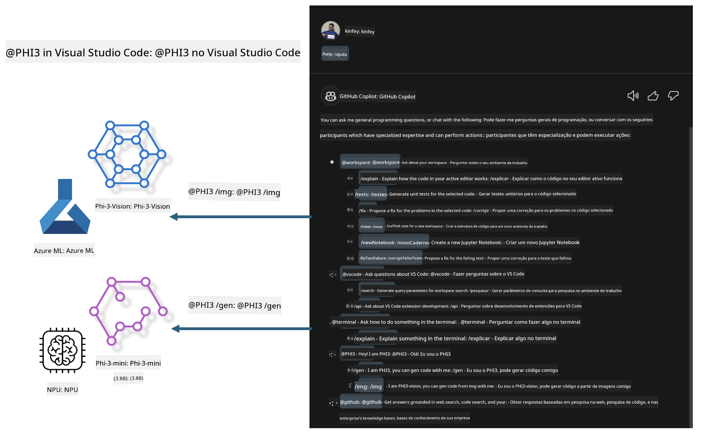

<!--
CO_OP_TRANSLATOR_METADATA:
{
  "original_hash": "00b7a699de8ac405fa821f4c0f7fc0ab",
  "translation_date": "2025-05-09T19:11:54+00:00",
  "source_file": "md/02.Application/02.Code/Phi3/VSCodeExt/README.md",
  "language_code": "pt"
}
-->
# **Construa seu próprio Visual Studio Code GitHub Copilot Chat com a Família Microsoft Phi-3**

Você já usou o agente de workspace no GitHub Copilot Chat? Quer criar um agente de código personalizado para sua equipe? Este laboratório prático tem como objetivo combinar o modelo open source para construir um agente empresarial de código.

## **Fundamentos**

### **Por que escolher o Microsoft Phi-3**

Phi-3 é uma série de modelos, incluindo phi-3-mini, phi-3-small e phi-3-medium, baseados em diferentes parâmetros de treinamento para geração de texto, conclusão de diálogo e geração de código. Também existe o phi-3-vision, baseado em visão computacional. É ideal para empresas ou equipes que desejam criar soluções de IA generativa offline.

Recomendamos a leitura deste link [https://github.com/microsoft/PhiCookBook/blob/main/md/01.Introduction/01/01.PhiFamily.md](https://github.com/microsoft/PhiCookBook/blob/main/md/01.Introduction/01/01.PhiFamily.md)

### **Microsoft GitHub Copilot Chat**

A extensão GitHub Copilot Chat oferece uma interface de chat que permite interagir com o GitHub Copilot e receber respostas para dúvidas relacionadas a código diretamente no VS Code, sem precisar navegar por documentações ou fóruns online.

O Copilot Chat pode usar realce de sintaxe, indentação e outras formatações para tornar a resposta mais clara. Dependendo do tipo de pergunta do usuário, o resultado pode incluir links para o contexto usado pelo Copilot na geração da resposta, como arquivos de código ou documentação, ou botões para acessar funcionalidades do VS Code.

- O Copilot Chat se integra ao seu fluxo de desenvolvimento e oferece ajuda onde você precisar:

- Inicie uma conversa de chat inline diretamente do editor ou terminal para obter ajuda enquanto codifica

- Use a visualização de Chat para ter um assistente de IA ao seu lado a qualquer momento

- Abra o Quick Chat para fazer uma pergunta rápida e voltar ao que estava fazendo

Você pode usar o GitHub Copilot Chat em diversos cenários, como:

- Responder dúvidas sobre a melhor forma de resolver um problema de programação

- Explicar o código de outra pessoa e sugerir melhorias

- Propor correções de código

- Gerar casos de teste unitários

- Gerar documentação de código

Recomendamos a leitura deste link [https://code.visualstudio.com/docs/copilot/copilot-chat](https://code.visualstudio.com/docs/copilot/copilot-chat?WT.mc_id=aiml-137032-kinfeylo)

### **Microsoft GitHub Copilot Chat @workspace**

Referenciar **@workspace** no Copilot Chat permite que você faça perguntas sobre toda a sua base de código. Com base na pergunta, o Copilot busca inteligentemente arquivos e símbolos relevantes, que são referenciados na resposta como links e exemplos de código.

Para responder à sua pergunta, **@workspace** pesquisa nas mesmas fontes que um desenvolvedor usaria ao navegar por uma base de código no VS Code:

- Todos os arquivos no workspace, exceto aqueles ignorados por um arquivo .gitignore

- Estrutura de diretórios com pastas e nomes de arquivos aninhados

- Índice de busca de código do GitHub, se o workspace for um repositório GitHub e estiver indexado pela busca de código

- Símbolos e definições no workspace

- Texto selecionado atualmente ou texto visível no editor ativo

Nota: o .gitignore é ignorado se você tiver um arquivo aberto ou texto selecionado dentro de um arquivo ignorado.

Recomendamos a leitura deste link [[https://code.visualstudio.com/docs/copilot/copilot-chat](https://code.visualstudio.com/docs/copilot/workspace-context?WT.mc_id=aiml-137032-kinfeylo)]

## **Saiba mais sobre este Laboratório**

O GitHub Copilot melhorou significativamente a eficiência de programação nas empresas, e muitas delas desejam personalizar as funções do GitHub Copilot. Diversas empresas criaram extensões personalizadas semelhantes ao GitHub Copilot baseadas em seus próprios cenários de negócio e modelos open source. Para as empresas, extensões personalizadas são mais fáceis de controlar, mas isso pode impactar a experiência do usuário. Afinal, o GitHub Copilot possui recursos mais avançados para lidar com cenários gerais e profissionalismo. Manter a experiência consistente enquanto personaliza funções específicas oferece uma experiência melhor para o usuário. O GitHub Copilot Chat fornece APIs relevantes para que as empresas possam expandir a experiência de chat. Manter uma experiência consistente e ter funções personalizadas é uma experiência superior.

Este laboratório usa principalmente o modelo Phi-3 combinado com NPU local e Azure híbrido para construir um agente personalizado no GitHub Copilot Chat ***@PHI3*** para ajudar desenvolvedores empresariais na geração de código ***(@PHI3 /gen)*** e na geração de código baseado em imagens ***(@PHI3 /img)***.

### ***Nota:***

Este laboratório está atualmente implementado no AIPC de CPU Intel e Apple Silicon. Continuaremos atualizando a versão Qualcomm do NPU.

## **Laboratório**

| Nome | Descrição | AIPC | Apple |
| ------------ | ----------- | -------- |-------- |
| Lab0 - Instalações(✅) | Configurar e instalar ambientes relacionados e ferramentas de instalação | [Go](./HOL/AIPC/01.Installations.md) |[Go](./HOL/Apple/01.Installations.md) |
| Lab1 - Executar fluxo Prompt com Phi-3-mini (✅) | Combinado com AIPC / Apple Silicon, usando NPU local para criar geração de código via Phi-3-mini | [Go](./HOL/AIPC/02.PromptflowWithNPU.md) |  [Go](./HOL/Apple/02.PromptflowWithMLX.md) |
| Lab2 - Implantar Phi-3-vision no Azure Machine Learning Service(✅) | Gerar código implantando o catálogo de modelos do Azure Machine Learning Service - imagem Phi-3-vision | [Go](./HOL/AIPC/03.DeployPhi3VisionOnAzure.md) |[Go](./HOL/Apple/03.DeployPhi3VisionOnAzure.md) |
| Lab3 - Criar um agente @phi-3 no GitHub Copilot Chat(✅)  | Criar um agente Phi-3 personalizado no GitHub Copilot Chat para completar geração de código, geração de código gráfico, RAG, etc. | [Go](./HOL/AIPC/04.CreatePhi3AgentInVSCode.md) | [Go](./HOL/Apple/04.CreatePhi3AgentInVSCode.md) |
| Código de Exemplo (✅)  | Baixar código de exemplo | [Go](../../../../../../../code/07.Lab/01/AIPC) | [Go](../../../../../../../code/07.Lab/01/Apple) |

## **Recursos**

1. Phi-3 Cookbook [https://github.com/microsoft/Phi-3CookBook](https://github.com/microsoft/Phi-3CookBook)

2. Saiba mais sobre GitHub Copilot [https://learn.microsoft.com/training/paths/copilot/](https://learn.microsoft.com/training/paths/copilot/?WT.mc_id=aiml-137032-kinfeylo)

3. Saiba mais sobre GitHub Copilot Chat [https://learn.microsoft.com/training/paths/accelerate-app-development-using-github-copilot/](https://learn.microsoft.com/training/paths/accelerate-app-development-using-github-copilot/?WT.mc_id=aiml-137032-kinfeylo)

4. Saiba mais sobre GitHub Copilot Chat API [https://code.visualstudio.com/api/extension-guides/chat](https://code.visualstudio.com/api/extension-guides/chat?WT.mc_id=aiml-137032-kinfeylo)

5. Saiba mais sobre Azure AI Foundry [https://learn.microsoft.com/training/paths/create-custom-copilots-ai-studio/](https://learn.microsoft.com/training/paths/create-custom-copilots-ai-studio/?WT.mc_id=aiml-137032-kinfeylo)

6. Saiba mais sobre o Catálogo de Modelos do Azure AI Foundry [https://learn.microsoft.com/azure/ai-studio/how-to/model-catalog-overview](https://learn.microsoft.com/azure/ai-studio/how-to/model-catalog-overview)

**Aviso Legal**:  
Este documento foi traduzido utilizando o serviço de tradução por IA [Co-op Translator](https://github.com/Azure/co-op-translator). Embora nos esforcemos para garantir a precisão, por favor, esteja ciente de que traduções automáticas podem conter erros ou imprecisões. O documento original em seu idioma nativo deve ser considerado a fonte autoritativa. Para informações críticas, recomenda-se a tradução profissional humana. Não nos responsabilizamos por quaisquer mal-entendidos ou interpretações incorretas decorrentes do uso desta tradução.