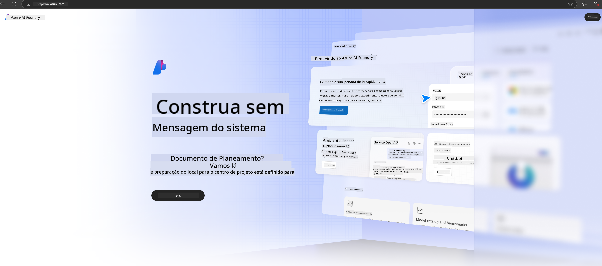

<!--
CO_OP_TRANSLATOR_METADATA:
{
  "original_hash": "3a1e48b628022485aac989c9f733e792",
  "translation_date": "2025-05-09T20:10:43+00:00",
  "source_file": "md/02.QuickStart/AzureAIFoundry_QuickStart.md",
  "language_code": "pt"
}
-->
# **Usando Phi-3 no Azure AI Foundry**

Com o avanço da IA Generativa, esperamos utilizar uma plataforma unificada para gerenciar diferentes LLMs e SLMs, integração de dados empresariais, operações de fine-tuning/RAG e a avaliação de diversos negócios após a integração de LLM e SLM, entre outras funções, para que as aplicações inteligentes baseadas em IA generativa sejam implementadas de forma mais eficaz. O [Azure AI Foundry](https://ai.azure.com) é uma plataforma de aplicação de IA generativa em nível empresarial.

Com o Azure AI Foundry, você pode avaliar respostas de modelos de linguagem grande (LLM) e orquestrar componentes de aplicação de prompt com prompt flow para obter melhor desempenho. A plataforma facilita a escalabilidade para transformar provas de conceito em produção completa com facilidade. Monitoramento contínuo e refinamento apoiam o sucesso a longo prazo.

Podemos implantar rapidamente o modelo Phi-3 no Azure AI Foundry com passos simples e, em seguida, usar o Azure AI Foundry para realizar Playground/Chat, Fine-tuning, avaliação e outras tarefas relacionadas ao Phi-3.

## **1. Preparação**

Se você já tem o [Azure Developer CLI](https://learn.microsoft.com/azure/developer/azure-developer-cli/overview?WT.mc_id=aiml-138114-kinfeylo) instalado na sua máquina, usar este template é tão simples quanto executar este comando em um diretório novo.

## Criação Manual

Criar um projeto e um hub no Microsoft Azure AI Foundry é uma ótima forma de organizar e gerenciar seu trabalho com IA. Aqui está um guia passo a passo para começar:

### Criando um Projeto no Azure AI Foundry

1. **Acesse o Azure AI Foundry**: Faça login no portal do Azure AI Foundry.
2. **Crie um Projeto**:
   - Se você já estiver dentro de um projeto, selecione "Azure AI Foundry" no canto superior esquerdo da página para voltar à página inicial.
   - Clique em "+ Create project".
   - Insira um nome para o projeto.
   - Se você já possui um hub, ele será selecionado por padrão. Caso tenha acesso a mais de um hub, pode escolher outro no menu suspenso. Se quiser criar um novo hub, selecione "Create new hub" e informe um nome.
   - Clique em "Create".

### Criando um Hub no Azure AI Foundry

1. **Acesse o Azure AI Foundry**: Faça login com sua conta Azure.
2. **Crie um Hub**:
   - Selecione o Centro de Gerenciamento no menu à esquerda.
   - Clique em "All resources", depois na seta para baixo ao lado de "+ New project" e selecione "+ New hub".
   - Na janela "Create a new hub", insira um nome para seu hub (por exemplo, contoso-hub) e ajuste os demais campos conforme desejar.
   - Clique em "Next", revise as informações e depois selecione "Create".

Para instruções mais detalhadas, você pode consultar a documentação oficial da [Microsoft](https://learn.microsoft.com/azure/ai-studio/how-to/create-projects).

Após a criação bem-sucedida, você pode acessar o estúdio criado através do [ai.azure.com](https://ai.azure.com/).

É possível ter vários projetos em um único AI Foundry. Crie um projeto no AI Foundry para começar.

Crie Azure AI Foundry [QuickStarts](https://learn.microsoft.com/azure/ai-studio/quickstarts/get-started-code)

## **2. Implantar um modelo Phi no Azure AI Foundry**

Clique na opção Explore do projeto para acessar o Catálogo de Modelos e selecione Phi-3.

Selecione Phi-3-mini-4k-instruct.

Clique em 'Deploy' para implantar o modelo Phi-3-mini-4k-instruct.

> [!NOTE]
>
> Você pode escolher a capacidade de computação durante a implantação.

## **3. Playground Chat Phi no Azure AI Foundry**

Acesse a página de implantação, selecione Playground e converse com o Phi-3 do Azure AI Foundry.

## **4. Implantando o Modelo a partir do Azure AI Foundry**

Para implantar um modelo a partir do Catálogo de Modelos do Azure, siga estes passos:

- Faça login no Azure AI Foundry.
- Escolha o modelo que deseja implantar no catálogo de modelos do Azure AI Foundry.
- Na página de Detalhes do modelo, selecione Deploy e depois escolha Serverless API com Azure AI Content Safety.
- Selecione o projeto onde deseja implantar seu modelo. Para usar a oferta Serverless API, seu workspace deve estar nas regiões East US 2 ou Sweden Central. Você pode personalizar o nome da implantação.
- No assistente de implantação, selecione Pricing and terms para conhecer os preços e termos de uso.
- Clique em Deploy. Aguarde até que a implantação esteja pronta e você seja redirecionado para a página de Deployments.
- Selecione Open in playground para começar a interagir com o modelo.
- Você pode voltar à página de Deployments, selecionar a implantação e anotar a URL do endpoint (Target URL) e a Secret Key, que podem ser usadas para chamar a implantação e gerar respostas.
- Você sempre pode encontrar os detalhes do endpoint, URL e chaves de acesso navegando até a aba Build e selecionando Deployments na seção Components.

> [!NOTE]
> Lembre-se de que sua conta deve ter permissões de função Azure AI Developer no Resource Group para realizar esses passos.

## **5. Usando a Phi API no Azure AI Foundry**

Você pode acessar https://{Your project name}.region.inference.ml.azure.com/swagger.json via Postman com método GET e combinar com a Key para conhecer as interfaces disponíveis.

É muito fácil obter os parâmetros de requisição, assim como os parâmetros de resposta.

**Aviso Legal**:  
Este documento foi traduzido utilizando o serviço de tradução automática [Co-op Translator](https://github.com/Azure/co-op-translator). Embora nos esforcemos para garantir a precisão, esteja ciente de que traduções automatizadas podem conter erros ou imprecisões. O documento original em seu idioma nativo deve ser considerado a fonte autorizada. Para informações críticas, recomenda-se a tradução profissional humana. Não nos responsabilizamos por quaisquer mal-entendidos ou interpretações incorretas decorrentes do uso desta tradução.