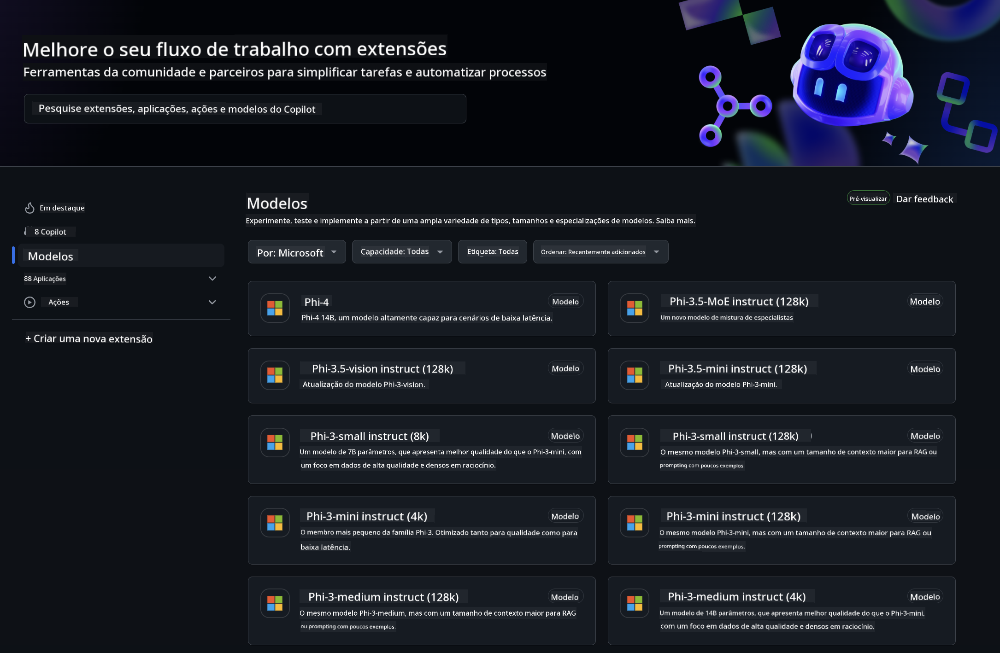
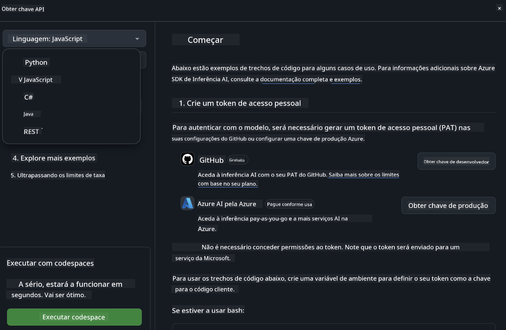
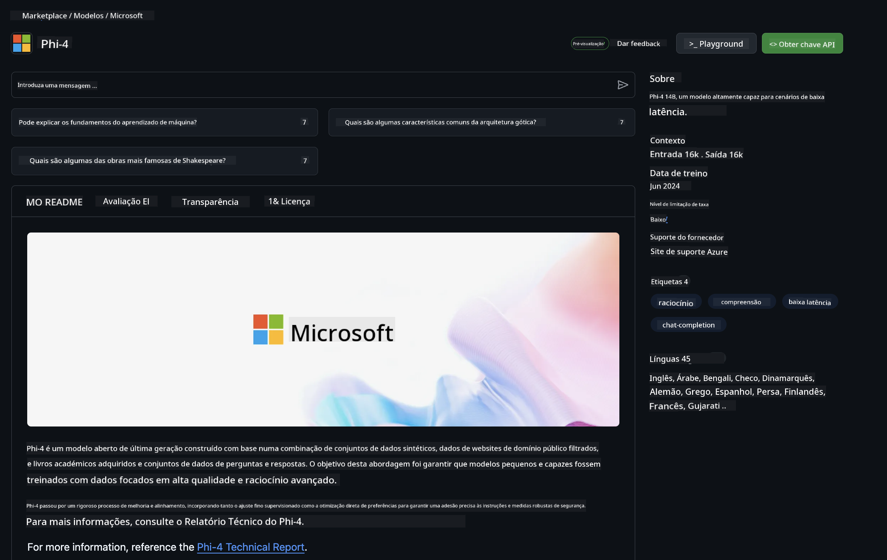

<!--
CO_OP_TRANSLATOR_METADATA:
{
  "original_hash": "5113634b77370af6790f9697d5d7de90",
  "translation_date": "2025-07-17T05:35:13+00:00",
  "source_file": "md/02.QuickStart/GitHubModel_QuickStart.md",
  "language_code": "pt"
}
-->
## GitHub Models - Beta Pública Limitada

Bem-vindo ao [GitHub Models](https://github.com/marketplace/models)! Temos tudo preparado para que explores os Modelos de IA alojados no Azure AI.



Para mais informações sobre os Modelos disponíveis no GitHub Models, consulta o [GitHub Model Marketplace](https://github.com/marketplace/models)

## Modelos Disponíveis

Cada modelo tem um playground dedicado e código de exemplo


### Modelos Phi-3 no Catálogo GitHub Model

[Phi-3-Medium-128k-Instruct](https://github.com/marketplace/models/azureml/Phi-3-medium-128k-instruct)

[Phi-3-medium-4k-instruct](https://github.com/marketplace/models/azureml/Phi-3-medium-4k-instruct)

[Phi-3-mini-128k-instruct](https://github.com/marketplace/models/azureml/Phi-3-mini-128k-instruct)

[Phi-3-mini-4k-instruct](https://github.com/marketplace/models/azureml/Phi-3-mini-4k-instruct)

[Phi-3-small-128k-instruct](https://github.com/marketplace/models/azureml/Phi-3-small-128k-instruct)

[Phi-3-small-8k-instruct](https://github.com/marketplace/models/azureml/Phi-3-small-8k-instruct)

## Começar

Existem alguns exemplos básicos prontos para executar. Podes encontrá-los na pasta samples. Se quiseres ir diretamente para a tua linguagem preferida, os exemplos estão disponíveis nas seguintes linguagens:

- Python
- JavaScript
- cURL

Existe também um Ambiente Codespaces dedicado para executar os exemplos e modelos.



## Código de Exemplo

A seguir estão trechos de código de exemplo para alguns casos de uso. Para mais informações sobre o Azure AI Inference SDK, consulta a documentação completa e os exemplos.

## Configuração

1. Cria um token de acesso pessoal  
Não é necessário atribuir permissões ao token. Nota que o token será enviado para um serviço da Microsoft.

Para usar os trechos de código abaixo, cria uma variável de ambiente para definir o teu token como chave para o código cliente.

Se estiveres a usar bash:  
```
export GITHUB_TOKEN="<your-github-token-goes-here>"
```  
Se estiveres no powershell:  

```
$Env:GITHUB_TOKEN="<your-github-token-goes-here>"
```  

Se estiveres no prompt de comando do Windows:  

```
set GITHUB_TOKEN=<your-github-token-goes-here>
```  

## Exemplo em Python

### Instalar dependências  
Instala o Azure AI Inference SDK usando pip (Requer: Python >=3.8):

```
pip install azure-ai-inference
```  
### Executar um exemplo básico

Este exemplo demonstra uma chamada básica à API de chat completion. Está a usar o endpoint de inferência do modelo AI do GitHub e o teu token GitHub. A chamada é síncrona.

```
import os
from azure.ai.inference import ChatCompletionsClient
from azure.ai.inference.models import SystemMessage, UserMessage
from azure.core.credentials import AzureKeyCredential

endpoint = "https://models.inference.ai.azure.com"
# Replace Model_Name 
model_name = "Phi-3-small-8k-instruct"
token = os.environ["GITHUB_TOKEN"]

client = ChatCompletionsClient(
    endpoint=endpoint,
    credential=AzureKeyCredential(token),
)

response = client.complete(
    messages=[
        SystemMessage(content="You are a helpful assistant."),
        UserMessage(content="What is the capital of France?"),
    ],
    model=model_name,
    temperature=1.,
    max_tokens=1000,
    top_p=1.
)

print(response.choices[0].message.content)
```

### Executar uma conversa multi-turno

Este exemplo demonstra uma conversa multi-turno com a API de chat completion. Ao usar o modelo para uma aplicação de chat, precisas de gerir o histórico dessa conversa e enviar as mensagens mais recentes para o modelo.

```
import os
from azure.ai.inference import ChatCompletionsClient
from azure.ai.inference.models import AssistantMessage, SystemMessage, UserMessage
from azure.core.credentials import AzureKeyCredential

token = os.environ["GITHUB_TOKEN"]
endpoint = "https://models.inference.ai.azure.com"
# Replace Model_Name
model_name = "Phi-3-small-8k-instruct"

client = ChatCompletionsClient(
    endpoint=endpoint,
    credential=AzureKeyCredential(token),
)

messages = [
    SystemMessage(content="You are a helpful assistant."),
    UserMessage(content="What is the capital of France?"),
    AssistantMessage(content="The capital of France is Paris."),
    UserMessage(content="What about Spain?"),
]

response = client.complete(messages=messages, model=model_name)

print(response.choices[0].message.content)
```

### Transmitir a saída

Para uma melhor experiência do utilizador, vais querer transmitir a resposta do modelo para que o primeiro token apareça rapidamente e evites esperar por respostas longas.

```
import os
from azure.ai.inference import ChatCompletionsClient
from azure.ai.inference.models import SystemMessage, UserMessage
from azure.core.credentials import AzureKeyCredential

token = os.environ["GITHUB_TOKEN"]
endpoint = "https://models.inference.ai.azure.com"
# Replace Model_Name
model_name = "Phi-3-small-8k-instruct"

client = ChatCompletionsClient(
    endpoint=endpoint,
    credential=AzureKeyCredential(token),
)

response = client.complete(
    stream=True,
    messages=[
        SystemMessage(content="You are a helpful assistant."),
        UserMessage(content="Give me 5 good reasons why I should exercise every day."),
    ],
    model=model_name,
)

for update in response:
    if update.choices:
        print(update.choices[0].delta.content or "", end="")

client.close()
```  
## JavaScript

### Instalar dependências

Instala o Node.js.

Copia as seguintes linhas de texto e guarda-as num ficheiro package.json dentro da tua pasta.

```
{
  "type": "module",
  "dependencies": {
    "@azure-rest/ai-inference": "latest",
    "@azure/core-auth": "latest",
    "@azure/core-sse": "latest"
  }
}
```

Nota: @azure/core-sse é necessário apenas quando transmites a resposta das chat completions.

Abre uma janela de terminal nesta pasta e executa npm install.

Para cada um dos trechos de código abaixo, copia o conteúdo para um ficheiro sample.js e executa com node sample.js.

### Executar um exemplo básico

Este exemplo demonstra uma chamada básica à API de chat completion. Está a usar o endpoint de inferência do modelo AI do GitHub e o teu token GitHub. A chamada é síncrona.

```
import ModelClient from "@azure-rest/ai-inference";
import { AzureKeyCredential } from "@azure/core-auth";

const token = process.env["GITHUB_TOKEN"];
const endpoint = "https://models.inference.ai.azure.com";
// Update your modelname
const modelName = "Phi-3-small-8k-instruct";

export async function main() {

  const client = new ModelClient(endpoint, new AzureKeyCredential(token));

  const response = await client.path("/chat/completions").post({
    body: {
      messages: [
        { role:"system", content: "You are a helpful assistant." },
        { role:"user", content: "What is the capital of France?" }
      ],
      model: modelName,
      temperature: 1.,
      max_tokens: 1000,
      top_p: 1.
    }
  });

  if (response.status !== "200") {
    throw response.body.error;
  }
  console.log(response.body.choices[0].message.content);
}

main().catch((err) => {
  console.error("The sample encountered an error:", err);
});
```

### Executar uma conversa multi-turno

Este exemplo demonstra uma conversa multi-turno com a API de chat completion. Ao usar o modelo para uma aplicação de chat, precisas de gerir o histórico dessa conversa e enviar as mensagens mais recentes para o modelo.

```
import ModelClient from "@azure-rest/ai-inference";
import { AzureKeyCredential } from "@azure/core-auth";

const token = process.env["GITHUB_TOKEN"];
const endpoint = "https://models.inference.ai.azure.com";
// Update your modelname
const modelName = "Phi-3-small-8k-instruct";

export async function main() {

  const client = new ModelClient(endpoint, new AzureKeyCredential(token));

  const response = await client.path("/chat/completions").post({
    body: {
      messages: [
        { role: "system", content: "You are a helpful assistant." },
        { role: "user", content: "What is the capital of France?" },
        { role: "assistant", content: "The capital of France is Paris." },
        { role: "user", content: "What about Spain?" },
      ],
      model: modelName,
    }
  });

  if (response.status !== "200") {
    throw response.body.error;
  }

  for (const choice of response.body.choices) {
    console.log(choice.message.content);
  }
}

main().catch((err) => {
  console.error("The sample encountered an error:", err);
});
```

### Transmitir a saída  
Para uma melhor experiência do utilizador, vais querer transmitir a resposta do modelo para que o primeiro token apareça rapidamente e evites esperar por respostas longas.

```
import ModelClient from "@azure-rest/ai-inference";
import { AzureKeyCredential } from "@azure/core-auth";
import { createSseStream } from "@azure/core-sse";

const token = process.env["GITHUB_TOKEN"];
const endpoint = "https://models.inference.ai.azure.com";
// Update your modelname
const modelName = "Phi-3-small-8k-instruct";

export async function main() {

  const client = new ModelClient(endpoint, new AzureKeyCredential(token));

  const response = await client.path("/chat/completions").post({
    body: {
      messages: [
        { role: "system", content: "You are a helpful assistant." },
        { role: "user", content: "Give me 5 good reasons why I should exercise every day." },
      ],
      model: modelName,
      stream: true
    }
  }).asNodeStream();

  const stream = response.body;
  if (!stream) {
    throw new Error("The response stream is undefined");
  }

  if (response.status !== "200") {
    stream.destroy();
    throw new Error(`Failed to get chat completions, http operation failed with ${response.status} code`);
  }

  const sseStream = createSseStream(stream);

  for await (const event of sseStream) {
    if (event.data === "[DONE]") {
      return;
    }
    for (const choice of (JSON.parse(event.data)).choices) {
        process.stdout.write(choice.delta?.content ?? ``);
    }
  }
}

main().catch((err) => {
  console.error("The sample encountered an error:", err);
});
```

## REST

### Executar um exemplo básico

Cola o seguinte num shell:

```
curl -X POST "https://models.inference.ai.azure.com/chat/completions" \
    -H "Content-Type: application/json" \
    -H "Authorization: Bearer $GITHUB_TOKEN" \
    -d '{
        "messages": [
            {
                "role": "system",
                "content": "You are a helpful assistant."
            },
            {
                "role": "user",
                "content": "What is the capital of France?"
            }
        ],
        "model": "Phi-3-small-8k-instruct"
    }'
```  
### Executar uma conversa multi-turno

Chama a API de chat completion e passa o histórico da conversa:

```
curl -X POST "https://models.inference.ai.azure.com/chat/completions" \
    -H "Content-Type: application/json" \
    -H "Authorization: Bearer $GITHUB_TOKEN" \
    -d '{
        "messages": [
            {
                "role": "system",
                "content": "You are a helpful assistant."
            },
            {
                "role": "user",
                "content": "What is the capital of France?"
            },
            {
                "role": "assistant",
                "content": "The capital of France is Paris."
            },
            {
                "role": "user",
                "content": "What about Spain?"
            }
        ],
        "model": "Phi-3-small-8k-instruct"
    }'
```  
### Transmitir a saída

Este é um exemplo de chamada ao endpoint com transmissão da resposta.

```
curl -X POST "https://models.inference.ai.azure.com/chat/completions" \
    -H "Content-Type: application/json" \
    -H "Authorization: Bearer $GITHUB_TOKEN" \
    -d '{
        "messages": [
            {
                "role": "system",
                "content": "You are a helpful assistant."
            },
            {
                "role": "user",
                "content": "Give me 5 good reasons why I should exercise every day."
            }
        ],
        "stream": true,
        "model": "Phi-3-small-8k-instruct"
    }'
```

## Utilização GRATUITA e Limites de Taxa para GitHub Models



Os [limites de taxa para o playground e uso gratuito da API](https://docs.github.com/en/github-models/prototyping-with-ai-models#rate-limits) destinam-se a ajudar-te a experimentar modelos e prototipar a tua aplicação de IA. Para uso além desses limites, e para escalar a tua aplicação, deves provisionar recursos a partir de uma conta Azure e autenticar a partir daí em vez do teu token pessoal do GitHub. Não precisas de alterar mais nada no teu código. Usa este link para descobrir como ultrapassar os limites da camada gratuita no Azure AI.

### Avisos

Lembra-te que ao interagir com um modelo estás a experimentar IA, por isso erros no conteúdo são possíveis.

A funcionalidade está sujeita a vários limites (incluindo pedidos por minuto, pedidos por dia, tokens por pedido e pedidos concorrentes) e não é destinada a casos de uso em produção.

GitHub Models usa Azure AI Content Safety. Estes filtros não podem ser desativados como parte da experiência GitHub Models. Se decidires usar modelos através de um serviço pago, por favor configura os teus filtros de conteúdo para satisfazer as tuas necessidades.

Este serviço está sujeito aos Termos de Pré-lançamento do GitHub.

**Aviso Legal**:  
Este documento foi traduzido utilizando o serviço de tradução automática [Co-op Translator](https://github.com/Azure/co-op-translator). Embora nos esforcemos pela precisão, por favor tenha em conta que traduções automáticas podem conter erros ou imprecisões. O documento original na sua língua nativa deve ser considerado a fonte autorizada. Para informações críticas, recomenda-se tradução profissional humana. Não nos responsabilizamos por quaisquer mal-entendidos ou interpretações erradas decorrentes da utilização desta tradução.