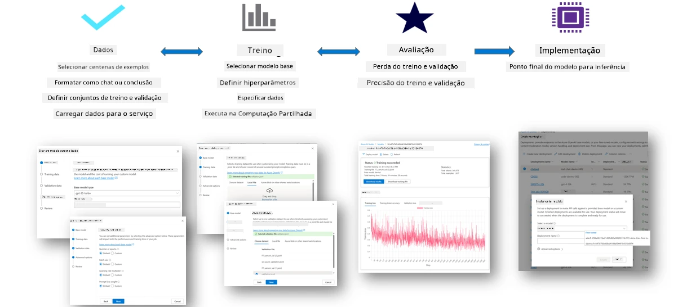
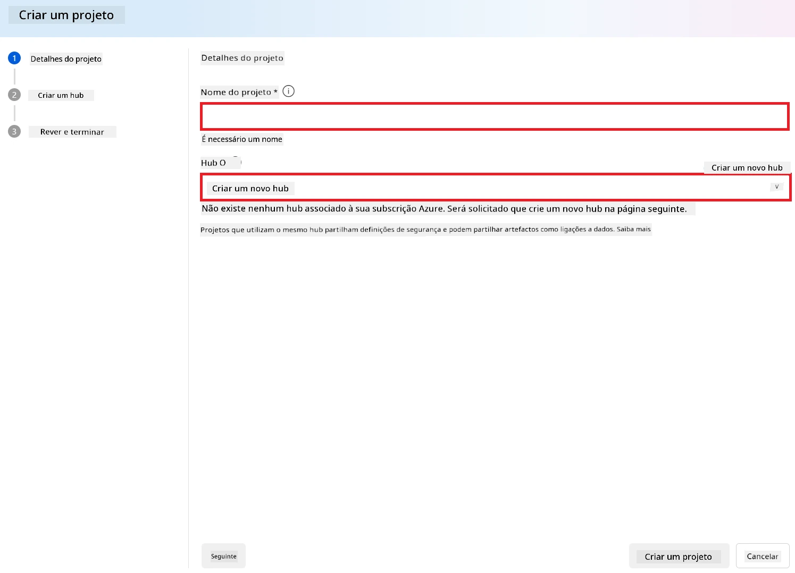
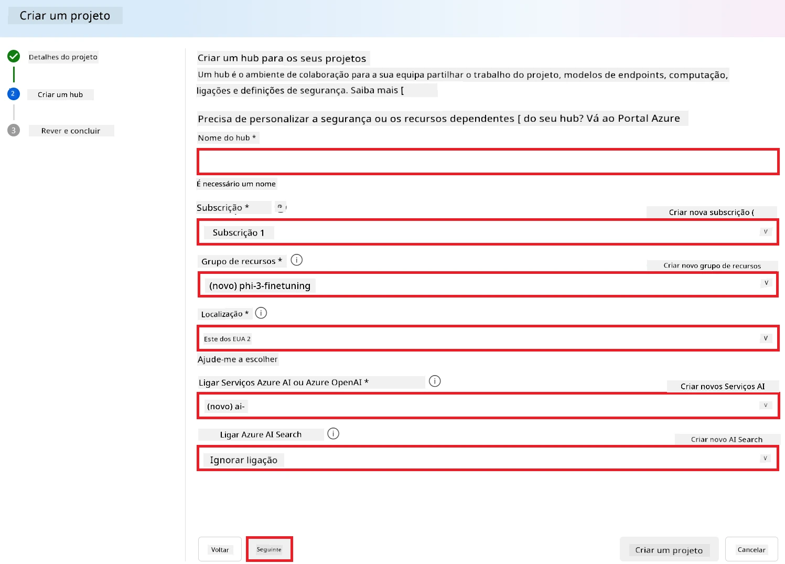
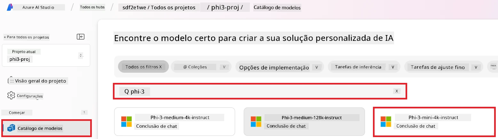
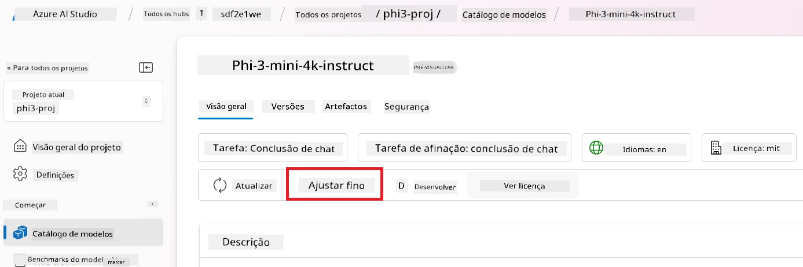
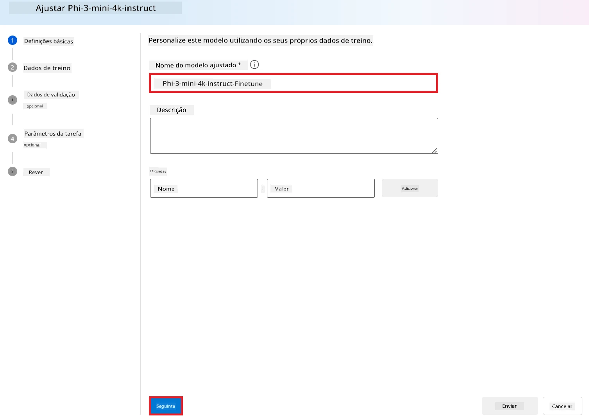

<!--
CO_OP_TRANSLATOR_METADATA:
{
  "original_hash": "c1559c5af6caccf6f623fd43a6b3a9a3",
  "translation_date": "2025-07-17T06:03:04+00:00",
  "source_file": "md/03.FineTuning/FineTuning_AIFoundry.md",
  "language_code": "pt"
}
-->
# Ajuste fino do Phi-3 com Azure AI Foundry

Vamos explorar como ajustar o modelo de linguagem Phi-3 Mini da Microsoft usando o Azure AI Foundry. O ajuste fino permite adaptar o Phi-3 Mini a tarefas específicas, tornando-o ainda mais poderoso e sensível ao contexto.

## Considerações

- **Capacidades:** Quais modelos podem ser ajustados? Para que pode o modelo base ser ajustado?
- **Custo:** Qual é o modelo de preços para o ajuste fino?
- **Personalização:** Até que ponto posso modificar o modelo base – e de que formas?
- **Conveniência:** Como é que o ajuste fino acontece na prática – preciso de escrever código personalizado? Preciso de trazer a minha própria capacidade computacional?
- **Segurança:** Modelos ajustados são conhecidos por apresentar riscos de segurança – existem salvaguardas para evitar danos não intencionais?


## Preparação para o ajuste fino

### Pré-requisitos

> [!NOTE]
> Para os modelos da família Phi-3, a oferta de ajuste fino no modelo pay-as-you-go está disponível apenas para hubs criados na região **East US 2**.

- Uma subscrição Azure. Se não tiver uma subscrição Azure, crie uma [conta Azure paga](https://azure.microsoft.com/pricing/purchase-options/pay-as-you-go) para começar.

- Um [projeto AI Foundry](https://ai.azure.com?WT.mc_id=aiml-138114-kinfeylo).
- O controlo de acesso baseado em funções do Azure (Azure RBAC) é usado para conceder acesso às operações no Azure AI Foundry. Para realizar os passos deste artigo, a sua conta de utilizador deve ter a __função Azure AI Developer__ atribuída no grupo de recursos.

### Registo do fornecedor de subscrição

Verifique se a subscrição está registada no fornecedor de recursos `Microsoft.Network`.

1. Inicie sessão no [portal Azure](https://portal.azure.com).
1. Selecione **Subscrições** no menu à esquerda.
1. Selecione a subscrição que pretende usar.
1. Selecione **Configurações do projeto AI** > **Fornecedores de recursos** no menu à esquerda.
1. Confirme que **Microsoft.Network** está na lista de fornecedores de recursos. Caso contrário, adicione-o.

### Preparação dos dados

Prepare os seus dados de treino e validação para ajustar o modelo. Os seus conjuntos de dados de treino e validação consistem em exemplos de entrada e saída que ilustram como pretende que o modelo funcione.

Certifique-se de que todos os seus exemplos de treino seguem o formato esperado para inferência. Para ajustar modelos de forma eficaz, garanta um conjunto de dados equilibrado e diversificado.

Isto implica manter o equilíbrio dos dados, incluir vários cenários e refinar periodicamente os dados de treino para alinhar com as expectativas do mundo real, o que resulta em respostas do modelo mais precisas e equilibradas.

Diferentes tipos de modelos exigem formatos diferentes para os dados de treino.

### Chat Completion

Os dados de treino e validação que usar **devem** estar formatados como um documento JSON Lines (JSONL). Para o `Phi-3-mini-128k-instruct`, o conjunto de dados para ajuste fino deve estar no formato de conversação usado pela API de Chat completions.

### Exemplo de formato de ficheiro

```json
    {"messages": [{"role": "system", "content": "You are an Xbox customer support agent whose primary goal is to help users with issues they are experiencing with their Xbox devices. You are friendly and concise. You only provide factual answers to queries, and do not provide answers that are not related to Xbox."}, {"role": "user", "content": "Is Xbox better than PlayStation?"}, {"role": "assistant", "content": "I apologize, but I cannot provide personal opinions. My primary job is to assist you with any issues related to your Xbox device. Do you have any Xbox-related issues that need addressing?"}]}
    {"messages": [{"role": "system", "content": "You are an Xbox customer support agent whose primary goal is to help users with issues they are experiencing with their Xbox devices. You are friendly and concise. You only provide factual answers to queries, and do not provide answers that are not related to Xbox."}, {"role": "user", "content": "Can I play PC games on my Xbox?"}, {"role": "assistant", "content": "While Xbox consoles don't natively support PC games, they can play an array of Xbox games, many of which are also available on PC. Can I assist you with finding games compatible with your Xbox device?"}]}
    {"messages": [{"role": "system", "content": "You are an Xbox customer support agent whose primary goal is to help users with issues they are experiencing with their Xbox devices. You are friendly and concise. You only provide factual answers to queries, and do not provide answers that are not related to Xbox."}, {"role": "user", "content": "I'm having trouble connecting my Xbox to the Wi-Fi."}, {"role": "assistant", "content": "No worries, let's go through the network settings on your Xbox. Can you please tell me what happens when you try to connect it to the Wi-Fi?"}]}
```

O tipo de ficheiro suportado é JSON Lines. Os ficheiros são carregados para o datastore predefinido e ficam disponíveis no seu projeto.

## Ajuste fino do Phi-3 com Azure AI Foundry

O Azure AI Foundry permite-lhe personalizar grandes modelos de linguagem com os seus próprios conjuntos de dados através de um processo conhecido como ajuste fino. O ajuste fino oferece um valor significativo ao permitir a personalização e otimização para tarefas e aplicações específicas. Isto resulta em melhor desempenho, eficiência de custos, menor latência e resultados adaptados.



### Criar um Novo Projeto

1. Inicie sessão no [Azure AI Foundry](https://ai.azure.com).

1. Selecione **+New project** para criar um novo projeto no Azure AI Foundry.

    

1. Execute as seguintes tarefas:

    - Nome do **Hub** do projeto. Deve ser um valor único.
    - Selecione o **Hub** a usar (crie um novo se necessário).

    

1. Execute as seguintes tarefas para criar um novo hub:

    - Introduza o **Nome do Hub**. Deve ser um valor único.
    - Selecione a sua **Subscrição** Azure.
    - Selecione o **Grupo de recursos** a usar (crie um novo se necessário).
    - Selecione a **Localização** que pretende usar.
    - Selecione os **Serviços Azure AI a ligar** (crie um novo se necessário).
    - Selecione **Ligar Azure AI Search** para **Ignorar ligação**.

    

1. Selecione **Next**.
1. Selecione **Create a project**.

### Preparação dos Dados

Antes do ajuste fino, reúna ou crie um conjunto de dados relevante para a sua tarefa, como instruções de chat, pares de perguntas e respostas, ou qualquer outro texto pertinente. Limpe e pré-processe estes dados removendo ruído, tratando valores em falta e tokenizando o texto.

### Ajustar modelos Phi-3 no Azure AI Foundry

> [!NOTE]
> O ajuste fino dos modelos Phi-3 é atualmente suportado apenas em projetos localizados na região East US 2.

1. Selecione **Model catalog** no separador do lado esquerdo.

1. Escreva *phi-3* na **barra de pesquisa** e selecione o modelo phi-3 que pretende usar.

    

1. Selecione **Fine-tune**.

    

1. Introduza o **Nome do modelo ajustado**.

    

1. Selecione **Next**.

1. Execute as seguintes tarefas:

    - Selecione o **tipo de tarefa** para **Chat completion**.
    - Selecione os **Dados de treino** que pretende usar. Pode carregá-los através dos dados do Azure AI Foundry ou do seu ambiente local.

    

1. Selecione **Next**.

1. Carregue os **Dados de validação** que pretende usar, ou pode selecionar **Divisão automática dos dados de treino**.

    

1. Selecione **Next**.

1. Execute as seguintes tarefas:

    - Selecione o **Multiplicador do tamanho do batch** que pretende usar.
    - Selecione a **Taxa de aprendizagem** que pretende usar.
    - Selecione o número de **Épocas** que pretende usar.

    

1. Selecione **Submit** para iniciar o processo de ajuste fino.

    

1. Quando o seu modelo estiver ajustado, o estado será exibido como **Completed**, conforme mostrado na imagem abaixo. Agora pode implantar o modelo e usá-lo na sua própria aplicação, no playground ou no prompt flow. Para mais informações, consulte [Como implantar a família de modelos de linguagem pequenos Phi-3 com Azure AI Foundry](https://learn.microsoft.com/azure/ai-studio/how-to/deploy-models-phi-3?tabs=phi-3-5&pivots=programming-language-python).

    

> [!NOTE]
> Para informações mais detalhadas sobre o ajuste fino do Phi-3, visite [Fine-tune Phi-3 models in Azure AI Foundry](https://learn.microsoft.com/azure/ai-studio/how-to/fine-tune-phi-3?tabs=phi-3-mini).

## Limpar os seus modelos ajustados

Pode eliminar um modelo ajustado da lista de modelos ajustados no [Azure AI Foundry](https://ai.azure.com) ou a partir da página de detalhes do modelo. Selecione o modelo ajustado que pretende eliminar na página de Ajuste fino e depois selecione o botão Eliminar para apagar o modelo ajustado.

> [!NOTE]
> Não pode eliminar um modelo personalizado se este tiver uma implantação existente. Deve primeiro eliminar a implantação do modelo antes de poder eliminar o modelo personalizado.

## Custos e quotas

### Considerações sobre custos e quotas para modelos Phi-3 ajustados como serviço

Os modelos Phi ajustados como serviço são oferecidos pela Microsoft e integrados com o Azure AI Foundry para utilização. Pode consultar os preços ao [implantar](https://learn.microsoft.com/azure/ai-studio/how-to/deploy-models-phi-3?tabs=phi-3-5&pivots=programming-language-python) ou ajustar os modelos na aba Preços e termos do assistente de implantação.

## Filtragem de conteúdo

Modelos implantados como serviço com pay-as-you-go são protegidos pelo Azure AI Content Safety. Quando implantados em endpoints em tempo real, pode optar por desativar esta funcionalidade. Com o Azure AI Content Safety ativado, tanto o prompt como a resposta passam por um conjunto de modelos de classificação destinados a detetar e prevenir a saída de conteúdo prejudicial. O sistema de filtragem de conteúdo deteta e atua sobre categorias específicas de conteúdo potencialmente prejudicial, tanto nos prompts de entrada como nas respostas geradas. Saiba mais sobre [Azure AI Content Safety](https://learn.microsoft.com/azure/ai-studio/concepts/content-filtering).

**Configuração do Ajuste Fino**

Hiperparâmetros: Defina hiperparâmetros como taxa de aprendizagem, tamanho do batch e número de épocas de treino.

**Função de Perda**

Escolha uma função de perda adequada para a sua tarefa (por exemplo, cross-entropy).

**Otimizador**

Selecione um otimizador (por exemplo, Adam) para as atualizações de gradiente durante o treino.

**Processo de Ajuste Fino**

- Carregar Modelo Pré-Treinado: Carregue o checkpoint do Phi-3 Mini.
- Adicionar Camadas Personalizadas: Adicione camadas específicas para a tarefa (por exemplo, cabeça de classificação para instruções de chat).

**Treinar o Modelo**  
Ajuste o modelo usando o seu conjunto de dados preparado. Monitorize o progresso do treino e ajuste os hiperparâmetros conforme necessário.

**Avaliação e Validação**

Conjunto de Validação: Divida os seus dados em conjuntos de treino e validação.

**Avaliar Desempenho**

Use métricas como precisão, F1-score ou perplexidade para avaliar o desempenho do modelo.

## Guardar Modelo Ajustado

**Checkpoint**  
Guarde o checkpoint do modelo ajustado para uso futuro.

## Implantação

- Implantar como Serviço Web: Implante o seu modelo ajustado como um serviço web no Azure AI Foundry.
- Testar o Endpoint: Envie consultas de teste para o endpoint implantado para verificar a sua funcionalidade.

## Iterar e Melhorar

Iterar: Se o desempenho não for satisfatório, itere ajustando hiperparâmetros, adicionando mais dados ou treinando por mais épocas.

## Monitorizar e Refinar

Monitorize continuamente o comportamento do modelo e refine conforme necessário.

## Personalizar e Expandir

Tarefas Personalizadas: O Phi-3 Mini pode ser ajustado para várias tarefas além de instruções de chat. Explore outros casos de uso!  
Experimente: Teste diferentes arquiteturas, combinações de camadas e técnicas para melhorar o desempenho.

> [!NOTE]
> O ajuste fino é um processo iterativo. Experimente, aprenda e adapte o seu modelo para alcançar os melhores resultados para a sua tarefa específica!

**Aviso Legal**:  
Este documento foi traduzido utilizando o serviço de tradução automática [Co-op Translator](https://github.com/Azure/co-op-translator). Embora nos esforcemos por garantir a precisão, por favor tenha em conta que traduções automáticas podem conter erros ou imprecisões. O documento original na sua língua nativa deve ser considerado a fonte autorizada. Para informações críticas, recomenda-se tradução profissional humana. Não nos responsabilizamos por quaisquer mal-entendidos ou interpretações incorretas decorrentes da utilização desta tradução.