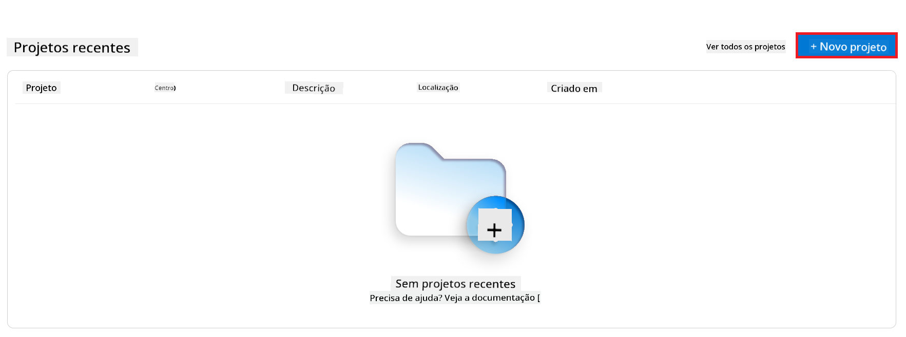

<!--
CO_OP_TRANSLATOR_METADATA:
{
  "original_hash": "c1559c5af6caccf6f623fd43a6b3a9a3",
  "translation_date": "2025-05-09T20:29:24+00:00",
  "source_file": "md/03.FineTuning/FineTuning_AIFoundry.md",
  "language_code": "pt"
}
-->
# Ajustando o Phi-3 com Azure AI Foundry

Vamos explorar como ajustar o modelo de linguagem Phi-3 Mini da Microsoft usando o Azure AI Foundry. O fine-tuning permite adaptar o Phi-3 Mini para tarefas específicas, tornando-o ainda mais poderoso e contextualizado.

## Considerações

- **Capacidades:** Quais modelos podem ser ajustados? Para quais tarefas o modelo base pode ser ajustado?
- **Custo:** Qual é o modelo de precificação para o fine-tuning?
- **Personalização:** Até que ponto posso modificar o modelo base – e de que formas?
- **Conveniência:** Como o fine-tuning acontece na prática – preciso escrever código personalizado? Preciso trazer minha própria infraestrutura de computação?
- **Segurança:** Modelos ajustados apresentam riscos de segurança – existem proteções para evitar danos não intencionais?


## Preparação para o fine-tuning

### Pré-requisitos

> [!NOTE]
> Para modelos da família Phi-3, a oferta de fine-tuning no modelo pay-as-you-go está disponível apenas para hubs criados nas regiões **East US 2**.

- Uma assinatura do Azure. Se você não tem uma assinatura, crie uma [conta paga do Azure](https://azure.microsoft.com/pricing/purchase-options/pay-as-you-go) para começar.

- Um [projeto AI Foundry](https://ai.azure.com?WT.mc_id=aiml-138114-kinfeylo).
- Controles de acesso baseados em função do Azure (Azure RBAC) são usados para conceder acesso às operações no Azure AI Foundry. Para realizar os passos deste artigo, sua conta de usuário deve ter o __papel Azure AI Developer__ no grupo de recursos.

### Registro do provedor de assinatura

Verifique se a assinatura está registrada no provedor de recursos `Microsoft.Network`.

1. Faça login no [portal do Azure](https://portal.azure.com).
1. Selecione **Assinaturas** no menu à esquerda.
1. Selecione a assinatura que deseja usar.
1. Selecione **Configurações do projeto AI** > **Provedores de recursos** no menu à esquerda.
1. Confirme se **Microsoft.Network** está na lista de provedores de recursos. Caso contrário, adicione-o.

### Preparação dos dados

Prepare seus dados de treinamento e validação para ajustar seu modelo. Seus conjuntos de dados de treinamento e validação devem conter exemplos de entrada e saída que representem como você deseja que o modelo funcione.

Certifique-se de que todos os exemplos de treinamento sigam o formato esperado para inferência. Para ajustar modelos de forma eficaz, garanta um conjunto de dados equilibrado e diversificado.

Isso envolve manter o equilíbrio dos dados, incluir vários cenários e refinar periodicamente os dados de treinamento para alinhar com as expectativas do mundo real, resultando em respostas mais precisas e equilibradas do modelo.

Diferentes tipos de modelo exigem formatos distintos de dados de treinamento.

### Chat Completion

Os dados de treinamento e validação que você usar **devem** estar no formato JSON Lines (JSONL). Para `Phi-3-mini-128k-instruct`, o conjunto de dados para fine-tuning deve estar no formato conversacional usado pela API de Chat completions.

### Exemplo de formato de arquivo

```json
    {"messages": [{"role": "system", "content": "You are an Xbox customer support agent whose primary goal is to help users with issues they are experiencing with their Xbox devices. You are friendly and concise. You only provide factual answers to queries, and do not provide answers that are not related to Xbox."}, {"role": "user", "content": "Is Xbox better than PlayStation?"}, {"role": "assistant", "content": "I apologize, but I cannot provide personal opinions. My primary job is to assist you with any issues related to your Xbox device. Do you have any Xbox-related issues that need addressing?"}]}
    {"messages": [{"role": "system", "content": "You are an Xbox customer support agent whose primary goal is to help users with issues they are experiencing with their Xbox devices. You are friendly and concise. You only provide factual answers to queries, and do not provide answers that are not related to Xbox."}, {"role": "user", "content": "Can I play PC games on my Xbox?"}, {"role": "assistant", "content": "While Xbox consoles don't natively support PC games, they can play an array of Xbox games, many of which are also available on PC. Can I assist you with finding games compatible with your Xbox device?"}]}
    {"messages": [{"role": "system", "content": "You are an Xbox customer support agent whose primary goal is to help users with issues they are experiencing with their Xbox devices. You are friendly and concise. You only provide factual answers to queries, and do not provide answers that are not related to Xbox."}, {"role": "user", "content": "I'm having trouble connecting my Xbox to the Wi-Fi."}, {"role": "assistant", "content": "No worries, let's go through the network settings on your Xbox. Can you please tell me what happens when you try to connect it to the Wi-Fi?"}]}
```

O tipo de arquivo suportado é JSON Lines. Os arquivos são enviados para o datastore padrão e disponibilizados no seu projeto.

## Ajustando o Phi-3 com Azure AI Foundry

O Azure AI Foundry permite personalizar grandes modelos de linguagem com seus próprios conjuntos de dados usando um processo conhecido como fine-tuning. O fine-tuning oferece grande valor ao possibilitar personalização e otimização para tarefas e aplicações específicas. Isso resulta em melhor desempenho, eficiência de custo, menor latência e respostas ajustadas.


### Criar um Novo Projeto

1. Faça login no [Azure AI Foundry](https://ai.azure.com).

1. Selecione **+New project** para criar um novo projeto no Azure AI Foundry.

    

1. Realize as seguintes tarefas:

    - Nome do **Hub** do projeto. Deve ser um valor único.
    - Selecione o **Hub** a ser usado (crie um novo se necessário).

    

1. Realize as seguintes tarefas para criar um novo hub:

    - Informe o **Nome do Hub**. Deve ser um valor único.
    - Selecione sua **Assinatura** do Azure.
    - Selecione o **Grupo de recursos** a ser usado (crie um novo se necessário).
    - Selecione a **Localização** que deseja usar.
    - Selecione **Connect Azure AI Services** a ser usado (crie um novo se necessário).
    - Selecione **Connect Azure AI Search** para **Pular conexão**.

    

1. Selecione **Next**.
1. Selecione **Create a project**.

### Preparação dos Dados

Antes do fine-tuning, reúna ou crie um conjunto de dados relevante para sua tarefa, como instruções de chat, pares de perguntas e respostas ou qualquer outro texto pertinente. Limpe e pré-processe esses dados removendo ruídos, tratando valores ausentes e tokenizando o texto.

### Ajustando modelos Phi-3 no Azure AI Foundry

> [!NOTE]
> O fine-tuning dos modelos Phi-3 é suportado atualmente apenas em projetos localizados na região East US 2.

1. Selecione **Model catalog** na aba lateral esquerda.

1. Digite *phi-3* na **barra de busca** e selecione o modelo phi-3 que deseja usar.

    

1. Selecione **Fine-tune**.

    

1. Insira o **Nome do modelo ajustado**.

    

1. Selecione **Next**.

1. Realize as seguintes tarefas:

    - Selecione o **tipo de tarefa** como **Chat completion**.
    - Selecione os **dados de treinamento** que deseja usar. Você pode enviá-los pelo armazenamento de dados do Azure AI Foundry ou do seu ambiente local.

    

1. Selecione **Next**.

1. Envie os **dados de validação** que deseja usar, ou selecione **Divisão automática dos dados de treinamento**.

    

1. Selecione **Next**.

1. Realize as seguintes tarefas:

    - Selecione o **multiplicador do tamanho do batch** que deseja usar.
    - Selecione a **taxa de aprendizado** que deseja usar.
    - Selecione o número de **épocas** que deseja usar.

    

1. Selecione **Submit** para iniciar o processo de fine-tuning.

    

1. Quando seu modelo estiver ajustado, o status será exibido como **Completed**, conforme mostrado na imagem abaixo. Agora você pode implantar o modelo e usá-lo em sua aplicação, no playground ou no prompt flow. Para mais informações, veja [Como implantar a família de pequenos modelos de linguagem Phi-3 com Azure AI Foundry](https://learn.microsoft.com/azure/ai-studio/how-to/deploy-models-phi-3?tabs=phi-3-5&pivots=programming-language-python).

    

> [!NOTE]
> Para informações mais detalhadas sobre fine-tuning do Phi-3, visite [Fine-tune Phi-3 models in Azure AI Foundry](https://learn.microsoft.com/azure/ai-studio/how-to/fine-tune-phi-3?tabs=phi-3-mini).

## Limpando seus modelos ajustados

Você pode excluir um modelo ajustado da lista de modelos de fine-tuning no [Azure AI Foundry](https://ai.azure.com) ou na página de detalhes do modelo. Selecione o modelo ajustado para excluir na página de Fine-tuning e então clique no botão Excluir para remover o modelo.

> [!NOTE]
> Você não pode excluir um modelo customizado se ele possuir uma implantação ativa. É necessário excluir a implantação do modelo antes de excluir o modelo customizado.

## Custos e cotas

### Considerações sobre custos e cotas para modelos Phi-3 ajustados como serviço

Modelos Phi ajustados como serviço são oferecidos pela Microsoft e integrados ao Azure AI Foundry para uso. Você pode encontrar a precificação ao [implantar](https://learn.microsoft.com/azure/ai-studio/how-to/deploy-models-phi-3?tabs=phi-3-5&pivots=programming-language-python) ou ajustar os modelos na aba de Preços e termos do assistente de implantação.

## Filtragem de conteúdo

Modelos implantados como serviço com pay-as-you-go são protegidos pelo Azure AI Content Safety. Quando implantados em endpoints em tempo real, você pode optar por desabilitar essa funcionalidade. Com o Azure AI Content Safety habilitado, tanto o prompt quanto a resposta passam por um conjunto de modelos de classificação que detectam e previnem a saída de conteúdo nocivo. O sistema de filtragem detecta e age sobre categorias específicas de conteúdo potencialmente prejudicial, tanto nas entradas quanto nas respostas. Saiba mais sobre [Azure AI Content Safety](https://learn.microsoft.com/azure/ai-studio/concepts/content-filtering).

**Configuração do Fine-Tuning**

Hyperparâmetros: Defina hyperparâmetros como taxa de aprendizado, tamanho do batch e número de épocas de treinamento.

**Função de Perda**

Escolha uma função de perda adequada para sua tarefa (ex: entropia cruzada).

**Otimizador**

Selecione um otimizador (ex: Adam) para as atualizações de gradiente durante o treinamento.

**Processo de Fine-Tuning**

- Carregar Modelo Pré-Treinado: Carregue o checkpoint do Phi-3 Mini.
- Adicionar Camadas Customizadas: Adicione camadas específicas para a tarefa (ex: cabeça de classificação para instruções de chat).

**Treinar o Modelo**
Ajuste o modelo usando seu conjunto de dados preparado. Monitore o progresso do treinamento e ajuste os hyperparâmetros conforme necessário.

**Avaliação e Validação**

Conjunto de Validação: Separe seus dados em conjuntos de treinamento e validação.

**Avaliar Desempenho**

Use métricas como acurácia, F1-score ou perplexidade para avaliar o desempenho do modelo.

## Salvar Modelo Ajustado

**Checkpoint**
Salve o checkpoint do modelo ajustado para uso futuro.

## Implantação

- Implante como Serviço Web: Implante seu modelo ajustado como um serviço web no Azure AI Foundry.
- Teste o Endpoint: Envie consultas de teste para o endpoint implantado para verificar sua funcionalidade.

## Iterar e Melhorar

Iterar: Se o desempenho não for satisfatório, ajuste hyperparâmetros, adicione mais dados ou faça fine-tuning por mais épocas.

## Monitorar e Refinar

Monitore continuamente o comportamento do modelo e refine conforme necessário.

## Personalizar e Expandir

Tarefas Customizadas: O Phi-3 Mini pode ser ajustado para várias tarefas além de instruções de chat. Explore outros casos de uso!
Experimente: Teste diferentes arquiteturas, combinações de camadas e técnicas para melhorar o desempenho.

> [!NOTE]
> O fine-tuning é um processo iterativo. Experimente, aprenda e adapte seu modelo para alcançar os melhores resultados para sua tarefa específica!

**Aviso Legal**:  
Este documento foi traduzido utilizando o serviço de tradução por IA [Co-op Translator](https://github.com/Azure/co-op-translator). Embora nos esforcemos para garantir a precisão, esteja ciente de que traduções automáticas podem conter erros ou imprecisões. O documento original em seu idioma nativo deve ser considerado a fonte autorizada. Para informações críticas, recomenda-se tradução profissional realizada por humanos. Não nos responsabilizamos por quaisquer mal-entendidos ou interpretações incorretas decorrentes do uso desta tradução.