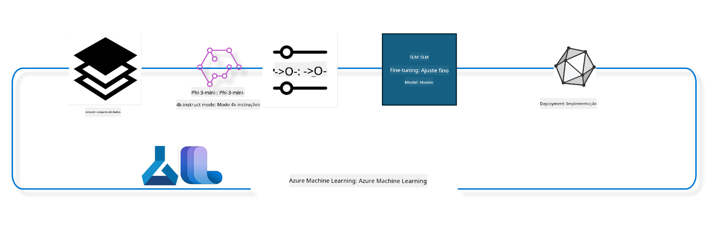

<!--
CO_OP_TRANSLATOR_METADATA:
{
  "original_hash": "944949f040e61b2ea25b3460f7394fd4",
  "translation_date": "2025-05-09T21:03:32+00:00",
  "source_file": "md/03.FineTuning/FineTuning_MLSDK.md",
  "language_code": "pt"
}
-->
## Como usar componentes de chat-completion do registro do sistema Azure ML para ajustar um modelo

Neste exemplo, faremos o fine tuning do modelo Phi-3-mini-4k-instruct para completar uma conversa entre 2 pessoas usando o conjunto de dados ultrachat_200k.



O exemplo mostrará como realizar o fine tuning usando o Azure ML SDK e Python e, em seguida, implantar o modelo ajustado em um endpoint online para inferência em tempo real.

### Dados de treinamento

Usaremos o conjunto de dados ultrachat_200k. Esta é uma versão fortemente filtrada do conjunto UltraChat e foi usada para treinar o Zephyr-7B-β, um modelo de chat state-of-the-art de 7 bilhões de parâmetros.

### Modelo

Usaremos o modelo Phi-3-mini-4k-instruct para mostrar como o usuário pode ajustar um modelo para a tarefa de chat-completion. Se você abriu este notebook a partir de uma ficha de modelo específica, lembre-se de substituir o nome do modelo.

### Tarefas

- Escolher um modelo para ajustar.
- Escolher e explorar os dados de treinamento.
- Configurar o job de fine tuning.
- Executar o job de fine tuning.
- Revisar as métricas de treinamento e avaliação.
- Registrar o modelo ajustado.
- Implantar o modelo ajustado para inferência em tempo real.
- Limpar os recursos.

## 1. Configurar pré-requisitos

- Instalar dependências
- Conectar ao AzureML Workspace. Saiba mais em set up SDK authentication. Substitua <WORKSPACE_NAME>, <RESOURCE_GROUP> e <SUBSCRIPTION_ID> abaixo.
- Conectar ao registro do sistema azureml
- Definir um nome opcional para o experimento
- Verificar ou criar o compute.

> [!NOTE]
> Requisitos: um único nó GPU pode ter múltiplas placas GPU. Por exemplo, um nó Standard_NC24rs_v3 possui 4 GPUs NVIDIA V100, enquanto o Standard_NC12s_v3 possui 2 GPUs NVIDIA V100. Consulte a documentação para mais informações. O número de GPUs por nó é definido no parâmetro gpus_per_node abaixo. Configurar esse valor corretamente garante a utilização de todas as GPUs no nó. Os SKUs recomendados para GPU compute podem ser encontrados aqui e aqui.

### Bibliotecas Python

Instale as dependências executando a célula abaixo. Esta etapa não é opcional se estiver rodando em um ambiente novo.

```bash
pip install azure-ai-ml
pip install azure-identity
pip install datasets==2.9.0
pip install mlflow
pip install azureml-mlflow
```

### Interagindo com Azure ML

1. Este script Python é usado para interagir com o serviço Azure Machine Learning (Azure ML). Aqui está um resumo do que ele faz:

    - Importa módulos necessários dos pacotes azure.ai.ml, azure.identity e azure.ai.ml.entities, além do módulo time.

    - Tenta autenticar usando DefaultAzureCredential(), que oferece uma experiência simplificada para começar a desenvolver aplicações na nuvem Azure. Se falhar, usa InteractiveBrowserCredential(), que abre um prompt interativo de login.

    - Tenta criar uma instância MLClient usando o método from_config, que lê a configuração do arquivo padrão (config.json). Se falhar, cria a instância MLClient fornecendo manualmente subscription_id, resource_group_name e workspace_name.

    - Cria outra instância MLClient, desta vez para o registro Azure ML chamado "azureml". Este registro armazena modelos, pipelines de fine tuning e ambientes.

    - Define o nome do experimento como "chat_completion_Phi-3-mini-4k-instruct".

    - Gera um timestamp único convertendo o tempo atual (em segundos desde a época, como número float) para inteiro e depois para string. Esse timestamp pode ser usado para criar nomes e versões únicos.

    ```python
    # Import necessary modules from Azure ML and Azure Identity
    from azure.ai.ml import MLClient
    from azure.identity import (
        DefaultAzureCredential,
        InteractiveBrowserCredential,
    )
    from azure.ai.ml.entities import AmlCompute
    import time  # Import time module
    
    # Try to authenticate using DefaultAzureCredential
    try:
        credential = DefaultAzureCredential()
        credential.get_token("https://management.azure.com/.default")
    except Exception as ex:  # If DefaultAzureCredential fails, use InteractiveBrowserCredential
        credential = InteractiveBrowserCredential()
    
    # Try to create an MLClient instance using the default config file
    try:
        workspace_ml_client = MLClient.from_config(credential=credential)
    except:  # If that fails, create an MLClient instance by manually providing the details
        workspace_ml_client = MLClient(
            credential,
            subscription_id="<SUBSCRIPTION_ID>",
            resource_group_name="<RESOURCE_GROUP>",
            workspace_name="<WORKSPACE_NAME>",
        )
    
    # Create another MLClient instance for the Azure ML registry named "azureml"
    # This registry is where models, fine-tuning pipelines, and environments are stored
    registry_ml_client = MLClient(credential, registry_name="azureml")
    
    # Set the experiment name
    experiment_name = "chat_completion_Phi-3-mini-4k-instruct"
    
    # Generate a unique timestamp that can be used for names and versions that need to be unique
    timestamp = str(int(time.time()))
    ```

## 2. Escolher um modelo base para ajustar

1. Phi-3-mini-4k-instruct é um modelo leve de 3,8 bilhões de parâmetros, state-of-the-art, construído a partir dos datasets usados para o Phi-2. O modelo pertence à família Phi-3, e a versão Mini vem em duas variantes 4K e 128K, que indicam o comprimento do contexto (em tokens) que suporta. Precisamos ajustar o modelo para nosso propósito específico antes de usá-lo. Você pode navegar por esses modelos no Catálogo de Modelos no AzureML Studio, filtrando pela tarefa chat-completion. Neste exemplo, usamos o modelo Phi-3-mini-4k-instruct. Se abriu este notebook para outro modelo, substitua o nome e a versão do modelo conforme necessário.

    > [!NOTE]
    > a propriedade model id do modelo. Isso será passado como entrada para o job de fine tuning. Também está disponível como o campo Asset ID na página de detalhes do modelo no Catálogo de Modelos do AzureML Studio.

2. Este script Python interage com o serviço Azure Machine Learning (Azure ML). Aqui está um resumo do que ele faz:

    - Define o model_name como "Phi-3-mini-4k-instruct".

    - Usa o método get da propriedade models do objeto registry_ml_client para recuperar a versão mais recente do modelo com o nome especificado do registro Azure ML. O método get é chamado com dois argumentos: o nome do modelo e um label que especifica que a versão mais recente deve ser obtida.

    - Imprime uma mensagem no console indicando o nome, versão e id do modelo que será usado para o fine tuning. O método format da string insere o nome, versão e id do modelo na mensagem. Esses dados são acessados como propriedades do objeto foundation_model.

    ```python
    # Set the model name
    model_name = "Phi-3-mini-4k-instruct"
    
    # Get the latest version of the model from the Azure ML registry
    foundation_model = registry_ml_client.models.get(model_name, label="latest")
    
    # Print the model name, version, and id
    # This information is useful for tracking and debugging
    print(
        "\n\nUsing model name: {0}, version: {1}, id: {2} for fine tuning".format(
            foundation_model.name, foundation_model.version, foundation_model.id
        )
    )
    ```

## 3. Criar um compute para usar no job

O job de fine tuning funciona SOMENTE com compute GPU. O tamanho do compute depende do tamanho do modelo e, na maioria dos casos, é difícil identificar o compute certo para o job. Nesta célula, orientamos o usuário a selecionar o compute adequado.

> [!NOTE]
> Os computes listados abaixo funcionam com a configuração mais otimizada. Qualquer alteração na configuração pode causar erro Cuda Out Of Memory. Nestes casos, tente aumentar o tamanho do compute.

> [!NOTE]
> Ao selecionar o compute_cluster_size abaixo, certifique-se que o compute está disponível no seu grupo de recursos. Se um compute específico não estiver disponível, você pode solicitar acesso aos recursos de compute.

### Verificando suporte ao Fine Tuning no Modelo

1. Este script Python interage com um modelo Azure Machine Learning (Azure ML). Aqui está um resumo do que ele faz:

    - Importa o módulo ast, que fornece funções para processar árvores da gramática abstrata do Python.

    - Verifica se o objeto foundation_model (que representa um modelo no Azure ML) possui uma tag chamada finetune_compute_allow_list. Tags no Azure ML são pares chave-valor que você pode criar e usar para filtrar e ordenar modelos.

    - Se a tag finetune_compute_allow_list estiver presente, usa ast.literal_eval para analisar com segurança o valor da tag (uma string) para uma lista Python. Essa lista é atribuída à variável computes_allow_list. Em seguida, imprime uma mensagem indicando que o compute deve ser criado a partir dessa lista.

    - Se a tag não estiver presente, define computes_allow_list como None e imprime uma mensagem indicando que a tag finetune_compute_allow_list não faz parte das tags do modelo.

    - Em resumo, este script verifica uma tag específica nos metadados do modelo, converte seu valor em lista se existir e fornece feedback ao usuário.

    ```python
    # Import the ast module, which provides functions to process trees of the Python abstract syntax grammar
    import ast
    
    # Check if the 'finetune_compute_allow_list' tag is present in the model's tags
    if "finetune_compute_allow_list" in foundation_model.tags:
        # If the tag is present, use ast.literal_eval to safely parse the tag's value (a string) into a Python list
        computes_allow_list = ast.literal_eval(
            foundation_model.tags["finetune_compute_allow_list"]
        )  # convert string to python list
        # Print a message indicating that a compute should be created from the list
        print(f"Please create a compute from the above list - {computes_allow_list}")
    else:
        # If the tag is not present, set computes_allow_list to None
        computes_allow_list = None
        # Print a message indicating that the 'finetune_compute_allow_list' tag is not part of the model's tags
        print("`finetune_compute_allow_list` is not part of model tags")
    ```

### Verificando a Instância de Compute

1. Este script Python interage com o serviço Azure Machine Learning (Azure ML) e realiza várias verificações em uma instância de compute. Aqui está um resumo do que ele faz:

    - Tenta recuperar a instância de compute com o nome armazenado em compute_cluster no workspace Azure ML. Se o estado de provisionamento for "failed", gera um ValueError.

    - Verifica se computes_allow_list não é None. Se não for, converte todos os tamanhos de compute da lista para minúsculas e verifica se o tamanho da instância atual está na lista. Se não estiver, gera um ValueError.

    - Se computes_allow_list for None, verifica se o tamanho da instância está em uma lista de tamanhos de VM GPU não suportados. Se estiver, gera um ValueError.

    - Recupera uma lista de todos os tamanhos de compute disponíveis no workspace. Itera sobre essa lista e, para cada tamanho, verifica se o nome corresponde ao tamanho da instância atual. Se corresponder, recupera o número de GPUs para esse tamanho e define gpu_count_found como True.

    - Se gpu_count_found for True, imprime o número de GPUs na instância de compute. Se for False, gera um ValueError.

    - Em resumo, este script realiza várias verificações em uma instância de compute no workspace Azure ML, incluindo o estado de provisionamento, o tamanho em relação a uma lista permitida ou negada, e o número de GPUs.

    ```python
    # Print the exception message
    print(e)
    # Raise a ValueError if the compute size is not available in the workspace
    raise ValueError(
        f"WARNING! Compute size {compute_cluster_size} not available in workspace"
    )
    
    # Retrieve the compute instance from the Azure ML workspace
    compute = workspace_ml_client.compute.get(compute_cluster)
    # Check if the provisioning state of the compute instance is "failed"
    if compute.provisioning_state.lower() == "failed":
        # Raise a ValueError if the provisioning state is "failed"
        raise ValueError(
            f"Provisioning failed, Compute '{compute_cluster}' is in failed state. "
            f"please try creating a different compute"
        )
    
    # Check if computes_allow_list is not None
    if computes_allow_list is not None:
        # Convert all compute sizes in computes_allow_list to lowercase
        computes_allow_list_lower_case = [x.lower() for x in computes_allow_list]
        # Check if the size of the compute instance is in computes_allow_list_lower_case
        if compute.size.lower() not in computes_allow_list_lower_case:
            # Raise a ValueError if the size of the compute instance is not in computes_allow_list_lower_case
            raise ValueError(
                f"VM size {compute.size} is not in the allow-listed computes for finetuning"
            )
    else:
        # Define a list of unsupported GPU VM sizes
        unsupported_gpu_vm_list = [
            "standard_nc6",
            "standard_nc12",
            "standard_nc24",
            "standard_nc24r",
        ]
        # Check if the size of the compute instance is in unsupported_gpu_vm_list
        if compute.size.lower() in unsupported_gpu_vm_list:
            # Raise a ValueError if the size of the compute instance is in unsupported_gpu_vm_list
            raise ValueError(
                f"VM size {compute.size} is currently not supported for finetuning"
            )
    
    # Initialize a flag to check if the number of GPUs in the compute instance has been found
    gpu_count_found = False
    # Retrieve a list of all available compute sizes in the workspace
    workspace_compute_sku_list = workspace_ml_client.compute.list_sizes()
    available_sku_sizes = []
    # Iterate over the list of available compute sizes
    for compute_sku in workspace_compute_sku_list:
        available_sku_sizes.append(compute_sku.name)
        # Check if the name of the compute size matches the size of the compute instance
        if compute_sku.name.lower() == compute.size.lower():
            # If it does, retrieve the number of GPUs for that compute size and set gpu_count_found to True
            gpus_per_node = compute_sku.gpus
            gpu_count_found = True
    # If gpu_count_found is True, print the number of GPUs in the compute instance
    if gpu_count_found:
        print(f"Number of GPU's in compute {compute.size}: {gpus_per_node}")
    else:
        # If gpu_count_found is False, raise a ValueError
        raise ValueError(
            f"Number of GPU's in compute {compute.size} not found. Available skus are: {available_sku_sizes}."
            f"This should not happen. Please check the selected compute cluster: {compute_cluster} and try again."
        )
    ```

## 4. Escolher o dataset para fine tuning do modelo

1. Usamos o conjunto de dados ultrachat_200k. O dataset tem quatro divisões, adequadas para fine tuning supervisionado (sft) e ranking de geração (gen). O número de exemplos por divisão é mostrado a seguir:

    ```bash
    train_sft test_sft  train_gen  test_gen
    207865  23110  256032  28304
    ```

1. As próximas células mostram a preparação básica dos dados para fine tuning:

### Visualizar algumas linhas de dados

Queremos que esta amostra rode rapidamente, então salvamos os arquivos train_sft e test_sft contendo 5% das linhas já filtradas. Isso significa que o modelo ajustado terá menor precisão, portanto não deve ser usado em produção.
O script download-dataset.py é usado para baixar o dataset ultrachat_200k e transformar os dados em um formato consumível pelo pipeline de fine tuning. Como o dataset é grande, aqui temos apenas uma parte dele.

1. Executar o script abaixo baixa apenas 5% dos dados. Isso pode ser aumentado alterando o parâmetro dataset_split_pc para a porcentagem desejada.

    > [!NOTE]
    > Alguns modelos de linguagem possuem códigos de idioma diferentes e, portanto, os nomes das colunas no dataset devem refletir isso.

1. Aqui está um exemplo de como os dados devem parecer
O dataset de chat-completion está armazenado em formato parquet, com cada entrada usando o seguinte esquema:

    - Este é um documento JSON (JavaScript Object Notation), um formato popular de intercâmbio de dados. Não é código executável, mas uma forma de armazenar e transportar dados. Aqui está a estrutura:

    - "prompt": esta chave contém uma string que representa uma tarefa ou pergunta feita a um assistente de IA.

    - "messages": esta chave contém um array de objetos. Cada objeto representa uma mensagem em uma conversa entre um usuário e um assistente de IA. Cada objeto mensagem tem duas chaves:

    - "content": string que representa o conteúdo da mensagem.
    - "role": string que representa o papel da entidade que enviou a mensagem. Pode ser "user" ou "assistant".
    - "prompt_id": string que representa um identificador único para o prompt.

1. Neste documento JSON específico, uma conversa é representada onde um usuário pede ao assistente de IA para criar um protagonista para uma história distópica. O assistente responde, e o usuário pede mais detalhes. O assistente concorda em fornecer mais detalhes. Toda a conversa está associada a um prompt_id específico.

    ```python
    {
        // The task or question posed to an AI assistant
        "prompt": "Create a fully-developed protagonist who is challenged to survive within a dystopian society under the rule of a tyrant. ...",
        
        // An array of objects, each representing a message in a conversation between a user and an AI assistant
        "messages":[
            {
                // The content of the user's message
                "content": "Create a fully-developed protagonist who is challenged to survive within a dystopian society under the rule of a tyrant. ...",
                // The role of the entity that sent the message
                "role": "user"
            },
            {
                // The content of the assistant's message
                "content": "Name: Ava\n\n Ava was just 16 years old when the world as she knew it came crashing down. The government had collapsed, leaving behind a chaotic and lawless society. ...",
                // The role of the entity that sent the message
                "role": "assistant"
            },
            {
                // The content of the user's message
                "content": "Wow, Ava's story is so intense and inspiring! Can you provide me with more details.  ...",
                // The role of the entity that sent the message
                "role": "user"
            }, 
            {
                // The content of the assistant's message
                "content": "Certainly! ....",
                // The role of the entity that sent the message
                "role": "assistant"
            }
        ],
        
        // A unique identifier for the prompt
        "prompt_id": "d938b65dfe31f05f80eb8572964c6673eddbd68eff3db6bd234d7f1e3b86c2af"
    }
    ```

### Baixar Dados

1. Este script Python é usado para baixar um dataset usando um script auxiliar chamado download-dataset.py. Aqui está um resumo do que ele faz:

    - Importa o módulo os, que oferece uma forma portátil de usar funcionalidades dependentes do sistema operacional.

    - Usa a função os.system para executar o script download-dataset.py no shell com argumentos específicos. Os argumentos especificam o dataset a ser baixado (HuggingFaceH4/ultrachat_200k), o diretório para download (ultrachat_200k_dataset) e a porcentagem do dataset para dividir (5). A função os.system retorna o status de saída do comando; esse status é armazenado em exit_status.

    - Verifica se exit_status não é 0. Em sistemas Unix-like, status 0 indica sucesso, qualquer outro número indica erro. Se não for 0, gera uma Exception indicando erro no download do dataset.

    - Em resumo, este script executa um comando para baixar um dataset usando um script auxiliar e lança uma exceção se o comando falhar.

    ```python
    # Import the os module, which provides a way of using operating system dependent functionality
    import os
    
    # Use the os.system function to run the download-dataset.py script in the shell with specific command-line arguments
    # The arguments specify the dataset to download (HuggingFaceH4/ultrachat_200k), the directory to download it to (ultrachat_200k_dataset), and the percentage of the dataset to split (5)
    # The os.system function returns the exit status of the command it executed; this status is stored in the exit_status variable
    exit_status = os.system(
        "python ./download-dataset.py --dataset HuggingFaceH4/ultrachat_200k --download_dir ultrachat_200k_dataset --dataset_split_pc 5"
    )
    
    # Check if exit_status is not 0
    # In Unix-like operating systems, an exit status of 0 usually indicates that a command has succeeded, while any other number indicates an error
    # If exit_status is not 0, raise an Exception with a message indicating that there was an error downloading the dataset
    if exit_status != 0:
        raise Exception("Error downloading dataset")
    ```

### Carregar Dados em um DataFrame

1. Este script Python carrega um arquivo JSON Lines em um DataFrame pandas e exibe as primeiras 5 linhas. Aqui está um resumo do que ele faz:

    - Importa a biblioteca pandas, uma poderosa ferramenta para manipulação e análise de dados.

    - Define a largura máxima das colunas para exibição no pandas como 0. Isso significa que o texto completo de cada coluna será exibido sem truncamento ao imprimir o DataFrame.

    - Usa pd.read_json para carregar o arquivo train_sft.jsonl do diretório ultrachat_200k_dataset em um DataFrame. O argumento lines=True indica que o arquivo está no formato JSON Lines, onde cada linha é um objeto JSON separado.

    - Usa o método head para exibir as primeiras 5 linhas do DataFrame. Se o DataFrame tiver menos de 5 linhas, exibirá todas.

    - Em resumo, este script carrega um arquivo JSON Lines em um DataFrame e exibe as primeiras 5 linhas com o texto completo das colunas.

    ```python
    # Import the pandas library, which is a powerful data manipulation and analysis library
    import pandas as pd
    
    # Set the maximum column width for pandas' display options to 0
    # This means that the full text of each column will be displayed without truncation when the DataFrame is printed
    pd.set_option("display.max_colwidth", 0)
    
    # Use the pd.read_json function to load the train_sft.jsonl file from the ultrachat_200k_dataset directory into a DataFrame
    # The lines=True argument indicates that the file is in JSON Lines format, where each line is a separate JSON object
    df = pd.read_json("./ultrachat_200k_dataset/train_sft.jsonl", lines=True)
    
    # Use the head method to display the first 5 rows of the DataFrame
    # If the DataFrame has less than 5 rows, it will display all of them
    df.head()
    ```

## 5. Enviar o job de fine tuning usando o modelo e os dados como entrada

Crie o job que usa o componente de pipeline chat-completion. Saiba mais sobre todos os parâmetros suportados para fine tuning.

### Definir parâmetros de fine tuning

1. Os parâmetros de fine tuning podem ser agrupados em 2 categorias - parâmetros de treinamento e parâmetros de otimização.

1. Os parâmetros de treinamento definem os aspectos do treinamento, tais como:

    - O otimizador, scheduler a usar
    - A métrica a ser otimizada no fine tuning
    - Número de passos de treinamento, tamanho do batch, etc.
    - Os parâmetros de otimização ajudam a otimizar a memória da GPU e usar os recursos de compute de forma eficiente.

1. Abaixo estão alguns dos parâmetros que pertencem a esta categoria. Os parâmetros de otimização diferem para cada modelo e são empacotados com o modelo para lidar com essas variações.

    - Ativar deepspeed e LoRA
    - Ativar treinamento com precisão mista
    - Ativar treinamento multi-nó

> [!NOTE]
> Fine tuning supervisionado pode resultar em perda de alinhamento ou esquecimento catastrófico. Recomendamos verificar esse problema e rodar uma etapa de alinhamento após o fine tuning.

### Parâmetros de Fine Tuning

1. Este script Python configura os parâmetros para fine tuning de um modelo de machine learning. Aqui está um resumo do que ele faz:

    - Configura parâmetros padrão de treinamento, como número de épocas, tamanhos de batch para treinamento e avaliação, taxa de aprendizado e tipo de scheduler.

    - Configura parâmetros padrão de otimização, como se deve aplicar Layer-wise Relevance Propagation (LoRa) e DeepSpeed, e o estágio do DeepSpeed.

    - Combina os parâmetros de treinamento e otimização em um único dicionário chamado finetune_parameters.

    - Verifica se o foundation_model possui parâmetros padrão específicos para o modelo. Se tiver, imprime uma mensagem de aviso e atualiza o dicionário finetune_parameters com esses parâmetros específicos. A função ast.literal_eval é usada para converter os parâmetros específicos do modelo de string para dicionário Python.

    - Imprime o conjunto final de parâmetros de fine tuning que será usado na execução.

    - Em resumo, este script configura e exibe os parâmetros para fine tuning de um modelo, com a possibilidade de sobrescrever os parâmetros padrão por parâmetros específicos do modelo.

    ```python
    # Set up default training parameters such as the number of training epochs, batch sizes for training and evaluation, learning rate, and learning rate scheduler type
    training_parameters = dict(
        num_train_epochs=3,
        per_device_train_batch_size=1,
        per_device_eval_batch_size=1,
        learning_rate=5e-6,
        lr_scheduler_type="cosine",
    )
    
    # Set up default optimization parameters such as whether to apply Layer-wise Relevance Propagation (LoRa) and DeepSpeed, and the DeepSpeed stage
    optimization_parameters = dict(
        apply_lora="true",
        apply_deepspeed="true",
        deepspeed_stage=2,
    )
    
    # Combine the training and optimization parameters into a single dictionary called finetune_parameters
    finetune_parameters = {**training_parameters, **optimization_parameters}
    
    # Check if the foundation_model has any model-specific default parameters
    # If it does, print a warning message and update the finetune_parameters dictionary with these model-specific defaults
    # The ast.literal_eval function is used to convert the model-specific defaults from a string to a Python dictionary
    if "model_specific_defaults" in foundation_model.tags:
        print("Warning! Model specific defaults exist. The defaults could be overridden.")
        finetune_parameters.update(
            ast.literal_eval(  # convert string to python dict
                foundation_model.tags["model_specific_defaults"]
            )
        )
    
    # Print the final set of fine-tuning parameters that will be used for the run
    print(
        f"The following finetune parameters are going to be set for the run: {finetune_parameters}"
    )
    ```

### Pipeline de Treinamento

1. Este script Python define uma função para gerar um nome de exibição para um pipeline de treinamento de machine learning, e então chama essa função para gerar e imprimir o nome de exibição. Aqui está um resumo do que ele faz:

    1. Define a função get_pipeline_display_name. Essa função gera um nome de exibição baseado em vários parâmetros relacionados ao pipeline de treinamento.

    2. Dentro da função, calcula o tamanho total do batch multiplicando o batch size por dispositivo, o número de passos de acumulação de gradiente, o número de GPUs por nó e o número de nós usados para fine tuning.

    3. Recupera vários outros parâmetros, como tipo de scheduler da taxa de aprendizado, se DeepSpeed está aplicado, estágio do DeepSpeed, se Layer-wise Relevance Propagation (LoRa) está aplicado, limite no número de checkpoints do modelo a manter e comprimento máximo da sequência.

    4. Constrói uma string que inclui todos esses parâmetros, separados por hífens. Se DeepSpeed ou LoRa estiverem aplicados, a string inclui "ds" seguido do estágio do DeepSpeed, ou "lora", respectivamente. Caso contrário, inclui "nods" ou "nolora", respectivamente.

    5. A função retorna essa string, que serve como nome de exibição para o pipeline de treinamento.

    6. Após definir a função, ela é chamada para gerar o nome de exibição, que é então impresso.

    7. Em resumo, este script gera um nome de exibição para um pipeline de machine learning.
pipeline de treinamento baseado em vários parâmetros, e então imprimindo esse nome de exibição. ```python
    # Define a function to generate a display name for the training pipeline
    def get_pipeline_display_name():
        # Calculate the total batch size by multiplying the per-device batch size, the number of gradient accumulation steps, the number of GPUs per node, and the number of nodes used for fine-tuning
        batch_size = (
            int(finetune_parameters.get("per_device_train_batch_size", 1))
            * int(finetune_parameters.get("gradient_accumulation_steps", 1))
            * int(gpus_per_node)
            * int(finetune_parameters.get("num_nodes_finetune", 1))
        )
        # Retrieve the learning rate scheduler type
        scheduler = finetune_parameters.get("lr_scheduler_type", "linear")
        # Retrieve whether DeepSpeed is applied
        deepspeed = finetune_parameters.get("apply_deepspeed", "false")
        # Retrieve the DeepSpeed stage
        ds_stage = finetune_parameters.get("deepspeed_stage", "2")
        # If DeepSpeed is applied, include "ds" followed by the DeepSpeed stage in the display name; if not, include "nods"
        if deepspeed == "true":
            ds_string = f"ds{ds_stage}"
        else:
            ds_string = "nods"
        # Retrieve whether Layer-wise Relevance Propagation (LoRa) is applied
        lora = finetune_parameters.get("apply_lora", "false")
        # If LoRa is applied, include "lora" in the display name; if not, include "nolora"
        if lora == "true":
            lora_string = "lora"
        else:
            lora_string = "nolora"
        # Retrieve the limit on the number of model checkpoints to keep
        save_limit = finetune_parameters.get("save_total_limit", -1)
        # Retrieve the maximum sequence length
        seq_len = finetune_parameters.get("max_seq_length", -1)
        # Construct the display name by concatenating all these parameters, separated by hyphens
        return (
            model_name
            + "-"
            + "ultrachat"
            + "-"
            + f"bs{batch_size}"
            + "-"
            + f"{scheduler}"
            + "-"
            + ds_string
            + "-"
            + lora_string
            + f"-save_limit{save_limit}"
            + f"-seqlen{seq_len}"
        )
    
    # Call the function to generate the display name
    pipeline_display_name = get_pipeline_display_name()
    # Print the display name
    print(f"Display name used for the run: {pipeline_display_name}")
    ```

### Configurando a Pipeline

Este script Python está definindo e configurando uma pipeline de machine learning usando o Azure Machine Learning SDK. Veja o que ele faz:

1. Importa os módulos necessários do Azure AI ML SDK.
2. Busca um componente de pipeline chamado "chat_completion_pipeline" no registro.
3. Define um job de pipeline usando `@pipeline` decorator and the function `create_pipeline`. The name of the pipeline is set to `pipeline_display_name`.

1. Inside the `create_pipeline` function, it initializes the fetched pipeline component with various parameters, including the model path, compute clusters for different stages, dataset splits for training and testing, the number of GPUs to use for fine-tuning, and other fine-tuning parameters.

1. It maps the output of the fine-tuning job to the output of the pipeline job. This is done so that the fine-tuned model can be easily registered, which is required to deploy the model to an online or batch endpoint.

1. It creates an instance of the pipeline by calling the `create_pipeline` function.

1. It sets the `force_rerun` setting of the pipeline to `True`, meaning that cached results from previous jobs will not be used.

1. It sets the `continue_on_step_failure` setting of the pipeline to `False`, o que significa que a pipeline será interrompida se algum passo falhar.
4. Em resumo, este script está definindo e configurando uma pipeline de machine learning para uma tarefa de conclusão de chat usando o Azure Machine Learning SDK.

```python
    # Import necessary modules from the Azure AI ML SDK
    from azure.ai.ml.dsl import pipeline
    from azure.ai.ml import Input
    
    # Fetch the pipeline component named "chat_completion_pipeline" from the registry
    pipeline_component_func = registry_ml_client.components.get(
        name="chat_completion_pipeline", label="latest"
    )
    
    # Define the pipeline job using the @pipeline decorator and the function create_pipeline
    # The name of the pipeline is set to pipeline_display_name
    @pipeline(name=pipeline_display_name)
    def create_pipeline():
        # Initialize the fetched pipeline component with various parameters
        # These include the model path, compute clusters for different stages, dataset splits for training and testing, the number of GPUs to use for fine-tuning, and other fine-tuning parameters
        chat_completion_pipeline = pipeline_component_func(
            mlflow_model_path=foundation_model.id,
            compute_model_import=compute_cluster,
            compute_preprocess=compute_cluster,
            compute_finetune=compute_cluster,
            compute_model_evaluation=compute_cluster,
            # Map the dataset splits to parameters
            train_file_path=Input(
                type="uri_file", path="./ultrachat_200k_dataset/train_sft.jsonl"
            ),
            test_file_path=Input(
                type="uri_file", path="./ultrachat_200k_dataset/test_sft.jsonl"
            ),
            # Training settings
            number_of_gpu_to_use_finetuning=gpus_per_node,  # Set to the number of GPUs available in the compute
            **finetune_parameters
        )
        return {
            # Map the output of the fine tuning job to the output of pipeline job
            # This is done so that we can easily register the fine tuned model
            # Registering the model is required to deploy the model to an online or batch endpoint
            "trained_model": chat_completion_pipeline.outputs.mlflow_model_folder
        }
    
    # Create an instance of the pipeline by calling the create_pipeline function
    pipeline_object = create_pipeline()
    
    # Don't use cached results from previous jobs
    pipeline_object.settings.force_rerun = True
    
    # Set continue on step failure to False
    # This means that the pipeline will stop if any step fails
    pipeline_object.settings.continue_on_step_failure = False
    ```

### Submetendo o Job

1. Este script Python está submetendo um job de pipeline de machine learning para um workspace do Azure Machine Learning e então aguardando a conclusão do job. Veja o que ele faz:

- Chama o método create_or_update do objeto jobs no workspace_ml_client para submeter o job da pipeline. A pipeline a ser executada é especificada por pipeline_object, e o experimento sob o qual o job é executado é especificado por experiment_name.
- Em seguida, chama o método stream do objeto jobs no workspace_ml_client para aguardar a conclusão do job da pipeline. O job a ser aguardado é especificado pelo atributo name do objeto pipeline_job.
- Em resumo, este script está submetendo um job de pipeline de machine learning para um workspace do Azure Machine Learning e aguardando a conclusão do job.

```python
    # Submit the pipeline job to the Azure Machine Learning workspace
    # The pipeline to be run is specified by pipeline_object
    # The experiment under which the job is run is specified by experiment_name
    pipeline_job = workspace_ml_client.jobs.create_or_update(
        pipeline_object, experiment_name=experiment_name
    )
    
    # Wait for the pipeline job to complete
    # The job to wait for is specified by the name attribute of the pipeline_job object
    workspace_ml_client.jobs.stream(pipeline_job.name)
    ```

## 6. Registrar o modelo fine-tuned no workspace

Vamos registrar o modelo a partir da saída do job de fine tuning. Isso irá rastrear a linhagem entre o modelo fine-tuned e o job de fine tuning. O job de fine tuning, por sua vez, rastreia a linhagem do modelo base, dos dados e do código de treinamento.

### Registrando o Modelo de ML

1. Este script Python está registrando um modelo de machine learning que foi treinado em uma pipeline do Azure Machine Learning. Veja o que ele faz:

- Importa os módulos necessários do Azure AI ML SDK.
- Verifica se a saída trained_model está disponível a partir do job da pipeline, chamando o método get do objeto jobs no workspace_ml_client e acessando seu atributo outputs.
- Constrói um caminho para o modelo treinado formatando uma string com o nome do job da pipeline e o nome da saída ("trained_model").
- Define um nome para o modelo fine-tuned adicionando "-ultrachat-200k" ao nome original do modelo e substituindo quaisquer barras por hífens.
- Prepara o registro do modelo criando um objeto Model com vários parâmetros, incluindo o caminho para o modelo, o tipo do modelo (modelo MLflow), o nome e a versão do modelo, e uma descrição do modelo.
- Registra o modelo chamando o método create_or_update do objeto models no workspace_ml_client com o objeto Model como argumento.
- Imprime o modelo registrado.

1. Em resumo, este script está registrando um modelo de machine learning que foi treinado em uma pipeline do Azure Machine Learning.

```python
    # Import necessary modules from the Azure AI ML SDK
    from azure.ai.ml.entities import Model
    from azure.ai.ml.constants import AssetTypes
    
    # Check if the `trained_model` output is available from the pipeline job
    print("pipeline job outputs: ", workspace_ml_client.jobs.get(pipeline_job.name).outputs)
    
    # Construct a path to the trained model by formatting a string with the name of the pipeline job and the name of the output ("trained_model")
    model_path_from_job = "azureml://jobs/{0}/outputs/{1}".format(
        pipeline_job.name, "trained_model"
    )
    
    # Define a name for the fine-tuned model by appending "-ultrachat-200k" to the original model name and replacing any slashes with hyphens
    finetuned_model_name = model_name + "-ultrachat-200k"
    finetuned_model_name = finetuned_model_name.replace("/", "-")
    
    print("path to register model: ", model_path_from_job)
    
    # Prepare to register the model by creating a Model object with various parameters
    # These include the path to the model, the type of the model (MLflow model), the name and version of the model, and a description of the model
    prepare_to_register_model = Model(
        path=model_path_from_job,
        type=AssetTypes.MLFLOW_MODEL,
        name=finetuned_model_name,
        version=timestamp,  # Use timestamp as version to avoid version conflict
        description=model_name + " fine tuned model for ultrachat 200k chat-completion",
    )
    
    print("prepare to register model: \n", prepare_to_register_model)
    
    # Register the model by calling the create_or_update method of the models object in the workspace_ml_client with the Model object as the argument
    registered_model = workspace_ml_client.models.create_or_update(
        prepare_to_register_model
    )
    
    # Print the registered model
    print("registered model: \n", registered_model)
    ```

## 7. Implantar o modelo fine-tuned em um endpoint online

Endpoints online fornecem uma API REST durável que pode ser usada para integrar com aplicações que precisam usar o modelo.

### Gerenciando o Endpoint

1. Este script Python está criando um endpoint online gerenciado no Azure Machine Learning para um modelo registrado. Veja o que ele faz:

- Importa os módulos necessários do Azure AI ML SDK.
- Define um nome único para o endpoint online adicionando um timestamp à string "ultrachat-completion-".
- Prepara a criação do endpoint online criando um objeto ManagedOnlineEndpoint com vários parâmetros, incluindo o nome do endpoint, uma descrição do endpoint e o modo de autenticação ("key").
- Cria o endpoint online chamando o método begin_create_or_update do workspace_ml_client com o objeto ManagedOnlineEndpoint como argumento. Depois aguarda a conclusão da operação chamando o método wait.

1. Em resumo, este script está criando um endpoint online gerenciado no Azure Machine Learning para um modelo registrado.

```python
    # Import necessary modules from the Azure AI ML SDK
    from azure.ai.ml.entities import (
        ManagedOnlineEndpoint,
        ManagedOnlineDeployment,
        ProbeSettings,
        OnlineRequestSettings,
    )
    
    # Define a unique name for the online endpoint by appending a timestamp to the string "ultrachat-completion-"
    online_endpoint_name = "ultrachat-completion-" + timestamp
    
    # Prepare to create the online endpoint by creating a ManagedOnlineEndpoint object with various parameters
    # These include the name of the endpoint, a description of the endpoint, and the authentication mode ("key")
    endpoint = ManagedOnlineEndpoint(
        name=online_endpoint_name,
        description="Online endpoint for "
        + registered_model.name
        + ", fine tuned model for ultrachat-200k-chat-completion",
        auth_mode="key",
    )
    
    # Create the online endpoint by calling the begin_create_or_update method of the workspace_ml_client with the ManagedOnlineEndpoint object as the argument
    # Then wait for the creation operation to complete by calling the wait method
    workspace_ml_client.begin_create_or_update(endpoint).wait()
    ```

> [!NOTE]
> Você pode encontrar aqui a lista de SKUs suportados para implantação - [Managed online endpoints SKU list](https://learn.microsoft.com/azure/machine-learning/reference-managed-online-endpoints-vm-sku-list)

### Implantando o Modelo de ML

1. Este script Python está implantando um modelo de machine learning registrado em um endpoint online gerenciado no Azure Machine Learning. Veja o que ele faz:

- Importa o módulo ast, que fornece funções para processar árvores da gramática abstrata do Python.
- Define o tipo de instância para a implantação como "Standard_NC6s_v3".
- Verifica se a tag inference_compute_allow_list está presente no modelo base. Se estiver, converte o valor da tag de string para uma lista Python e atribui a inference_computes_allow_list. Caso contrário, define inference_computes_allow_list como None.
- Verifica se o tipo de instância especificado está na lista permitida. Se não estiver, imprime uma mensagem pedindo ao usuário para selecionar um tipo de instância da lista permitida.
- Prepara a criação da implantação criando um objeto ManagedOnlineDeployment com vários parâmetros, incluindo o nome da implantação, o nome do endpoint, o ID do modelo, o tipo e a quantidade de instâncias, as configurações da sonda de vivacidade e as configurações de requisição.
- Cria a implantação chamando o método begin_create_or_update do workspace_ml_client com o objeto ManagedOnlineDeployment como argumento. Depois aguarda a conclusão da operação chamando o método wait.
- Define o tráfego do endpoint para direcionar 100% do tráfego para a implantação "demo".
- Atualiza o endpoint chamando o método begin_create_or_update do workspace_ml_client com o objeto endpoint como argumento. Depois aguarda a conclusão da atualização chamando o método result.

1. Em resumo, este script está implantando um modelo de machine learning registrado em um endpoint online gerenciado no Azure Machine Learning.

```python
    # Import the ast module, which provides functions to process trees of the Python abstract syntax grammar
    import ast
    
    # Set the instance type for the deployment
    instance_type = "Standard_NC6s_v3"
    
    # Check if the `inference_compute_allow_list` tag is present in the foundation model
    if "inference_compute_allow_list" in foundation_model.tags:
        # If it is, convert the tag value from a string to a Python list and assign it to `inference_computes_allow_list`
        inference_computes_allow_list = ast.literal_eval(
            foundation_model.tags["inference_compute_allow_list"]
        )
        print(f"Please create a compute from the above list - {computes_allow_list}")
    else:
        # If it's not, set `inference_computes_allow_list` to `None`
        inference_computes_allow_list = None
        print("`inference_compute_allow_list` is not part of model tags")
    
    # Check if the specified instance type is in the allow list
    if (
        inference_computes_allow_list is not None
        and instance_type not in inference_computes_allow_list
    ):
        print(
            f"`instance_type` is not in the allow listed compute. Please select a value from {inference_computes_allow_list}"
        )
    
    # Prepare to create the deployment by creating a `ManagedOnlineDeployment` object with various parameters
    demo_deployment = ManagedOnlineDeployment(
        name="demo",
        endpoint_name=online_endpoint_name,
        model=registered_model.id,
        instance_type=instance_type,
        instance_count=1,
        liveness_probe=ProbeSettings(initial_delay=600),
        request_settings=OnlineRequestSettings(request_timeout_ms=90000),
    )
    
    # Create the deployment by calling the `begin_create_or_update` method of the `workspace_ml_client` with the `ManagedOnlineDeployment` object as the argument
    # Then wait for the creation operation to complete by calling the `wait` method
    workspace_ml_client.online_deployments.begin_create_or_update(demo_deployment).wait()
    
    # Set the traffic of the endpoint to direct 100% of the traffic to the "demo" deployment
    endpoint.traffic = {"demo": 100}
    
    # Update the endpoint by calling the `begin_create_or_update` method of the `workspace_ml_client` with the `endpoint` object as the argument
    # Then wait for the update operation to complete by calling the `result` method
    workspace_ml_client.begin_create_or_update(endpoint).result()
    ```

## 8. Testar o endpoint com dados de exemplo

Vamos buscar alguns dados de exemplo do conjunto de teste e enviar para o endpoint online para inferência. Em seguida, exibiremos as labels previstas junto com as labels reais.

### Lendo os resultados

1. Este script Python está lendo um arquivo JSON Lines em um DataFrame do pandas, selecionando uma amostra aleatória e resetando o índice. Veja o que ele faz:

- Lê o arquivo ./ultrachat_200k_dataset/test_gen.jsonl em um DataFrame do pandas. A função read_json é usada com o argumento lines=True porque o arquivo está no formato JSON Lines, onde cada linha é um objeto JSON separado.
- Seleciona uma amostra aleatória de 1 linha do DataFrame. A função sample é usada com o argumento n=1 para especificar o número de linhas aleatórias a serem selecionadas.
- Reseta o índice do DataFrame. A função reset_index é usada com o argumento drop=True para descartar o índice original e substituí-lo por um novo índice com valores inteiros padrão.
- Exibe as primeiras 2 linhas do DataFrame usando a função head com o argumento 2. Contudo, como o DataFrame contém apenas uma linha após a amostragem, isso exibirá apenas essa linha.

1. Em resumo, este script está lendo um arquivo JSON Lines em um DataFrame do pandas, selecionando uma amostra aleatória de 1 linha, resetando o índice e exibindo a primeira linha.

```python
    # Import pandas library
    import pandas as pd
    
    # Read the JSON Lines file './ultrachat_200k_dataset/test_gen.jsonl' into a pandas DataFrame
    # The 'lines=True' argument indicates that the file is in JSON Lines format, where each line is a separate JSON object
    test_df = pd.read_json("./ultrachat_200k_dataset/test_gen.jsonl", lines=True)
    
    # Take a random sample of 1 row from the DataFrame
    # The 'n=1' argument specifies the number of random rows to select
    test_df = test_df.sample(n=1)
    
    # Reset the index of the DataFrame
    # The 'drop=True' argument indicates that the original index should be dropped and replaced with a new index of default integer values
    # The 'inplace=True' argument indicates that the DataFrame should be modified in place (without creating a new object)
    test_df.reset_index(drop=True, inplace=True)
    
    # Display the first 2 rows of the DataFrame
    # However, since the DataFrame only contains one row after the sampling, this will only display that one row
    test_df.head(2)
    ```

### Criando o Objeto JSON

1. Este script Python está criando um objeto JSON com parâmetros específicos e salvando-o em um arquivo. Veja o que ele faz:

- Importa o módulo json, que fornece funções para trabalhar com dados JSON.
- Cria um dicionário parameters com chaves e valores que representam parâmetros para um modelo de machine learning. As chaves são "temperature", "top_p", "do_sample" e "max_new_tokens", com os valores correspondentes 0.6, 0.9, True e 200, respectivamente.
- Cria outro dicionário test_json com duas chaves: "input_data" e "params". O valor de "input_data" é outro dicionário com as chaves "input_string" e "parameters". O valor de "input_string" é uma lista contendo a primeira mensagem do DataFrame test_df. O valor de "parameters" é o dicionário parameters criado anteriormente. O valor de "params" é um dicionário vazio.
- Abre um arquivo chamado sample_score.json

```python
    # Import the json module, which provides functions to work with JSON data
    import json
    
    # Create a dictionary `parameters` with keys and values that represent parameters for a machine learning model
    # The keys are "temperature", "top_p", "do_sample", and "max_new_tokens", and their corresponding values are 0.6, 0.9, True, and 200 respectively
    parameters = {
        "temperature": 0.6,
        "top_p": 0.9,
        "do_sample": True,
        "max_new_tokens": 200,
    }
    
    # Create another dictionary `test_json` with two keys: "input_data" and "params"
    # The value of "input_data" is another dictionary with keys "input_string" and "parameters"
    # The value of "input_string" is a list containing the first message from the `test_df` DataFrame
    # The value of "parameters" is the `parameters` dictionary created earlier
    # The value of "params" is an empty dictionary
    test_json = {
        "input_data": {
            "input_string": [test_df["messages"][0]],
            "parameters": parameters,
        },
        "params": {},
    }
    
    # Open a file named `sample_score.json` in the `./ultrachat_200k_dataset` directory in write mode
    with open("./ultrachat_200k_dataset/sample_score.json", "w") as f:
        # Write the `test_json` dictionary to the file in JSON format using the `json.dump` function
        json.dump(test_json, f)
    ```

### Invocando o Endpoint

1. Este script Python está invocando um endpoint online no Azure Machine Learning para pontuar um arquivo JSON. Veja o que ele faz:

- Chama o método invoke da propriedade online_endpoints do objeto workspace_ml_client. Este método é usado para enviar uma requisição a um endpoint online e obter uma resposta.
- Especifica o nome do endpoint e da implantação com os argumentos endpoint_name e deployment_name. Neste caso, o nome do endpoint está armazenado na variável online_endpoint_name e o nome da implantação é "demo".
- Especifica o caminho para o arquivo JSON a ser pontuado com o argumento request_file. Neste caso, o arquivo é ./ultrachat_200k_dataset/sample_score.json.
- Armazena a resposta do endpoint na variável response.
- Imprime a resposta bruta.

1. Em resumo, este script está invocando um endpoint online no Azure Machine Learning para pontuar um arquivo JSON e imprimindo a resposta.

```python
    # Invoke the online endpoint in Azure Machine Learning to score the `sample_score.json` file
    # The `invoke` method of the `online_endpoints` property of the `workspace_ml_client` object is used to send a request to an online endpoint and get a response
    # The `endpoint_name` argument specifies the name of the endpoint, which is stored in the `online_endpoint_name` variable
    # The `deployment_name` argument specifies the name of the deployment, which is "demo"
    # The `request_file` argument specifies the path to the JSON file to be scored, which is `./ultrachat_200k_dataset/sample_score.json`
    response = workspace_ml_client.online_endpoints.invoke(
        endpoint_name=online_endpoint_name,
        deployment_name="demo",
        request_file="./ultrachat_200k_dataset/sample_score.json",
    )
    
    # Print the raw response from the endpoint
    print("raw response: \n", response, "\n")
    ```

## 9. Deletar o endpoint online

1. Não esqueça de deletar o endpoint online, caso contrário você continuará sendo cobrado pelo uso do compute do endpoint. Esta linha de código Python está deletando um endpoint online no Azure Machine Learning. Veja o que ela faz:

- Chama o método begin_delete da propriedade online_endpoints do objeto workspace_ml_client. Este método é usado para iniciar a exclusão de um endpoint online.
- Especifica o nome do endpoint a ser deletado com o argumento name. Neste caso, o nome do endpoint está armazenado na variável online_endpoint_name.
- Chama o método wait para aguardar a conclusão da operação de exclusão. Esta é uma operação bloqueante, ou seja, impedirá que o script continue até que a exclusão seja finalizada.
- Em resumo, esta linha de código está iniciando a exclusão de um endpoint online no Azure Machine Learning e aguardando a conclusão da operação.

```python
    # Delete the online endpoint in Azure Machine Learning
    # The `begin_delete` method of the `online_endpoints` property of the `workspace_ml_client` object is used to start the deletion of an online endpoint
    # The `name` argument specifies the name of the endpoint to be deleted, which is stored in the `online_endpoint_name` variable
    # The `wait` method is called to wait for the deletion operation to complete. This is a blocking operation, meaning that it will prevent the script from continuing until the deletion is finished
    workspace_ml_client.online_endpoints.begin_delete(name=online_endpoint_name).wait()
    ```

**Aviso Legal**:  
Este documento foi traduzido utilizando o serviço de tradução por IA [Co-op Translator](https://github.com/Azure/co-op-translator). Embora nos esforcemos para garantir a precisão, esteja ciente de que traduções automáticas podem conter erros ou imprecisões. O documento original em seu idioma nativo deve ser considerado a fonte autorizada. Para informações críticas, recomenda-se a tradução profissional realizada por humanos. Não nos responsabilizamos por quaisquer mal-entendidos ou interpretações equivocadas decorrentes do uso desta tradução.