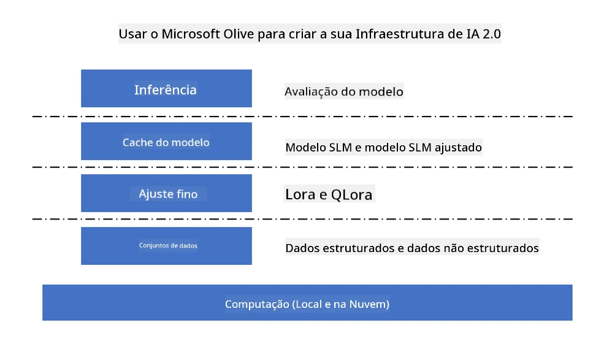
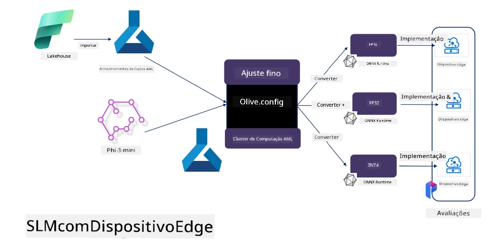

<!--
CO_OP_TRANSLATOR_METADATA:
{
  "original_hash": "5764be88ad2eb4f341e742eb8f14fab1",
  "translation_date": "2025-07-17T06:43:38+00:00",
  "source_file": "md/03.FineTuning/FineTuning_MicrosoftOlive.md",
  "language_code": "pt"
}
-->
# **Ajuste fino do Phi-3 com Microsoft Olive**

[Olive](https://github.com/microsoft/OLive?WT.mc_id=aiml-138114-kinfeylo) é uma ferramenta de otimização de modelos consciente do hardware, fácil de usar, que reúne técnicas líderes da indústria em compressão, otimização e compilação de modelos.

Foi concebida para simplificar o processo de otimização de modelos de machine learning, garantindo o uso mais eficiente possível das arquiteturas de hardware específicas.

Quer esteja a trabalhar em aplicações na cloud ou em dispositivos edge, o Olive permite otimizar os seus modelos de forma simples e eficaz.

## Principais funcionalidades:
- O Olive agrega e automatiza técnicas de otimização para os alvos de hardware desejados.
- Nenhuma técnica de otimização serve para todos os cenários, por isso o Olive permite extensibilidade, possibilitando que especialistas da indústria integrem as suas inovações em otimização.

## Reduza o esforço de engenharia:
- Os desenvolvedores frequentemente precisam aprender e utilizar várias toolchains específicas de fornecedores de hardware para preparar e otimizar modelos treinados para deployment.
- O Olive simplifica esta experiência ao automatizar as técnicas de otimização para o hardware desejado.

## Solução de otimização E2E pronta a usar:

Ao compor e ajustar técnicas integradas, o Olive oferece uma solução unificada para otimização de ponta a ponta.
Considera restrições como precisão e latência durante a otimização dos modelos.

## Utilizar o Microsoft Olive para ajuste fino

O Microsoft Olive é uma ferramenta open source de otimização de modelos muito fácil de usar, que cobre tanto o ajuste fino como a referência no campo da inteligência artificial generativa. Requer apenas uma configuração simples, combinada com o uso de modelos de linguagem pequenos open source e ambientes de runtime relacionados (AzureML / GPU local, CPU, DirectML), permitindo completar o ajuste fino ou referência do modelo através de otimização automática, encontrando o melhor modelo para deployment na cloud ou em dispositivos edge. Permite às empresas construir os seus próprios modelos verticais de indústria localmente e na cloud.



## Ajuste fino do Phi-3 com Microsoft Olive



## Código de exemplo e exemplo do Phi-3 Olive
Neste exemplo, vai usar o Olive para:

- Ajustar fino um adaptador LoRA para classificar frases em Tristeza, Alegria, Medo, Surpresa.
- Fundir os pesos do adaptador no modelo base.
- Otimizar e quantizar o modelo para int4.

[Sample Code](../../code/03.Finetuning/olive-ort-example/README.md)

### Configurar o Microsoft Olive

A instalação do Microsoft Olive é muito simples, podendo ser instalada para CPU, GPU, DirectML e Azure ML

```bash
pip install olive-ai
```

Se quiser executar um modelo ONNX com CPU, pode usar

```bash
pip install olive-ai[cpu]
```

Se quiser executar um modelo ONNX com GPU, pode usar

```python
pip install olive-ai[gpu]
```

Se quiser usar Azure ML, use

```python
pip install git+https://github.com/microsoft/Olive#egg=olive-ai[azureml]
```

**Aviso**  
Requisito do SO: Ubuntu 20.04 / 22.04

### **Config.json do Microsoft Olive**

Após a instalação, pode configurar diferentes definições específicas do modelo através do ficheiro Config, incluindo dados, computação, treino, deployment e geração de modelos.

**1. Dados**

No Microsoft Olive, é possível treinar com dados locais e dados na cloud, configuráveis nas definições.

*Configuração de dados locais*

Pode configurar facilmente o conjunto de dados para treino e ajuste fino, normalmente em formato json, adaptando-o ao template de dados. Isto deve ser ajustado conforme os requisitos do modelo (por exemplo, adaptá-lo ao formato exigido pelo Microsoft Phi-3-mini. Se tiver outros modelos, consulte os formatos de ajuste fino exigidos por esses modelos para processamento)

```json

    "data_configs": [
        {
            "name": "dataset_default_train",
            "type": "HuggingfaceContainer",
            "load_dataset_config": {
                "params": {
                    "data_name": "json", 
                    "data_files":"dataset/dataset-classification.json",
                    "split": "train"
                }
            },
            "pre_process_data_config": {
                "params": {
                    "dataset_type": "corpus",
                    "text_cols": [
                            "phrase",
                            "tone"
                    ],
                    "text_template": "### Text: {phrase}\n### The tone is:\n{tone}",
                    "corpus_strategy": "join",
                    "source_max_len": 2048,
                    "pad_to_max_len": false,
                    "use_attention_mask": false
                }
            }
        }
    ],
```

**Configuração de fontes de dados na cloud**

Ao ligar o datastore do Azure AI Studio/Azure Machine Learning Service para aceder aos dados na cloud, pode escolher introduzir diferentes fontes de dados para o Azure AI Studio/Azure Machine Learning Service através do Microsoft Fabric e Azure Data como suporte para o ajuste fino dos dados.

```json

    "data_configs": [
        {
            "name": "dataset_default_train",
            "type": "HuggingfaceContainer",
            "load_dataset_config": {
                "params": {
                    "data_name": "json", 
                    "data_files": {
                        "type": "azureml_datastore",
                        "config": {
                            "azureml_client": {
                                "subscription_id": "Your Azure Subscrition ID",
                                "resource_group": "Your Azure Resource Group",
                                "workspace_name": "Your Azure ML Workspaces name"
                            },
                            "datastore_name": "workspaceblobstore",
                            "relative_path": "Your train_data.json Azure ML Location"
                        }
                    },
                    "split": "train"
                }
            },
            "pre_process_data_config": {
                "params": {
                    "dataset_type": "corpus",
                    "text_cols": [
                            "Question",
                            "Best Answer"
                    ],
                    "text_template": "<|user|>\n{Question}<|end|>\n<|assistant|>\n{Best Answer}\n<|end|>",
                    "corpus_strategy": "join",
                    "source_max_len": 2048,
                    "pad_to_max_len": false,
                    "use_attention_mask": false
                }
            }
        }
    ],
    
```

**2. Configuração de computação**

Se precisar de ser local, pode usar diretamente recursos de dados locais. Se precisar de usar recursos do Azure AI Studio / Azure Machine Learning Service, deve configurar os parâmetros Azure relevantes, nome da capacidade computacional, etc.

```json

    "systems": {
        "aml": {
            "type": "AzureML",
            "config": {
                "accelerators": ["gpu"],
                "hf_token": true,
                "aml_compute": "Your Azure AI Studio / Azure Machine Learning Service Compute Name",
                "aml_docker_config": {
                    "base_image": "Your Azure AI Studio / Azure Machine Learning Service docker",
                    "conda_file_path": "conda.yaml"
                }
            }
        },
        "azure_arc": {
            "type": "AzureML",
            "config": {
                "accelerators": ["gpu"],
                "aml_compute": "Your Azure AI Studio / Azure Machine Learning Service Compute Name",
                "aml_docker_config": {
                    "base_image": "Your Azure AI Studio / Azure Machine Learning Service docker",
                    "conda_file_path": "conda.yaml"
                }
            }
        }
    },
```

***Aviso***

Como é executado através de um container no Azure AI Studio/Azure Machine Learning Service, o ambiente necessário deve ser configurado. Isto é feito no ambiente conda.yaml.

```yaml

name: project_environment
channels:
  - defaults
dependencies:
  - python=3.8.13
  - pip=22.3.1
  - pip:
      - einops
      - accelerate
      - azure-keyvault-secrets
      - azure-identity
      - bitsandbytes
      - datasets
      - huggingface_hub
      - peft
      - scipy
      - sentencepiece
      - torch>=2.2.0
      - transformers
      - git+https://github.com/microsoft/Olive@jiapli/mlflow_loading_fix#egg=olive-ai[gpu]
      - --extra-index-url https://aiinfra.pkgs.visualstudio.com/PublicPackages/_packaging/ORT-Nightly/pypi/simple/ 
      - ort-nightly-gpu==1.18.0.dev20240307004
      - --extra-index-url https://aiinfra.pkgs.visualstudio.com/PublicPackages/_packaging/onnxruntime-genai/pypi/simple/
      - onnxruntime-genai-cuda

    

```

**3. Escolha o seu SLM**

Pode usar o modelo diretamente do Hugging Face, ou pode combiná-lo diretamente com o Catálogo de Modelos do Azure AI Studio / Azure Machine Learning para selecionar o modelo a usar. No exemplo de código abaixo, usaremos o Microsoft Phi-3-mini como exemplo.

Se tiver o modelo localmente, pode usar este método

```json

    "input_model":{
        "type": "PyTorchModel",
        "config": {
            "hf_config": {
                "model_name": "model-cache/microsoft/phi-3-mini",
                "task": "text-generation",
                "model_loading_args": {
                    "trust_remote_code": true
                }
            }
        }
    },
```

Se quiser usar um modelo do Azure AI Studio / Azure Machine Learning Service, pode usar este método

```json

    "input_model":{
        "type": "PyTorchModel",
        "config": {
            "model_path": {
                "type": "azureml_registry_model",
                "config": {
                    "name": "microsoft/Phi-3-mini-4k-instruct",
                    "registry_name": "azureml-msr",
                    "version": "11"
                }
            },
             "model_file_format": "PyTorch.MLflow",
             "hf_config": {
                "model_name": "microsoft/Phi-3-mini-4k-instruct",
                "task": "text-generation",
                "from_pretrained_args": {
                    "trust_remote_code": true
                }
            }
        }
    },
```

**Aviso:**  
É necessário integrar com o Azure AI Studio / Azure Machine Learning Service, por isso, ao configurar o modelo, consulte o número da versão e a nomenclatura relacionada.

Todos os modelos no Azure devem estar configurados para PyTorch.MLflow

É necessário ter uma conta Hugging Face e associar a chave ao valor Key do Azure AI Studio / Azure Machine Learning

**4. Algoritmo**

O Microsoft Olive encapsula muito bem os algoritmos de ajuste fino Lora e QLora. Só precisa configurar alguns parâmetros relevantes. Aqui tomo o QLora como exemplo.

```json
        "lora": {
            "type": "LoRA",
            "config": {
                "target_modules": [
                    "o_proj",
                    "qkv_proj"
                ],
                "double_quant": true,
                "lora_r": 64,
                "lora_alpha": 64,
                "lora_dropout": 0.1,
                "train_data_config": "dataset_default_train",
                "eval_dataset_size": 0.3,
                "training_args": {
                    "seed": 0,
                    "data_seed": 42,
                    "per_device_train_batch_size": 1,
                    "per_device_eval_batch_size": 1,
                    "gradient_accumulation_steps": 4,
                    "gradient_checkpointing": false,
                    "learning_rate": 0.0001,
                    "num_train_epochs": 3,
                    "max_steps": 10,
                    "logging_steps": 10,
                    "evaluation_strategy": "steps",
                    "eval_steps": 187,
                    "group_by_length": true,
                    "adam_beta2": 0.999,
                    "max_grad_norm": 0.3
                }
            }
        },
```

Se quiser conversão para quantização, a branch principal do Microsoft Olive já suporta o método onnxruntime-genai. Pode configurar conforme as suas necessidades:

1. fundir os pesos do adaptador no modelo base  
2. converter o modelo para onnx com a precisão requerida pelo ModelBuilder

como por exemplo converter para INT4 quantizado

```json

        "merge_adapter_weights": {
            "type": "MergeAdapterWeights"
        },
        "builder": {
            "type": "ModelBuilder",
            "config": {
                "precision": "int4"
            }
        }
```

**Aviso**  
- Se usar QLoRA, a conversão de quantização do ONNXRuntime-genai não é suportada para já.

- Deve-se salientar que pode configurar os passos acima conforme as suas necessidades. Não é obrigatório configurar todos os passos completamente. Dependendo das suas necessidades, pode usar diretamente os passos do algoritmo sem ajuste fino. Por fim, precisa configurar os motores relevantes.

```json

    "engine": {
        "log_severity_level": 0,
        "host": "aml",
        "target": "aml",
        "search_strategy": false,
        "execution_providers": ["CUDAExecutionProvider"],
        "cache_dir": "../model-cache/models/phi3-finetuned/cache",
        "output_dir" : "../model-cache/models/phi3-finetuned"
    }
```

**5. Ajuste fino concluído**

Na linha de comandos, execute no diretório do olive-config.json

```bash
olive run --config olive-config.json  
```

**Aviso Legal**:  
Este documento foi traduzido utilizando o serviço de tradução automática [Co-op Translator](https://github.com/Azure/co-op-translator). Embora nos esforcemos pela precisão, por favor tenha em conta que traduções automáticas podem conter erros ou imprecisões. O documento original na sua língua nativa deve ser considerado a fonte autorizada. Para informações críticas, recomenda-se tradução profissional humana. Não nos responsabilizamos por quaisquer mal-entendidos ou interpretações incorretas decorrentes da utilização desta tradução.