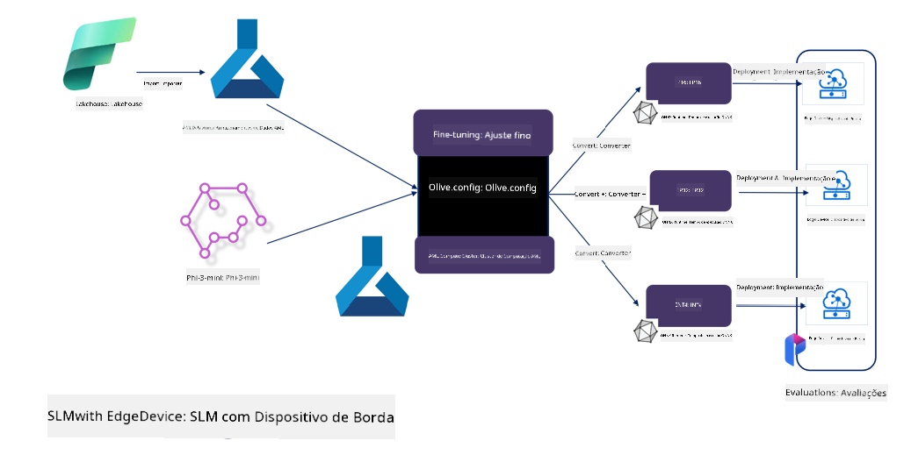

<!--
CO_OP_TRANSLATOR_METADATA:
{
  "original_hash": "5764be88ad2eb4f341e742eb8f14fab1",
  "translation_date": "2025-05-09T20:50:14+00:00",
  "source_file": "md/03.FineTuning/FineTuning_MicrosoftOlive.md",
  "language_code": "pt"
}
-->
# **Ajuste fino do Phi-3 com Microsoft Olive**

[Olive](https://github.com/microsoft/OLive?WT.mc_id=aiml-138114-kinfeylo) é uma ferramenta de otimização de modelos consciente de hardware, fácil de usar, que reúne técnicas líderes do setor em compressão, otimização e compilação de modelos.

Ela foi criada para simplificar o processo de otimização de modelos de machine learning, garantindo o uso mais eficiente das arquiteturas de hardware específicas.

Seja para aplicações na nuvem ou dispositivos de borda, Olive permite otimizar seus modelos de forma simples e eficaz.

## Principais Recursos:
- Olive agrega e automatiza técnicas de otimização para os hardwares desejados.
- Nenhuma técnica de otimização serve para todos os casos, por isso Olive permite extensibilidade, possibilitando que especialistas do setor integrem suas inovações em otimização.

## Reduza o Esforço de Engenharia:
- Desenvolvedores frequentemente precisam aprender e usar múltiplas ferramentas específicas de fornecedores de hardware para preparar e otimizar modelos treinados para implantação.
- Olive simplifica essa experiência automatizando as técnicas de otimização para o hardware desejado.

## Solução de Otimização E2E Pronta para Uso:

Compondo e ajustando técnicas integradas, Olive oferece uma solução unificada para otimização de ponta a ponta.
Ela considera restrições como precisão e latência durante a otimização dos modelos.

## Usando Microsoft Olive para ajuste fino

Microsoft Olive é uma ferramenta de otimização de modelos open source muito fácil de usar, que cobre tanto ajuste fino quanto referência no campo da inteligência artificial generativa. Basta uma configuração simples, combinada com o uso de pequenos modelos de linguagem open source e ambientes de execução relacionados (AzureML / GPU local, CPU, DirectML), para realizar o ajuste fino ou referência do modelo por meio de otimização automática, encontrando o melhor modelo para implantar na nuvem ou em dispositivos de borda. Permite que empresas construam seus próprios modelos verticais para o setor, tanto localmente quanto na nuvem.


## Ajuste fino do Phi-3 com Microsoft Olive



## Código de exemplo e amostra do Phi-3 Olive  
Neste exemplo, você usará o Olive para:

- Ajustar fino um adaptador LoRA para classificar frases em Tristeza, Alegria, Medo, Surpresa.
- Mesclar os pesos do adaptador no modelo base.
- Otimizar e quantizar o modelo para int4.

[Sample Code](../../code/03.Finetuning/olive-ort-example/README.md)

### Configurando o Microsoft Olive

A instalação do Microsoft Olive é muito simples e pode ser feita para CPU, GPU, DirectML e Azure ML

```bash
pip install olive-ai
```

Se desejar rodar um modelo ONNX com CPU, você pode usar

```bash
pip install olive-ai[cpu]
```

Se quiser rodar um modelo ONNX com GPU, pode usar

```python
pip install olive-ai[gpu]
```

Se quiser usar Azure ML, utilize

```python
pip install git+https://github.com/microsoft/Olive#egg=olive-ai[azureml]
```

**Aviso**  
Requisito do SO: Ubuntu 20.04 / 22.04

### **Config.json do Microsoft Olive**

Após a instalação, você pode configurar diferentes definições específicas do modelo através do arquivo Config, incluindo dados, computação, treinamento, implantação e geração do modelo.

**1. Dados**

No Microsoft Olive, é possível treinar com dados locais e dados na nuvem, e isso pode ser configurado nas definições.

*Configuração de dados locais*

Você pode configurar facilmente o conjunto de dados para ajuste fino, geralmente em formato json, adaptando-o ao template de dados. Isso deve ser ajustado conforme os requisitos do modelo (por exemplo, adaptando ao formato exigido pelo Microsoft Phi-3-mini. Se usar outros modelos, consulte os formatos de ajuste fino requeridos por esses modelos para o processamento)

```json

    "data_configs": [
        {
            "name": "dataset_default_train",
            "type": "HuggingfaceContainer",
            "load_dataset_config": {
                "params": {
                    "data_name": "json", 
                    "data_files":"dataset/dataset-classification.json",
                    "split": "train"
                }
            },
            "pre_process_data_config": {
                "params": {
                    "dataset_type": "corpus",
                    "text_cols": [
                            "phrase",
                            "tone"
                    ],
                    "text_template": "### Text: {phrase}\n### The tone is:\n{tone}",
                    "corpus_strategy": "join",
                    "source_max_len": 2048,
                    "pad_to_max_len": false,
                    "use_attention_mask": false
                }
            }
        }
    ],
```

**Configuração de fonte de dados na nuvem**

Ao vincular o datastore do Azure AI Studio/Azure Machine Learning Service para acessar dados na nuvem, você pode escolher diferentes fontes de dados para Azure AI Studio/Azure Machine Learning Service via Microsoft Fabric e Azure Data como suporte para o ajuste fino dos dados.

```json

    "data_configs": [
        {
            "name": "dataset_default_train",
            "type": "HuggingfaceContainer",
            "load_dataset_config": {
                "params": {
                    "data_name": "json", 
                    "data_files": {
                        "type": "azureml_datastore",
                        "config": {
                            "azureml_client": {
                                "subscription_id": "Your Azure Subscrition ID",
                                "resource_group": "Your Azure Resource Group",
                                "workspace_name": "Your Azure ML Workspaces name"
                            },
                            "datastore_name": "workspaceblobstore",
                            "relative_path": "Your train_data.json Azure ML Location"
                        }
                    },
                    "split": "train"
                }
            },
            "pre_process_data_config": {
                "params": {
                    "dataset_type": "corpus",
                    "text_cols": [
                            "Question",
                            "Best Answer"
                    ],
                    "text_template": "<|user|>\n{Question}<|end|>\n<|assistant|>\n{Best Answer}\n<|end|>",
                    "corpus_strategy": "join",
                    "source_max_len": 2048,
                    "pad_to_max_len": false,
                    "use_attention_mask": false
                }
            }
        }
    ],
    
```

**2. Configuração de computação**

Se quiser usar recursos locais, pode usar diretamente os recursos de dados locais. Se precisar usar recursos do Azure AI Studio / Azure Machine Learning Service, é necessário configurar os parâmetros relevantes do Azure, nome da capacidade computacional, etc.

```json

    "systems": {
        "aml": {
            "type": "AzureML",
            "config": {
                "accelerators": ["gpu"],
                "hf_token": true,
                "aml_compute": "Your Azure AI Studio / Azure Machine Learning Service Compute Name",
                "aml_docker_config": {
                    "base_image": "Your Azure AI Studio / Azure Machine Learning Service docker",
                    "conda_file_path": "conda.yaml"
                }
            }
        },
        "azure_arc": {
            "type": "AzureML",
            "config": {
                "accelerators": ["gpu"],
                "aml_compute": "Your Azure AI Studio / Azure Machine Learning Service Compute Name",
                "aml_docker_config": {
                    "base_image": "Your Azure AI Studio / Azure Machine Learning Service docker",
                    "conda_file_path": "conda.yaml"
                }
            }
        }
    },
```

***Aviso***

Como o processo roda via container no Azure AI Studio/Azure Machine Learning Service, o ambiente necessário precisa ser configurado. Isso é feito no arquivo conda.yaml do ambiente.

```yaml

name: project_environment
channels:
  - defaults
dependencies:
  - python=3.8.13
  - pip=22.3.1
  - pip:
      - einops
      - accelerate
      - azure-keyvault-secrets
      - azure-identity
      - bitsandbytes
      - datasets
      - huggingface_hub
      - peft
      - scipy
      - sentencepiece
      - torch>=2.2.0
      - transformers
      - git+https://github.com/microsoft/Olive@jiapli/mlflow_loading_fix#egg=olive-ai[gpu]
      - --extra-index-url https://aiinfra.pkgs.visualstudio.com/PublicPackages/_packaging/ORT-Nightly/pypi/simple/ 
      - ort-nightly-gpu==1.18.0.dev20240307004
      - --extra-index-url https://aiinfra.pkgs.visualstudio.com/PublicPackages/_packaging/onnxruntime-genai/pypi/simple/
      - onnxruntime-genai-cuda

    

```

**3. Escolha seu SLM**

Você pode usar o modelo diretamente do Hugging Face, ou pode combiná-lo diretamente com o Catálogo de Modelos do Azure AI Studio / Azure Machine Learning para selecionar o modelo a ser usado. No exemplo de código abaixo, usaremos o Microsoft Phi-3-mini como exemplo.

Se você tem o modelo localmente, pode usar este método

```json

    "input_model":{
        "type": "PyTorchModel",
        "config": {
            "hf_config": {
                "model_name": "model-cache/microsoft/phi-3-mini",
                "task": "text-generation",
                "model_loading_args": {
                    "trust_remote_code": true
                }
            }
        }
    },
```

Se quiser usar um modelo do Azure AI Studio / Azure Machine Learning Service, pode usar este método

```json

    "input_model":{
        "type": "PyTorchModel",
        "config": {
            "model_path": {
                "type": "azureml_registry_model",
                "config": {
                    "name": "microsoft/Phi-3-mini-4k-instruct",
                    "registry_name": "azureml-msr",
                    "version": "11"
                }
            },
             "model_file_format": "PyTorch.MLflow",
             "hf_config": {
                "model_name": "microsoft/Phi-3-mini-4k-instruct",
                "task": "text-generation",
                "from_pretrained_args": {
                    "trust_remote_code": true
                }
            }
        }
    },
```

**Aviso:**  
É necessário integrar com Azure AI Studio / Azure Machine Learning Service, então ao configurar o modelo, consulte a versão e nomenclatura relacionadas.

Todos os modelos no Azure devem estar configurados como PyTorch.MLflow

Você precisa ter uma conta no Hugging Face e vincular a chave ao valor Key do Azure AI Studio / Azure Machine Learning

**4. Algoritmo**

Microsoft Olive encapsula muito bem os algoritmos de ajuste fino Lora e QLora. Tudo que precisa configurar são alguns parâmetros relevantes. Aqui uso QLora como exemplo.

```json
        "lora": {
            "type": "LoRA",
            "config": {
                "target_modules": [
                    "o_proj",
                    "qkv_proj"
                ],
                "double_quant": true,
                "lora_r": 64,
                "lora_alpha": 64,
                "lora_dropout": 0.1,
                "train_data_config": "dataset_default_train",
                "eval_dataset_size": 0.3,
                "training_args": {
                    "seed": 0,
                    "data_seed": 42,
                    "per_device_train_batch_size": 1,
                    "per_device_eval_batch_size": 1,
                    "gradient_accumulation_steps": 4,
                    "gradient_checkpointing": false,
                    "learning_rate": 0.0001,
                    "num_train_epochs": 3,
                    "max_steps": 10,
                    "logging_steps": 10,
                    "evaluation_strategy": "steps",
                    "eval_steps": 187,
                    "group_by_length": true,
                    "adam_beta2": 0.999,
                    "max_grad_norm": 0.3
                }
            }
        },
```

Se quiser conversão para quantização, o branch principal do Microsoft Olive já suporta o método onnxruntime-genai. Você pode configurar conforme sua necessidade:

1. mesclar pesos do adaptador no modelo base  
2. converter o modelo para onnx com a precisão necessária usando o ModelBuilder

como converter para INT4 quantizado

```json

        "merge_adapter_weights": {
            "type": "MergeAdapterWeights"
        },
        "builder": {
            "type": "ModelBuilder",
            "config": {
                "precision": "int4"
            }
        }
```

**Aviso**  
- Se usar QLoRA, a conversão de quantização do ONNXRuntime-genai não é suportada no momento.

- Vale destacar que você pode configurar os passos acima conforme sua necessidade. Não é obrigatório configurar todos esses passos completamente. Dependendo do seu caso, pode usar diretamente os passos do algoritmo sem ajuste fino. Por fim, é necessário configurar os engines relevantes.

```json

    "engine": {
        "log_severity_level": 0,
        "host": "aml",
        "target": "aml",
        "search_strategy": false,
        "execution_providers": ["CUDAExecutionProvider"],
        "cache_dir": "../model-cache/models/phi3-finetuned/cache",
        "output_dir" : "../model-cache/models/phi3-finetuned"
    }
```

**5. Ajuste fino concluído**

Na linha de comando, execute no diretório onde está o olive-config.json

```bash
olive run --config olive-config.json  
```

**Aviso Legal**:  
Este documento foi traduzido usando o serviço de tradução por IA [Co-op Translator](https://github.com/Azure/co-op-translator). Embora nos esforcemos para garantir a precisão, esteja ciente de que traduções automáticas podem conter erros ou imprecisões. O documento original em seu idioma nativo deve ser considerado a fonte autoritativa. Para informações críticas, recomenda-se tradução profissional realizada por humanos. Não nos responsabilizamos por quaisquer mal-entendidos ou interpretações incorretas decorrentes do uso desta tradução.