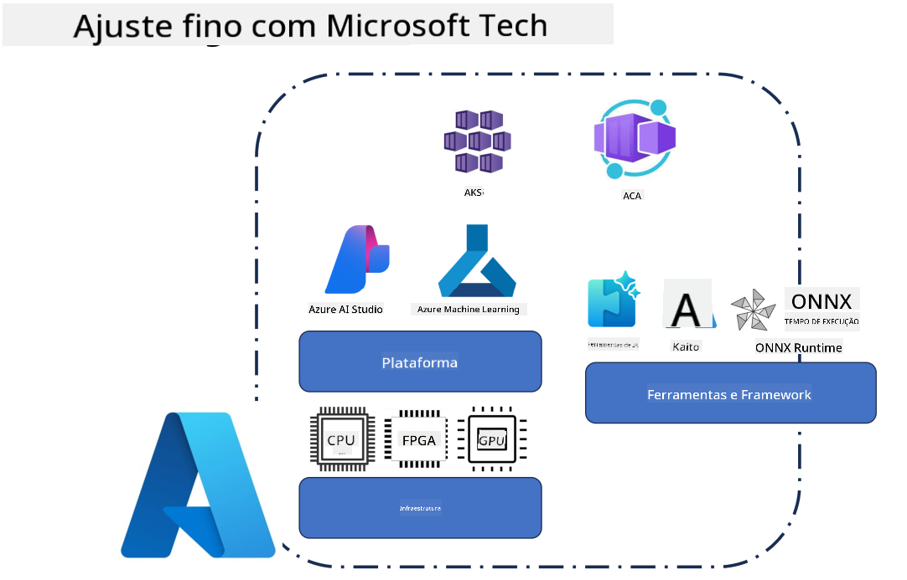
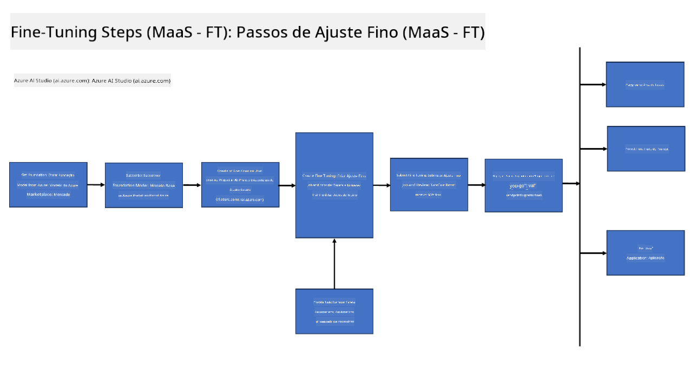
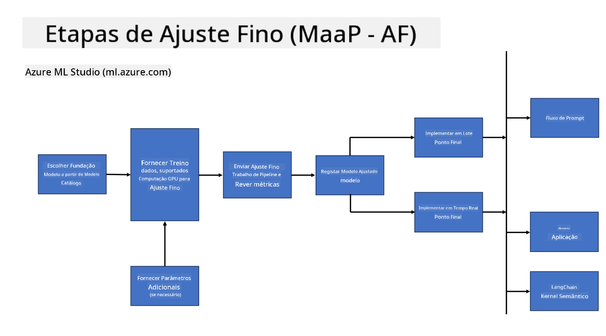

<!--
CO_OP_TRANSLATOR_METADATA:
{
  "original_hash": "cb5648935f63edc17e95ce38f23adc32",
  "translation_date": "2025-05-09T21:54:45+00:00",
  "source_file": "md/03.FineTuning/FineTuning_Scenarios.md",
  "language_code": "pt"
}
-->
## Cenários de Fine Tuning

**Plataforma** Isso inclui várias tecnologias como Azure AI Foundry, Azure Machine Learning, AI Tools, Kaito e ONNX Runtime.

**Infraestrutura** Isso inclui CPU e FPGA, que são essenciais para o processo de fine-tuning. Vou mostrar os ícones de cada uma dessas tecnologias.

**Ferramentas e Framework** Isso inclui ONNX Runtime e ONNX Runtime. Vou mostrar os ícones de cada uma dessas tecnologias.  
[Inserir ícones para ONNX Runtime e ONNX Runtime]

O processo de fine-tuning com tecnologias Microsoft envolve vários componentes e ferramentas. Ao entender e utilizar essas tecnologias, podemos ajustar eficazmente nossas aplicações e criar soluções melhores.

## Modelo como Serviço

Faça o fine-tuning do modelo usando fine-tuning hospedado, sem a necessidade de criar e gerenciar recursos computacionais.

O fine-tuning serverless está disponível para os modelos Phi-3-mini e Phi-3-medium, permitindo que os desenvolvedores personalizem rapidamente e com facilidade os modelos para cenários em nuvem e edge, sem precisar se preocupar com a alocação de recursos computacionais. Também anunciamos que o Phi-3-small está agora disponível através da nossa oferta Models-as-a-Service, para que os desenvolvedores possam começar rapidamente e com facilidade o desenvolvimento em IA, sem precisar gerenciar a infraestrutura subjacente.

## Modelo como Plataforma

Os usuários gerenciam seus próprios recursos computacionais para fazer o fine-tuning de seus modelos.

[Exemplo de Fine Tuning](https://github.com/Azure/azureml-examples/blob/main/sdk/python/foundation-models/system/finetune/chat-completion/chat-completion.ipynb)

## Cenários de Fine Tuning

| | | | | | | |
|-|-|-|-|-|-|-|
|Cenário|LoRA|QLoRA|PEFT|DeepSpeed|ZeRO|DORA|
|Adaptar LLMs pré-treinados para tarefas ou domínios específicos|Sim|Sim|Sim|Sim|Sim|Sim|
|Fine-tuning para tarefas de NLP como classificação de texto, reconhecimento de entidades nomeadas e tradução automática|Sim|Sim|Sim|Sim|Sim|Sim|
|Fine-tuning para tarefas de QA|Sim|Sim|Sim|Sim|Sim|Sim|
|Fine-tuning para gerar respostas humanizadas em chatbots|Sim|Sim|Sim|Sim|Sim|Sim|
|Fine-tuning para gerar música, arte ou outras formas de criatividade|Sim|Sim|Sim|Sim|Sim|Sim|
|Redução de custos computacionais e financeiros|Sim|Sim|Não|Sim|Sim|Não|
|Redução do uso de memória|Não|Sim|Não|Sim|Sim|Sim|
|Uso de menos parâmetros para fine-tuning eficiente|Não|Sim|Sim|Não|Não|Sim|
|Forma eficiente de paralelismo de dados que dá acesso à memória agregada de todas as GPUs disponíveis|Não|Não|Não|Sim|Sim|Sim|

## Exemplos de Performance em Fine Tuning

**Aviso Legal**:  
Este documento foi traduzido utilizando o serviço de tradução por IA [Co-op Translator](https://github.com/Azure/co-op-translator). Embora nos esforcemos para garantir a precisão, esteja ciente de que traduções automáticas podem conter erros ou imprecisões. O documento original em seu idioma nativo deve ser considerado a fonte autorizada. Para informações críticas, recomenda-se tradução profissional realizada por humanos. Não nos responsabilizamos por quaisquer mal-entendidos ou interpretações equivocadas decorrentes do uso desta tradução.